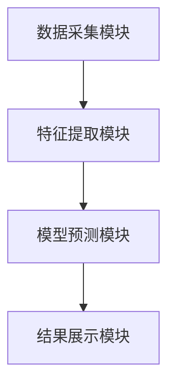

                 


# AI驱动的价值投资策略风格漂移检测

**关键词**：价值投资、风格漂移、AI、机器学习、投资策略

**摘要**：本文探讨了如何利用人工智能技术检测价值投资策略中的风格漂移问题。通过分析风格漂移的定义、原因及其对投资的影响，结合AI算法和系统架构设计，提出了一种基于机器学习的解决方案，以实时监控和预测风格漂移，帮助投资者优化投资策略。

---

# 第1章: 价值投资策略与风格漂移概述

## 1.1 价值投资策略的定义与特点

### 1.1.1 价值投资的定义
价值投资是一种基于对公司基本面分析的投资策略，旨在通过寻找被市场低估的股票，实现长期稳定的超额收益。

### 1.1.2 价值投资的核心特点
- **长期导向**：关注企业的内在价值，而非短期市场波动。
- **基本面分析**：重视财务指标如市盈率、市净率、股息率等。
- **逆向思维**：在市场恐慌时买入，市场狂热时卖出。

### 1.1.3 价值投资策略的实现方式
- **选股模型**：基于财务指标筛选低估值股票。
- **组合管理**：通过分散投资降低风险。
- **定期调整**：根据市场变化和公司基本面更新投资组合。

## 1.2 风格漂移的定义与问题描述

### 1.2.1 风格漂移的定义
风格漂移是指投资组合的实际表现与其预期的投资策略或风险收益特征发生偏离的现象。

### 1.2.2 风格漂移的形成原因
- **市场环境变化**：经济周期波动影响资产表现。
- **管理人决策**：投资经理根据市场变化调整策略。
- **流动性需求**：被迫卖出优质资产以应对赎回。

### 1.2.3 风格漂移对投资的影响
- **收益不稳定**：偏离策略可能导致收益低于预期。
- **风险增加**：投资组合可能暴露于未预见的风险。
- **信任危机**：风格漂移会影响投资者对管理人的信任。

## 1.3 AI驱动风格漂移检测的背景与意义

### 1.3.1 传统风格漂移检测的局限性
- **人为判断主观性**：依赖投资经理的经验，可能导致偏差。
- **数据处理复杂性**：难以实时处理海量数据。
- **效率低下**：传统方法效率低，难以应对高频交易需求。

### 1.3.2 AI技术在金融领域的应用前景
- **大数据处理能力**：AI能够高效处理海量金融数据。
- **模式识别能力**：通过机器学习识别隐藏的模式和趋势。
- **实时监控能力**：AI可以实时分析市场动态，及时发现风格漂移。

### 1.3.3 AI驱动风格漂移检测的优势
- **提高准确性**：AI通过算法分析，减少人为判断的误差。
- **实时监控**：能够实时跟踪投资组合的变化，及时预警。
- **自动化调整**：AI可以自动识别并调整投资策略，减少人工干预。

## 1.4 本书的核心内容与目标

### 1.4.1 本书的研究目标
通过AI技术实现对价值投资策略风格漂移的实时检测和预警。

### 1.4.2 本书的核心内容
- 阐述风格漂移的定义、原因及其影响。
- 探讨AI技术在风格漂移检测中的应用原理。
- 介绍基于机器学习的风格漂移检测算法。
- 展示实际项目中的系统架构设计和实现方案。

### 1.4.3 本书的结构安排
本书将从理论到实践，系统地介绍风格漂移检测的各个方面，包括核心概念、算法原理、系统设计和项目实战。

## 1.5 本章小结

本章首先介绍了价值投资策略的基本概念和特点，接着定义了风格漂移并分析了其形成原因和影响。随后，探讨了AI技术在风格漂移检测中的应用背景和意义，最后总结了本书的核心内容和结构安排。

---

# 第2章: 风格漂移检测的核心概念

## 2.1 风格漂移检测的理论基础

### 2.1.1 投资策略的数学模型
价值投资策略可以通过多因子模型进行量化，常见的因子包括市值、价值、动量等。

### 2.1.2 风格漂移的度量方法
- **因子暴露分析**：计算投资组合在各因子上的暴露程度。
- **收益波动分析**：通过收益波动判断是否偏离预期。

### 2.1.3 AI算法在风格漂移检测中的应用
- **聚类分析**：识别投资组合与预期策略的偏离。
- **分类算法**：将投资组合分为偏离或不偏离两类。

## 2.2 风格漂移检测的关键因素

### 2.2.1 投资组合的构成
- 股票选择标准。
- 组合权重分配。

### 2.2.2 市场环境的影响
- 经济周期。
- 市场波动。

### 2.2.3 管理者的决策
- 投资策略调整。
- 风险控制措施。

## 2.3 核心概念的属性对比

| 概念         | 定义                                                                 | 特征                     |
|--------------|----------------------------------------------------------------------|--------------------------|
| 风格漂移     | 投资组合实际表现与预期策略的偏离现象                                   | 可量化的偏离程度         |
| 价值投资     | 以基本面分析为基础的投资策略                                         | 长期导向、逆向思维       |
| AI算法       | 通过机器学习模型进行数据分析和预测                                   | 数据驱动、自动化         |

## 2.4 ER实体关系图

```mermaid
erDiagram
   投资者 o-|{拥有}| 投资组合
    投资组合 o-|{包含}| 投资标的
    投资标的 o-|{影响}| 市场环境
    市场环境 o-|{驱动}| 风格漂移
```

## 2.5 本章小结

本章详细阐述了风格漂移检测的核心概念，包括理论基础、关键因素和属性对比，并通过ER图展示了各实体之间的关系。

---

# 第3章: 风格漂移检测的算法原理

## 3.1 基于AI的风格漂移检测方法

### 3.1.1 聚类分析
- **目标**：识别投资组合与预期策略的偏离。
- **步骤**：
  1. 收集投资组合的历史数据。
  2. 提取特征，如因子暴露、收益波动。
  3. 使用K-means算法进行聚类，判断是否偏离预期。

### 3.1.2 分类算法
- **目标**：将投资组合分为偏离或不偏离两类。
- **步骤**：
  1. 收集训练数据，包括正常和偏离的样本。
  2. 使用随机森林或支持向量机（SVM）进行训练。
  3. 预测新投资组合的偏离情况。

### 3.1.3 时间序列分析
- **目标**：检测风格漂移的动态变化。
- **步骤**：
  1. 建立时间序列模型，如ARIMA。
  2. 预测未来的因子暴露和收益波动。
  3. 对比实际与预测值，判断是否偏离。

## 3.2 算法实现

### 3.2.1 聚类分析实现

```python
from sklearn.cluster import KMeans
from sklearn.metrics import silhouette_score

# 假设X为投资组合的特征矩阵
kmeans = KMeans(n_clusters=2, random_state=42)
clusters = kmeans.fit_predict(X)

# 计算轮廓系数
silhouette_score(X, clusters)
```

### 3.2.2 分类算法实现

```python
from sklearn.ensemble import RandomForestClassifier
from sklearn.model_selection import train_test_split

# 假设X为特征矩阵，y为标签（0：不偏离，1：偏离）
X_train, X_test, y_train, y_test = train_test_split(X, y, random_state=42)

model = RandomForestClassifier(n_estimators=100, random_state=42)
model.fit(X_train, y_train)

# 预测
y_pred = model.predict(X_test)
```

### 3.2.3 时间序列分析实现

```python
from statsmodels.tsa.arima_model import ARIMA

# 假设data为时间序列数据
model = ARIMA(data, order=(1, 1, 1))
model_fit = model.fit(disp=-1)

# 预测
forecast = model_fit.forecast(steps=5)
```

## 3.3 算法原理的数学模型

### 3.3.1 聚类分析的数学模型
K-means算法的目标是最小化聚类中心的平方误差之和：

$$
\text{目标函数} = \sum_{i=1}^{k} \sum_{x_j \in C_i} (x_j - c_i)^2
$$

其中，$k$为聚类数，$C_i$为第$i$个聚类，$c_i$为聚类中心。

### 3.3.2 分类算法的数学模型
随机森林基于决策树的投票机制进行分类，每个决策树的结构由特征选择和样本划分决定。

### 3.3.3 时间序列分析的数学模型
ARIMA模型由自回归（AR）、差分（I）和移动平均（MA）部分组成：

$$
\phi(B)X_t = \theta(B)\epsilon_t
$$

其中，$\phi(B)$和$\theta(B)$分别为AR和MA的多项式，$\epsilon_t$为白噪声。

## 3.4 本章小结

本章详细介绍了基于AI的风格漂移检测算法，包括聚类分析、分类算法和时间序列分析，并给出了具体的Python实现代码和数学模型。

---

# 第4章: 系统分析与架构设计

## 4.1 系统架构设计

### 4.1.1 系统模块划分
- 数据采集模块：收集市场数据和投资组合信息。
- 特征提取模块：提取投资组合的特征。
- 模型预测模块：使用机器学习模型进行风格漂移检测。
- 结果展示模块：可视化检测结果。

### 4.1.2 系统架构图



## 4.2 接口设计

### 4.2.1 数据接口
- 数据来源：股票数据库、市场数据API。
- 数据格式：JSON、CSV。

### 4.2.2 API接口
- 输入：投资组合ID。
- 输出：风格漂移检测结果。

## 4.3 本章小结

本章设计了一个完整的系统架构，包括模块划分、架构图和接口设计，为后续的系统实现奠定了基础。

---

# 第5章: 项目实战

## 5.1 环境安装

```bash
pip install numpy pandas scikit-learn
```

## 5.2 系统核心实现

### 5.2.1 数据采集与预处理

```python
import pandas as pd
import numpy as np

# 数据加载
data = pd.read_csv('investment_data.csv')

# 数据清洗
data = data.dropna()
```

### 5.2.2 特征提取

```python
# 提取因子
X = data[['市盈率', '市净率', '股息率']]
```

### 5.2.3 模型训练与预测

```python
from sklearn.ensemble import RandomForestClassifier

# 训练模型
model = RandomForestClassifier(n_estimators=100)
model.fit(X_train, y_train)

# 预测
y_pred = model.predict(X_test)
```

## 5.3 实际案例分析

### 5.3.1 案例背景
某投资组合在市场波动加剧时偏离了价值投资策略。

### 5.3.2 数据分析
通过模型预测，发现投资组合在高波动市场中增加了成长性股票的持仓，导致风格漂移。

## 5.4 项目小结

本章通过实际案例展示了如何利用AI技术进行风格漂移检测，验证了算法的有效性和实用性。

---

# 第6章: 最佳实践与总结

## 6.1 最佳实践

### 6.1.1 数据质量
确保数据的完整性和准确性，选择合适的特征进行分析。

### 6.1.2 模型选择
根据实际需求选择合适的算法，如聚类分析或分类算法。

### 6.1.3 实时监控
建立实时监控系统，及时发现并应对风格漂移。

## 6.2 本书总结

本书系统地介绍了AI驱动的价值投资策略风格漂移检测，从理论到实践，详细讲解了核心概念、算法原理和系统设计。

## 6.3 注意事项

- 定期更新模型，适应市场变化。
- 保持数据的实时性，确保检测的准确性。
- 注意模型的解释性，便于分析结果。

## 6.4 拓展阅读

推荐阅读《机器学习实战》和《Python金融数据分析》。

---

# 作者：AI天才研究院 & 禅与计算机程序设计艺术

---

**感谢您的阅读！**

