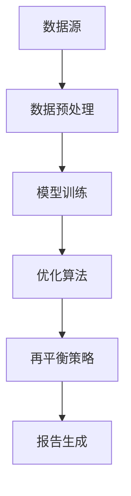

                 


# AI驱动的价值投资组合再平衡优化

> 关键词：AI驱动、投资组合优化、再平衡优化、强化学习、深度学习

> 摘要：本文探讨了如何利用人工智能技术优化投资组合的再平衡过程。通过分析传统方法的局限性，引入机器学习、强化学习和深度学习等技术，构建高效的AI驱动再平衡优化模型。文章详细讲解了算法原理、系统架构设计、项目实战，并给出了实际案例分析和最佳实践建议，帮助读者理解如何在实际投资中应用这些技术。

---

# 第1章: 价值投资组合再平衡的背景与意义

## 1.1 投资组合的基本概念

### 1.1.1 投资组合的定义
投资组合是指将多种金融资产（如股票、债券、基金等）按一定比例配置在一起，以实现风险分散和收益最大化的资产组合。投资组合的价值通常通过其收益率和波动率来衡量。

### 1.1.2 投资组合的价值衡量标准
投资组合的价值衡量标准主要包括：
- **收益**：投资组合的预期收益率。
- **风险**：投资组合的波动性，通常用标准差衡量。
- **夏普比率**：衡量投资组合相对于其风险的超额收益。

### 1.1.3 再平衡的定义与意义
再平衡是指根据市场变化或投资者风险偏好的变化，调整投资组合中各资产的比例，以维持目标配置比例的过程。再平衡的意义在于：
- **降低风险**：通过调整资产比例，避免某类资产过度暴露。
- **提高收益**：捕捉市场机会，优化资产配置。
- **适应市场变化**：应对市场波动和经济周期变化。

## 1.2 传统投资组合再平衡方法

### 1.2.1 基于固定比例的再平衡策略
固定比例策略是指将投资组合按固定比例分配到不同资产类别，定期进行调整以维持该比例。例如，将60%的资金配置在股票，30%配置在债券，10%配置在现金。

### 1.2.2 基于目标权重的再平衡策略
目标权重策略是根据市场变化动态调整各资产的目标权重，定期进行再平衡。例如，当股票市场上涨导致股票比例超过目标权重时，卖出部分股票以恢复目标比例。

### 1.2.3 基于市场变化的再平衡策略
市场变化驱动的再平衡策略是指根据市场波动或经济周期变化，动态调整再平衡的频率和比例。例如，在市场剧烈波动时，增加再平衡频率以降低风险。

## 1.3 传统方法的局限性

### 1.3.1 市场波动对再平衡策略的影响
传统再平衡策略通常基于固定的时间间隔（如季度或半年）进行调整，无法及时捕捉市场短期波动带来的机会或风险。

### 1.3.2 人工决策的局限性
人工决策容易受到主观判断和情绪影响，可能导致误判市场趋势，影响再平衡效果。

### 1.3.3 传统策略的计算复杂性
传统再平衡策略需要频繁计算各资产的权重和调整幅度，尤其是在市场波动较大时，计算复杂性增加，难以快速响应。

## 1.4 AI技术在投资组合优化中的应用前景

### 1.4.1 AI技术的基本概念
人工智能（AI）是指计算机系统执行与人类智能相关的任务的能力，包括学习、推理、问题解决等。AI的核心技术包括机器学习、深度学习、自然语言处理等。

### 1.4.2 AI在金融领域的应用现状
AI技术在金融领域的应用日益广泛，包括股票预测、风险管理、信用评估、投资组合优化等。

### 1.4.3 AI驱动再平衡优化的潜力
AI可以通过分析海量数据，识别复杂市场模式，优化投资组合配置，提高再平衡效率和收益。

---

# 第2章: AI驱动的价值投资组合再平衡的核心概念

## 2.1 机器学习在投资组合优化中的应用

### 2.1.1 机器学习的基本概念
机器学习是一种通过数据训练模型，使其能够从数据中学习并做出预测或决策的技术。常用算法包括线性回归、支持向量机、随机森林等。

### 2.1.2 机器学习在金融中的应用
机器学习在金融中的应用包括：
- 股票价格预测
- 风险管理
- 投资组合优化
- 市场情绪分析

### 2.1.3 机器学习在投资组合优化中的具体应用
机器学习可以用于：
- 市场因子分析
- 资产价格预测
- 资产配置优化

## 2.2 基于强化学习的投资组合优化

### 2.2.1 强化学习的基本原理
强化学习是一种通过智能体与环境交互，学习最优策略的技术。智能体会根据环境反馈（奖励或惩罚）调整行为，以最大化累积奖励。

### 2.2.2 强化学习在投资组合优化中的应用
强化学习可以用于动态调整投资组合配置，实时响应市场变化。例如，根据市场波动调整股票和债券的比例。

### 2.2.3 强化学习的优势与挑战
- **优势**：能够处理非线性关系，适应复杂市场环境。
- **挑战**：需要大量数据和计算资源，存在过拟合风险。

## 2.3 基于深度学习的投资组合优化

### 2.3.1 深度学习的基本原理
深度学习是一种基于人工神经网络的机器学习技术，通过多层非线性变换提取数据特征。

### 2.3.2 深度学习在投资组合优化中的应用
深度学习可以用于：
- 多资产价格预测
- 资产配置优化
- 风险管理

### 2.3.3 深度学习的优势与挑战
- **优势**：能够捕捉复杂市场模式。
- **挑战**：计算成本高，解释性差。

## 2.4 优化算法在投资组合再平衡中的应用

### 2.4.1 常用优化算法
- **线性规划**：用于简单的线性优化问题。
- **二次规划**：用于处理非线性约束。
- **遗传算法**：用于全局优化。

### 2.4.2 优化算法在再平衡中的具体应用
优化算法可以用于：
- 确定最优资产配置比例
- 计算再平衡所需的买卖金额

### 2.4.3 算法选择的注意事项
- 算法的计算效率
- 算法的全局最优性
- 算法的适应性

---

# 第3章: AI驱动的价值投资组合再平衡优化算法

## 3.1 算法设计思路

### 3.1.1 算法目标
构建一个AI驱动的再平衡优化模型，能够在市场变化时动态调整资产配置，实现风险可控下的收益最大化。

### 3.1.2 算法输入
- 历史市场数据
- 资产类别权重
- 风险承受能力

### 3.1.3 算法输出
- 优化后的资产配置比例
- 再平衡操作建议

## 3.2 基于强化学习的再平衡优化算法

### 3.2.1 算法框架
- 状态空间：市场指数、资产价格等。
- 行动空间：调整各资产的权重。
- 奖励机制：基于收益和风险的综合指标。

### 3.2.2 算法实现步骤
1. 数据预处理：清洗和归一化市场数据。
2. 状态定义：定义市场状态。
3. 行动定义：定义可能的资产调整动作。
4. 策略网络设计：使用深度神经网络近似策略。
5. 策略训练：通过强化学习训练策略网络。
6. 再平衡操作：根据当前市场状态，输出最优资产调整方案。

### 3.2.3 算法实现代码

```python
import numpy as np
import tensorflow as tf

# 定义状态空间和动作空间
state_space = 10  # 示例：10种市场状态
action_space = 5   # 示例：5种调整动作

# 定义策略网络
model = tf.keras.Sequential([
    tf.keras.layers.Dense(64, activation='relu', input_dim=state_space),
    tf.keras.layers.Dense(action_space, activation='softmax')
])

# 定义奖励函数
def reward_function(state, action, next_state, reward):
    # 示例：基于收益和风险的综合奖励
    return reward

# 强化学习训练循环
for episode in range(1000):
    state = get_initial_state()
    done = False
    while not done:
        # 选择动作
        action = np.random.choice(action_space, p=model.predict(state))
        # 执行动作，获得下一个状态和奖励
        next_state, reward = step(action)
        # 更新策略
        model.fit(state, np.array([reward]), epochs=1, verbose=0)
        state = next_state
```

## 3.3 算法优化与改进

### 3.3.1 算法优化
- 使用更复杂的网络结构（如多层感知机、卷积神经网络）。
- 引入经验回放机制，减少策略的短期波动。

### 3.3.2 算法改进
- 结合多目标优化，同时考虑收益和风险。
- 引入时间序列分析，捕捉市场趋势。

### 3.3.3 算法实现优化
- 使用GPU加速训练。
- 采用批量训练，减少计算成本。

---

# 第4章: AI驱动的价值投资组合再平衡优化系统

## 4.1 系统设计思路

### 4.1.1 系统目标
构建一个实时响应市场变化的AI驱动再平衡优化系统，能够为投资者提供个性化的投资组合管理服务。

### 4.1.2 系统功能设计
- 数据采集与处理：实时采集市场数据，清洗和预处理。
- 模型训练与优化：基于历史数据训练优化模型。
- 再平衡策略执行：根据当前市场状态，动态调整资产配置。
- 报告生成：生成投资组合绩效报告。

### 4.1.3 系统架构设计



---

# 第5章: 项目实战与案例分析

## 5.1 实战环境搭建

### 5.1.1 环境配置
- 安装Python、TensorFlow、Keras等开发工具。
- 数据源：获取历史股票数据、市场指数等。

### 5.1.2 数据预处理
- 数据清洗：处理缺失值、异常值。
- 数据归一化：标准化或归一化处理。
- 特征提取：提取有用的市场特征。

### 5.1.3 模型训练与测试
- 训练强化学习模型。
- 测试模型的再平衡效果。

## 5.2 核心代码实现

### 5.2.1 数据预处理代码

```python
import pandas as pd
import numpy as np

# 数据加载
df = pd.read_csv('market_data.csv')

# 数据清洗
df.dropna(inplace=True)
df = df.drop(columns=['Date'])

# 数据归一化
from sklearn.preprocessing import StandardScaler
scaler = StandardScaler()
df_normalized = pd.DataFrame(scaler.fit_transform(df), columns=df.columns)
```

### 5.2.2 模型训练代码

```python
import tensorflow as tf
from tensorflow.keras import layers

# 定义模型
model = tf.keras.Sequential([
    layers.Dense(64, activation='relu', input_shape=(df.shape[1],)),
    layers.Dense(10, activation='softmax')
])

# 编译模型
model.compile(optimizer='adam', loss='sparse_categorical_crossentropy', metrics=['accuracy'])

# 训练模型
model.fit(df_normalized, np.random.randint(0,10, df_normalized.shape[0]), epochs=10, batch_size=32)
```

### 5.2.3 再平衡策略实现

```python
def rebalance_strategy(current_weights, model):
    # 获取当前市场状态
    market_state = get_current_state()
    # 预测最优动作
    predicted_action = model.predict(market_state)
    # 调整权重
    new_weights = adjust_weights(current_weights, predicted_action)
    return new_weights
```

## 5.3 实际案例分析

### 5.3.1 案例背景
假设我们有5种资产，目标是通过AI驱动的再平衡策略，在市场波动中实现收益最大化。

### 5.3.2 案例分析
- 初始配置：各资产权重相等（20%）。
- 市场变化：股票市场上涨，债券市场下跌。
- 再平衡策略：根据模型预测，增加股票权重，减少债券权重。

### 5.3.3 案例结果
- 股票权重调整为30%，债券权重调整为15%，其他资产保持不变。
- 投资组合收益率提高，波动性降低。

---

# 第6章: 最佳实践与小结

## 6.1 最佳实践

### 6.1.1 数据质量管理
确保数据的准确性和完整性，选择合适的特征。

### 6.1.2 模型调优
选择合适的算法，优化模型参数，避免过拟合。

### 6.1.3 风险管理
设定止损点，监控市场风险，定期评估策略效果。

## 6.2 小结
AI技术为投资组合再平衡优化提供了新的可能性，通过强化学习和深度学习，能够实现更高效、更精准的资产配置。然而，实际应用中需要注意数据质量、模型解释性和计算成本等问题。

---

作者：AI天才研究院/AI Genius Institute & 禅与计算机程序设计艺术 /Zen And The Art of Computer Programming

