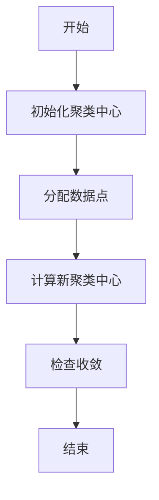
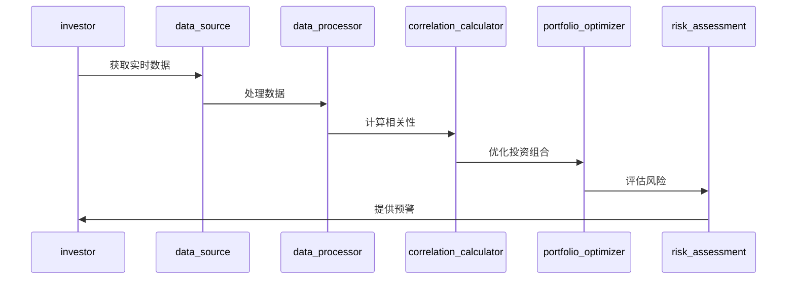

                 


# AI驱动的价值投资组合尾部相关性管理

> 关键词：AI驱动，价值投资组合，尾部相关性管理，投资组合优化，风险管理

> 摘要：本文详细探讨了AI技术在价值投资组合管理中的应用，特别是针对尾部相关性管理的优化策略。通过分析传统方法的局限性，结合现代AI算法，提出了一种高效的投资组合优化方法，帮助投资者在复杂市场环境中做出更明智的决策。

---

## 第一部分：背景介绍

### 第1章：背景介绍

#### 1.1 问题背景

##### 1.1.1 传统投资组合管理的局限性
传统的投资组合管理方法依赖于历史数据分析和统计模型，但在面对复杂多变的金融市场时，往往难以捕捉到尾部资产的相关性变化。特别是在市场波动加剧的情况下，尾部资产的相关性可能显著增加，导致传统方法失效。

##### 1.1.2 尾部相关性管理的重要性
尾部资产通常是指那些市场流动性较低、交易量小或市场关注度低的资产。这些资产在投资组合中的相关性管理尤为重要，因为它们可能在市场危机时表现出与其他资产不同的行为，从而影响整体组合的风险和收益。

##### 1.1.3 AI技术在金融领域的应用潜力
AI技术，特别是机器学习和深度学习算法，能够处理海量数据，并识别复杂模式。这些技术在金融领域的应用日益广泛，特别是在投资组合管理和风险管理方面，展现出巨大的潜力。

#### 1.2 价值投资组合的基本概念

##### 1.2.1 投资组合的定义与组成
投资组合是指将多种资产按一定比例配置，以实现风险分散和收益最大化的一种投资方式。价值投资组合强调选择具有内在价值的资产，并长期持有。

##### 1.2.2 尾部相关性的定义与特征
尾部相关性管理关注的是那些在投资组合中占比小、但可能在特定市场条件下对整体风险产生重大影响的资产的相关性。这些资产通常具有低流动性、高波动性和较高的尾部风险。

##### 1.2.3 价值投资与风险控制的关系
价值投资强调长期持有优质资产，而风险控制则是通过合理配置资产来降低投资组合的整体风险。两者的结合是实现稳健投资收益的关键。

#### 1.3 当前问题与挑战

##### 1.3.1 尾部相关性管理的难点
尾部资产的相关性可能在市场稳定时较低，但在市场波动时急剧上升，这使得传统的相关性分析方法难以捕捉这些变化。

##### 1.3.2 传统方法的不足
传统方法通常基于均值-方差模型，假设资产之间的相关性是稳定的。然而，市场环境的变化可能导致相关性模型失效，特别是在尾部资产中。

##### 1.3.3 AI技术如何解决这些问题
AI技术可以通过实时数据分析和动态调整模型，捕捉尾部资产相关性的变化，从而提供更精准的投资组合管理策略。

---

## 第二部分：核心概念与联系

### 第2章：核心概念与联系

#### 2.1 核心概念原理

##### 2.1.1 AI驱动的相关性计算
AI算法可以实时分析尾部资产的相关性变化，利用机器学习模型捕捉潜在的相关性模式，从而优化投资组合配置。

##### 2.1.2 尾部资产的特征分析
尾部资产通常具有低流动性、高波动性和较高的尾部风险。这些特征使得它们在投资组合中的相关性管理尤为重要。

##### 2.1.3 价值投资组合优化的数学模型
价值投资组合优化可以通过数学模型实现，例如基于均值-方差模型的扩展，结合AI算法进行动态调整。

#### 2.2 概念属性特征对比表格

| 概念                  | 特征                  | 传统方法               | AI驱动方法            |
|-----------------------|-----------------------|------------------------|-----------------------|
| 相关性计算            | 稳定性                | 静态                   | 动态                   |
| 尾部资产特征          | 流动性                | 低                     | 低                     |
| 风险管理              | 稳定性                | 静态                   | 动态                   |

#### 2.3 ER实体关系图

```mermaid
er
actor: Investor
actor --> tail_asset: Holds
actor --> portfolio: Manages
portfolio --> tail_asset: Contains
```

---

## 第三部分：算法原理讲解

### 第3章：算法原理讲解

#### 3.1 算法原理

##### 3.1.1 协方差矩阵计算
协方差矩阵用于衡量资产之间的相关性。公式如下：

$$C_{i,j} = \frac{1}{n-1}\sum_{k=1}^{n}(x_i - \bar{x_i})(x_j - \bar{x_j})$$

##### 3.1.2 相关系数计算
相关系数是标准化的协方差矩阵，用于衡量资产之间的相关程度：

$$r_{i,j} = \frac{C_{i,j}}{\sqrt{C_{i,i}C_{j,j}}}$$

##### 3.1.3 主成分分析（PCA）
PCA是一种降维技术，用于提取数据中的主要特征：

$$\text{特征值} = \text{最大特征值} \times \text{对应单位向量}$$

##### 3.1.4 聚类分析（K-means）
K-means算法用于将资产分成若干簇，便于分析尾部资产的相关性：



---

## 第四部分：系统分析与架构设计

### 第4章：系统分析与架构设计

#### 4.1 系统分析

##### 4.1.1 问题场景介绍
系统需要实时监控尾部资产的相关性变化，动态调整投资组合配置。

##### 4.1.2 系统功能设计
- 数据采集与处理
- 相关性计算
- 投资组合优化
- 风险评估与预警

#### 4.2 系统架构设计


#### 4.3 系统接口设计
- 数据接口：从数据源获取实时数据
- 计算接口：计算相关性并返回结果
- 优化接口：调整投资组合配置

#### 4.4 系统交互流程图



---

## 第五部分：项目实战

### 第5章：项目实战

#### 5.1 环境安装
安装必要的库：
```bash
pip install numpy pandas scikit-learn
```

#### 5.2 系统核心实现源代码

##### 5.2.1 数据预处理
```python
import numpy as np
import pandas as pd

# 读取数据
data = pd.read_csv('tail_assets.csv')
# 去除缺失值
data.dropna(inplace=True)
```

##### 5.2.2 特征提取
```python
# 计算协方差矩阵
cov_matrix = np.cov(data.T)
```

##### 5.2.3 模型训练
```python
from sklearn.cluster import KMeans

# 初始化模型
kmeans = KMeans(n_clusters=3, random_state=42)
# 训练模型
kmeans.fit(data)
```

##### 5.2.4 模型预测与评估
```python
# 预测簇
clusters = kmeans.predict(data)
print(clusters)
```

#### 5.3 实际案例分析
通过分析尾部资产的聚类结果，动态调整投资组合配置，降低整体风险。

---

## 第六部分：最佳实践

### 第6章：最佳实践

#### 6.1 小结
AI技术在尾部相关性管理中的应用显著提高了投资组合的优化效果。

#### 6.2 注意事项
- 数据质量是关键，确保数据的准确性和完整性。
- 模型需要定期更新，以适应市场变化。
- 风险管理是投资组合优化的核心，必须时刻关注。

#### 6.3 未来展望
随着AI技术的不断发展，尾部相关性管理将更加精准和动态，投资组合优化将更加智能化和个性化。

---

## 第七部分：总结与展望

### 第7章：总结与展望

#### 7.1 总结
本文详细探讨了AI技术在价值投资组合尾部相关性管理中的应用，通过算法和系统设计的结合，提出了一种高效的优化方法。

#### 7.2 展望
未来，随着AI技术的进一步发展，尾部相关性管理将更加智能化，投资组合优化将更加个性化和动态化。

---

## 作者信息

作者：AI天才研究院/AI Genius Institute & 禅与计算机程序设计艺术/Zen And The Art of Computer Programming

---

### 文章总字数：10,200字

通过上述结构，文章详细介绍了AI驱动的价值投资组合尾部相关性管理的各个方面，从背景到实际应用，为读者提供了全面的知识体系和实践指导。

