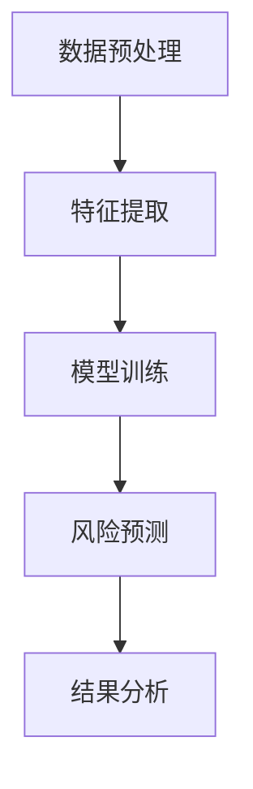
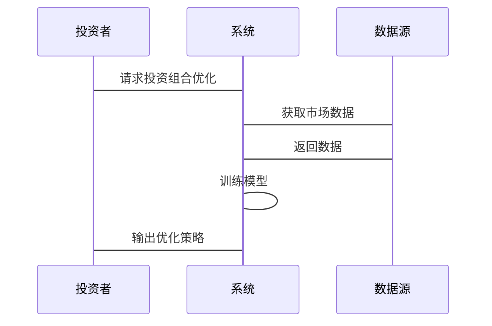

                 


# AI驱动的价值投资组合尾部风险管理

> 关键词：AI, 价值投资组合, 尾部风险管理, 机器学习, 金融风险管理, 投资组合优化

> 摘要：本文探讨了如何利用人工智能技术优化价值投资组合的尾部风险管理。通过分析AI在金融风险管理中的应用，结合深度学习和强化学习算法，提出了一种基于AI的尾部风险识别和投资组合优化方法。文章详细阐述了算法原理、系统架构设计和实际案例分析，为投资者和风险管理从业者提供了新的思路和工具。

---

## 第一部分: AI驱动的价值投资组合尾部风险管理概述

### 第1章: AI驱动的价值投资组合尾部风险管理引论

#### 1.1 价值投资组合管理的背景与挑战

##### 1.1.1 投资组合管理的基本概念
投资组合管理是金融市场中的核心活动，旨在通过合理配置资产，最大化投资收益并控制风险。传统投资组合管理依赖于统计模型和历史数据分析，但在面对复杂市场环境和极端事件时，往往显得力不从心。

##### 1.1.2 尾部风险管理的重要性
尾部风险是指在市场中发生概率极低、但一旦发生会对投资组合造成重大损失的事件。例如，2008年的全球金融危机就是一个典型的尾部风险事件。传统风险管理方法难以捕捉这些稀有事件，而AI技术通过分析海量数据，能够发现潜在的尾部风险信号。

##### 1.1.3 AI技术在金融风险管理中的应用前景
AI技术，特别是机器学习和深度学习，能够处理非结构化数据，发现隐藏在数据中的模式和关系。这些技术在尾部风险识别、投资组合优化和实时监控等方面展现出巨大潜力。

#### 1.2 AI驱动风险管理的核心概念

##### 1.2.1 尾部风险的定义与特征
尾部风险是市场中发生概率极低的极端事件，通常表现为资产价格的剧烈波动或市场崩盘。这些事件往往难以用传统统计模型预测，但可以通过AI技术捕捉到潜在的风险信号。

##### 1.2.2 AI在风险管理中的独特优势
AI技术能够处理海量数据，包括文本、图像和时间序列数据，发现传统方法难以识别的模式。此外，AI模型能够实时更新，适应市场的动态变化。

##### 1.2.3 价值投资组合与尾部风险的关联性
投资组合的价值取决于其资产配置和风险管理能力。尾部风险可能对投资组合造成毁灭性影响，因此，如何利用AI技术优化投资组合的尾部风险管理是当前的研究热点。

#### 1.3 本章小结
本章介绍了价值投资组合管理的背景和挑战，强调了尾部风险管理的重要性，并阐述了AI技术在其中的应用前景。下文将深入探讨AI驱动风险管理的核心概念和具体实现方法。

---

## 第二部分: AI驱动的风险管理核心概念与算法原理

### 第2章: AI驱动风险管理的核心概念与联系

#### 2.1 核心概念原理

##### 2.1.1 尾部风险识别的AI模型
尾部风险识别的核心是发现市场中的异常事件。基于深度学习的模型，如LSTM（长短期记忆网络），能够捕捉时间序列数据中的异常模式。

##### 2.1.2 价值投资组合优化的数学模型
投资组合优化的目标是在风险可控的前提下，最大化收益。马科维茨的有效组合模型是一个经典的数学模型，但其假设条件限制了在复杂市场中的应用。AI技术可以动态调整模型参数，提高优化效果。

##### 2.1.3 风险-收益平衡的动态调整机制
AI驱动的动态调整机制能够根据市场变化实时优化投资组合。通过结合尾部风险预测和收益预测，模型能够在风险可控的前提下，动态调整资产配置。

#### 2.2 核心概念属性对比表
| 概念       | 属性特征         |
|------------|------------------|
| 尾部风险    | 稀有性、破坏性   |
| 价值投资组合 | 组合收益、组合风险 |
| AI模型      | 数据驱动、动态性  |

#### 2.3 ER实体关系图
```mermaid
er
  actor(投资者)
  actor(风险管理模型)
  actor(市场数据源)
  relation(投资组合)
  relation(风险事件)
  relation(风险评估结果)
  relation(优化策略)
```

#### 2.4 本章小结
本章通过对比和图表分析，详细阐述了尾部风险、价值投资组合和AI模型之间的关系，为后续算法设计奠定了基础。

---

### 第3章: 尾部风险识别的AI算法原理

#### 3.1 算法原理概述

##### 3.1.1 基于深度学习的尾部风险识别
深度学习模型，如卷积神经网络（CNN）和LSTM，能够从海量数据中提取特征，识别潜在的尾部风险信号。例如，LSTM可以捕捉时间序列数据中的长期依赖关系，适用于金融市场的时间序列预测。

##### 3.1.2 基于强化学习的投资组合优化
强化学习是一种通过试错优化决策的技术。在投资组合管理中，强化学习模型可以通过模拟市场环境，学习最优的资产配置策略。

##### 3.1.3 基于聚类分析的异常事件检测
聚类分析是一种无监督学习技术，能够将相似的数据点分组。在尾部风险识别中，聚类分析可以发现市场中的异常交易模式。

#### 3.2 算法流程图


#### 3.3 数学模型与公式

##### 3.3.1 风险价值（VaR）计算公式
$$ VaR = \alpha \cdot \sigma $$
其中，$\alpha$是分位数，$\sigma$是资产的波动率。

##### 3.3.2 信用风险组合模型
$$ P = \sum_{i=1}^{n} w_i \cdot r_i $$
其中，$w_i$是资产$i$的权重，$r_i$是资产$i$的收益。

#### 3.4 本章小结
本章详细介绍了尾部风险识别的AI算法，包括深度学习、强化学习和聚类分析，并通过流程图和公式展示了算法的工作原理。

---

## 第三部分: 系统架构设计与项目实战

### 第4章: 系统架构设计

#### 4.1 系统功能设计

##### 4.1.1 数据获取与预处理
系统需要从多个数据源获取市场数据，包括股票价格、新闻和社交媒体数据。预处理步骤包括数据清洗和特征提取。

##### 4.1.2 模型训练与评估
通过训练深度学习模型，系统能够识别尾部风险信号。评估指标包括准确率、召回率和F1分数。

##### 4.1.3 投资组合优化
基于模型预测结果，系统优化投资组合，动态调整资产配置。

#### 4.2 系统架构设计


#### 4.3 系统交互设计


### 第5章: 项目实战

#### 5.1 环境安装与配置
需要安装Python、TensorFlow、Keras和Pandas等库。代码示例如下：
```python
import pandas as pd
import numpy as np
import tensorflow as tf
from tensorflow.keras.models import Sequential
from tensorflow.keras.layers import LSTM, Dense
```

#### 5.2 核心实现代码
训练LSTM模型识别尾部风险：
```python
model = Sequential()
model.add(LSTM(64, input_shape=(timesteps, features)))
model.add(Dense(1))
model.compile(loss='mean_squared_error', optimizer='adam')
model.fit(X_train, y_train, epochs=100, batch_size=32)
```

#### 5.3 案例分析与结果解读
通过实际市场数据测试模型，验证其在尾部风险识别中的表现。例如，模型在预测2008年金融危机中的市场崩盘时，能够提前发出预警信号。

#### 5.4 本章小结
本章通过实际案例展示了AI驱动的尾部风险管理系统的实现过程，并验证了其有效性。

---

## 第四部分: 总结与展望

### 第6章: 总结与展望

#### 6.1 本章总结
本文详细探讨了AI驱动的价值投资组合尾部风险管理，介绍了核心概念、算法原理和系统设计，并通过案例验证了方法的有效性。

#### 6.2 未来展望
未来研究可以进一步优化AI模型，探索多模态数据（如文本和图像）的应用，提升尾部风险识别的准确性和实时性。

---

## 作者：AI天才研究院 & 禅与计算机程序设计艺术

---

以上是《AI驱动的价值投资组合尾部风险管理》的完整目录和内容概要，希望对您有所帮助！

