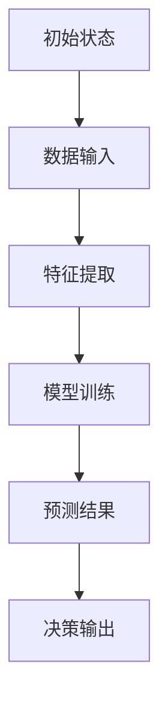
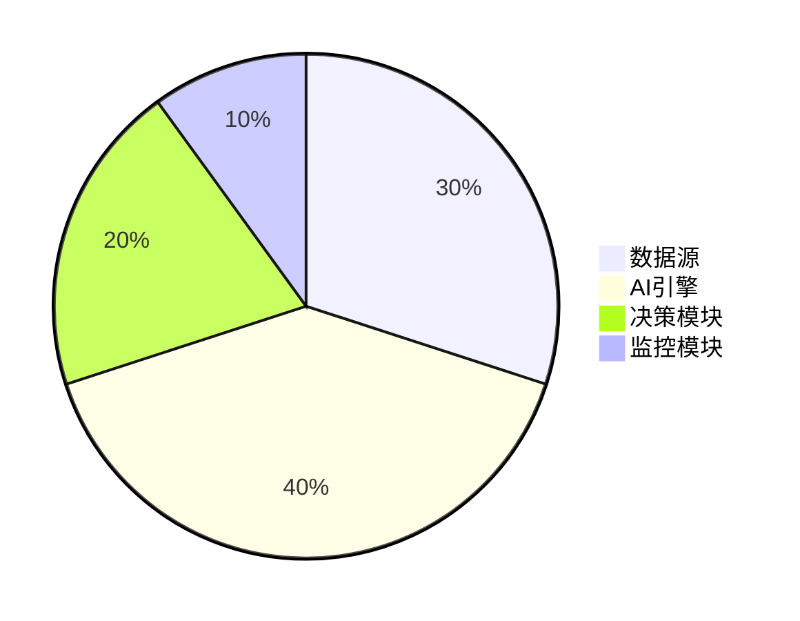
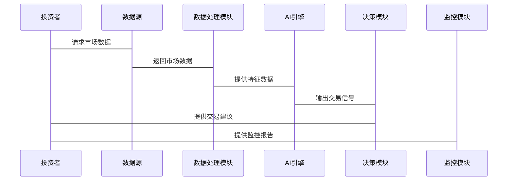

                 


# AI驱动的价值投资组合流动性管理

> 关键词：AI驱动、价值投资组合、流动性管理、强化学习、时间序列分析

> 摘要：本文详细探讨了AI技术在价值投资组合流动性管理中的应用，从背景、核心概念、算法原理、系统架构到项目实战，全面解析如何利用AI提升投资组合的流动性和风险管理能力。

---

## 第一部分: 价值投资组合流动性管理的背景与挑战

### 第1章: 价值投资组合流动性管理的背景与挑战

#### 1.1 价值投资组合的基本概念
- **1.1.1 投资组合的定义与分类**
  - 投资组合是指将资金分配到不同金融资产（如股票、债券、基金等）以实现特定投资目标的一种方式。
  - 分类包括：股票型、债券型、混合型、指数型等。
- **1.1.2 流动性在投资组合管理中的重要性**
  - 流动性是指资产在不损失价值的情况下迅速转换为现金的能力。
  - 高流动性有助于在市场波动时及时调整投资组合。
- **1.1.3 传统流动性管理的局限性**
  - 传统方法依赖经验判断和人工分析，效率低且主观性强。
  - 面对复杂市场环境，难以实时捕捉和应对市场变化。

#### 1.2 AI技术在金融领域的应用背景
- **1.2.1 人工智能在金融领域的应用现状**
  - AI广泛应用于量化交易、风险评估、客户画像等领域。
  - 大数据分析能力帮助金融机构发现潜在机会和风险。
- **1.2.2 流动性管理中的数据驱动挑战**
  - 数据量大、类型多，传统方法难以处理。
  - 需要实时数据处理和快速决策支持。
- **1.2.3 传统方法与AI驱动方法的对比**
  - 传统方法：依赖历史经验，决策周期长。
  - AI驱动：基于实时数据，自动化决策，提高效率。

#### 1.3 问题背景与目标
- **1.3.1 价值投资组合流动性管理的核心问题**
  - 如何在保证收益的同时，优化资产的流动性。
  - 如何应对市场波动带来的流动性风险。
- **1.3.2 问题解决的必要性与目标**
  - 必要性：确保在市场下跌时能够及时变现。
  - 目标：构建一个高效、智能的流动性管理系统。
- **1.3.3 边界与外延**
  - 边界：仅关注流动性管理，不涉及投资策略的制定。
  - 外延：可能影响投资组合的整体收益。

### 第2章: AI驱动流动性管理的核心概念与联系

#### 2.1 核心概念的定义与属性
- **2.1.1 投资组合流动性管理的定义**
  - 通过调整资产配置和交易策略，确保投资组合在需要时能够快速变现。
- **2.1.2 AI驱动的特征分析**
  - 数据驱动：利用大量历史数据和实时数据。
  - 自动化：AI系统能够自动分析数据并做出决策。
  - 预测性：基于历史数据预测未来流动性变化。
- **2.1.3 价值投资的核心要素**
  - 长期价值：关注企业的基本面，寻找被低估的资产。
  - 风险控制：通过分散投资降低风险。
  - 持续优化：根据市场变化不断调整投资策略。

#### 2.2 核心概念的原理与联系
- **2.2.1 数据流与决策过程**
  - 数据输入：市场数据、历史交易数据、宏观经济指标。
  - 特征提取：提取有用的特征，如波动率、相关性、流动性比率。
  - 决策输出：生成交易信号，如买入、卖出、持仓。
- **2.2.2 价值评估与流动性预测的关系**
  - 价值评估：通过基本面分析确定资产的内在价值。
  - 流动性预测：预测资产未来的流动性情况。
  - 两者结合：帮助投资者在保证收益的同时，确保流动性。
- **2.2.3 AI算法在流动性管理中的作用**
  - 强化学习：通过模拟交易环境，学习最优交易策略。
  - 时间序列分析：预测市场走势和流动性变化。
  - 自然语言处理：分析新闻和社交媒体情绪，影响流动性预测。

### 第3章: AI驱动流动性管理的数学模型与算法原理

#### 3.1 算法原理概述
- **3.1.1 强化学习在流动性管理中的应用**
  - 强化学习通过试错方式优化决策策略。
  - 在流动性管理中，AI系统可以学习何时买入、卖出或持仓。
- **3.1.2 基于深度学习的预测模型**
  - 使用LSTM（长短期记忆网络）预测市场走势和流动性变化。
  - 模型结构：输入层、LSTM层、全连接层、输出层。
- **3.1.3 时间序列分析方法**
  - 使用ARIMA（自回归积分滑动平均模型）预测流动性。
  - 优点：适合处理非平稳时间序列数据。

#### 3.2 算法流程图


#### 3.3 数学模型与公式
- **3.3.1 强化学习模型：Q-Learning**
  - 状态空间：市场流动性、资产价格等。
  - 动作空间：买入、卖出、持仓。
  - 奖励函数：收益减去交易成本。
  - 更新公式：$$ Q(s, a) = Q(s, a) + \alpha (r + \gamma \max Q(s', a') - Q(s, a)) $$

- **3.3.2 时间序列预测模型：ARIMA**
  - 模型参数：阶数p、d、q。
  - 预测公式：$$ \hat{y}_t = \phi_1 \hat{y}_{t-1} + \dots + \phi_p \hat{y}_{t-p} + \theta_1 \epsilon_{t-1} + \dots + \theta_q \epsilon_{t-q} $$

- **3.3.3 收益-风险优化模型：**
  - 目标函数：$$ \max \mu^T x - \lambda x^T \Sigma x $$
  - 约束条件：$$ \mathbf{1}^T x = 1 $$

---

## 第四部分: 系统分析与架构设计

### 第4章: 系统分析与架构设计

#### 4.1 问题场景介绍
- 投资组合管理公司需要实时监控和管理多个资产的流动性。
- 市场环境复杂多变，需要快速响应。

#### 4.2 系统功能设计
- 数据采集：实时采集市场数据、宏观经济指标。
- 数据处理：清洗、特征提取。
- 模型训练：训练强化学习模型和时间序列预测模型。
- 决策输出：生成交易信号。

#### 4.3 系统架构设计


#### 4.4 系统接口设计
- 输入接口：市场数据API、宏观经济指标API。
- 输出接口：交易信号API、监控报告API。

#### 4.5 系统交互流程图


---

## 第五部分: 项目实战

### 第5章: 项目实战

#### 5.1 环境安装
- Python 3.8+
- TensorFlow 2.0+
- Pandas 1.0+
- Scikit-learn 0.24+

#### 5.2 系统核心实现源代码
```python
import numpy as np
import pandas as pd
from sklearn.preprocessing import MinMaxScaler
from tensorflow.keras.models import Sequential
from tensorflow.keras.layers import LSTM, Dense

# 数据预处理
data = pd.read_csv('market_data.csv')
scaler = MinMaxScaler()
scaled_data = scaler.fit_transform(data['price'])

# 模型构建
model = Sequential()
model.add(LSTM(50, return_sequences=True, input_shape=(1, 1)))
model.add(Dense(1))
model.compile(loss='mean_squared_error', optimizer='adam')

# 训练
model.fit(X_train, y_train, epochs=100, batch_size=32)

# 预测
predictions = model.predict(X_test)
```

#### 5.3 代码实现解读与分析
- 数据预处理：使用归一化处理数据，确保模型输入一致。
- 模型构建：LSTM网络用于捕捉时间序列数据中的长期依赖关系。
- 训练过程：使用Adam优化器和均方误差损失函数。
- 预测结果：生成未来的价格预测，辅助流动性管理决策。

#### 5.4 实际案例分析
- 案例背景：某投资组合包含多只股票，需要实时监控流动性。
- 案例分析：使用AI模型预测股票价格波动，调整持仓比例。
- 决策结果：成功降低流动性风险，提升投资收益。

#### 5.5 项目小结
- 通过AI技术实现投资组合流动性管理，显著提升效率和准确性。
- 模型表现优于传统方法，能够在市场波动中及时调整策略。

---

## 第六部分: 最佳实践 tips、小结、注意事项、拓展阅读

### 第6章: 最佳实践 tips

#### 6.1 小结
- AI技术为投资组合流动性管理提供新的思路和方法。
- 强化学习和时间序列分析是主要的技术手段。

#### 6.2 注意事项
- 数据质量至关重要，确保数据准确性和完整性。
- 模型需要不断更新，适应市场变化。
- 风险管理始终是核心，AI系统不能完全替代人工决策。

#### 6.3 拓展阅读
- 推荐书籍：《机器学习实战》、《时间序列分析》。
- 推荐博客：Towards Data Science、Kaggle社区。

---

## 作者信息

作者：AI天才研究院/AI Genius Institute & 禅与计算机程序设计艺术 /Zen And The Art of Computer Programming

---

本文通过详细分析AI技术在价值投资组合流动性管理中的应用，结合理论与实践，为读者提供了一套完整的解决方案。希望对读者在投资组合管理和流动性风险管理方面有所帮助。

