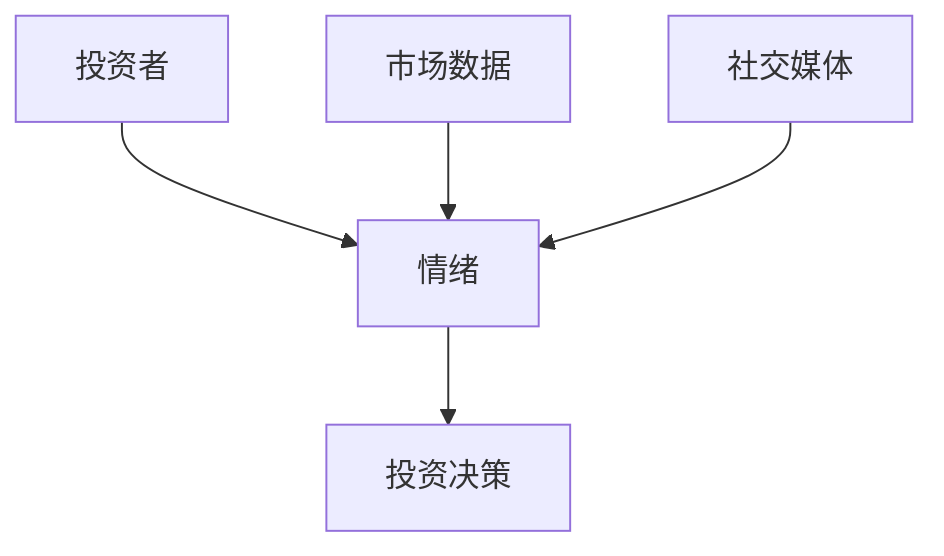
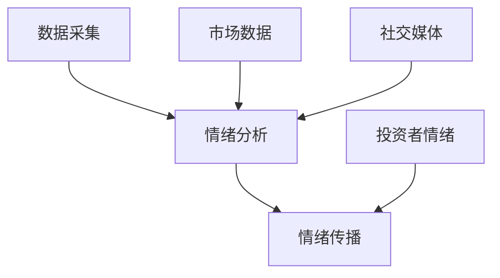

                 


# AI驱动的价值投资者情绪分析与控制

## 关键词：人工智能, 情绪分析, 价值投资, 投资者情绪, 自然语言处理

## 摘要：  
本文探讨了如何利用人工智能技术分析和控制投资者情绪，以辅助价值投资决策。文章从投资者情绪的基本概念出发，详细阐述了AI驱动的情绪分析方法，包括文本分析、情感计算和情绪传播模型。结合自然语言处理和机器学习算法，提出了基于LSTM和注意力机制的深度学习模型，并通过系统架构设计展示了情绪分析系统的实现。通过实际案例分析，验证了AI在情绪控制中的有效性，并总结了最佳实践和未来发展方向。

---

# 第一部分: 背景介绍

## 第1章: 价值投资与投资者情绪概述

### 1.1 价值投资的基本概念

#### 1.1.1 价值投资的定义与核心理念  
价值投资是一种以基本面分析为基础的投资策略，强调以低于内在价值的价格买入优质资产，长期持有，等待价值回归。其核心理念是寻找市场中的“价值洼地”，即被市场低估的优质公司。

#### 1.1.2 价值投资的历史与发展  
价值投资起源于20世纪初，由本杰明·格雷厄姆和戴维·多德提出，后来由沃伦·巴菲特发扬光大。随着金融市场的复杂化和数据量的爆炸式增长，传统价值投资方法逐渐融入现代技术手段，尤其是人工智能技术。

#### 1.1.3 价值投资与情绪分析的关系  
投资者情绪是价值投资中不可忽视的因素。情绪波动会影响投资者的决策，导致非理性行为，偏离长期价值判断。通过AI技术分析投资者情绪，可以帮助投资者克服情绪干扰，做出更理性的投资决策。

---

### 1.2 投资者情绪的基本概念

#### 1.2.1 投资者情绪的定义与分类  
投资者情绪是指投资者在面对市场波动时的心理状态和行为反应。根据表现形式，可分为乐观、悲观、贪婪、恐惧等；根据影响范围，可分为个体情绪和群体情绪。

#### 1.2.2 情绪在投资决策中的作用  
情绪是投资决策的重要影响因素。过度乐观可能导致投资者高位买入，过度悲观可能导致低位卖出。情绪分析可以帮助识别市场情绪拐点，辅助投资决策。

#### 1.2.3 情绪分析的挑战与意义  
情绪分析的挑战在于情绪的主观性、复杂性和动态变化。其意义在于帮助投资者识别情绪偏差，优化投资策略，提高投资收益。

---

### 1.3 AI在金融领域的应用现状

#### 1.3.1 AI在金融分析中的应用  
AI技术广泛应用于金融领域的价格预测、风险评估、市场情绪分析等。通过自然语言处理技术，AI可以从新闻、社交媒体等非结构化数据中提取情绪信息。

#### 1.3.2 AI在情绪分析中的应用  
AI通过深度学习模型，可以自动分析文本数据中的情感倾向，识别投资者情绪。例如，使用LSTM网络分析社交媒体上的投资者情绪，预测市场走势。

#### 1.3.3 当前研究的不足与未来方向  
当前研究多关注情绪识别的准确性，但对情绪的动态传播和群体影响研究不足。未来研究方向包括情绪传播模型的优化和跨市场情绪分析。

---

## 第2章: 价值投资者情绪分析的核心概念

### 2.1 情绪分析的基本原理

#### 2.1.1 情绪分析的定义与目标  
情绪分析是对文本数据进行情感倾向性分析，目标是识别文本中隐含的情感态度。在投资领域，情绪分析的目标是识别投资者情绪，预测市场走势。

#### 2.1.2 情绪分析的分类与方法  
情绪分析方法包括基于规则的浅层分析、基于机器学习的特征提取和深度学习模型。深度学习模型如LSTM和Transformer在处理长文本和捕捉语义关系方面表现优异。

#### 2.1.3 情绪分析的评价指标  
常用的评价指标包括准确率、精确率、召回率和F1值。选择合适的评价指标有助于评估模型性能。

---

### 2.2 价值投资者情绪分析的特殊性

#### 2.2.1 价值投资者的决策特点  
价值投资者注重长期投资，关注公司基本面，较少受短期市场波动影响。但情绪波动仍可能影响其决策。

#### 2.2.2 价值投资者情绪分析的独特需求  
价值投资者情绪分析需要结合基本面分析，关注长期情绪变化。同时，需要考虑投资者的个体差异和投资策略。

#### 2.2.3 情绪分析的边界与外延  
情绪分析的边界在于如何准确捕捉情绪信号，外延在于结合其他因素进行综合分析。

---

### 2.3 核心概念与联系

#### 2.3.1 情绪分析的核心要素  
情绪分析的核心要素包括文本数据、情感倾向、情绪强度和情绪传播。这些要素共同构成情绪分析的完整框架。

#### 2.3.2 情绪分析与价值投资的关系  
情绪分析帮助识别市场情绪拐点，辅助价值投资者做出更理性的决策。通过情绪分析，投资者可以更好地把握市场情绪，优化投资策略。

#### 2.3.3 ER实体关系图架构  


---

## 第3章: 价值投资者情绪分析的算法原理

### 3.1 情绪分析的算法选择

#### 3.1.1 基于传统机器学习的算法  
传统算法如SVM和随机森林适用于小规模数据，但难以处理长文本和语义关系。

#### 3.1.2 基于深度学习的算法  
深度学习算法如LSTM和Transformer在处理长文本和捕捉语义关系方面表现优异。适用于社交媒体文本和新闻数据的情绪分析。

---

### 3.2 情绪分析的数学模型与公式

#### 3.2.1 LSTM网络的结构与训练过程  
LSTM网络通过门控机制处理序列数据，公式如下：
$$
f_t = \sigma(g_x(x_t, h_{t-1}) + g_g(h_{t-1}) \cdot g_r(r_{t-1}))
$$

#### 3.2.2 注意力机制的工作原理  
注意力机制通过计算词与词之间的相关性，确定每个词的权重：
$$
\alpha_i = \frac{\exp(w_i)}{\sum_{j} \exp(w_j)}
$$

---

### 3.3 情绪分析系统的实现流程

#### 3.3.1 数据预处理  
数据预处理包括分词、去除停用词和文本向量化。使用Word2Vec进行词向量转换。

#### 3.3.2 情感分类模型的训练与优化  
训练LSTM模型，使用交叉验证优化超参数。通过网格搜索选择最优参数组合。

#### 3.3.3 情绪传播模型的设计  
情绪传播模型基于社会网络分析，通过构建情绪传播网络，分析情绪的扩散路径。

---

### 3.4 情绪分析算法的实现代码

```python
import tensorflow as tf
from tensorflow.keras import layers

def build_model(max_length, vocab_size):
    model = tf.keras.Sequential()
    model.add(layers.Embedding(vocab_size, 100, input_length=max_length))
    model.add(layers.LSTM(128, return_sequences=True))
    model.add(layers.Attention(max_length))
    model.add(layers.Dense(2, activation='softmax'))
    model.compile(loss='sparse_categorical_crossentropy', optimizer='adam', metrics=['accuracy'])
    return model
```

---

## 第4章: 价值投资者情绪分析系统架构设计

### 4.1 系统功能设计

#### 4.1.1 数据采集模块  
数据采集模块负责获取社交媒体、新闻和市场数据，实时更新情绪数据。

#### 4.1.2 情绪分析模块  
情绪分析模块使用LSTM和注意力机制，对文本数据进行情感倾向分析，生成情绪指数。

#### 4.1.3 情绪传播模块  
情绪传播模块分析情绪在投资者之间的传播路径，预测情绪变化趋势。

---

### 4.2 系统架构图



---

### 4.3 系统接口设计

#### 4.3.1 数据接口  
数据接口负责接收和处理外部数据，包括社交媒体、新闻和市场数据。

#### 4.3.2 情绪指数接口  
情绪指数接口提供投资者情绪指数，供其他系统调用。

#### 4.3.3 用户接口  
用户接口提供可视化界面，展示情绪分析结果，辅助投资者决策。

---

### 4.4 系统交互流程

```mermaid
sequenceDiagram
投资者请求情绪分析
->> 数据采集模块: 获取数据
数据采集模块 ->> 情绪分析模块: 提供数据
情绪分析模块 ->> 情绪传播模块: 分析情绪
情绪传播模块 ->> 投资者: 提供情绪指数
```

---

## 第5章: 项目实战

### 5.1 环境搭建

#### 5.1.1 安装Python和相关库  
安装Python 3.8以上版本，安装TensorFlow、Keras、NLTK和jieba。

#### 5.1.2 数据集准备  
准备社交媒体数据，包括推特、Reddit等平台的投资者评论。

---

### 5.2 情绪分析模块的实现

#### 5.2.1 数据预处理  
使用jieba进行中文分词，去除停用词，转换为词向量。

#### 5.2.2 模型训练  
训练LSTM模型，使用训练数据进行模型优化。

---

### 5.3 情绪传播模块的实现

#### 5.3.1 网络构建  
构建投资者情绪传播网络，分析情绪传播路径。

#### 5.3.2 情绪传播预测  
基于网络分析，预测未来情绪变化趋势。

---

### 5.4 案例分析

#### 5.4.1 案例背景  
分析某次市场波动中的投资者情绪变化，验证模型的有效性。

#### 5.4.2 情绪指数分析  
展示情绪指数的变化趋势，与实际市场表现对比。

---

## 第6章: 案例分析与最佳实践

### 6.1 案例分析

#### 6.1.1 案例背景  
选择某次市场波动事件，分析投资者情绪变化。

#### 6.1.2 情绪指数分析  
通过模型生成情绪指数，与实际市场数据对比，验证模型的有效性。

---

### 6.2 最佳实践

#### 6.2.1 数据质量的重要性  
数据质量和多样性直接影响模型性能，需注意数据清洗和标注。

#### 6.2.2 模型调优技巧  
通过网格搜索优化模型参数，选择合适的评估指标。

#### 6.2.3 情绪传播的注意事项  
情绪传播模型需考虑个体差异和网络结构，避免过度简化。

---

## 第7章: 总结与展望

### 7.1 总结

本文详细探讨了AI驱动的价值投资者情绪分析与控制，从理论到实践，展示了如何利用深度学习技术分析投资者情绪，优化投资决策。通过实际案例验证了模型的有效性。

---

### 7.2 未来展望

未来研究方向包括优化情绪传播模型、结合多模态数据进行情绪分析，以及探索情绪干预策略。随着AI技术的发展，情绪分析将在投资领域发挥更大的作用。

---

## 作者：AI天才研究院/AI Genius Institute & 禅与计算机程序设计艺术 /Zen And The Art of Computer Programming

---

**全文完**

