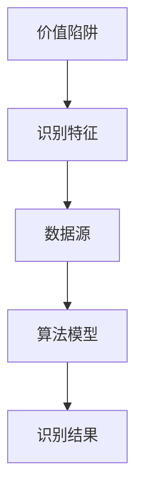
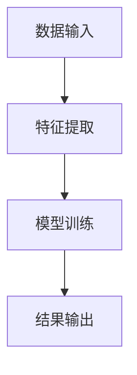
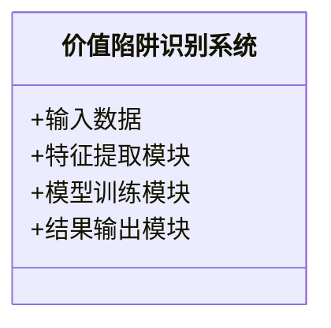
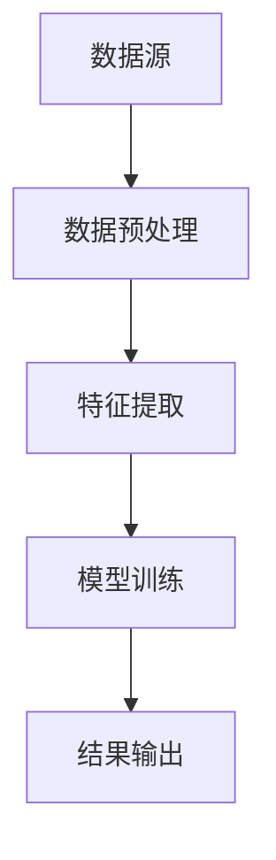
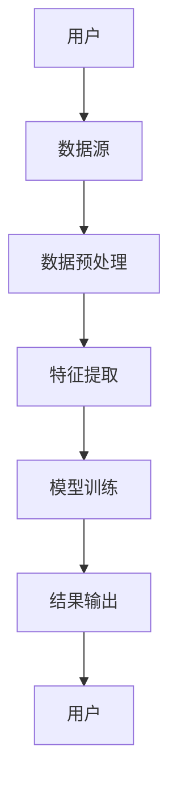

                 


# AI驱动的价值陷阱识别与规避

> 关键词：价值陷阱，AI识别，机器学习，深度学习，异常检测，系统架构

> 摘要：本文深入探讨了AI在识别和规避价值陷阱中的应用，结合理论与实践，详细介绍了算法原理、系统设计及实际案例，旨在为读者提供全面的指导。

---

# 第1章: 价值陷阱与AI驱动的识别概述

## 1.1 价值陷阱的概念与特征

### 1.1.1 价值陷阱的定义
价值陷阱是指在商业、金融或其他领域中，隐藏在表面现象下的潜在风险或问题。这些陷阱可能看似有利，实则暗藏危机，容易导致决策失误。

### 1.1.2 价值陷阱的核心特征
- **隐蔽性**：陷阱往往隐藏在表面的积极现象之后。
- **误导性**：表面信息可能误导决策者。
- **动态性**：陷阱随环境变化而变化。

### 1.1.3 价值陷阱的分类与场景
1. **商业场景**：如虚假盈利数据。
2. **金融场景**：如市场操纵。

## 1.2 AI在价值陷阱识别中的作用

### 1.2.1 AI技术的基本原理
AI通过数据处理、特征提取和模型训练，帮助识别模式和异常。

### 1.2.2 AI在价值陷阱识别中的优势
- **高效性**：快速处理大量数据。
- **准确性**：通过算法提升识别精度。

### 1.2.3 AI驱动识别的边界与外延
AI识别有其局限性，需结合人工判断。

## 1.3 本书的核心目标与结构

### 1.3.1 本书的核心目标
系统讲解AI识别价值陷阱的方法。

### 1.3.2 本书的章节结构
涵盖理论、算法、系统设计及实战。

### 1.3.3 本书的适用读者
适合技术与非技术人员阅读。

---

# 第2章: 价值陷阱识别的核心概念与联系

## 2.1 核心概念的原理分析

### 2.1.1 价值陷阱识别的原理
通过数据分析和机器学习识别异常。

### 2.1.2 AI驱动的核心算法
- **监督学习**：基于标记数据。
- **无监督学习**：发现隐藏模式。

### 2.1.3 价值陷阱识别的系统架构
系统包括数据采集、特征提取和模型训练模块。

## 2.2 核心概念的属性特征对比

### 2.2.1 价值陷阱与非陷阱的特征对比
| 特征 | 陷阱 | 非陷阱 |
|------|-------|---------|
| 数据 | 异常 | 正常 |

### 2.2.2 不同场景下的陷阱特征分析
- **商业场景**：虚假增长。
- **金融场景**：市场操纵。

## 2.3 ER实体关系图架构



---

# 第3章: 价值陷阱识别的算法原理

## 3.1 监督学习与无监督学习

### 3.1.1 监督学习的原理
基于标记数据训练模型。

### 3.1.2 无监督学习的原理
发现数据中的隐藏结构。

### 3.1.3 混合学习的原理
结合监督和无监督方法。

## 3.2 异常检测算法

### 3.2.1 异常检测的基本概念
识别数据中的异常点。

### 3.2.2 基于统计的异常检测
使用统计方法识别异常。

### 3.2.3 基于机器学习的异常检测
使用算法学习异常特征。

## 3.3 深度学习模型

### 3.3.1 神经网络的基本结构
包括输入层、隐藏层和输出层。

### 3.3.2 LSTM网络的原理
处理时间序列数据，捕捉长期依赖。

### 3.3.3 BERT模型的应用
用于自然语言处理任务。

## 3.4 算法流程图



---

# 第4章: 价值陷阱识别的系统分析与架构设计

## 4.1 系统分析

### 4.1.1 问题场景介绍
识别商业和金融中的价值陷阱。

### 4.1.2 项目介绍
设计一个AI驱动的识别系统。

## 4.2 系统功能设计

### 4.2.1 领域模型设计


### 4.2.2 系统架构设计


### 4.2.3 系统接口设计
API设计，定义输入输出接口。

### 4.2.4 系统交互设计


## 4.3 项目实战

### 4.3.1 环境安装
安装Python、TensorFlow等工具。

### 4.3.2 核心代码实现
```python
import tensorflow as tf
model = tf.keras.Sequential()
model.add(tf.keras.layers.Dense(64, activation='relu'))
model.add(tf.keras.layers.Dense(1, activation='sigmoid'))
model.compile(optimizer='adam', loss='binary_crossentropy')
model.fit(x_train, y_train, epochs=10)
```

### 4.3.3 案例分析
分析虚假盈利数据，识别异常。

---

# 第5章: 总结与展望

## 5.1 总结
AI在识别价值陷阱中的应用前景广阔。

## 5.2 展望
未来，AI将更广泛地应用于风险识别。

## 5.3 小结
结合AI技术，提升识别效率和准确性。

## 5.4 注意事项
避免过度依赖AI，结合人工判断。

## 5.5 拓展阅读
推荐相关书籍和论文。

---

作者：AI天才研究院 & 禅与计算机程序设计艺术

