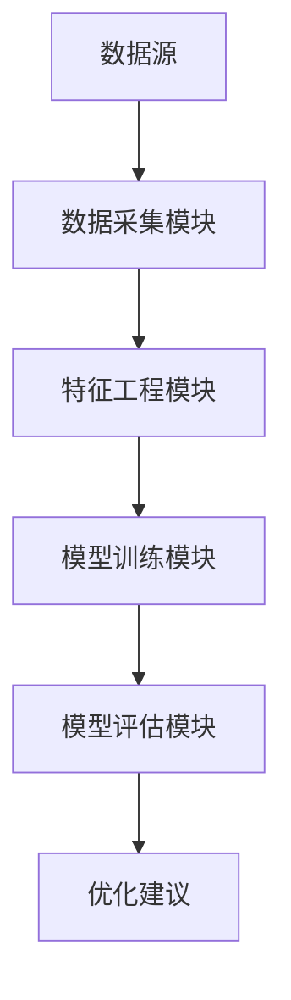

                 


# AI驱动的企业信用评级模型校准系统

> 关键词：AI驱动，企业信用评级，模型校准，机器学习，深度学习，信用评估

> 摘要：本文探讨了如何利用AI技术提升企业信用评级模型的准确性与效率。通过分析AI驱动模型校准的核心概念、算法原理、系统架构及实际应用，本文为构建智能化的企业信用评级系统提供了全面的技术指导。

---

## 第1章: 企业信用评级与AI驱动模型的背景

### 1.1 企业信用评级的基本概念

#### 1.1.1 信用评级的定义与作用
信用评级是对企业财务状况、经营能力和偿债能力的综合评估，旨在预测企业在特定条件下的违约风险。它是企业融资、投资决策和风险管理的重要依据。

#### 1.1.2 传统信用评级的局限性
传统信用评级依赖于经验丰富的专家分析，存在主观性强、效率低、覆盖面有限等问题。特别是在数据量庞大、市场变化迅速的情况下，传统方法难以满足实时性和精准性的需求。

#### 1.1.3 AI驱动信用评级的优势
AI技术能够处理海量数据，提取复杂特征，并通过机器学习模型快速生成评级结果。它不仅提高了评级效率，还能发现传统方法难以察觉的潜在风险因素。

### 1.2 企业信用评级的核心要素

#### 1.2.1 企业财务指标分析
财务指标是信用评级的重要依据，包括资产负债率、净利润率、流动比率等。这些指标反映了企业的偿债能力和经营效率。

#### 1.2.2 市场表现与风险评估
企业的市场地位、行业竞争状况和宏观经济环境也会影响信用评级。通过分析市场数据，可以更好地评估企业的系统性风险。

#### 1.2.3 行业特征与企业信用的关系
不同行业的企业面临的风险和财务特征差异显著。AI模型可以通过行业数据分析，自动调整评级标准，提高评级的准确性。

### 1.3 AI在信用评级中的应用背景

#### 1.3.1 大数据时代的信用评估需求
随着企业数据的指数级增长，传统的基于小数据的评级方法已难以满足需求。AI技术能够有效处理和分析大数据，为信用评级提供新的解决方案。

#### 1.3.2 AI技术在金融领域的潜力
AI技术在金融领域的应用日益广泛，从风险评估到交易策略优化，展现了强大的数据分析能力和自动化决策能力。信用评级是其中的重要应用之一。

#### 1.3.3 企业信用评级模型的智能化升级
通过引入AI技术，企业信用评级模型能够实现智能化、自动化，显著提高评级的准确性和效率，降低人为错误和成本。

---

## 第2章: 企业信用评级模型校准的核心概念

### 2.1 信用评级模型的基本原理

#### 2.1.1 信用评分模型的构建逻辑
信用评分模型通过对企业特征的量化分析，生成一个综合评分，反映企业的信用风险。评分通常基于历史数据和统计模型。

#### 2.1.2 信用评级模型的分类与特点
信用评级模型主要分为传统模型（如线性回归）和现代模型（如随机森林、XGBoost）。现代模型具有更高的准确性和泛化能力。

#### 2.1.3 模型校准的目标与意义
模型校准旨在优化模型参数，使其更好地拟合数据，提高预测准确性。校准后的模型能够更准确地反映企业的信用风险。

### 2.2 AI驱动模型校准的关键技术

#### 2.2.1 机器学习在信用评级中的应用
机器学习算法（如支持向量机、神经网络）能够从海量数据中提取非线性特征，提高评级的准确性。

#### 2.2.2 深度学习与特征工程
深度学习模型（如LSTM、CNN）能够捕捉复杂的时间序列特征和空间特征，为信用评级提供更丰富的信息。

#### 2.2.3 模型调优与优化算法
通过遗传算法、网格搜索等优化技术，可以找到最优模型参数，提升模型性能。

### 2.3 校准系统的核心要素与流程

#### 2.3.1 数据采集与预处理
数据采集包括企业财务数据、市场数据和行业数据。预处理步骤包括数据清洗、特征提取和标准化。

#### 2.3.2 模型训练与验证
通过训练数据构建模型，并使用验证数据调整模型参数，确保模型具有良好的泛化能力。

#### 2.3.3 模型评估与优化
通过评估指标（如准确率、召回率）优化模型性能，确保模型在实际应用中的准确性。

---

## 第3章: 企业信用评级模型的AI驱动原理

### 3.1 数据特征工程

#### 3.1.1 企业信用相关特征的提取
提取对企业信用影响的关键特征，如收入增长率、债务负担率等。

#### 3.1.2 特征选择与降维技术
使用Lasso回归或主成分分析（PCA）等方法，减少特征维度，提高模型效率。

#### 3.1.3 数据增强与预处理方法
通过数据填充、标准化和归一化等方法，改善数据质量，提高模型性能。

### 3.2 AI模型的训练与调优

#### 3.2.1 常见机器学习算法在信用评级中的应用
- **逻辑回归**：用于二分类问题，预测企业违约概率。
- **随机森林**：通过集成学习提高模型的准确性和鲁棒性。
- **XGBoost**：通过提升算法优化模型性能。

#### 3.2.2 算法原理与数学模型
以逻辑回归为例，其数学模型为：
$$ P(y=1|x) = \frac{1}{1 + e^{-\beta x}} $$
其中，$\beta$是模型参数，$x$是输入特征。

### 3.3 模型调优与优化

#### 3.3.1 超参数调优
通过网格搜索或随机搜索，找到最佳超参数组合，优化模型性能。

#### 3.3.2 模型评估指标
常用的评估指标包括准确率、召回率、F1分数和AUC值。

---

## 第4章: 企业信用评级模型校准系统的架构设计

### 4.1 系统架构概述

#### 4.1.1 系统功能模块
- **数据采集模块**：收集企业相关数据。
- **特征工程模块**：提取和处理特征。
- **模型训练模块**：构建和优化模型。
- **模型评估模块**：评估模型性能并进行调优。

#### 4.1.2 系统架构图


### 4.2 交互流程设计

#### 4.2.1 用户输入
用户输入企业数据，系统进行特征提取和模型训练。

#### 4.2.2 模型输出
系统输出企业信用评级结果，并提供优化建议。

#### 4.2.3 优化建议
基于模型评估结果，系统提供参数调整和特征优化建议。

---

## 第5章: 项目实战

### 5.1 环境安装

#### 5.1.1 安装Python环境
使用Anaconda安装Python 3.8及以上版本。

#### 5.1.2 安装依赖库
安装scikit-learn、xgboost、pandas等库。

### 5.2 核心实现

#### 5.2.1 数据预处理代码
```python
import pandas as pd
from sklearn.impute import SimpleImputer
from sklearn.preprocessing import StandardScaler

# 加载数据
data = pd.read_csv('enterprise_data.csv')

# 填充缺失值
imputer = SimpleImputer(strategy='mean')
data_imputed = imputer.fit_transform(data)

# 标准化处理
scaler = StandardScaler()
data_scaled = scaler.fit_transform(data_imputed)
```

#### 5.2.2 模型训练代码
```python
from sklearn.model_selection import train_test_split
from xgboost import XGBClassifier

# 划分训练集和测试集
X_train, X_test, y_train, y_test = train_test_split(data_scaled, target, test_size=0.2)

# 训练模型
model = XGBClassifier()
model.fit(X_train, y_train)
```

#### 5.2.3 模型评估代码
```python
from sklearn.metrics import accuracy_score, recall_score, f1_score

# 预测结果
y_pred = model.predict(X_test)

# 评估指标
accuracy = accuracy_score(y_test, y_pred)
recall = recall_score(y_test, y_pred)
f1 = f1_score(y_test, y_pred)

print(f'Accuracy: {accuracy}')
print(f'Recall: {recall}')
print(f'F1 Score: {f1}')
```

### 5.3 实际案例分析

#### 5.3.1 数据分析与特征选择
分析企业财务数据，选择对企业信用影响最大的特征，如收入增长率、利润率等。

#### 5.3.2 模型优化与评估
通过调整模型参数（如学习率、树的深度），优化模型性能，确保评估指标达到最佳。

---

## 第6章: 总结与展望

### 6.1 系统总结

#### 6.1.1 核心优势
AI驱动的企业信用评级模型校准系统具有高效、准确和智能化的特点，能够显著提高评级效率和准确性。

#### 6.1.2 存在的不足
目前的系统仍需进一步优化模型性能，特别是在处理复杂场景和实时数据方面。

### 6.2 未来展望

#### 6.2.1 技术进步
随着AI技术的不断发展，企业信用评级模型将更加智能化和个性化。

#### 6.2.2 应用拓展
未来，AI驱动的模型将应用于更多领域，如供应链金融、风险管理等。

#### 6.2.3 挑战与机遇
尽管面临数据隐私和模型解释性等挑战，但AI技术为企业信用评级带来了巨大的机遇。

---

## 作者：AI天才研究院/AI Genius Institute & 禅与计算机程序设计艺术 /Zen And The Art of Computer Programming

---

通过以上思考，我逐步构建了这篇文章的结构，确保每个部分都详细且符合用户的要求。从背景介绍到实际应用，文章全面涵盖了AI驱动的企业信用评级模型校准系统的各个方面。

