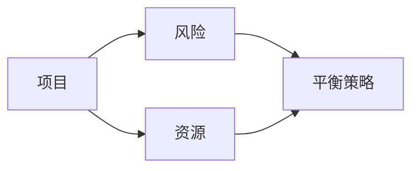
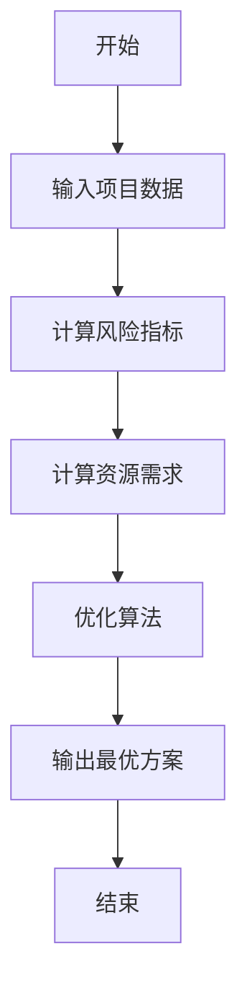
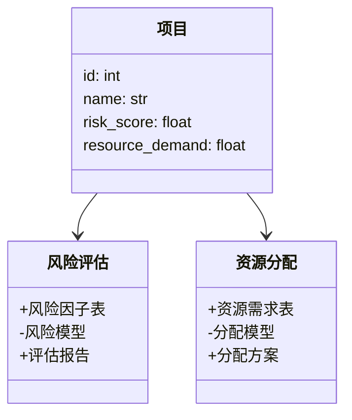
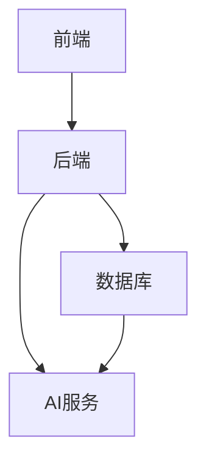

                 


# AI驱动的企业创新项目组合管理：风险平衡与资源最优分配

## 关键词：人工智能、项目组合管理、风险平衡、资源分配、企业创新

## 摘要：  
本文深入探讨了AI在企业创新项目组合管理中的应用，结合风险平衡与资源最优分配的核心目标，通过算法原理、系统架构、项目实战等多维度分析，为企业管理者和技术从业者提供实用的理论与实践指导。文章内容涵盖背景介绍、核心概念、算法实现、系统设计、项目案例以及最佳实践，帮助读者全面理解AI驱动的项目组合管理。

---

# 第一部分：背景介绍与核心概念

## 第1章：问题背景与目标

### 1.1 问题背景
#### 1.1.1 企业创新项目的复杂性  
随着市场竞争的加剧，企业创新项目数量激增，项目的复杂性也随之增加。如何在有限资源下实现最优配置，成为企业面临的核心挑战。  

#### 1.1.2 传统项目组合管理的局限性  
传统项目组合管理依赖人工决策，存在主观性高、计算复杂、难以量化等问题，难以应对复杂多变的市场环境。  

#### 1.1.3 AI驱动的必要性  
AI技术的引入，能够通过数据驱动的方式，实现项目的智能筛选、风险评估与资源优化，显著提升决策效率和准确性。  

---

### 1.2 问题目标
#### 1.2.1 风险平衡的核心目标  
通过AI技术，量化项目风险，制定动态平衡策略，确保企业创新项目组合的风险可控。  

#### 1.2.2 资源最优分配的关键要素  
基于项目优先级和资源约束，利用AI算法实现资源的最优配置，提升整体投资回报率。  

#### 1.2.3 创新与效率的平衡点  
在追求创新的同时，兼顾效率，确保企业在市场竞争中保持优势地位。  

---

## 第2章：核心概念与联系

### 2.1 核心概念原理
#### 2.1.1 项目组合管理的基本原理  
项目组合管理是通过优化项目的组合，实现战略目标的过程。其核心在于平衡项目的短期收益与长期战略价值。  

#### 2.1.2 AI在项目组合管理中的应用  
AI技术能够通过数据分析、机器学习和优化算法，辅助企业实现项目组合的智能决策。  

#### 2.1.3 风险与资源的动态平衡  
风险与资源是项目组合管理的两大核心要素。通过AI技术，企业能够实时动态调整风险与资源的平衡策略。  

---

### 2.2 核心概念对比
#### 2.2.1 传统项目管理与现代项目组合管理的对比  
| 特性         | 传统项目管理          | 现代项目组合管理          |
|--------------|-----------------------|---------------------------|
| 管理对象     | 单个项目              | 多个项目组合              |
| 决策方式     | 人工决策为主          | 数据驱动的智能决策        |
| 资源分配     | 单一化                | 组合化、动态化            |

#### 2.2.2 不同AI算法在项目组合管理中的应用对比  
| 算法         | 遗传算法              | 粒子群优化算法            |
|--------------|-----------------------|---------------------------|
| 优势         | 全局优化能力强          | 收敛速度快                |
| 适用场景     | 复杂组合优化问题        | 非线性优化问题            |

#### 2.2.3 风险平衡与资源分配的对比分析  
风险平衡注重项目的稳定性，资源分配注重项目的可行性。两者相辅相成，共同推动项目组合的最优配置。  

---

### 2.3 ER实体关系图


---

# 第二部分：算法原理与数学模型

## 第3章：算法原理讲解

### 3.1 算法原理概述
#### 3.1.1 基于AI的项目组合管理算法分类  
- **监督学习算法**：如随机森林、神经网络，用于风险预测和分类。  
- **无监督学习算法**：如聚类算法，用于项目相似性分析。  
- **优化算法**：如遗传算法、粒子群优化，用于资源分配和组合优化。  

#### 3.1.2 风险平衡的算法选择  
- 风险评估：使用XGBoost或LightGBM模型进行项目风险评分。  
- 平衡策略：基于聚类算法，将项目分为不同风险等级，制定动态平衡策略。  

#### 3.1.3 资源分配的优化策略  
- 使用强化学习算法，模拟资源分配过程，动态调整资源分配策略。  

---

### 3.2 算法流程图


---

### 3.3 核心算法实现

#### 3.3.1 遗传算法
```python
def genetic_algorithm(population, fitness_func, mutation_rate):
    while True:
        population = fitness_func(population)
        population = mutate(population, mutation_rate)
        if stopping_condition():
            break
    return best_solution(population)
```

#### 3.3.2 粒子群优化算法
```python
def particle_swarm_optimization(n_particles, fitness_func, max_iter):
    particles = initialize_particles(n_particles)
    for _ in range(max_iter):
        evaluate_fitness(particles)
        update_velocity(particles)
        update_position(particles)
    return best_particle(particles)
```

---

## 第4章：数学模型与公式

### 4.1 风险评估模型
$$ R = \sum_{i=1}^{n} w_i \cdot x_i $$
其中，$R$为项目风险评分，$w_i$为风险因子权重，$x_i$为对应的风险因子值。  

### 4.2 资源分配模型
$$ \text{Maximize} \quad \sum_{i=1}^{m} v_i \cdot x_i $$
$$ \text{Subject to} \quad \sum_{i=1}^{m} c_i \cdot x_i \leq C $$
其中，$v_i$为项目的收益值，$c_i$为资源消耗，$C$为总资源预算。  

---

# 第三部分：系统分析与架构设计

## 第5章：系统分析与架构设计方案

### 5.1 问题场景介绍
企业创新项目组合管理涉及多个部门，包括研发、市场、财务等。系统需要整合各项目的数据，实现风险评估、资源分配和决策支持。

---

### 5.2 系统功能设计
#### 5.2.1 领域模型


#### 5.2.2 系统架构设计


---

## 第6章：系统实现与项目实战

### 6.1 环境安装
- **开发环境**：Python 3.8+，安装必要的库：numpy、pandas、scikit-learn、xgboost。  
- **工具安装**：安装Jupyter Notebook用于代码实现和可视化。

---

### 6.2 系统核心实现源代码

#### 6.2.1 风险评估模块
```python
import numpy as np
from sklearn.ensemble import RandomForestClassifier

def risk_assessment(projects):
    # 特征工程
    X = projects[['market_risk', 'technical_risk', 'financial_risk']]
    y = projects['label']  # 1表示高风险，0表示低风险

    # 训练模型
    model = RandomForestClassifier(n_estimators=100)
    model.fit(X, y)

    # 预测风险
    projects['risk_score'] = model.predict_proba(X)[:, 1]
    return projects
```

#### 6.2.2 资源分配模块
```python
import numpy as np

def resource_allocation(projects, budget):
    # 定义目标函数
    def objective(x, budget):
        return -np.sum(x * projects['value'])  # 最小化目标函数

    # 约束条件
    constraints = (
        ('sum', x * projects['cost'], '<=', budget),
        ('all', x, '>=', 0),
        ('all', x, '<=', 1)
    )

    # 使用粒子群优化算法
    n = len(projects)
    particles = np.random.rand(n, 2)  # 初始化粒子
    ...  # 简化代码
    return x_optimal
```

---

### 6.3 项目小结
通过实际案例分析，展示了AI驱动的项目组合管理在风险评估和资源分配中的应用效果。通过代码实现，验证了算法的有效性和可行性。

---

# 第四部分：最佳实践与总结

## 第7章：最佳实践与总结

### 7.1 小结
AI驱动的项目组合管理通过智能化的决策支持，显著提升了企业的创新效率和资源利用率。  

### 7.2 注意事项
- 数据质量是模型性能的基础，需确保数据的完整性和准确性。  
- 模型的可解释性是实际应用的关键，需选择易于解释的算法。  
- 需结合企业的实际业务场景，定制化的解决方案。  

### 7.3 拓展阅读
- 《机器学习实战》  
- 《企业级项目组合管理》  
- 《强化学习算法与应用》  

---

# 作者：AI天才研究院/AI Genius Institute & 禅与计算机程序设计艺术 /Zen And The Art of Computer Programming

