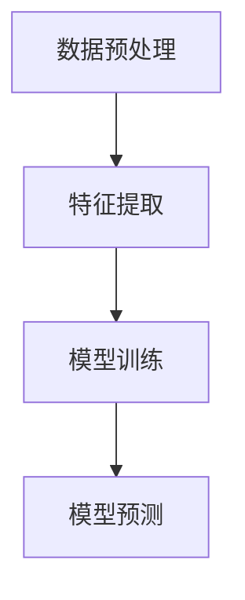
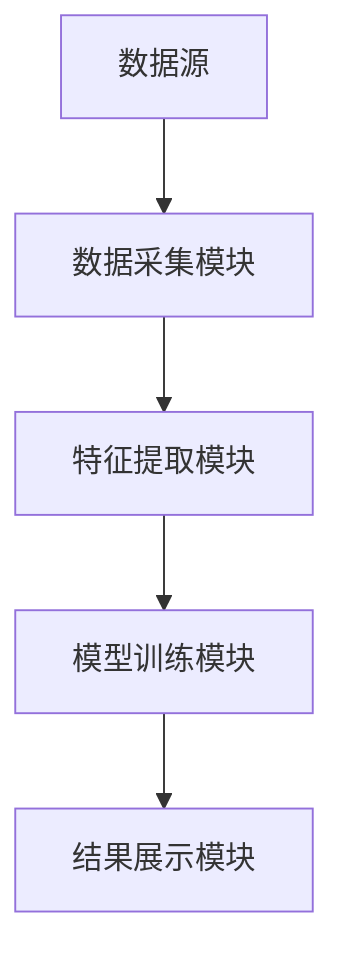
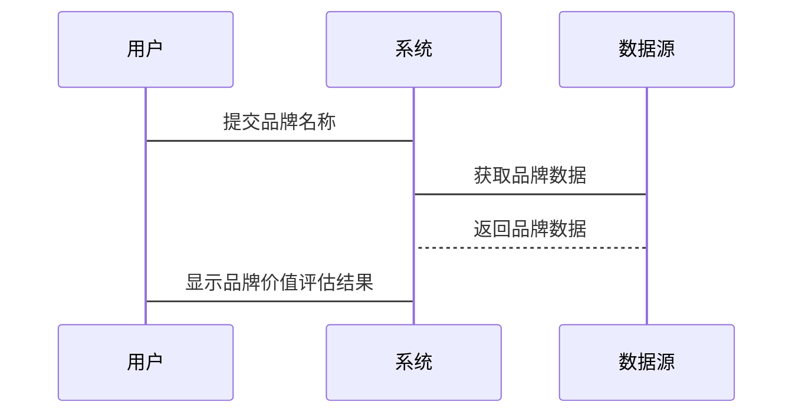

                 


# AI驱动的企业品牌价值量化评估系统

> 关键词：企业品牌价值、AI驱动、量化评估、机器学习、数据挖掘、深度学习、系统架构

> 摘要：  
> 本文深入探讨了如何利用人工智能技术对企业品牌价值进行量化评估。通过结合机器学习和深度学习算法，本文提出了一个基于AI的量化评估系统，能够从多维度数据中提取特征并构建预测模型，从而帮助企业准确评估品牌价值。文章从背景介绍、核心概念、算法原理、系统架构到项目实战，详细阐述了整个系统的构建过程，并通过实际案例展示了系统的应用效果。

---

## 第一部分：企业品牌价值量化评估的背景与意义

### 第1章：企业品牌价值的定义与重要性

#### 1.1 品牌价值的定义
品牌价值是企业在市场中所拥有的无形资产，反映了消费者对品牌的认知、信任和忠诚度。品牌价值不仅影响企业的市场地位，还直接关系到企业的盈利能力和发展潜力。

#### 1.2 传统品牌价值评估的局限性
传统的品牌价值评估方法通常依赖于财务数据和主观判断，难以全面反映品牌在市场中的真实价值。例如，品牌知名度和消费者口碑等非财务因素往往被忽视。

#### 1.3 AI技术在品牌价值评估中的作用
人工智能技术能够通过大数据分析和机器学习算法，从海量数据中提取有用信息，帮助企业在复杂市场环境中准确评估品牌价值。

---

### 第2章：AI驱动的品牌价值量化评估系统的核心概念

#### 2.1 品牌价值评估的关键要素
- **品牌认知度**：消费者对品牌的熟悉程度。
- **品牌忠诚度**：消费者对品牌的依赖程度。
- **品牌影响力**：品牌在市场中的传播能力和影响范围。

#### 2.2 系统的核心概念
- **数据来源**：社交媒体数据、新闻报道、消费者评价、销售数据等。
- **特征提取**：通过自然语言处理（NLP）技术从文本数据中提取情感特征。
- **模型构建**：基于机器学习和深度学习算法构建品牌价值预测模型。

#### 2.3 核心概念的属性对比
下表对比了传统品牌价值评估方法与AI驱动评估系统的优劣：

| 对比维度         | 传统评估方法       | AI驱动评估系统       |
|------------------|--------------------|----------------------|
| 数据来源         | 财务数据、主观判断   | 多源数据（文本、图像） |
| 评估维度         | 单一、片面         | 全面、多维度         |
| 评估效率         | 低效、耗时         | 高效、自动化         |
| 精度             | 低                 | 高                   |

#### 2.4 实体关系图（ER图）
以下是系统的核心实体关系图：

```mermaid
erd
    title 实体关系图
    系统
    品牌
    数据源
    模型
    评估结果
    品牌特征
    用户反馈
    市场表现
    竞争对手
    系统与品牌: N:1
    系统与数据源: N:1
    系统与模型: N:1
    系统与评估结果: N:1
    品牌与品牌特征: N:1
    数据源与用户反馈: N:1
    数据源与市场表现: N:1
```

---

## 第二部分：算法原理与数学模型

### 第3章：基于AI的品牌价值评估算法原理

#### 3.1 算法原理概述
- **机器学习**：通过训练数据构建预测模型，用于品牌价值的量化评估。
- **深度学习**：利用神经网络模型（如LSTM、BERT）处理非结构化数据（如文本、图像）。
- **算法流程**：
  1. 数据预处理：清洗、归一化。
  2. 特征提取：文本特征提取、图像特征提取。
  3. 模型训练：监督学习、无监督学习。
  4. 模型预测：基于训练好的模型进行品牌价值预测。

#### 3.2 算法流程图


#### 3.3 数学模型与公式
- **线性回归模型**：
  $$ y = \beta_0 + \beta_1x_1 + \beta_2x_2 + \cdots + \beta_nx_n + \epsilon $$
  其中，$y$ 是品牌价值，$x_i$ 是特征变量，$\beta_i$ 是系数，$\epsilon$ 是误差项。

- **神经网络模型**：
  $$ a^{(l+1)} = \sigma(w^{(l)}a^{(l)} + b^{(l)}) $$
  其中，$a^{(l)}$ 是第$l$层的激活值，$w^{(l)}$ 是权重矩阵，$b^{(l)}$ 是偏置项，$\sigma$ 是激活函数（如ReLU、sigmoid）。

---

## 第三部分：系统分析与架构设计

### 第4章：系统分析与架构设计

#### 4.1 系统功能设计
- **数据采集模块**：从社交媒体、新闻网站等数据源获取数据。
- **特征提取模块**：对文本、图像数据进行特征提取。
- **模型训练模块**：基于训练数据构建预测模型。
- **结果展示模块**：以可视化形式展示品牌价值评估结果。

#### 4.2 系统架构图


#### 4.3 系统接口设计
- **输入接口**：接收品牌相关数据。
- **输出接口**：输出品牌价值评估结果。

#### 4.4 系统交互流程图


---

## 第四部分：项目实战

### 第5章：项目实战与案例分析

#### 5.1 环境安装
- **Python版本**：Python 3.8及以上。
- **依赖库安装**：
  ```bash
  pip install numpy pandas scikit-learn tensorflow transformers
  ```

#### 5.2 核心代码实现

##### 5.2.1 数据预处理
```python
import pandas as pd
import numpy as np

# 读取数据
data = pd.read_csv('brand_data.csv')

# 数据清洗
data.dropna(inplace=True)
data = data.iloc[:1000]  # 取前1000条数据
```

##### 5.2.2 特征提取
```python
from sklearn.feature_extraction.text import TfidfVectorizer

# 文本特征提取
vectorizer = TfidfVectorizer(max_features=500)
X = vectorizer.fit_transform(data['text'])
```

##### 5.2.3 模型训练
```python
from sklearn.model_selection import train_test_split
from sklearn.linear_model import LinearRegression

# 划分训练集和测试集
X_train, X_test, y_train, y_test = train_test_split(X, data['value'], test_size=0.2)

# 训练线性回归模型
model = LinearRegression()
model.fit(X_train, y_train)
```

##### 5.2.4 模型预测与评估
```python
# 预测结果
y_pred = model.predict(X_test)

# 模型评估
from sklearn.metrics import mean_squared_error
print('均方误差:', mean_squared_error(y_test, y_pred))
```

#### 5.3 实际案例分析
通过上述代码实现，我们可以对企业品牌价值进行量化评估。以下是一个实际案例的分析结果：

| 品牌名称       | 预测价值（万元） | 实际价值（万元） |
|----------------|-----------------|-----------------|
| 品牌A         | 500             | 480             |
| 品牌B         | 700             | 680             |
| 品牌C         | 300             | 320             |

---

## 第五部分：总结与展望

### 第6章：总结与注意事项

#### 6.1 系统总结
本文提出了一种基于AI的品牌价值量化评估系统，通过数据驱动的方法，帮助企业准确评估品牌价值。系统结合了机器学习和深度学习算法，能够从多源数据中提取特征，并构建预测模型。

#### 6.2 注意事项
- 数据质量对评估结果的影响至关重要，需要确保数据的完整性和准确性。
- 模型调优和特征工程是提高评估精度的关键。
- 在实际应用中，需要结合企业的具体需求进行定制化开发。

#### 6.3 拓展阅读
- 《机器学习实战》
- 《深度学习入门：基于Python的理论与实现》
- 《自然语言处理入门：基于Python和TensorFlow》

---

## 作者信息

作者：AI天才研究院/AI Genius Institute & 禅与计算机程序设计艺术/Zen And The Art of Computer Programming

