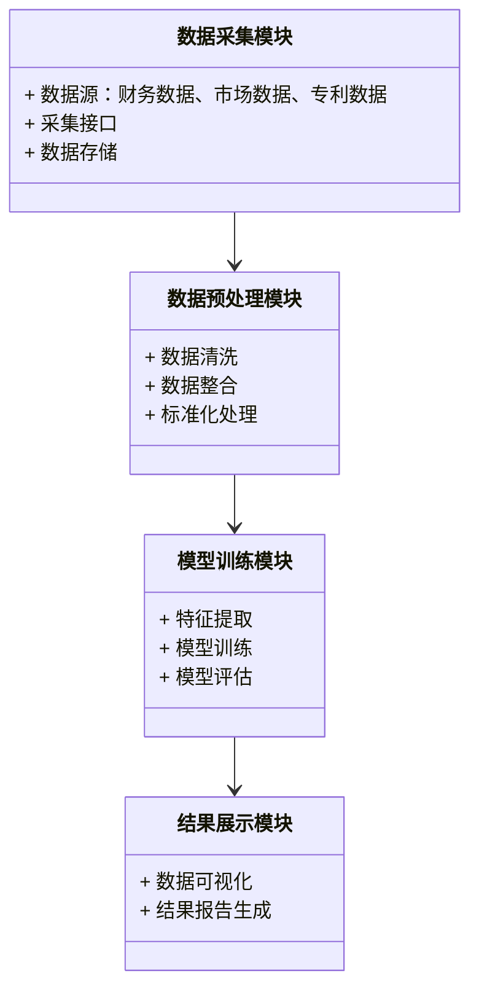
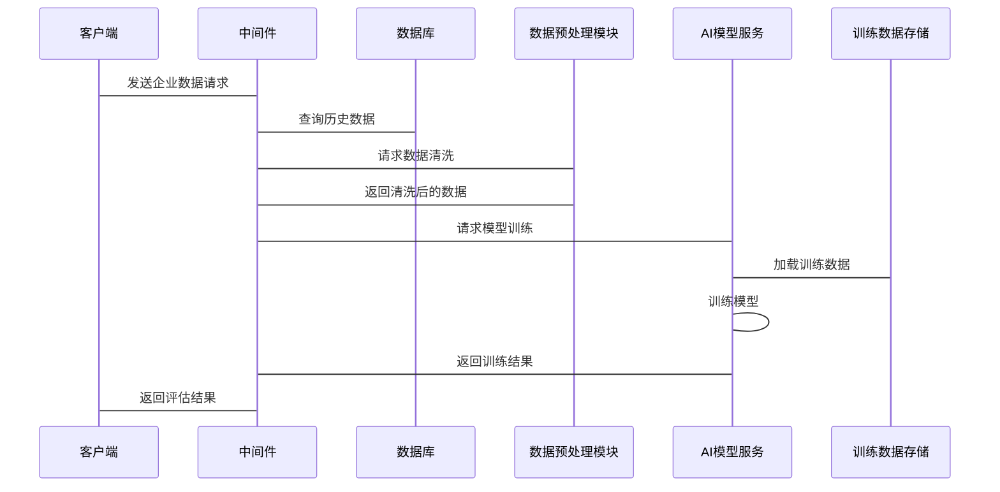
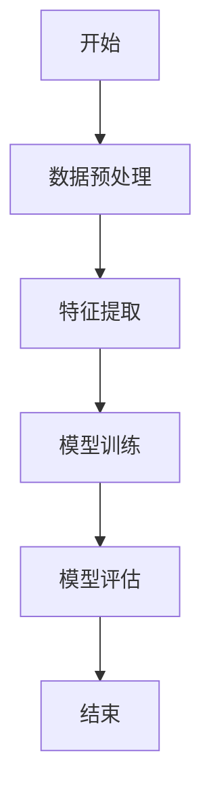

                 


# AI驱动的企业无形资产价值评估系统

> 关键词：AI，企业，无形资产，价值评估，系统架构，算法原理，项目实战

> 摘要：本文详细探讨了如何利用人工智能技术构建企业无形资产价值评估系统。文章首先介绍了无形资产的定义与分类，分析了传统评估方法的局限性，提出了AI驱动评估的必要性。接着，从系统架构、算法原理、核心概念等方面深入讲解了AI驱动评估系统的构建过程，包括系统设计、接口设计、交互流程等。最后，通过实际案例展示了系统的实现与应用效果，并总结了最佳实践和未来发展方向。

---

# 第一部分: 背景介绍

# 第1章: 无形资产的定义与分类

## 1.1 无形资产的定义
- 无形资产是指企业拥有的非实物资产，如品牌价值、客户关系、知识产权等。
- 无形资产的重要性体现在企业价值的贡献上，但传统评估方法难以准确量化。

## 1.2 无形资产的分类
- 知识产权类：专利、商标、版权。
- 经营资产类：品牌价值、客户关系、商誉。
- 技术资产类：技术诀窍、研发能力。

## 1.3 无形资产在企业中的重要性
- 无形资产是企业核心竞争力的体现。
- 无形资产的价值波动直接影响企业市值。
- 无形资产的评估对企业并购、融资等决策至关重要。

# 第2章: 传统无形资产评估方法的局限性

## 2.1 传统资产评估方法概述
- 市场法：通过市场交易数据进行评估。
- 收益法：基于未来现金流折现。
- 成本法：基于重置成本。

## 2.2 传统方法的局限性
- 数据依赖性强，难以处理非结构化数据。
- 评估结果主观性强，缺乏客观依据。
- 无法实时更新，难以应对快速变化的市场环境。

## 2.3 AI技术的应用前景
- 利用机器学习模型处理非结构化数据。
- 基于大数据分析，提高评估的准确性和实时性。
- 提供动态评估，适应市场变化。

---

# 第二部分: 系统架构与设计

# 第3章: 系统架构设计

## 3.1 项目背景与目标
- 项目目标：开发一个基于AI的企业无形资产价值评估系统。
- 项目背景：应对传统评估方法的局限性，提升评估效率和准确性。

## 3.2 系统功能设计
### 3.2.1 系统模块划分
- 数据采集模块：收集企业相关的数据，包括财务数据、市场数据、专利数据等。
- 数据预处理模块：清洗和整合数据，去除噪声。
- 模型训练模块：训练机器学习模型，生成评估结果。
- 结果展示模块：以可视化方式呈现评估结果。

### 3.2.2 领域模型类图（Mermaid）


## 3.3 系统架构设计
### 3.3.1 总体架构（Mermaid）


## 3.4 接口设计
### 3.4.1 数据接口
- 数据采集接口：REST API，用于获取企业数据。
- 数据预处理接口：API，用于清洗和整合数据。

### 3.4.2 模型接口
- 模型训练接口：API，用于训练评估模型。
- 模型评估接口：API，用于获取评估结果。

## 3.5 交互流程（Mermaid）


---

# 第三部分: 算法原理与实现

# 第4章: 算法原理

## 4.1 算法选择
- 选择合适的机器学习模型，如随机森林、神经网络等。

## 4.2 算法流程图（Mermaid）


## 4.3 算法实现代码
### 4.3.1 环境安装
```bash
pip install numpy scikit-learn
```

### 4.3.2 核心代码
```python
import numpy as np
from sklearn.ensemble import RandomForestRegressor

# 数据预处理
X = np.array([[1, 2, 3], [4, 5, 6]])
y = np.array([10, 20])

# 模型训练
model = RandomForestRegressor(n_estimators=100)
model.fit(X, y)

# 预测
print(model.predict([[7, 8, 9]]))
```

## 4.4 数学模型与公式
- 线性回归模型：$$ y = \beta_0 + \beta_1 x + \epsilon $$
- 神经网络模型：$$ y = \sigma(w \cdot x + b) $$

---

# 第四部分: 项目实战与案例分析

# 第5章: 项目实战

## 5.1 实战背景
- 某科技公司希望评估其品牌价值。

## 5.2 实战步骤
1. 数据采集：收集公司的财务数据、市场数据、专利数据。
2. 数据预处理：清洗和整合数据。
3. 模型训练：训练随机森林模型。
4. 模型评估：验证模型准确性。
5. 结果展示：生成品牌价值报告。

## 5.3 代码实现
### 5.3.1 环境配置
```bash
pip install numpy pandas scikit-learn
```

### 5.3.2 核心代码
```python
import pandas as pd
from sklearn.metrics import mean_squared_error

# 数据加载
data = pd.read_csv('enterprise_data.csv')

# 数据预处理
X = data.drop('value', axis=1)
y = data['value']

# 模型训练
from sklearn.model_selection import train_test_split
X_train, X_test, y_train, y_test = train_test_split(X, y, test_size=0.2)

model = RandomForestRegressor(n_estimators=200)
model.fit(X_train, y_train)

# 模型评估
y_pred = model.predict(X_test)
print(mean_squared_error(y_test, y_pred))
```

## 5.4 案例分析
- 通过实际数据验证模型的准确性，评估结果与实际价值进行对比。

---

# 第五部分: 总结与展望

# 第6章: 总结与展望

## 6.1 最佳实践
- 数据质量是关键，确保数据的准确性和完整性。
- 模型选择要结合实际场景，选择合适的算法。
- 结果展示要直观，便于决策者理解。

## 6.2 未来展望
- 引入更复杂的模型，如深度学习，提升评估精度。
- 实现动态评估，实时更新评估结果。
- 扩展应用场景，应用于更多类型的无形资产评估。

---

作者：AI天才研究院 & 禅与计算机程序设计艺术

