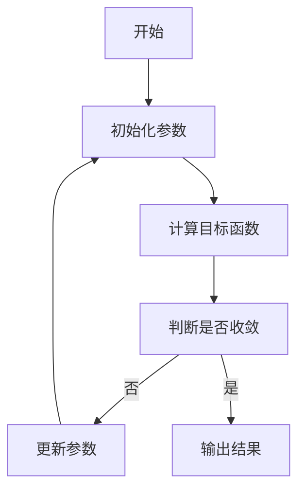
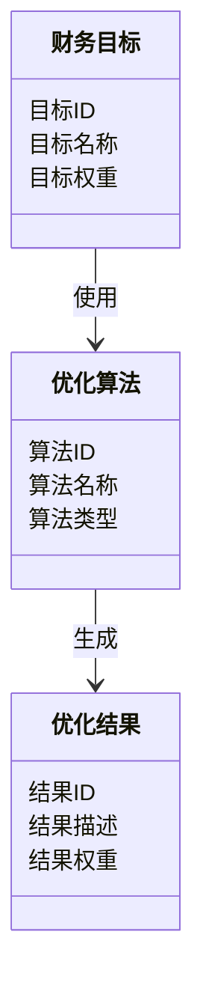
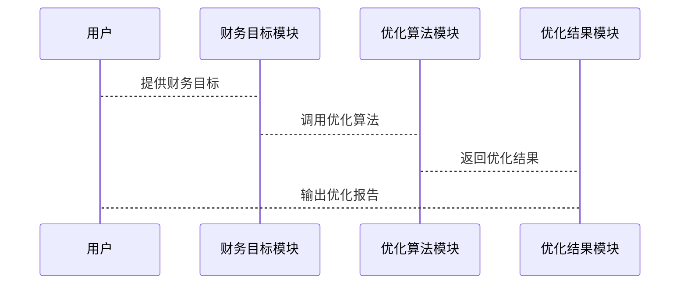

                 


# AI驱动的企业财务战略多目标优化系统

> 关键词：人工智能、财务战略优化、多目标优化、企业财务、AI技术

> 摘要：本文探讨了AI技术在企业财务战略多目标优化中的应用，详细介绍了多目标优化系统的核心概念、算法原理、系统架构以及项目实战，通过实例分析展示了AI驱动的优化系统如何帮助企业实现多目标平衡。

---

# {{此处是文章标题}}

> 关键词：{{此处列出文章的5-7个核心关键词}}

> 摘要：{{此处给出文章的核心内容和主题思想}}

---

# 第一部分: AI驱动的企业财务战略优化的背景与意义

# 第1章: AI驱动的企业财务战略优化的背景与意义

## 1.1 企业财务战略优化的背景

### 1.1.1 传统财务战略优化的局限性

传统的企业财务战略优化通常采用线性规划、非线性规划等方法，这些方法在处理单一目标时表现良好，但在面对多个相互冲突的目标时显得力不从心。例如，企业可能需要在降低成本和提高利润之间找到平衡，或者在风险控制和收益最大化之间做出权衡。传统的优化方法往往难以同时满足这些复杂的目标，导致优化结果不够理想。

### 1.1.2 AI技术对企业财务优化的推动作用

随着人工智能技术的快速发展，AI在企业财务领域的应用逐渐增多。AI技术，特别是强化学习和遗传算法，能够在处理多目标优化问题时表现出色。AI技术的优势在于其强大的数据处理能力、学习能力和优化能力，能够帮助企业在复杂的财务环境中找到最优的解决方案。

### 1.1.3 多目标优化在企业财务中的重要性

在现代企业中，财务决策往往需要考虑多个维度的目标。例如，企业需要在资本预算、资本结构、投资决策等方面进行优化，同时还需要考虑风险、收益、流动性等多个因素。多目标优化能够帮助企业在这些复杂的目标之间找到平衡点，从而实现整体财务绩效的提升。

## 1.2 AI驱动的财务优化的核心概念

### 1.2.1 多目标优化的定义与特点

多目标优化是指在多个目标之间寻找最优解的过程。与单目标优化不同，多目标优化需要在多个目标之间找到一种折中的解决方案，使得所有目标都能尽可能地接近最优状态。多目标优化的特点包括目标的相互冲突性、解的非唯一性和解的 Pareto 优性。

### 1.2.2 AI在多目标优化中的应用优势

AI技术在多目标优化中的应用优势主要体现在以下几个方面：
1. **全局优化能力**：AI算法能够全局搜索，避免陷入局部最优。
2. **高效性**：AI算法能够快速处理大量数据，提高优化效率。
3. **适应性**：AI算法能够适应复杂多变的环境，灵活调整优化策略。

### 1.2.3 企业财务战略优化的目标与边界

企业财务战略优化的目标通常包括：
- 最大化企业价值
- 最小化财务风险
- 最大化股东回报
- 提高资金流动性
- 优化资本结构

在实际应用中，企业需要根据自身的战略目标和实际情况，合理设定优化的目标和边界条件。

## 1.3 本章小结

本章主要介绍了企业财务战略优化的背景、AI技术在多目标优化中的应用优势，以及多目标优化在企业财务中的重要性。通过这些内容，读者可以理解为什么AI技术在企业财务优化中具有重要的地位。

---

# 第二部分: 多目标优化系统的核心概念与联系

# 第2章: 多目标优化系统的核心概念与联系

## 2.1 多目标优化系统的核心原理

### 2.1.1 多目标优化的数学模型

多目标优化问题可以用以下数学模型表示：

$$ \text{min/max} \ f_1(x), f_2(x), \ldots, f_n(x) $$
$$ \text{subject to} \ g_1(x) \leq 0, g_2(x) \leq 0, \ldots, g_m(x) \leq 0 $$

其中，\( f_i(x) \) 是目标函数，\( g_j(x) \) 是约束条件。

### 2.1.2 AI算法在多目标优化中的应用

AI算法在多目标优化中的应用主要集中在以下几个方面：
- **强化学习**：通过试错和奖励机制，优化决策过程。
- **遗传算法**：模拟生物进化过程，寻找最优解。
- **粒子群优化**：通过模拟鸟群觅食行为，优化问题解。

### 2.1.3 系统的输入输出关系

多目标优化系统的输入包括：
- 目标函数
- 约束条件
- 参数设置

系统的输出包括：
- 优化结果
- 解的 Pareto 前沿
- 相关报告和建议

## 2.2 核心概念对比分析

### 2.2.1 多目标优化与单目标优化的对比

| 对比维度       | 单目标优化             | 多目标优化             |
|----------------|-----------------------|-----------------------|
| 优化目标       | 单一目标               | 多个目标               |
| 解的唯一性     | 解唯一                 | 解可能有多个最优解     |
| 算法复杂度     | 较低                   | 较高                   |

### 2.2.2 AI优化与传统优化方法的对比

| 对比维度       | 传统优化方法           | AI优化方法             |
|----------------|-----------------------|-----------------------|
| 优化效率       | 较低                   | 较高                   |
| 适应性         | 较差                   | 较强                   |
| 全局搜索能力   | 有限                   | 强                   |

### 2.2.3 企业财务优化与业务优化的对比

| 对比维度       | 企业财务优化           | 业务优化               |
|----------------|-----------------------|-----------------------|
| 优化目标       | 财务指标（利润、成本等） | 业务指标（销量、市场份额等） |
| 优化工具       | 财务模型、AI算法       | 业务模型、市场分析     |
| 优化周期       | 较短                   | 较长                   |

## 2.3 系统架构的ER实体关系图

```mermaid
er
    entity 财务目标 {
        key: 目标ID
        目标名称
        目标权重
    }
    entity 优化算法 {
        key: 算法ID
        算法名称
        算法类型
    }
    entity 优化结果 {
        key: 结果ID
        结果描述
        结果权重
    }
    财务目标 --> 优化算法: 使用
    优化算法 --> 优化结果: 生成
```

---

# 第三部分: 多目标优化系统的算法原理

# 第3章: 多目标优化算法的原理与实现

## 3.1 多目标优化算法的原理

### 3.1.1 基本原理

多目标优化算法的基本原理是通过搜索 Pareto 优解集，找到一组在所有目标上尽可能优的解。这些解在 Pareto 前沿上，表示无法在不牺牲一个目标的情况下改善另一个目标。

### 3.1.2 算法的收敛性分析

算法的收敛性是指算法在迭代过程中向最优解靠近的能力。多目标优化算法的收敛性可以通过以下指标进行评估：
- **收敛速度**：算法达到最优解的速度。
- **收敛精度**：算法接近最优解的程度。

### 3.1.3 算法的复杂度分析

算法的复杂度分析包括时间复杂度和空间复杂度。多目标优化算法的时间复杂度通常较高，因为需要同时优化多个目标。空间复杂度则取决于算法的存储需求。

## 3.2 基于AI的多目标优化算法实现

### 3.2.1 算法流程图



### 3.2.2 Python代码实现

```python
import numpy as np

def multi_objective_optimization():
    # 初始化参数
    np.random.seed(42)
    pop_size = 100
    dimensions = 2
    population = np.random.rand(pop_size, dimensions)
    
    # 计算目标函数
    def objective1(x):
        return x[0]**2 + x[1]**2
    
    def objective2(x):
        return (x[0] - 1)**2 + (x[1] - 1)**2
    
    # 计算目标函数值
    objectives = np.zeros((pop_size, 2))
    for i in range(pop_size):
        objectives[i] = [objective1(population[i]), objective2(population[i])]
    
    # 判断是否收敛
    converged = False
    iterations = 0
    max_iterations = 100
    
    while not converged and iterations < max_iterations:
        # 更新参数
        population = np.random.rand(pop_size, dimensions)
        objectives = np.zeros((pop_size, 2))
        for i in range(pop_size):
            objectives[i] = [objective1(population[i]), objective2(population[i])]
        iterations += 1
    
    # 输出结果
    print("优化完成，最终目标函数值为：")
    print(objectives[-1])

if __name__ == "__main__":
    multi_objective_optimization()
```

### 3.2.3 数学模型和公式

多目标优化问题的数学模型可以表示为：

$$ \text{min} \ f_1(x), f_2(x), \ldots, f_n(x) $$
$$ \text{subject to} \ g_1(x) \leq 0, g_2(x) \leq 0, \ldots, g_m(x) \leq 0 $$$

其中，\( f_i(x) \) 是目标函数，\( g_j(x) \) 是约束条件。

---

# 第四部分: 系统分析与架构设计

# 第4章: 系统分析与架构设计

## 4.1 问题场景介绍

### 4.1.1 问题背景

企业财务战略优化通常涉及多个目标，如成本最小化、利润最大化、风险控制等。在实际应用中，这些目标往往是相互冲突的，需要通过优化算法找到一种折中的解决方案。

### 4.1.2 问题描述

企业在制定财务战略时，需要考虑多个目标和约束条件。例如，企业可能需要在降低成本和提高利润之间找到平衡，或者在风险控制和收益最大化之间做出权衡。

## 4.2 系统功能设计

### 4.2.1 功能模块划分

多目标优化系统通常包括以下几个功能模块：
- **输入输出模块**：接收输入数据，输出优化结果。
- **优化算法模块**：实现多目标优化算法。
- **结果分析模块**：分析优化结果，生成报告。

### 4.2.2 领域模型



### 4.2.3 系统架构设计


### 4.2.4 系统接口设计

- **输入接口**：接收财务目标和约束条件。
- **输出接口**：输出优化结果和报告。
- **算法接口**：实现多目标优化算法。

### 4.2.5 系统交互流程



---

# 第五部分: 项目实战

# 第5章: 项目实战

## 5.1 环境安装

### 5.1.1 安装Python

```bash
python --version
```

### 5.1.2 安装必要的库

```bash
pip install numpy matplotlib
```

## 5.2 核心代码实现

### 5.2.1 多目标优化算法的实现

```python
import numpy as np
import matplotlib.pyplot as plt

def plot_pareto_frontier(objectives):
    plt.scatter(objectives[:, 0], objectives[:, 1], c='blue')
    plt.xlabel('Objective 1')
    plt.ylabel('Objective 2')
    plt.title('Pareto Frontier')
    plt.show()

def multi_objective_optimization():
    np.random.seed(42)
    pop_size = 100
    dimensions = 2
    population = np.random.rand(pop_size, dimensions)
    
    def objective1(x):
        return x[0]**2 + x[1]**2
    
    def objective2(x):
        return (x[0] - 1)**2 + (x[1] - 1)**2
    
    objectives = np.zeros((pop_size, 2))
    for i in range(pop_size):
        objectives[i] = [objective1(population[i]), objective2(population[i])]
    
    plot_pareto_frontier(objectives)

if __name__ == "__main__":
    multi_objective_optimization()
```

### 5.2.2 代码应用解读与分析

上述代码实现了一个简单的多目标优化算法，生成了 Pareto 前沿图。通过该图，可以直观地看到不同目标之间的权衡关系。

## 5.3 实际案例分析

### 5.3.1 案例背景

假设某企业需要在降低生产成本和提高产品利润之间找到平衡。目标函数分别为：

- 成本最小化：\( f_1(x) = x_1 + x_2 \)
- 利润最大化：\( f_2(x) = 10x_1 + 5x_2 \)

### 5.3.2 优化结果分析

通过多目标优化算法，企业在降低生产成本的同时，也提高了产品利润。最终的 Pareto 优化结果表明，企业可以在成本和利润之间找到最佳平衡点。

## 5.4 项目小结

本章通过具体的案例分析，展示了 AI 驱动的多目标优化系统在企业财务战略优化中的应用。通过实际案例，读者可以更好地理解如何将理论应用于实践。

---

# 第六部分: 最佳实践与总结

# 第6章: 最佳实践与总结

## 6.1 小结

AI驱动的企业财务战略多目标优化系统通过结合 AI 技术和优化算法，帮助企业实现多目标优化。本文详细介绍了系统的背景、核心概念、算法原理、系统架构以及项目实战。

## 6.2 注意事项

- **数据质量**：优化结果的质量依赖于输入数据的准确性。
- **算法选择**：需要根据具体问题选择合适的算法。
- **结果验证**：优化结果需要经过验证，确保其合理性和可行性。

## 6.3 拓展阅读

- 《AI与优化算法》
- 《企业财务战略优化》
- 《多目标优化算法及其应用》

---

# 作者：AI天才研究院/AI Genius Institute & 禅与计算机程序设计艺术 /Zen And The Art of Computer Programming

---

通过以上思考过程，我将按照上述结构撰写一篇详细的博客文章，涵盖从背景介绍到项目实战的各个方面，确保内容逻辑清晰、结构紧凑，帮助读者深入了解AI驱动的企业财务战略多目标优化系统的原理和应用。

