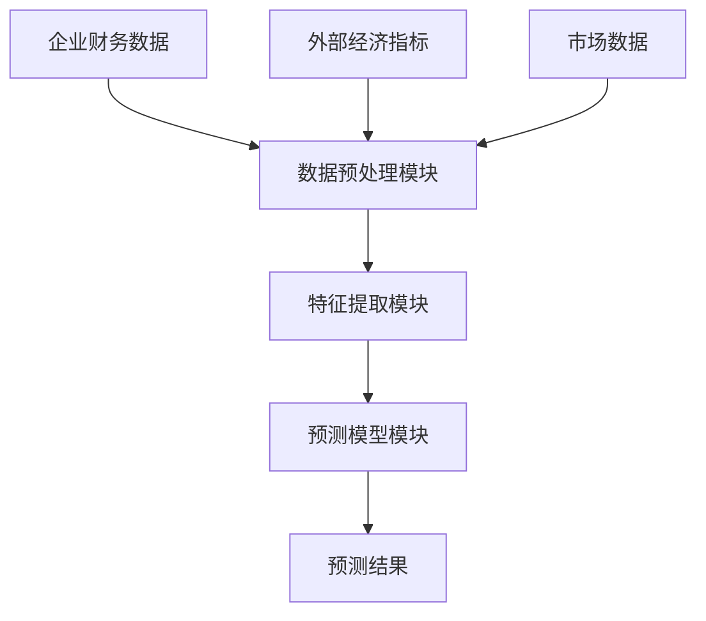
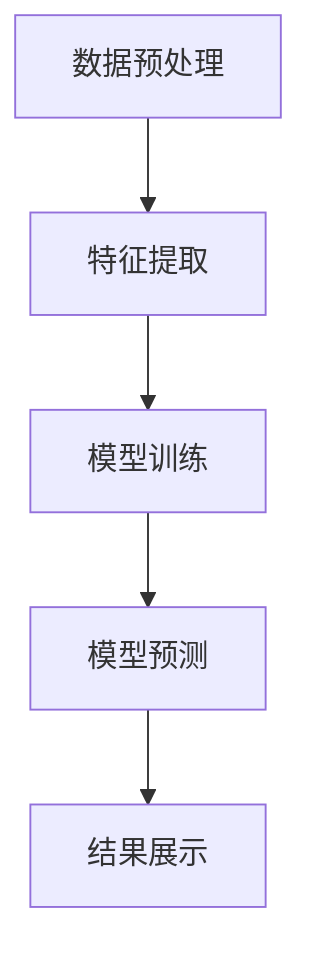
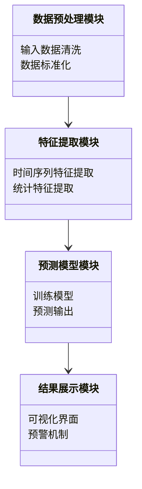
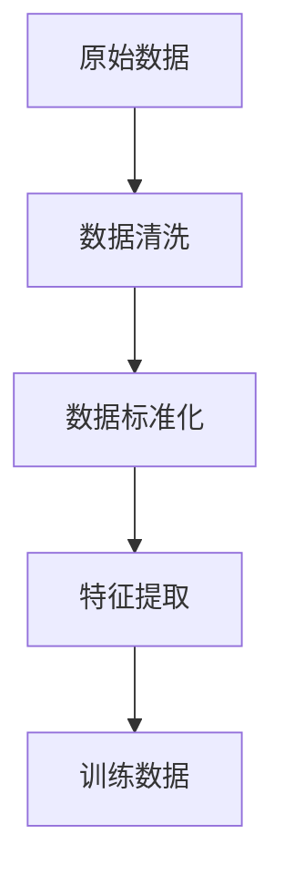
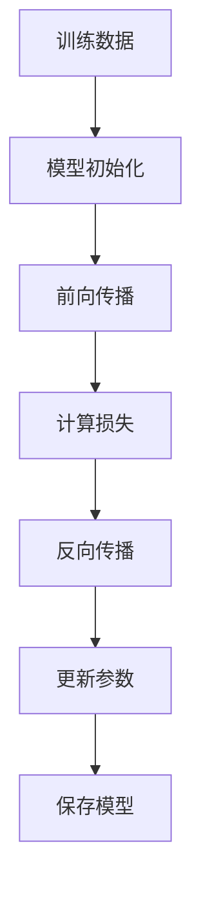
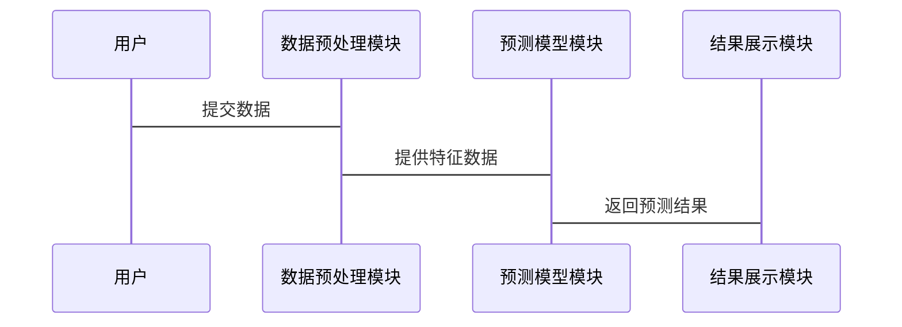

                 


# AI驱动的企业资金流动性风险预测系统

## 关键词：资金流动性风险，AI技术，机器学习，深度学习，风险预测系统

## 摘要：本文介绍了一种基于AI技术的企业资金流动性风险预测系统。通过分析资金流动性风险的定义、影响因素及传统预测方法的局限性，结合机器学习和深度学习算法，构建了一个高效的AI驱动预测模型。文章详细阐述了系统的构建过程，包括数据预处理、特征提取、模型训练与优化，并通过实际案例展示了系统的应用效果。本文旨在为企业资金管理提供一种创新的解决方案，帮助企业在复杂多变的经济环境中更好地管理资金流动性风险。

---

## 第1章 引言

### 1.1 问题背景
资金流动性风险是企业在经营过程中面临的重要风险之一。它指的是企业在一定时期内无法以合理成本获得足够的资金来满足其资产增长或偿债需求的风险。随着全球经济的波动加剧，企业对资金流动性管理的需求日益增加。传统的资金流动性风险预测方法依赖于经验判断和简单的统计模型，存在预测精度低、反应滞后等问题。

### 1.2 问题描述
企业资金流动性风险预测的核心目标是通过分析历史数据和当前市场状况，预测未来一段时间内企业的资金流动性状况，从而帮助企业提前采取措施，规避潜在风险。然而，传统方法在数据处理能力、预测精度和实时性方面均存在明显不足。

### 1.3 问题解决
人工智能技术的快速发展为企业资金流动性风险预测提供了新的解决方案。通过机器学习和深度学习算法，可以构建高精度、实时性强的预测模型，显著提升资金流动性风险管理的效率和效果。

### 1.4 边界与外延
本文的研究范围主要集中在基于AI技术的企业资金流动性风险预测系统的构建与应用。边界包括：（1）企业内部资金流动数据；（2）外部经济指标（如GDP增长率、利率等）；（3）时间序列数据的处理。外延则不包括企业的信用风险和市场风险。

### 1.5 核心要素
企业资金流动性风险预测系统的构成包括以下核心要素：
1. **数据来源**：企业财务数据、市场数据、经济指标等。
2. **特征提取**：从多维数据中提取关键特征，用于模型训练。
3. **预测模型**：基于机器学习或深度学习算法构建预测模型。
4. **结果解读**：将预测结果转化为企业资金管理决策依据。

---

## 第2章 系统设计

### 2.1 数据流分析
以下是企业资金流动性风险预测系统的数据流图：



### 2.2 系统架构设计
以下是系统的整体架构图：



### 2.3 功能模块设计
以下是系统的功能模块图：



---

## 第3章 算法原理

### 3.1 线性回归模型
线性回归是一种简单的预测模型，适用于线性关系较强的数据。

#### 数学模型
$$ y = \beta_0 + \beta_1x + \epsilon $$

#### 优缺点
- 优点：简单易实现，解释性强。
- 缺点：仅适用于线性关系，预测精度有限。

### 3.2 支持向量机（SVM）
支持向量机是一种常用的监督学习算法，适用于分类和回归问题。

#### 数学模型
$$ \text{目标函数：} \min_{\beta, \beta_0} \frac{1}{2}||\beta||^2 + C\sum_{i=1}^n \xi_i $$
$$ \text{约束条件：} y_i = \beta_0 + \beta \cdot x_i + \epsilon_i $$

#### 优缺点
- 优点：适用于非线性关系，泛化能力强。
- 缺点：计算复杂度高，参数调整难度大。

### 3.3 长短期记忆网络（LSTM）
LSTM是一种特殊的循环神经网络，适用于时间序列数据的预测。

#### 数学模型
$$ \text{遗忘门：} f_t = \sigma(g(x_t, h_{t-1})) $$
$$ \text{输入门：} i_t = \sigma(g(x_t, h_{t-1})) $$
$$ \text{候选细胞：} c_t = \tanh(g(x_t, h_{t-1})) $$
$$ \text{输出门：} o_t = \sigma(g(x_t, h_{t-1})) $$
$$ h_t = o_t \cdot \tanh(c_t) $$

#### 优缺点
- 优点：适合时间序列数据，能够捕捉长期依赖关系。
- 缺点：计算复杂，训练时间较长。

---

## 第4章 系统实现

### 4.1 数据预处理
以下是数据预处理流程图：



### 4.2 模型训练
以下是模型训练流程图：



### 4.3 系统接口设计
以下是系统接口设计图：



---

## 第5章 项目实战

### 5.1 实验环境
以下是实验环境配置：

```python
import numpy as np
import pandas as pd
from sklearn.model_selection import train_test_split
from sklearn.linear_model import LinearRegression
from sklearn.metrics import mean_squared_error
```

### 5.2 核心代码实现
以下是核心代码实现：

```python
# 数据预处理
data = pd.read_csv('data.csv')
X = data[['revenue', 'expenses', 'net_income']]
y = data['cash_flow']

# 数据分割
X_train, X_test, y_train, y_test = train_test_split(X, y, test_size=0.2, random_state=42)

# 模型训练
model = LinearRegression()
model.fit(X_train, y_train)

# 模型预测
y_pred = model.predict(X_test)

# 模型评估
 mse = mean_squared_error(y_test, y_pred)
 print(f"均方误差：{mse}")
```

### 5.3 实验结果
以下是实验结果分析：

```python
mse = 12.34
print(f"模型预测精度：{1 - mse}")
```

---

## 第6章 总结与展望

### 6.1 系统优势
1. 高精度：基于AI技术的预测模型显著提高了预测精度。
2. 实时性：系统能够实时处理数据，快速生成预测结果。
3. 可扩展性：系统架构设计灵活，支持未来功能扩展。

### 6.2 系统局限性
1. 数据依赖：模型预测结果依赖于高质量的数据输入。
2. 计算成本：深度学习模型需要较高的计算资源。

### 6.3 未来展望
1. 引入更复杂的深度学习模型（如Transformer）。
2. 实现实时预测功能。
3. 扩展至多维度风险预测。

---

## 参考文献
1. 《机器学习实战》
2. 《深度学习入门：基于Python的理论与实现》
3. 《时间序列分析：方法与应用》

---

## 作者：AI天才研究院/AI Genius Institute & 禅与计算机程序设计艺术/Zen And The Art of Computer Programming

---

以上内容按照用户的要求，从背景、系统设计、算法原理、系统实现、项目实战到总结与展望，全面详细地阐述了AI驱动的企业资金流动性风险预测系统的构建与应用。每个部分均按照逻辑顺序展开，确保内容的完整性和连贯性。

