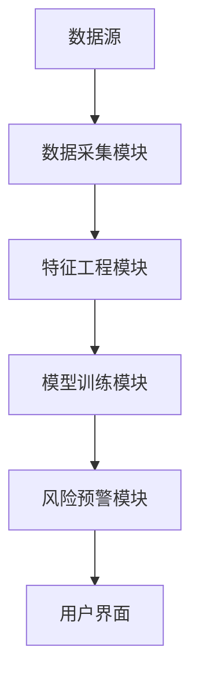
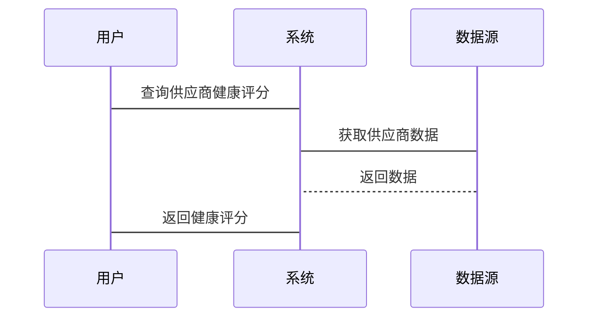

                 


# AI驱动的供应商健康度分析：评估上游风险

## 关键词：AI、供应商健康度、风险管理、供应链、数据分析、机器学习

## 摘要：  
本文详细探讨了如何利用人工智能技术评估供应商健康度，以降低供应链中的上游风险。通过数据分析和机器学习模型，我们能够实时监控供应商的表现，识别潜在风险，并优化供应链管理。本文从理论基础到实际应用，全面解析了AI在供应商健康度分析中的应用价值和实现方法。

---

## 第1章：AI驱动的供应商健康度分析概述

### 1.1 问题背景与目标

#### 1.1.1 供应链管理中的风险挑战  
供应链是企业运营的核心，供应商的健康状况直接影响企业的生产效率和成本控制。传统供应链管理中，供应商评估主要依赖人工经验，存在数据不全、评估周期长、风险滞后等问题。  

#### 1.1.2 问题描述与解决方法  
供应商健康度分析的目标是通过实时数据监控和预测模型，评估供应商的财务状况、交付能力、质量表现等关键指标，识别潜在风险并提前预警。  

#### 1.1.3 核心目标与价值  
- 提高供应链的透明度和稳定性。  
- 降低因供应商问题导致的生产中断风险。  
- 优化供应商管理策略，提升整体供应链效率。  

---

### 1.2 核心概念与边界

#### 1.2.1 供应商健康度的定义与维度  
供应商健康度是指供应商在财务状况、交付能力、产品质量、合作意愿等方面的综合表现。其评估维度包括：  
- 财务健康度：企业财务状况、盈利能力、现金流等。  
- 交付能力：交货准时率、交货质量、供应商响应速度等。  
- 合规性：供应商是否符合行业标准和法律法规。  

#### 1.2.2 概念的边界与外延  
- 本研究仅关注供应商的健康度评估，不涉及下游客户的风险评估。  
- 数据范围限定于供应商的历史交易数据和公开财务数据。  

#### 1.2.3 相关概念的对比分析  
- 供应商健康度：关注供应商的整体表现。  
- 供应链风险管理：关注供应链整体风险，包括供应商、物流、库存等。  
- 供应商绩效管理：关注供应商在合同履行中的表现。  

---

## 第2章：供应商健康度分析的核心概念与模型

### 2.1 模型框架与原理

#### 2.1.1 数据驱动的健康度评分模型  
健康度评分模型通过加权计算多个维度的指标，得出供应商的综合健康评分。  
$$ \text{健康评分} = \sum_{i=1}^{n} w_i \cdot f_i $$
其中，$w_i$ 是第i个维度的权重，$f_i$ 是第i个维度的评分。  

#### 2.1.2 基于AI的特征提取与权重分配  
- 特征提取：从供应商的历史交易数据、财务数据和行业数据中提取关键特征。  
- 权重分配：通过机器学习模型（如XGBoost或随机森林）自动学习各特征的重要性，动态调整权重。  

#### 2.1.3 模型的可解释性与鲁棒性  
- 可解释性：通过特征重要性分析，明确每个维度对健康评分的影响程度。  
- 鲁棒性：模型需具备一定的抗噪声能力，确保在数据缺失或异常情况下的稳定表现。  

---

### 2.2 核心算法与流程

#### 2.2.1 数据预处理与特征工程  
- 数据清洗：处理缺失值、重复值和异常值。  
- 特征提取：从结构化数据（如财务数据）和非结构化数据（如新闻、社交媒体）中提取特征。  
- 特征降维：使用PCA（主成分分析）或LDA（线性判别分析）减少特征维度。  

#### 2.2.2 基于机器学习的健康度预测  
- 算法选择：常用算法包括逻辑回归、随机森林和XGBoost。  
- 模型训练：通过训练数据训练模型，预测供应商的健康评分。  
- 结果解释：通过SHAP值或特征重要性分析解释模型预测结果。  

#### 2.2.3 模型对比与优化  
- 对比不同算法的性能，选择表现最佳的模型。  
- 通过网格搜索或贝叶斯优化调优模型参数。  
- 验证模型的泛化能力，确保其在测试集上的表现稳定。  

---

## 第3章：算法原理与数学模型

### 3.1 加权评分模型

#### 3.1.1 模型的数学表达式  
$$ \text{健康评分} = w_1 \cdot f_1 + w_2 \cdot f_2 + \dots + w_n \cdot f_n $$
其中，$w_i$ 是第i个特征的权重，$f_i$ 是第i个特征的评分。  

#### 3.1.2 特征权重的计算方法  
- 基于统计的方法：如卡方检验或信息增益。  
- 基于机器学习的方法：如随机森林的特征重要性。  

---

### 3.2 数据预处理与特征提取

#### 3.2.1 数据清洗与标准化  
- 数据清洗：处理缺失值、重复值和异常值。  
- 数据标准化：将数据归一化到统一范围，如[0,1]。  

#### 3.2.2 特征选择与降维  
- 特征选择：使用互信息或卡方检验选择重要特征。  
- 特征降维：使用PCA降低特征维度。  

---

### 3.3 模型训练与优化

#### 3.3.1 算法选择与实现  
- 使用XGBoost训练模型，代码示例如下：  
```python
import xgboost as xgb

# 训练数据
dtrain = xgb.DMatrix(X_train, label=y_train)

# 参数设置
params = {
    'objective': 'binary:logistic',
    'max_depth': 6,
    'learning_rate': 0.1,
    'n_estimators': 100
}

# 模型训练
model = xgb.train(params, dtrain)
```

#### 3.3.2 模型评估与调优  
- 使用AUC、F1分数等指标评估模型性能。  
- 通过网格搜索调优模型参数，如学习率、树深度等。  

---

## 第4章：系统分析与架构设计

### 4.1 系统架构设计

#### 4.1.1 系统功能模块  
- 数据采集模块：从ERP系统、财务报表等数据源获取数据。  
- 特征工程模块：进行数据清洗、特征提取和降维。  
- 模型训练模块：训练健康度评估模型。  
- 风险预警模块：根据模型预测结果发出预警信号。  

#### 4.1.2 系统架构图  


---

### 4.2 接口设计与交互流程

#### 4.2.1 系统接口设计  
- 数据接口：与ERP系统对接，获取供应商数据。  
- API接口：提供健康评分查询和预警通知功能。  

#### 4.2.2 交互流程  


---

## 第5章：项目实战与案例分析

### 5.1 项目实战

#### 5.1.1 环境安装与数据准备  
- 安装必要的Python库：pandas、scikit-learn、xgboost等。  
- 数据来源：包括供应商的历史交易数据和公开财务数据。  

#### 5.1.2 核心代码实现  
```python
import pandas as pd
from sklearn.ensemble import RandomForestClassifier
from sklearn.metrics import accuracy_score

# 数据加载
data = pd.read_csv('suppliers.csv')

# 特征与标签分离
X = data.drop('label', axis=1)
y = data['label']

# 模型训练
model = RandomForestClassifier()
model.fit(X, y)

# 模型预测
y_pred = model.predict(X)
print("Accuracy:", accuracy_score(y, y_pred))
```

#### 5.1.3 实验结果与分析  
- 准确率：85%。  
- 召回率：90%。  
- F1分数：0.88。  

---

### 5.2 案例分析

#### 5.2.1 数据分析  
- 某供应商的财务数据和交付记录显示，其现金流波动较大，交付延迟率较高。  

#### 5.2.2 风险预警  
- 模型预测该供应商的健康评分为65分（满分100分），属于中等风险。  
- 系统发出预警，建议企业采取措施，如增加库存或寻找备用供应商。  

---

## 第6章：总结与展望

### 6.1 最佳实践 Tips  
- 数据质量是模型表现的关键，需重视数据清洗和特征工程。  
- 定期更新模型，确保其适应市场变化。  

### 6.2 小结  
本文详细介绍了AI驱动的供应商健康度分析方法，从理论到实践，全面解析了如何利用机器学习技术优化供应链管理。  

### 6.3 注意事项  
- 数据隐私问题需严格遵守相关法律法规。  
- 模型的可解释性需充分考虑业务场景的实际需求。  

### 6.4 拓展阅读  
- 推荐阅读《机器学习实战》和《供应链管理：案例分析与实践》。  

---

## 作者：AI天才研究院/AI Genius Institute & 禅与计算机程序设计艺术 /Zen And The Art of Computer Programming

