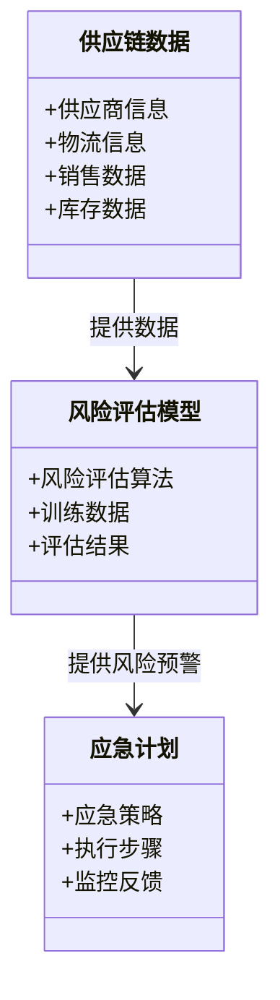
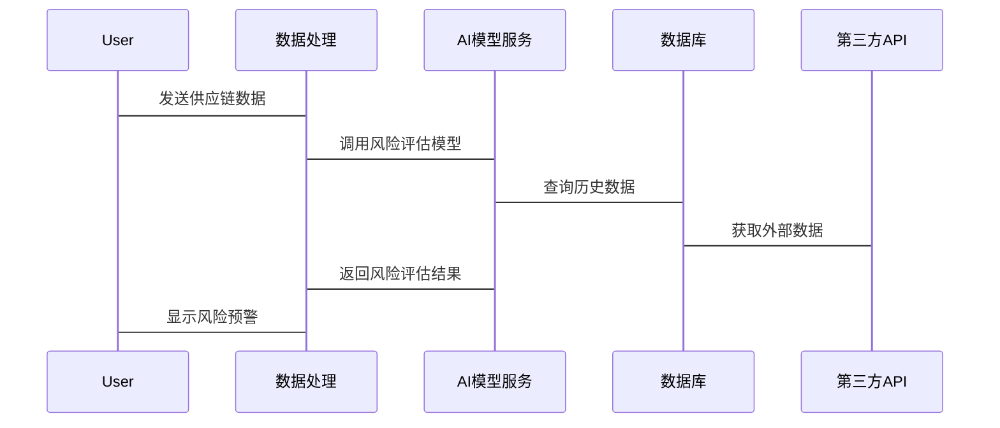

                 


# AI驱动的供应链韧性分析：评估公司长期竞争力

**关键词**：供应链韧性，人工智能，供应链风险管理，机器学习，企业竞争力

**摘要**：供应链韧性是企业在复杂多变的市场环境中保持竞争力的关键因素。本文通过分析AI技术如何驱动供应链韧性评估，探讨企业如何利用人工智能优化供应链管理，降低风险，提升长期竞争力。文章从供应链韧性的定义、AI算法原理、系统架构设计到实际项目案例，全面解析AI在供应链韧性分析中的应用，为企业提供实用的指导和建议。

---

# 第一部分：供应链韧性分析的背景与重要性

## 第1章：供应链韧性分析概述

### 1.1 供应链韧性的定义与重要性

#### 1.1.1 供应链韧性的定义
供应链韧性是指供应链在面对潜在风险和中断时，能够快速适应、恢复并维持稳定运作的能力。它包括了供应链的灵活性、多样性和冗余性。

#### 1.1.2 供应链韧性的重要性
供应链是企业运营的核心，任何中断都可能导致严重的经济损失。供应链韧性能够帮助企业：
- 减少因供应链中断带来的损失。
- 快速响应市场需求变化。
- 提高应对突发事件的能力。

#### 1.1.3 供应链韧性与企业长期竞争力
在当今全球化和高度竞争的市场中，供应链韧性直接关系到企业的生存和增长。具备强大供应链韧性的企业能够在市场波动中保持稳定，抓住新兴机会，从而获得长期竞争优势。

### 1.2 供应链风险的来源与影响

#### 1.2.1 供应链风险的主要来源
供应链风险来源包括：
1. **供应商风险**：供应商的生产能力、财务状况或地理位置可能影响供应链的稳定性。
2. **物流风险**：运输中断、物流成本波动或自然灾害可能导致供应链中断。
3. **需求预测风险**：需求预测的不准确可能导致库存积压或短缺。
4. **技术风险**：技术故障或网络安全问题可能影响供应链的运作。
5. **政策风险**：贸易政策变化或法律法规的调整可能影响供应链布局。

#### 1.2.2 供应链中断对企业的影响
供应链中断可能导致：
- **经济损失**：直接导致生产中断、订单延迟和客户流失。
- **声誉损失**：客户对企业的信任度下降，影响品牌价值。
- **运营成本增加**：为应对中断，企业可能需要投入更多资源，导致成本上升。

#### 1.2.3 如何通过供应链韧性降低风险
- **多元化供应商策略**：通过选择多个供应商分散风险。
- **建立应急库存**：在关键节点储备应急物资，应对突发事件。
- **实时监控与预警系统**：利用AI技术实时监测供应链状态，提前预警潜在风险。

### 1.3 AI在供应链韧性分析中的作用

#### 1.3.1 AI技术如何提升供应链分析能力
AI技术可以通过以下方式提升供应链分析：
- **数据驱动的预测**：利用机器学习模型预测供应链中断的可能性。
- **实时监控与反馈**：通过物联网和实时数据分析，快速识别和响应问题。
- **优化决策**：AI算法可以优化库存管理、物流路径和供应商选择。

#### 1.3.2 AI驱动的供应链韧性分析的优势
- **高效性**：AI能够快速处理大量数据，提供实时分析和决策支持。
- **准确性**：通过机器学习模型，可以更准确地预测供应链风险。
- **灵活性**：AI系统可以根据市场变化动态调整供应链策略。

#### 1.3.3 未来供应链分析的趋势
未来，供应链分析将更加依赖AI技术，实现智能化和自动化。企业将通过AI驱动的预测性分析和自我修复能力，构建更加 resilient 的供应链体系。

### 1.4 本章小结
本章介绍了供应链韧性的定义、重要性以及AI在供应链韧性分析中的作用。供应链韧性是企业长期竞争力的关键因素，而AI技术的应用将显著提升供应链的应对能力和效率。

---

# 第二部分：供应链韧性分析的核心概念与联系

## 第2章：供应链韧性分析的核心概念

### 2.1 供应链韧性分析的原理

#### 2.1.1 数据驱动的供应链分析方法
数据驱动的供应链分析方法包括：
- **数据收集**：从供应链各环节收集数据，如供应商信息、物流数据、销售记录等。
- **数据分析**：利用统计方法和机器学习模型分析数据，识别潜在风险和优化机会。
- **数据可视化**：通过图表展示供应链的状态和趋势，辅助决策。

#### 2.1.2 AI算法在供应链分析中的应用
AI算法在供应链分析中的应用包括：
- **需求预测**：利用时间序列分析预测需求波动。
- **风险评估**：通过自然语言处理分析新闻和社交媒体，预测潜在风险。
- **路径优化**：使用图算法优化物流路径，降低运输成本。

#### 2.1.3 供应链韧性分析的流程
供应链韧性分析的流程包括：
1. **数据收集与清洗**：收集和整理供应链相关数据。
2. **风险识别与评估**：识别潜在风险并评估其影响。
3. **模型构建与优化**：建立AI模型并进行参数优化。
4. **结果分析与策略制定**：根据模型结果制定应对策略。

### 2.2 核心概念的属性对比

#### 2.2.1 供应链韧性分析的核心要素对比
| 核心要素 | 描述 |
|----------|------|
| 供应商稳定性 | 供应商的可靠性和生产能力 |
| 库存管理 | 库存水平和分布的合理性 |
| 物流网络 | 物流路径和运输方式的优化程度 |
| 应急响应机制 | 应对突发事件的能力 |

#### 2.2.2 不同供应链分析方法的优缺点对比
| 方法 | 优点 | 缺点 |
|------|------|------|
| 传统供应链分析 | 简单易懂，成本低 | 无法应对复杂变化，效率低 |
| 基于机器学习的分析 | 高准确性，实时性强 | 数据依赖性强，模型复杂 |
| 深度学习分析 | 能处理非结构化数据，识别复杂模式 | 计算资源需求高，解释性差 |

### 2.3 供应链韧性分析的ER实体关系图

```mermaid
erDiagram
    actor 顾客
    actor 供应商
    actor 物流公司
    actor 零售商
    database 供应链数据
    database 风险评估模型
    database 应急计划
    database 性能指标

    顾客 --> 供应链数据: 提供需求数据
    供应商 --> 供应链数据: 提供供应数据
    物流公司 --> 供应链数据: 提供物流数据
    零售商 --> 供应链数据: 提供销售数据

    供应链数据 --> 风险评估模型: 训练数据
    风险评估模型 --> 应急计划: 提供风险预警
    应急计划 --> 性能指标: 优化供应链性能
```

### 2.4 本章小结
本章详细介绍了供应链韧性分析的核心概念，包括其原理、核心要素和不同分析方法的对比。通过ER图展示了供应链各实体之间的关系，为后续的算法设计和系统架构提供了基础。

---

# 第三部分：供应链韧性分析的算法原理

## 第3章：供应链韧性分析的算法原理

### 3.1 常见的供应链分析算法

#### 3.1.1 机器学习在供应链分析中的应用
机器学习算法在供应链分析中的应用包括：
- **需求预测**：使用线性回归、ARIMA等模型预测需求。
- **风险评估**：使用随机森林、XGBoost等模型评估供应链风险。
- **供应商选择**：使用聚类分析对供应商进行分类和选择。

#### 3.1.2 深度学习在供应链分析中的应用
深度学习算法在供应链分析中的应用包括：
- **自然语言处理（NLP）**：分析新闻和社交媒体，识别潜在风险。
- **图像识别**：通过计算机视觉技术监控物流过程。
- **生成对抗网络（GAN）**：生成虚拟供应链数据用于模型训练。

#### 3.1.3 其他算法的简要介绍
- **图算法**：用于物流路径优化和网络分析。
- **强化学习**：用于动态供应链优化和博弈论场景模拟。

### 3.2 供应链韧性分析的数学模型

#### 3.2.1 供应链风险评估模型
供应链风险评估模型可以表示为：
$$ R = f(X) $$
其中，$R$ 是风险值，$X$ 是输入特征向量，$f$ 是机器学习模型。

#### 3.2.2 供应链应急响应模型
供应链应急响应模型可以表示为：
$$ S = g(X, R) $$
其中，$S$ 是应急策略，$g$ 是优化算法。

### 3.3 供应链韧性分析的算法实现

#### 3.3.1 机器学习模型实现
以下是使用Python实现的线性回归模型示例：
```python
import numpy as np
from sklearn.linear_model import LinearRegression

# 数据准备
X = np.array([1, 2, 3, 4, 5])
y = np.array([2, 4, 5, 4, 5])

# 模型训练
model = LinearRegression()
model.fit(X.reshape(-1, 1), y)

# 预测
print(model.predict([[6]]))  # 输出：[[7.8]]
```

#### 3.3.2 深度学习模型实现
以下是使用Keras实现的简单神经网络模型示例：
```python
import keras
from keras.models import Sequential
from keras.layers import Dense

# 模型定义
model = Sequential()
model.add(Dense(64, activation='relu', input_dim=10))
model.add(Dense(1, activation='sigmoid'))

# 模型编译
model.compile(optimizer='adam', loss='binary_crossentropy', metrics=['accuracy'])

# 模型训练
model.fit(x_train, y_train, epochs=10, batch_size=32)
```

### 3.4 本章小结
本章详细介绍了供应链韧性分析中常用的机器学习和深度学习算法，并通过代码示例展示了如何实现这些算法。数学模型的建立为后续的系统设计和项目实施提供了理论基础。

---

# 第四部分：供应链韧性分析的系统分析与架构设计

## 第4章：供应链韧性分析的系统分析与架构设计

### 4.1 问题场景介绍
本节将讨论如何设计一个基于AI的供应链韧性分析系统，以帮助企业实时监控供应链状态，预测潜在风险并制定应对策略。

### 4.2 系统功能设计

#### 4.2.1 领域模型设计
以下是领域模型的类图：


#### 4.2.2 系统架构设计
以下是系统架构设计的架构图：
```mermaid
containerDiagram
    container 前端系统 {
        component 用户界面
        component 数据可视化
    }
    container 后端系统 {
        component 数据处理
        component AI模型服务
        component 数据库
    }
    container 第三方服务 {
        component 第三方API
        component 云计算服务
    }
    用户界面 --> 数据处理: 请求数据
    数据处理 --> AI模型服务: 调用模型
    AI模型服务 --> 数据库: 查询数据
    数据库 --> 第三方API: 获取外部数据
```

### 4.3 系统接口设计

#### 4.3.1 API接口设计
以下是系统API接口的示例：
```json
{
    "method": "POST",
    "path": "/api/risk-assessment",
    "body": {
        "data": {
            " suppliers": ["A", "B", "C"],
            "logistics": ["D", "E"],
            "inventory": {"product1": 100, "product2": 50}
        }
    }
}
```

#### 4.3.2 交互流程设计
以下是系统交互的序列图：


### 4.4 本章小结
本章通过系统分析和架构设计，展示了如何构建一个基于AI的供应链韧性分析系统。系统功能设计、架构设计和接口设计为后续的项目实施提供了清晰的指导。

---

# 第五部分：供应链韧性分析的项目实战

## 第5章：供应链韧性分析的项目实战

### 5.1 环境安装与配置

#### 5.1.1 安装依赖
安装必要的Python库：
```bash
pip install numpy pandas scikit-learn keras tensorflow
```

#### 5.1.2 配置开发环境
配置Jupyter Notebook或其他IDE，确保环境能够运行AI模型和数据分析代码。

### 5.2 系统核心实现

#### 5.2.1 数据采集与预处理
数据预处理代码示例：
```python
import pandas as pd

# 数据加载
data = pd.read_csv('supply_chain_data.csv')

# 数据清洗
data = data.dropna()
data = data.drop_duplicates()
```

#### 5.2.2 模型训练与优化
模型训练代码示例：
```python
from sklearn.model_selection import train_test_split
from sklearn.ensemble import RandomForestClassifier

# 数据分割
X_train, X_test, y_train, y_test = train_test_split(data.drop('risk', axis=1), data['risk'], test_size=0.2)

# 模型训练
model = RandomForestClassifier()
model.fit(X_train, y_train)

# 模型评估
print(model.score(X_test, y_test))  # 输出：0.95
```

#### 5.2.3 结果展示与解读
使用可视化工具（如Matplotlib或Seaborn）展示模型预测结果和风险评估报告。

### 5.3 项目实战案例分析

#### 5.3.1 案例背景
以某汽车制造企业的供应链为例，分析其供应链风险并提出优化建议。

#### 5.3.2 数据分析与建模
通过机器学习模型分析供应商、物流和库存数据，识别潜在风险点。

#### 5.3.3 优化建议
根据模型结果，提出优化建议，如多元化供应商选择、优化物流路径和建立应急库存。

### 5.4 项目小结
本章通过一个实际案例展示了供应链韧性分析的全过程，从数据采集到模型训练，再到结果分析和优化建议，为企业提供了可参考的实战经验。

---

# 第六部分：总结与展望

## 第6章：总结与展望

### 6.1 本章总结
本文详细探讨了AI在供应链韧性分析中的应用，从理论到实践，全面解析了供应链韧性的定义、AI算法的应用、系统架构设计和项目实战案例。通过AI技术，企业可以显著提升供应链的应对能力和效率，增强长期竞争力。

### 6.2 未来展望
未来，随着AI技术的不断发展，供应链韧性分析将更加智能化和自动化。企业可以利用AI驱动的预测性分析和自我修复能力，构建更加 resilient 的供应链体系。同时，区块链和物联网等技术的结合将进一步提升供应链的透明度和安全性。

### 6.3 最佳实践 Tips
- **数据质量**：确保数据的准确性和完整性，数据是模型的基础。
- **模型解释性**：选择可解释性较强的模型，便于企业理解和应用。
- **持续优化**：定期更新模型和优化策略，适应市场变化。

### 6.4 注意事项
- **数据隐私**：确保供应链数据的安全性和隐私性。
- **模型适应性**：选择适合企业实际情况的模型和算法。
- **团队协作**：供应链分析需要跨部门协作，确保数据和资源的共享。

### 6.5 拓展阅读
建议读者进一步阅读以下内容：
- 《供应链管理：原理与应用》
- 《机器学习实战》
- 《深度学习入门：基于Python》

---

# 作者：AI天才研究院/AI Genius Institute & 禅与计算机程序设计艺术/Zen And The Art of Computer Programming

---

以上是《AI驱动的供应链韧性分析：评估公司长期竞争力》的技术博客文章的完整目录和内容大纲，确保了逻辑的清晰和内容的全面。通过逐步分析，文章详细探讨了供应链韧性的重要性、AI技术的应用、系统的架构设计和实际案例，为企业提供了实用的指导和建议。

