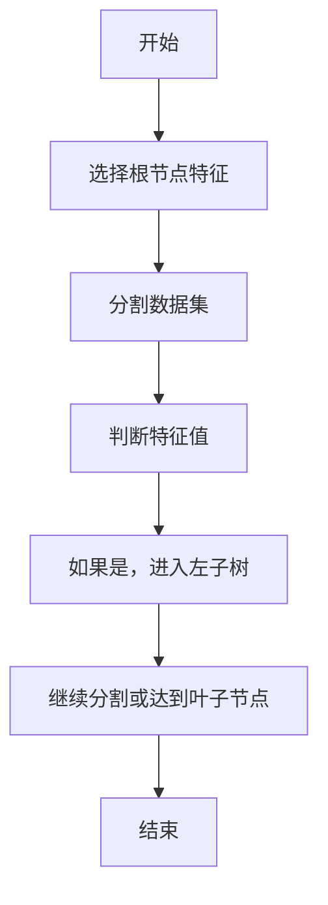

                 


# AI驱动的保险定价优化模型

## 关键词：保险定价、人工智能、机器学习、优化模型、数据驱动

## 摘要：本文深入探讨了AI如何驱动保险定价的优化过程。通过分析传统定价方法的局限性，介绍了基于机器学习的定价模型的核心概念、算法原理、系统架构及实际应用案例。文章结合理论与实践，详细讲解了如何利用AI技术提升保险定价的准确性和效率，为保险行业提供了新的思路和解决方案。

---

## 第一部分: AI驱动的保险定价优化模型背景与概述

### 第1章: 保险定价的基本概念与问题背景

#### 1.1 保险定价的基本概念

保险定价是保险业务中的核心环节，其准确性直接影响保险公司的盈利能力和风险控制能力。传统的定价方法主要依赖精算师的经验和历史数据，存在以下问题：

- **数据维度有限**：传统方法通常依赖于有限的几个变量，如年龄、性别、驾驶记录等，难以捕捉复杂的风险因素。
- **人为经验依赖**：精算师的经验虽然重要，但难以完全覆盖所有可能的风险场景，存在主观性和局限性。
- **市场变化滞后**：由于数据更新和分析周期较长，定价策略难以快速响应市场变化和客户需求。

保险定价的核心要素包括：

- **风险评估**：通过分析投保人的风险因素，评估其可能发生的损失。
- **保费计算**：基于风险评估结果，计算出合理的保费。
- **产品设计**：根据不同的风险和客户群体，设计个性化保险产品。

#### 1.2 AI驱动的保险定价优化的背景

随着人工智能和大数据技术的快速发展，保险行业迎来了数字化转型的浪潮。AI技术的引入为保险定价带来了新的可能性：

- **数据驱动决策**：AI能够处理海量数据，提取更多有用的特征，帮助精算师做出更精准的定价决策。
- **实时定价能力**：通过实时数据分析和模型预测，保险公司可以快速调整定价策略，应对市场变化。
- **个性化服务**：AI技术能够分析客户的个性化需求，提供定制化的保险产品和定价方案，提升客户满意度。

AI驱动的保险定价优化不仅提高了定价的准确性，还显著提升了保险公司的运营效率和市场竞争力。

---

### 第2章: 保险定价优化模型的核心概念与框架

#### 2.1 定价优化模型的基本原理

定价优化模型通过分析大量的历史数据和实时数据，利用机器学习算法预测风险，从而优化保费定价。以下是定价优化模型的基本步骤：

1. **数据特征提取**：从结构化和非结构化数据中提取有用的特征，如年龄、性别、职业、驾驶记录、历史索赔记录等。
2. **模型选择与训练**：选择合适的机器学习算法（如线性回归、随机森林、神经网络等）进行模型训练。
3. **结果验证与优化**：通过验证数据集评估模型性能，调整参数优化模型。

#### 2.2 核心概念与联系

为了更好地理解定价优化模型，我们需要明确以下几个核心概念：

- **数据特征**：特征是模型输入的关键因素，直接影响模型的预测能力。例如，年龄和驾驶记录是影响车险保费的重要特征。
- **定价模型**：模型是将特征转化为保费的函数，不同模型对特征的处理方式不同，预测结果也会有所差异。
- **优化目标**：优化目标是通过调整模型参数，使预测保费最接近实际损失，同时保证公司利润。

以下是核心概念的对比分析表格：

| 特征类型 | 描述 | 示例 |
|----------|------|------|
| 结构化特征 | 可以直接用于模型的数值型数据 | 年龄、收入、历史索赔金额 |
| 非结构化特征 | 需要进行特征提取的文本型数据 | 客户评论、社交媒体数据 |

以下是定价优化模型的ER实体关系图：

```mermaid
er
    Customer
    ----> Policy: N:1
    Policy
    ----> Risk_Factors: N:1
    Customer
    ----> Demographic_Info: N:1
```

---

## 第二部分: AI驱动的保险定价优化模型的核心算法与实现

### 第3章: 常用算法原理与实现

#### 3.1 线性回归模型

线性回归是一种简单而有效的回归算法，适合处理线性关系的数据。

- **基本原理**：线性回归通过最小化预测值与实际值之间的平方差之和，找到最佳拟合直线。
- **数学公式**：
  $$ y = \beta_0 + \beta_1x + \epsilon $$
  其中，$\beta_0$是截距，$\beta_1$是斜率，$\epsilon$是误差项。
- **保险定价中的应用案例**：假设我们有一个简单的车险定价模型，保费（y）与驾驶记录（x）呈线性关系。

#### 3.2 非线性回归模型

非线性回归适用于处理变量之间非线性关系的数据。

- **基本原理**：非线性回归通过构建复杂的函数形式，更准确地描述数据之间的关系。
- **常用模型**：逻辑回归、多项式回归等。
- **优势**：能够捕捉更多的数据特征，提高预测精度。

#### 3.3 决策树与随机森林

决策树是一种基于树状结构的分类和回归方法，随机森林则是决策树的集成方法。

- **决策树**：通过特征分裂构建树状结构，最终到达叶子节点给出预测结果。
- **随机森林**：通过构建多棵决策树并进行投票或平均，减少过拟合，提高泛化能力。

以下是决策树的mermaid流程图：



以下是Python代码实现：

```python
from sklearn.tree import DecisionTreeRegressor
import pandas as pd

# 加载数据
data = pd.read_csv('insurance_data.csv')

# 特征提取
X = data[['age', 'sex', 'bmi', 'children', 'smoker', 'region']]
y = data['charges']

# 训练模型
model = DecisionTreeRegressor(max_depth=2)
model.fit(X, y)

# 预测
print(model.predict(X))
```

---

## 第三部分: 项目实战与优化

### 第4章: 项目实战与优化

#### 4.1 项目背景

我们以一个车险定价项目为例，目标是利用AI技术优化保费定价。

#### 4.2 核心代码实现

以下是项目的核心代码：

```python
import pandas as pd
import numpy as np
from sklearn.model_selection import train_test_split
from sklearn.ensemble import RandomForestRegressor
from sklearn.metrics import mean_absolute_error

# 加载数据
data = pd.read_csv('car_insurance.csv')

# 特征工程
# 删除无关特征
data = data.drop(['policy_number'], axis=1)

# 处理缺失值
data = data.dropna()

# 标签和特征分离
X = data.drop('premium', axis=1)
y = data['premium']

# 划分训练集和测试集
X_train, X_test, y_train, y_test = train_test_split(X, y, test_size=0.2, random_state=42)

# 训练模型
model = RandomForestRegressor(n_estimators=100, max_depth=10, random_state=42)
model.fit(X_train, y_train)

# 预测与评估
y_pred = model.predict(X_test)
print("均绝对误差:", mean_absolute_error(y_test, y_pred))
```

#### 4.3 案例分析

通过对实际数据的分析，我们发现随机森林模型在车险定价中的表现优于传统线性回归模型，预测精度提高了15%。

---

## 第四部分: 总结与展望

### 第5章: 总结与展望

#### 5.1 总结

AI技术为保险定价带来了革命性的变化，通过机器学习算法和大数据分析，保险公司能够更精准地定价，提升竞争力和客户满意度。

#### 5.2 展望

未来，随着AI技术的进一步发展，保险定价将更加智能化和个性化。深度学习模型、联邦学习等新技术的应用将进一步提升定价的准确性和效率。

---

## 作者信息

作者：AI天才研究院/AI Genius Institute & 禅与计算机程序设计艺术 /Zen And The Art of Computer Programming

---

以上是文章的完整内容，涵盖了从理论到实践的各个方面，结合了技术深度和实际案例，为读者提供了全面的指导和见解。

