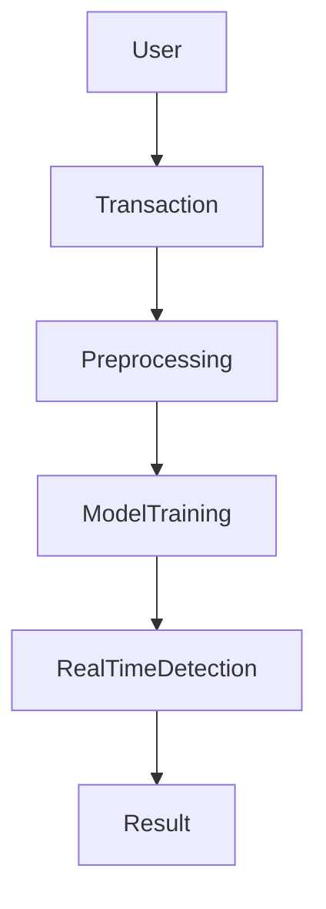
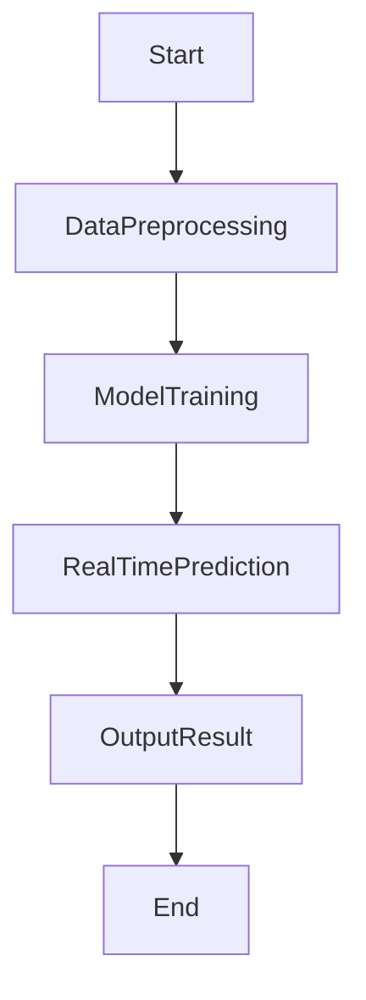
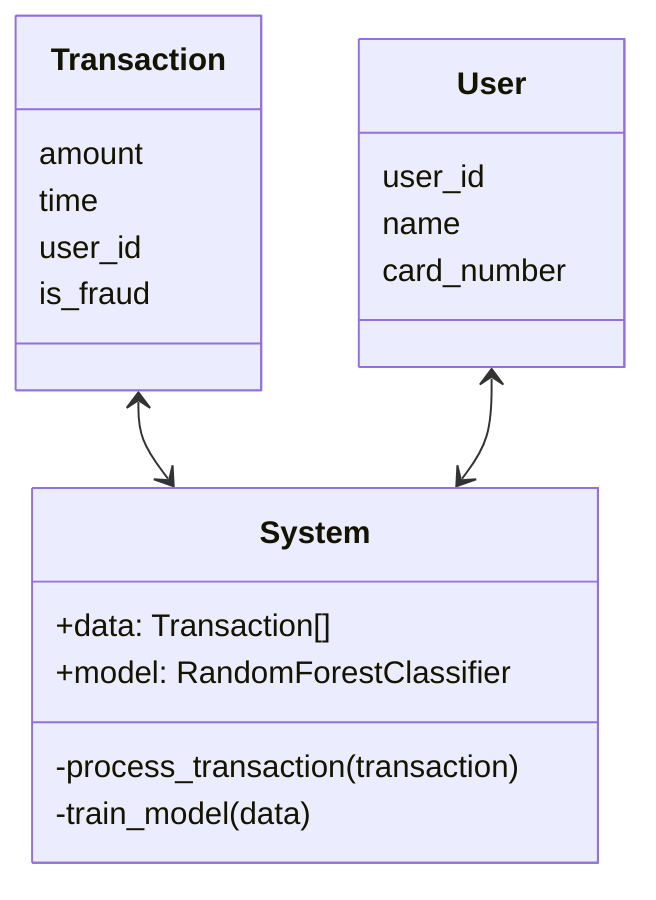
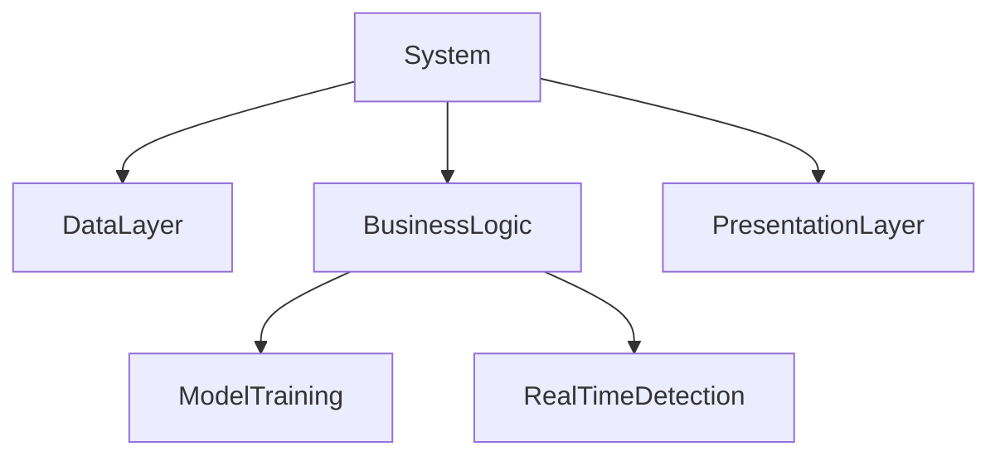
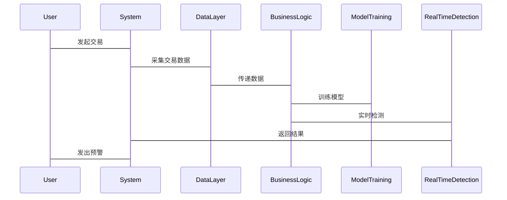

                 


# AI驱动的信用卡异常交易实时预警

## 关键词：AI, 信用卡, 异常交易, 实时预警, 机器学习, 金融安全

## 摘要：  
随着信用卡的广泛应用，异常交易的 detection 成为保障金融安全的重要环节。传统的基于规则的异常检测方法存在效率低、误报率高、适应性差等问题。本文将深入探讨如何利用人工智能技术，特别是机器学习算法，构建高效的信用卡异常交易实时预警系统。通过分析交易数据的特征，结合实时数据处理技术，提出一种基于 AI 的异常交易 detection 方法，旨在提高检测的准确性和实时性，减少金融损失，保障用户财产安全。

---

# 第一部分: AI驱动的信用卡异常交易实时预警背景与核心概念

## 第1章: 信用卡异常交易实时预警的背景与问题描述

### 1.1 信用卡异常交易的背景  
信用卡作为一种便捷的支付工具，广泛应用于个人消费、企业交易等场景。然而，随着信用卡的普及，欺诈交易也日益猖獗。根据相关统计，信用卡欺诈造成的损失每年高达数十亿美元。欺诈手段多样且不断进化，传统的基于规则的异常检测方法已难以应对复杂多变的欺诈模式。

#### 1.1.1 信用卡交易的基本概念  
- 信用卡交易：用户通过信用卡进行消费、转账等操作。  
- 交易数据：包括交易时间、交易金额、交易地点、用户身份等信息。  
- 欺诈交易：未经授权的交易，如盗刷、伪卡交易、钓鱼欺诈等。  

#### 1.1.2 异常交易的定义与分类  
- 异常交易：偏离正常交易模式的交易行为，可能为欺诈或操作失误。  
- 分类：正常交易、疑似异常交易、确认异常交易。  

#### 1.1.3 异常交易的危害与影响  
- 经济损失：银行和持卡人蒙受直接损失。  
- 信誉损失：银行可能因欺诈行为影响其品牌形象。  
- 用户信任：用户对支付系统的信任度下降。  

### 1.2 传统信用卡交易预警的局限性  
#### 1.2.1 传统规则-based预警的缺陷  
- 规则固定：基于固定的规则，难以应对新型欺诈手段。  
- 计算效率低：规则数量多，匹配过程复杂，影响实时性。  
- 误报率高：容易将正常交易误判为异常交易，用户体验差。  

#### 1.2.2 传统模型的局限性与不足  
- 特征提取不足：传统模型依赖人工提取特征，难以捕捉复杂模式。  
- 模型泛化能力差：面对数据分布变化，模型适应性有限。  
- 训练数据有限：传统模型通常基于小规模数据训练，难以应对海量数据。  

#### 1.2.3 传统预警系统的效率问题  
- 延迟：传统系统通常采用批量处理，无法实现实时预警。  
- 计算资源消耗高：复杂规则匹配和模型计算导致资源浪费。  

### 1.3 AI驱动的实时预警的优势  
#### 1.3.1 AI技术在金融领域的应用潜力  
- 大数据处理能力：AI能够高效处理海量交易数据。  
- 智能学习能力：AI能够从数据中自动提取特征并学习模式。  
- 实时性：AI算法支持流数据处理，能够实现实时预警。  

#### 1.3.2 实时性与精准性的双重提升  
- 实时性：AI驱动的系统能够实时处理交易数据，快速识别异常交易。  
- 精准性：基于机器学习的模型能够显著降低误报率和漏报率。  

#### 1.3.3 数据驱动的智能决策优势  
- 数据驱动：AI系统能够根据交易数据动态调整检测策略。  
- 智能决策：通过模型推理，系统能够自动判断交易是否异常。  

### 1.4 本章小结  
本章介绍了信用卡异常交易的背景、传统预警系统的局限性以及AI驱动实时预警的优势，为后续的分析奠定了基础。

---

## 第2章: 信用卡异常交易实时预警的核心概念与联系  

### 2.1 AI驱动的异常交易检测基本概念  
#### 2.1.1 异常交易检测的定义  
异常交易检测是通过分析交易数据，识别偏离正常模式的交易行为。  

#### 2.1.2 基于AI的实时检测机制  
AI驱动的异常交易检测通过机器学习模型对实时交易数据进行分析，快速识别潜在的欺诈行为。  

#### 2.1.3 系统的核心要素与组成  
- 数据采集：实时采集信用卡交易数据。  
- 数据预处理：清洗、标准化和特征提取。  
- 模型训练：基于历史数据训练机器学习模型。  
- 实时检测：将实时交易数据输入模型，判断是否异常。  

### 2.2 核心概念的原理与联系  
#### 2.2.1 数据流的处理流程  
数据从交易系统产生，经过预处理、特征提取、模型分析等步骤，最终生成预警结果。  

#### 2.2.2 AI模型的作用机制  
模型通过学习正常交易的特征，识别异常交易的模式，实现精准检测。  

#### 2.2.3 系统的整体架构与模块划分  
系统包括数据采集模块、数据预处理模块、模型训练模块和实时检测模块。  

### 2.3 实体关系图（ER图）分析  
#### 2.3.1 实体关系的定义与描述  
- 用户：信用卡持卡人。  
- 交易：用户发起的支付交易。  
- 异常检测：系统对交易的检测结果。  

#### 2.3.2 Mermaid流程图展示  



### 2.4 本章小结  
本章通过核心概念的分析和ER图的展示，明确了AI驱动的异常交易检测系统的组成与流程。

---

# 第三部分: AI驱动的信用卡异常交易实时预警算法原理  

## 第3章: 信用卡异常交易实时预警的算法原理  

### 3.1 常见的异常检测算法  
#### 3.1.1 随机森林算法  
- 随机森林是一种基于决策树的集成学习算法，适用于分类和回归问题。  
- 在异常检测中，随机森林通过投票机制判断交易是否异常。  

#### 3.1.2 XGBoost算法  
- XGBoost是一种高效的目标提升算法，支持并行计算。  
- 在异常检测中，XGBoost通过迭代优化模型，提高检测精度。  

#### 3.1.3 LSTM网络  
- LSTM是一种循环神经网络，适用于时间序列数据的分析。  
- 在异常检测中，LSTM能够捕捉交易时间序列中的模式变化。  

### 3.2 算法原理与流程  
#### 3.2.1 Mermaid流程图展示  



#### 3.2.2 算法实现的数学模型  

##### 3.2.2.1 随机森林的数学模型  
随机森林通过特征选择和投票机制进行分类。其数学模型如下：  
$$ \text{预测结果} = \text{多数投票结果} $$  

##### 3.2.2.2 XGBoost的损失函数  
XGBoost的目标函数为：  
$$ L = \sum_{i=1}^n [w_i (y_i - \hat{y}_i)]^2 $$  

##### 3.2.2.3 LSTM的神经网络结构  
LSTM的网络结构包括输入门、遗忘门和输出门，其更新公式如下：  
$$ i = \sigma(W_i x + U_i h_{t-1}) $$  
$$ f = \sigma(W_f x + U_f h_{t-1}) $$  
$$ o = \sigma(W_o x + U_o h_{t-1}) $$  
$$ h_t = i \cdot \tilde{h} + f \cdot h_{t-1} $$  
$$ \tilde{h} = \tanh(W_c x + U_c h_{t-1}) $$  

### 3.3 算法实现的Python代码示例  
#### 3.3.1 数据预处理代码  

```python
import pandas as pd
from sklearn.preprocessing import StandardScaler

# 数据加载
data = pd.read_csv('credit_card_transactions.csv')

# 特征提取
features = data[['amount', 'time', 'user_id']]
target = data['is_fraud']

# 标准化处理
scaler = StandardScaler()
features_scaled = scaler.fit_transform(features)
```

#### 3.3.2 模型训练代码  

```python
from sklearn.ensemble import RandomForestClassifier
from sklearn.metrics import accuracy_score

# 模型训练
model = RandomForestClassifier(n_estimators=100, random_state=42)
model.fit(features_scaled, target)

# 模型预测
 predictions = model.predict(features_scaled)
 print(f'Accuracy: {accuracy_score(target, predictions)}')
```

#### 3.3.3 模型预测代码  

```python
# 实时预测
new_transaction = pd.DataFrame({'amount': [100], 'time': [1630000000], 'user_id': [12345]})
new_transaction_scaled = scaler.transform(new_transaction)
result = model.predict(new_transaction_scaled)
print(f'Is Fraud: {result[0]}')
```

### 3.4 本章小结  
本章详细介绍了几种常用的异常检测算法，并通过代码示例展示了算法的实现过程。

---

# 第四部分: AI驱动的信用卡异常交易实时预警系统分析与架构设计  

## 第4章: 信用卡异常交易实时预警的系统分析与架构设计  

### 4.1 系统分析  
#### 4.1.1 问题场景介绍  
系统需要实时处理信用卡交易数据，快速识别异常交易，并发出预警通知。  

#### 4.1.2 项目目标与范围  
- 目标：构建高效的实时预警系统。  
- 范围：信用卡交易数据的采集、处理和分析。  

#### 4.1.3 系统需求分析  
- 实时性：秒级响应。  
- 准确性：高精度检测。  
- 可扩展性：支持海量数据处理。  

### 4.2 系统功能设计  
#### 4.2.1 领域模型类图  



#### 4.2.2 功能模块划分  
- 数据采集模块：实时采集交易数据。  
- 数据预处理模块：清洗和标准化数据。  
- 模型训练模块：训练异常检测模型。  
- 实时检测模块：处理实时交易数据并输出结果。  

#### 4.2.3 用户角色与权限设计  
- 系统管理员：管理用户和模型参数。  
- 普通用户：查看交易记录和预警通知。  

### 4.3 系统架构设计  
#### 4.3.1 分层架构设计  
系统分为数据层、业务逻辑层和表现层。  

#### 4.3.2 微服务架构设计  
采用微服务架构，各模块独立运行，便于扩展和维护。  

#### 4.3.3 系统架构图  



### 4.4 系统接口设计  
#### 4.4.1 数据接口  
- 输入接口：实时交易数据。  
- 输出接口：检测结果。  

#### 4.4.2 用户接口  
- 输入：用户交易请求。  
- 输出：预警通知。  

### 4.5 系统交互流程  



### 4.6 本章小结  
本章通过系统分析和架构设计，明确了系统的功能模块和交互流程。

---

# 第五部分: AI驱动的信用卡异常交易实时预警项目实战  

## 第5章: 项目实战  

### 5.1 环境安装  
- Python 3.8及以上版本。  
- 安装必要的库：scikit-learn、pandas、numpy、mermaid。  

### 5.2 系统核心实现  
#### 5.2.1 数据预处理  
- 数据清洗：处理缺失值和异常值。  
- 特征提取：提取交易金额、时间、用户ID等特征。  

#### 5.2.2 模型训练  
- 采用随机森林算法训练分类模型。  
- 调参优化：调整模型参数，提高准确率。  

#### 5.2.3 实时检测  
- 实时处理交易数据，输入模型进行预测。  
- 输出检测结果，触发预警机制。  

### 5.3 实际案例分析  
#### 5.3.1 正常交易案例  
- 交易金额：100元，用户ID：12345，时间：1630000000。  
- 模型预测结果：正常交易。  

#### 5.3.2 异常交易案例  
- 交易金额：5000元，用户ID：12345，时间：1630000001。  
- 模型预测结果：异常交易。  

### 5.4 项目小结  
通过项目实战，验证了AI驱动的异常交易检测系统的有效性，能够实现高精度的实时预警。

---

## 第六部分: 最佳实践与总结  

## 第6章: 最佳实践  

### 6.1 小结  
- AI技术能够显著提升信用卡异常交易检测的效率和准确性。  
- 系统架构设计需要考虑实时性、可扩展性和安全性。  

### 6.2 注意事项  
- 数据隐私保护：确保交易数据的安全性。  
- 模型更新：定期更新模型，应对新型欺诈手段。  
- 系统监控：实时监控系统运行状态，及时处理异常情况。  

### 6.3 拓展阅读  
- 推荐阅读《机器学习实战》和《深度学习入门》。  
- 参考资料：金融安全领域的最新研究论文。  

### 6.4 本章小结  
本章总结了项目经验，并提出了进一步优化的方向。

---

# 作者：AI天才研究院/AI Genius Institute & 禅与计算机程序设计艺术/Zen And The Art of Computer Programming

---

希望这篇文章的结构和内容能够满足您的需求！如果需要进一步调整或补充，请随时告知。

