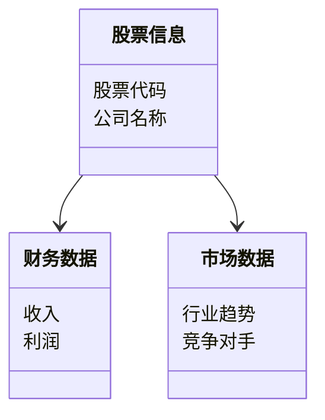
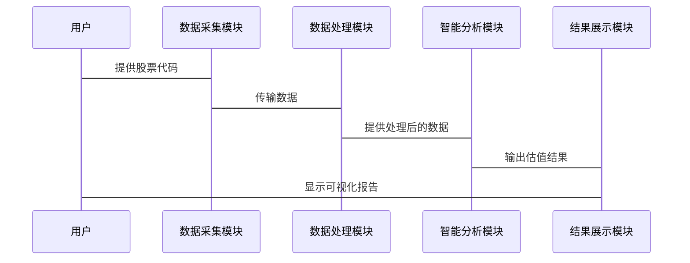

                 


# AI驱动的公司估值：多维度智能体协作评估内在价值

> **关键词**：AI驱动、公司估值、多维度智能体协作、内在价值、智能系统架构、算法原理、系统实现

> **摘要**：本文详细探讨了AI驱动的公司估值方法，重点介绍了多维度智能体协作在评估公司内在价值中的应用。通过分析传统估值方法的局限性，本文提出了基于AI的创新解决方案，包括生成式AI、强化学习和多智能体协作的算法原理，以及系统的架构设计和实现。文章还通过实际案例分析，展示了AI驱动的公司估值系统在实际应用中的优势和效果。

---

## 第1章 AI驱动的公司估值背景

### 1.1 问题背景

#### 1.1.1 公司估值的传统方法与局限性
传统的公司估值方法主要包括DCF（Discounted Cash Flow）模型、相对估值法（如市盈率、市净率等）以及资产重置法等。这些方法在一定程度上能够帮助企业评估公司价值，但存在以下局限性：
- 数据依赖性强，难以处理非结构化数据。
- 人工分析为主，效率低下且容易出错。
- 无法实时更新和调整，难以适应快速变化的市场环境。

#### 1.1.2 AI技术在金融领域的应用现状
AI技术在金融领域的应用日益广泛，尤其是在数据分析、预测和决策支持方面。通过自然语言处理（NLP）、机器学习（ML）和深度学习（DL）等技术，AI能够从海量数据中提取有价值的信息，帮助投资者做出更精准的决策。

#### 1.1.3 多维度智能体协作的必要性
公司估值不仅依赖于财务数据，还涉及市场趋势、行业动态、管理团队等多个维度。为了全面评估公司价值，需要将不同领域的知识和数据进行整合。多维度智能体协作能够通过分工合作，分别处理不同的数据源和分析任务，从而提高估值的准确性和效率。

---

### 1.2 问题描述

#### 1.2.1 公司估值的核心要素
公司估值的核心要素包括：
- 财务数据（收入、利润、现金流等）。
- 市场数据（行业趋势、竞争状况、宏观经济指标等）。
- 管理团队能力和公司治理。
- 技术创新和知识产权。
- 风险因素（市场风险、信用风险等）。

#### 1.2.2 AI驱动的公司估值的目标
AI驱动的公司估值的目标是通过智能算法和多维度数据的分析，提供更加精准和高效的估值结果。具体目标包括：
- 自动化数据收集和处理。
- 多维度数据的整合与分析。
- 实时更新和动态调整。

#### 1.2.3 多维度数据的整合与分析
多维度数据的整合与分析是AI驱动公司估值的核心任务。通过自然语言处理技术，可以从新闻、报告等文本数据中提取情感和关键词；通过机器学习算法，可以从历史数据中发现隐藏的模式和趋势。

---

### 1.3 问题解决

#### 1.3.1 AI驱动的公司估值方法
AI驱动的公司估值方法包括以下几种：
1. **生成式AI**：通过大语言模型生成分析报告和市场预测。
2. **强化学习**：通过策略优化找到最优的估值模型。
3. **多智能体协作**：通过分工合作提高分析效率和准确性。

#### 1.3.2 多维度智能体协作的实现路径
多维度智能体协作的实现路径包括：
1. 数据采集与预处理。
2. 分配任务给不同的智能体。
3. 智能体协作完成任务。
4. 结果整合与输出。

#### 1.3.3 系统架构设计与实现
系统架构设计包括以下几个部分：
1. 数据采集模块。
2. 数据处理模块。
3. 智能分析模块。
4. 结果展示模块。

---

### 1.4 边界与外延

#### 1.4.1 AI驱动的公司估值的适用范围
AI驱动的公司估值适用于以下场景：
- 初创公司的估值。
- 并购交易中的公司估值。
- 投资组合管理。

#### 1.4.2 系统的边界条件
系统的边界条件包括：
- 数据来源的限制。
- 模型的准确性和鲁棒性。
- 算法的计算效率。

#### 1.4.3 多维度智能体协作的限制与扩展
多维度智能体协作的限制包括：
- 智能体之间的通信成本。
- 数据隐私和安全问题。
- 算法的可解释性。

---

### 1.5 核心概念与联系

#### 1.5.1 核心概念原理
- **生成式AI**：通过生成模型（如GPT）生成文本数据。
- **强化学习**：通过策略优化找到最优解。
- **多维度智能体协作**：通过分工合作提高效率。

#### 1.5.2 核心概念属性特征对比表格
| 特性       | 生成式AI       | 强化学习       | 多维度智能体协作       |
|------------|---------------|---------------|------------------------|
| 目标       | 数据生成       | 策略优化       | 分工合作               |
| 输入       | 文本或数据     | 状态和动作     | 多维度数据             |
| 输出       | 生成内容       | 最优策略       | 协作结果               |
| 应用场景   | 内容生成       | 自动驾驶、游戏 | 分析协作               |

#### 1.5.3 ER实体关系图架构
```mermaid
erd
    股票代码
    公司信息
    财务数据
    市场数据
    竞争对手数据
    估值结果
    算法模块
```

---

## 第2章 多维度智能体协作

### 2.1 多维度智能体协作的定义与特点

#### 2.1.1 多维度智能体协作的定义
多维度智能体协作是指多个智能体在不同维度上协同工作，共同完成复杂的任务。

#### 2.1.2 多维度智能体协作的特点
1. **分工明确**：每个智能体负责不同的任务。
2. **协同高效**：通过协作提高整体效率。
3. **动态调整**：能够根据环境变化动态调整协作策略。

#### 2.1.3 多维度智能体协作的优势
- 提高分析效率。
- 提高分析结果的准确性。
- 能够处理复杂的多维度数据。

---

### 2.2 多维度智能体协作的核心要素

#### 2.2.1 多维度数据源
- **财务数据**：收入、利润、现金流等。
- **市场数据**：行业趋势、竞争状况等。
- **文本数据**：新闻、报告等。

#### 2.2.2 智能体协作机制
- **任务分配**：根据智能体的能力分配任务。
- **信息共享**：智能体之间共享必要的信息。
- **协作优化**：通过反馈优化协作策略。

#### 2.2.3 协作结果的整合
- **数据融合**：将不同智能体的分析结果进行融合。
- **结果验证**：通过验证确保结果的准确性。

---

### 2.3 多维度智能体协作的实现步骤

#### 2.3.1 数据采集与预处理
1. 从多个数据源采集数据。
2. 对数据进行清洗和预处理。

#### 2.3.2 智能体任务分配
1. 根据任务类型分配智能体。
2. 确定每个智能体的职责。

#### 2.3.3 智能体协作与分析
1. 智能体协同完成分析任务。
2. 通过反馈优化协作策略。

#### 2.3.4 结果整合与输出
1. 整合各智能体的分析结果。
2. 输出最终的估值结果。

---

## 第3章 算法原理

### 3.1 生成式AI算法

#### 3.1.1 生成式AI的原理
生成式AI通过生成模型（如GPT）生成文本数据。

#### 3.1.2 生成式AI的数学模型
生成式AI的数学模型包括：
- **编码器**：将输入数据编码为向量。
- **解码器**：将向量解码为输出数据。

#### 3.1.3 生成式AI的代码实现
```python
class Generator:
    def __init__(self, vocab_size, embedding_dim):
        self.vocab_size = vocab_size
        self.embedding_dim = embedding_dim
        # 定义编码器和解码器
```

---

### 3.2 强化学习算法

#### 3.2.1 强化学习的原理
强化学习通过策略优化找到最优解。

#### 3.2.2 强化学习的数学模型
强化学习的数学模型包括：
- **状态空间**：环境的状态。
- **动作空间**：智能体可以执行的动作。
- **奖励函数**：对智能体的奖励。

#### 3.2.3 强化学习的代码实现
```python
class Agent:
    def __init__(self, state_space_size, action_space_size):
        self.state_space_size = state_space_size
        self.action_space_size = action_space_size
        # 定义策略网络
```

---

### 3.3 多智能体协作算法

#### 3.3.1 多智能体协作的原理
多智能体协作通过分工合作完成任务。

#### 3.3.2 多智能体协作的数学模型
多智能体协作的数学模型包括：
- **任务分配**：智能体的任务分配策略。
- **信息共享**：智能体之间共享的信息。
- **协作优化**：优化协作策略。

#### 3.3.3 多智能体协作的代码实现
```python
class MultiAgent:
    def __init__(self, num_agents):
        self.num_agents = num_agents
        # 初始化每个智能体的参数
```

---

## 第4章 系统架构设计

### 4.1 问题场景介绍

#### 4.1.1 问题场景描述
公司估值系统需要从多个数据源获取数据，进行多维度分析，最终输出估值结果。

#### 4.1.2 系统目标
- 提供高效的公司估值服务。
- 支持多维度数据的分析。

---

### 4.2 系统功能设计

#### 4.2.1 领域模型设计


#### 4.2.2 系统架构设计
```mermaid
container 公司估值系统 {
    component 数据采集模块 {
        数据源1
        数据源2
    }
    component 数据处理模块 {
        数据清洗
        数据转换
    }
    component 智能分析模块 {
        生成式AI
        强化学习
    }
    component 结果展示模块 {
        估值结果
        可视化
    }
}
```

---

### 4.3 系统接口设计

#### 4.3.1 系统接口定义
- **输入接口**：接收股票代码和数据源。
- **输出接口**：输出估值结果和可视化报告。

#### 4.3.2 系统交互流程


---

## 第5章 项目实战

### 5.1 环境安装

#### 5.1.1 系统要求
- Python 3.8及以上版本
- 安装必要的库（如TensorFlow、PyTorch）

#### 5.1.2 安装依赖
```bash
pip install tensorflow transformers pandas numpy
```

---

### 5.2 核心代码实现

#### 5.2.1 数据采集模块
```python
import pandas as pd
import numpy as np

def collect_data(stock_code):
    # 数据采集逻辑
    pass
```

#### 5.2.2 数据处理模块
```python
def preprocess_data(data):
    # 数据预处理逻辑
    pass
```

#### 5.2.3 智能分析模块
```python
def analyze_data(data):
    # 智能分析逻辑
    pass
```

#### 5.2.4 结果展示模块
```python
def display_results(results):
    # 结果展示逻辑
    pass
```

---

### 5.3 代码解读与分析

#### 5.3.1 代码结构
1. 数据采集模块：从不同数据源获取数据。
2. 数据处理模块：清洗和预处理数据。
3. 智能分析模块：使用AI算法进行分析。
4. 结果展示模块：输出分析结果。

#### 5.3.2 代码实现细节
- 数据采集模块：支持多种数据源（如API、数据库）。
- 数据处理模块：包括数据清洗、特征提取等。
- 智能分析模块：结合生成式AI和强化学习进行分析。
- 结果展示模块：提供可视化报告和详细分析结果。

---

### 5.4 实际案例分析

#### 5.4.1 案例背景
分析某公司的财务数据和市场数据，评估其内在价值。

#### 5.4.2 数据准备
- 财务数据：收入、利润、现金流。
- 市场数据：行业趋势、竞争对手。

#### 5.4.3 算法实现
- 使用生成式AI生成分析报告。
- 使用强化学习优化估值模型。

#### 5.4.4 结果展示
- 输出估值结果和可视化报告。

---

### 5.5 项目总结

#### 5.5.1 项目成果
- 提供高效的公司估值服务。
- 支持多维度数据的分析。

#### 5.5.2 经验与教训
- 数据质量对结果影响重大。
- 算法的可解释性需要进一步优化。

---

## 第6章 案例分析

### 6.1 案例背景

#### 6.1.1 案例描述
分析某公司的财务数据和市场数据，评估其内在价值。

---

### 6.2 系统设计

#### 6.2.1 系统设计说明
- 数据采集模块：从多个数据源获取数据。
- 数据处理模块：清洗和预处理数据。
- 智能分析模块：使用AI算法进行分析。
- 结果展示模块：输出分析结果。

---

### 6.3 系统实现

#### 6.3.1 数据采集
- 从API获取财务数据。
- 从新闻网站获取市场数据。

#### 6.3.2 数据处理
- 清洗数据。
- 提取特征。

#### 6.3.3 智能分析
- 使用生成式AI生成分析报告。
- 使用强化学习优化估值模型。

#### 6.3.4 结果展示
- 输出估值结果。
- 提供可视化报告。

---

### 6.4 结果展示

#### 6.4.1 估值结果
- 公司的估值结果。
- 相关分析报告。

#### 6.4.2 可视化报告
- 图表展示公司估值的变化趋势。
- 文本报告详细分析估值结果。

---

## 第7章 未来展望

### 7.1 技术发展趋势

#### 7.1.1 技术趋势
- 更加高效的AI算法。
- 更加智能的多智能体协作。

#### 7.1.2 技术挑战
- 算法的可解释性。
- 数据隐私和安全。

---

### 7.2 投资机会

#### 7.2.1 投资机会
- 新兴行业的公司估值。
- 创新技术公司的估值。

---

## 附录

### 附录A 术语表

| 术语       | 定义                                   |
|------------|--------------------------------------|
| AI驱动的公司估值 | 通过AI技术进行公司估值的方法。 |
| 多维度智能体协作 | 多个智能体在不同维度上协同工作。 |

---

### 附录B 工具安装指南

```bash
pip install tensorflow transformers pandas numpy
```

---

### 附录C 参考文献

1. Goodfellow, I., Bengio, Y., & Courville, A. (2016). *Deep Learning*.
2. LeCun, Y., Bengio, Y., & Hinton, G. (2015). Deep learning.
3. Russell, S., & Norvig, P. (2010). *Artificial Intelligence: A Modern Approach*.

---

## 作者

作者：AI天才研究院/AI Genius Institute & 禅与计算机程序设计艺术 /Zen And The Art of Computer Programming

