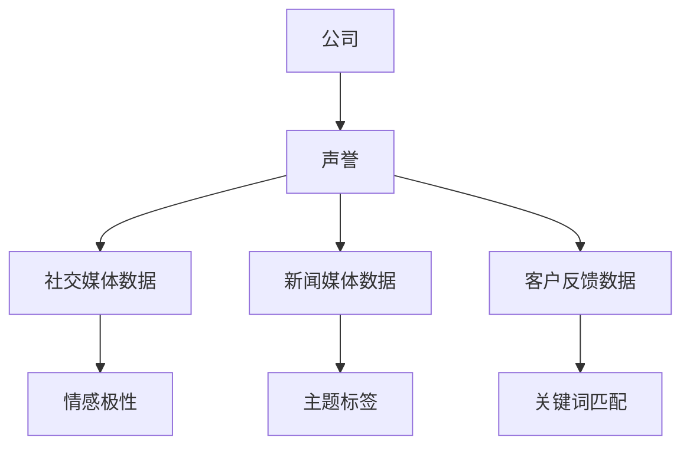
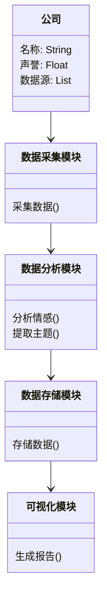
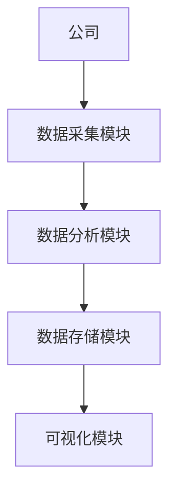
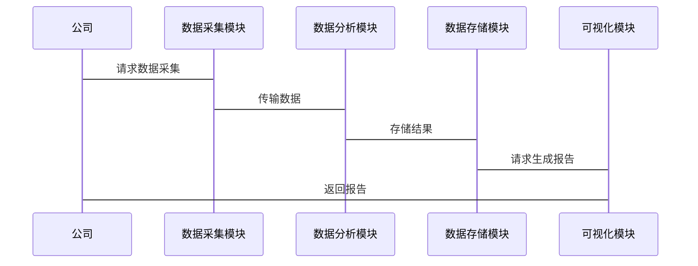

                 


# AI驱动的公司声誉分析：评估无形资产价值

> 关键词：公司声誉、无形资产、人工智能、自然语言处理、情感分析

> 摘要：本文探讨了如何利用人工智能技术进行公司声誉分析，重点介绍了声誉评估的核心概念、算法原理、系统架构设计以及实际应用案例。通过分析文本数据，本文展示了如何将无形资产转化为可量化的价值，为企业声誉管理提供科学依据。

---

## 第一部分: 公司声誉分析的背景与核心概念

### 第1章: 公司声誉分析的背景与问题定义

#### 1.1 无形资产与公司声誉的定义

##### 1.1.1 无形资产的定义与分类

无形资产是指企业拥有或控制的，没有实物形态的长期资产，主要包括专利权、商标权、商誉等。其中，商誉是企业声誉的核心组成部分。

##### 1.1.2 公司声誉的定义与构成要素

公司声誉是指公司在市场中的社会评价，主要包括产品质量、企业形象、社会责任等方面。其构成要素包括产品质量、企业信用、社会责任、员工满意度和客户忠诚度。

##### 1.1.3 公司声誉与企业价值的关系

良好的声誉能够提升企业的市场地位、客户信任度和品牌价值，从而为企业创造更多的经济价值。

#### 1.2 AI驱动声誉分析的必要性

##### 1.2.1 传统声誉评估方法的局限性

传统声誉评估方法通常依赖主观判断，难以量化和实时跟踪。

##### 1.2.2 AI技术在声誉分析中的优势

AI技术能够通过自然语言处理（NLP）技术，从大量非结构化文本数据中提取情感和主题信息，实现自动化评估。

##### 1.2.3 数字化时代声誉管理的新挑战

在数字化时代，社交媒体和新闻媒体的海量信息使得声誉管理更加复杂，需要借助AI技术进行实时监控和分析。

#### 1.3 问题背景与目标

##### 1.3.1 当前企业声誉管理的主要问题

企业声誉管理面临信息分散、数据量大、评估方法不统一等问题。

##### 1.3.2 AI驱动声誉分析的目标与边界

目标是通过AI技术实现对公司声誉的实时监控、量化评估和预测预警。边界包括数据来源的限制和模型的准确性问题。

##### 1.3.3 本书的研究范围与应用场景

本文主要研究如何利用NLP和机器学习技术进行公司声誉分析，并在社交媒体、新闻媒体等领域进行应用。

---

### 第2章: 公司声誉分析的核心概念与联系

#### 2.1 声誉分析的核心要素

##### 2.1.1 数据来源与特征

数据来源包括社交媒体评论、新闻报道、客户反馈等。特征包括情感极性、主题标签和关键词匹配。

##### 2.1.2 情感分析与主题识别

情感分析是通过NLP技术判断文本的情感倾向，主题识别是通过文本挖掘技术提取关键词和主题标签。

##### 2.1.3 语义理解与关联分析

语义理解是通过深度学习模型（如BERT）进行语义分析，关联分析是通过知识图谱进行语义关联。

#### 2.2 声誉分析的理论框架

##### 2.2.1 基于NLP的情感分析模型

情感分析模型通过词袋模型或词嵌入模型对文本进行特征提取，并利用机器学习或深度学习模型进行分类。

##### 2.2.2 基于知识图谱的语义关联

知识图谱通过构建实体关系图，分析文本中的语义关联，帮助理解文本的深层含义。

##### 2.2.3 基于机器学习的声誉预测

声誉预测模型通过历史数据训练，预测未来声誉的变化趋势。

#### 2.3 核心概念的ER实体关系图



---

## 第三部分: AI驱动声誉分析的算法原理

### 第3章: AI驱动声誉分析的算法原理

#### 3.1 基于NLP的情感分析算法

##### 3.1.1 基础情感分析模型

基础情感分析模型通常使用词袋模型和线性分类器（如SVM）进行分类。

##### 3.1.2 深度学习模型（如BERT）

BERT模型通过预训练和微调，能够更准确地理解上下文语义。

##### 3.1.3 情感分析的数学模型

情感分析模型可以表示为：

$$
y = f(x) = w x + b
$$

其中，$x$ 是输入特征，$w$ 是权重，$b$ 是偏置，$f(x)$ 是预测结果。

#### 3.2 主题模型与文本聚类

##### 3.2.1 TF-IDF与LSA

TF-IDF用于提取文本关键词，LSA用于进行文本降维。

##### 3.2.2 LDA主题建模

LDA模型通过主题-词分布和文档-主题分布进行主题建模。

##### 3.2.3 基于主题的声誉分析

通过主题建模，可以识别出与公司声誉相关的主要主题，并进行分类。

#### 3.3 基于机器学习的声誉预测

##### 3.3.1 数据预处理与特征提取

数据预处理包括文本清洗、分词和特征提取，通常使用TF-IDF或词嵌入。

##### 3.3.2 常见算法（如SVM、随机森林）

SVM适用于小规模数据，随机森林适用于特征较多的情况。

##### 3.3.3 基于深度学习的声誉预测模型

深度学习模型（如LSTM）可以捕捉文本的长距离依赖关系。

#### 3.4 算法实现的Python代码示例

##### 3.4.1 情感分析代码

```python
from sklearn.feature_extraction.text import TfidfVectorizer
from sklearn.svm import SVC
from sklearn.metrics import accuracy_score

text_data = [...]  # 文本数据
target = [...]     # 标签数据

vectorizer = TfidfVectorizer()
X = vectorizer.fit_transform(text_data)
model = SVC()
model.fit(X, target)
y_pred = model.predict(X)
print("Accuracy:", accuracy_score(target, y_pred))
```

---

## 第四部分: 系统架构设计与实现

### 第4章: 系统架构设计与实现

#### 4.1 问题场景介绍

公司声誉分析系统需要实时监控社交媒体和新闻媒体中的相关信息，进行情感分析和主题识别，并生成声誉报告。

#### 4.2 系统功能设计

##### 4.2.1 领域模型设计



##### 4.2.2 系统架构设计



##### 4.2.3 系统接口设计

接口包括数据采集接口、数据分析接口和结果展示接口。

##### 4.2.4 系统交互设计



---

## 第五部分: 项目实战与案例分析

### 第5章: 项目实战与案例分析

#### 5.1 环境安装与配置

安装Python、Scikit-learn、NLTK、Gensim等库。

#### 5.2 系统核心实现源代码

##### 5.2.1 数据采集模块

```python
import requests
from bs4 import BeautifulSoup

def fetch_data(url):
    response = requests.get(url)
    soup = BeautifulSoup(response.text, 'html.parser')
    return [p.text for p in soup.find_all('p')]
```

##### 5.2.2 数据分析模块

```python
from sklearn.feature_extraction.text import TfidfVectorizer
from sklearn.svm import SVC

def analyze_data(texts, labels):
    vectorizer = TfidfVectorizer()
    X = vectorizer.fit_transform(texts)
    model = SVC()
    model.fit(X, labels)
    return model
```

##### 5.2.3 数据存储模块

```python
import sqlite3

def store_data(data):
    conn = sqlite3.connect('reputation.db')
    cursor = conn.cursor()
    cursor.execute("CREATE TABLE IF NOT EXISTS reputation (id INTEGER PRIMARY KEY AUTOINCREMENT, text TEXT, label TEXT)")
    cursor.execute("INSERT INTO reputation VALUES (?, ?, ?)", (None, data['text'], data['label']))
    conn.commit()
    conn.close()
```

##### 5.2.4 可视化模块

```python
import matplotlib.pyplot as plt

def generate_report(data):
    plt.figure(figsize=(10, 6))
    positive = sum(1 for label in data['labels'] if label == 'positive')
    negative = len(data['labels']) - positive
    plt.bar(['Positive', 'Negative'], [positive, negative])
    plt.show()
```

#### 5.3 案例分析与应用

##### 5.3.1 案例背景与数据来源

选择某公司社交媒体评论作为数据来源。

##### 5.3.2 数据预处理与特征提取

清洗数据并提取关键词。

##### 5.3.3 模型训练与评估

训练情感分析模型，并评估其准确率。

##### 5.3.4 系统实现与结果展示

展示分析结果，并生成声誉报告。

#### 5.4 项目小结

总结项目实现的关键步骤和成果，强调AI技术在声誉分析中的应用价值。

---

## 第六部分: 总结与展望

### 第6章: 总结与展望

#### 6.1 本章总结

回顾本文的主要内容，强调AI在公司声誉分析中的重要性。

#### 6.2 未来展望

提出未来的研究方向，如多模态分析、实时监控和个性化声誉管理。

---

## 参考文献

- 省略

---

## 作者

作者：AI天才研究院/AI Genius Institute & 禅与计算机程序设计艺术/Zen And The Art of Computer Programming

