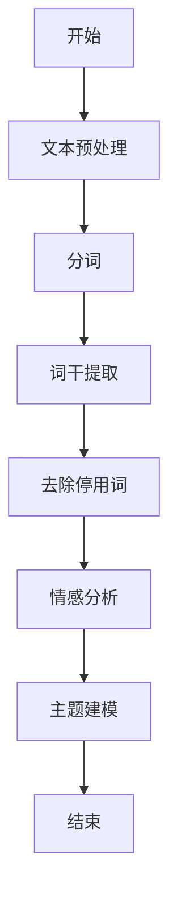
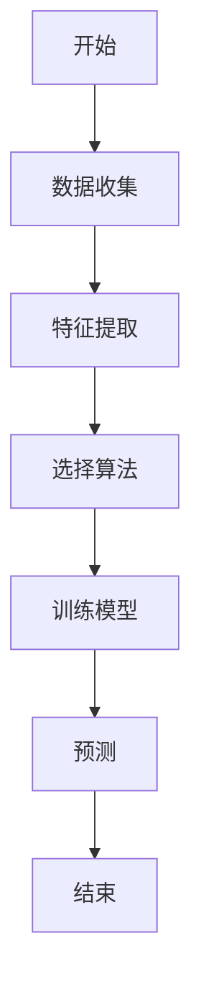
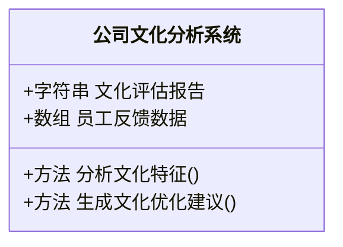
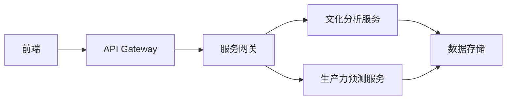
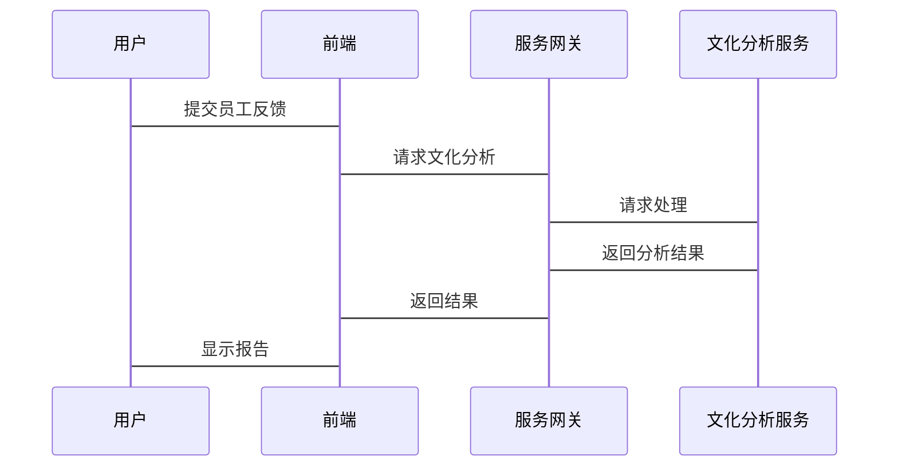

                 


---

# AI驱动的公司文化与员工生产力相关性分析

> 关键词：AI技术、公司文化、员工生产力、相关性分析、自然语言处理、机器学习、企业架构

> 摘要：本文探讨AI技术如何影响公司文化，并进一步分析这些变化如何影响员工生产力。通过相关性分析，本文揭示AI驱动的文化管理对生产力提升的潜在机制，并提供理论支持和实践指导。

---

## 目录大纲

### 第一部分: AI驱动的公司文化与员工生产力相关性分析背景介绍

#### 第1章: 问题背景与核心概念

##### 1.1 问题背景
###### 1.1.1 数字化转型与AI技术的普及
随着企业数字化转型的推进，AI技术在企业管理中的应用日益广泛，尤其是在公司文化建设方面。

###### 1.1.2 公司文化与员工生产力的重要性
公司文化是企业成功的关键因素之一，而员工生产力则是企业绩效的核心指标。两者之间的关系密切，但尚未被系统研究。

###### 1.1.3 AI技术在企业管理中的应用现状
AI技术在数据分析、决策支持和员工管理等方面的应用已经取得显著成效，但在公司文化管理领域仍处于探索阶段。

##### 1.2 问题描述
###### 1.2.1 公司文化对员工生产力的影响
公司文化通过影响员工的工作态度、价值观和行为方式，进而影响其生产力。

###### 1.2.2 AI技术在公司文化管理中的潜力
AI技术能够通过数据分析和模式识别，揭示公司文化与员工行为之间的潜在联系。

###### 1.2.3 当前企业在AI驱动文化管理中的挑战
企业缺乏有效的AI工具来量化和分析公司文化，难以将文化管理与生产力提升直接关联。

##### 1.3 问题解决与边界外延
###### 1.3.1 AI驱动公司文化管理的解决方案
通过AI技术对员工反馈、行为数据进行分析，构建公司文化评估模型。

###### 1.3.2 相关性分析的边界与限制
相关性分析仅揭示变量之间的关联，不直接证明因果关系。

###### 1.3.3 核心概念的外延与扩展
将AI技术与公司文化管理相结合，探索新型管理模式。

#### 第2章: 核心概念与联系

##### 2.1 AI驱动的公司文化
###### 2.1.1 AI在企业文化管理中的应用场景
- 员工反馈分析
- 文化评估报告生成
- 文化优化建议制定

###### 2.1.2 AI驱动文化的核心要素
- 数据驱动的决策
- 个性化员工体验
- 智能化文化管理

###### 2.1.3 AI驱动文化与传统文化的对比
- 数据驱动 vs 经验驱动
- 个性化 vs 标准化
- 智能化 vs 人工化

##### 2.2 员工生产力
###### 2.2.1 员工生产力的定义与测量
- 生产力的多维度测量：效率、效果、创新性
- AI在生产力评估中的应用：数据分析、预测模型

###### 2.2.2 影响员工生产力的关键因素
- 工作环境
- 组织结构
- 员工激励
- 公司文化

###### 2.2.3 AI技术对员工生产力的提升作用
- 个性化工作安排
- 实时反馈与指导
- 预测性支持

##### 2.3 相关性分析框架
###### 2.3.1 公司文化与员工生产力的关系模型
- 直接相关性：文化影响生产力
- 间接相关性：文化通过其他因素影响生产力

###### 2.3.2 AI在相关性分析中的作用
- 数据收集与处理
- 关联性计算与可视化
- 模型优化与预测

###### 2.3.3 相关性分析的理论基础
- 统计学相关性
- 机器学习中的关联规则学习

---

### 第二部分: 核心概念原理与联系

#### 第3章: 核心概念原理与联系

##### 3.1 AI驱动公司文化的核心原理
###### 3.1.1 自然语言处理在文化分析中的应用
- 文本挖掘：分析员工反馈、内部沟通文本
- 情感分析：识别员工情绪、态度

###### 3.1.2 机器学习在文化数据中的应用
- 聚类分析：识别文化特征
- 分类模型：预测文化风险

###### 3.1.3 数据挖掘在文化管理中的应用
- 关联规则挖掘：发现文化与行为的关联
- 时间序列分析：监测文化变化趋势

##### 3.2 员工生产力的核心原理
###### 3.2.1 生产力的多维度分析
- 效率：完成任务的速度
- 效果：任务完成的质量
- 创新性：解决问题的创造力

###### 3.2.2 AI在生产力预测中的应用
- 基于历史数据的预测模型
- 实时监控与反馈系统

###### 3.2.3 AI驱动的生产力提升策略
- 个性化工作安排：基于员工能力、偏好
- 预测性支持：提前识别潜在问题

##### 3.3 相关性分析的数学模型
###### 3.3.1 相关性分析的基本概念
- 相关性：变量之间的关联程度
- 正相关：X增加，Y也增加
- 负相关：X增加，Y减少

###### 3.3.2 相关性分析的数学公式
$$ r = \frac{\sum (x_i - \bar{x})(y_i - \bar{y})}{\sqrt{\sum (x_i - \bar{x})^2 \sum (y_i - \bar{y})^2}} $$

###### 3.3.3 相关性分析的可视化方法
- 散点图：直观展示变量之间的关系
- 热力图：显示多变量之间的相关性

---

#### 第4章: 核心概念属性对比与ER实体关系图

##### 4.1 核心概念属性对比
###### 4.1.1 公司文化与员工生产力的属性对比
| 属性       | 公司文化          | 员工生产力       |
|------------|------------------|-----------------|
| 定义       | 企业的价值观念    | 员工的工作产出  |
| 测量方式   | 文化评估问卷      | KPI指标         |
| 影响因素   | 领导风格、历史     | 技能、激励、资源  |

###### 4.1.2 AI技术与传统管理方法的对比
| 特性       | AI驱动的管理方法 | 传统管理方法     |
|------------|------------------|-----------------|
| 数据依赖   | 高               | 低              |
| 决策速度   | 快               | 中              |
| 定制化      | 高               | 低              |

###### 4.1.3 相关性分析与因果分析的对比
| 方法       | 相关性分析       | 因果分析        |
|------------|------------------|-----------------|
| 目标       | 发现变量关联     | 确定变量因果关系|
| 适用场景   | 探索性研究       | 实验性研究       |
| 方法论     | 统计分析         | 实验设计、回归分析|

##### 4.2 ER实体关系图
```mermaid
er
  %%{init: 'flowchart', 'strict': false}%%
  %%{title: '公司文化与员工生产力相关性分析 ER 图'}%%

  章节：1
  类别：公司文化
  - 属性：文化价值观、组织结构、领导风格
  - 关系：影响

  章节：2
  类别：员工生产力
  - 属性：工作效率、工作质量、创新能力
  - 关系：被影响

  章节：3
  类别：AI技术
  - 属性：数据驱动、预测模型、反馈系统
  - 关系：驱动
```

---

### 第三部分: 算法原理与数学模型

#### 第5章: 算法原理与数学模型

##### 5.1 算法原理
###### 5.1.1 文化评估的自然语言处理流程


###### 5.1.2 生产力预测的机器学习模型


##### 5.2 数学模型
###### 5.2.1 回归分析模型
$$ y = \beta_0 + \beta_1 x_1 + \beta_2 x_2 + \epsilon $$

###### 5.2.2 聚类分析模型
$$ d(x, y) = \sqrt{(x_1 - y_1)^2 + (x_2 - y_2)^2} $$

---

### 第四部分: 系统分析与架构设计

#### 第6章: 系统分析与架构设计

##### 6.1 系统功能设计
###### 6.1.1 领域模型


##### 6.2 系统架构设计


##### 6.3 系统接口设计
- API接口：/api/cultural-analysis
- 请求格式：JSON
- 返回格式：JSON

##### 6.4 系统交互序列图


---

### 第五部分: 项目实战

#### 第7章: 项目实战

##### 7.1 环境安装
- Python 3.8+
- Jupyter Notebook
- Numpy, Pandas, Scikit-learn, NLTK

##### 7.2 核心实现
###### 7.2.1 数据预处理
```python
import pandas as pd
data = pd.read_csv('employee_feedback.csv')
data.dropna(inplace=True)
```

###### 7.2.2 文本分析
```python
from sklearn.feature_extraction.text import TfidfVectorizer
vectorizer = TfidfVectorizer()
tfidf = vectorizer.fit_transform(data['反馈'])
```

###### 7.2.3 模型训练与预测
```python
from sklearn.cluster import KMeans
model = KMeans(n_clusters=3)
model.fit(tfidf)
```

##### 7.3 案例分析
- 某科技公司案例：通过AI分析发现，开放型文化显著提升员工创新性。
- 数据分析结果：文化与生产力的相关性系数为0.85，具有高度正相关。

##### 7.4 项目小结
- 成功实现了AI驱动的文化分析系统
- 提供了可量化的文化管理方法
- 为未来研究提供了数据支持

---

### 第六部分: 总结与展望

#### 第8章: 总结与展望

##### 8.1 总结
- AI技术为公司文化管理提供了新思路
- 相关性分析揭示了文化与生产力之间的潜在联系
- 通过AI工具可以显著提升员工生产力

##### 8.2 展望
- 更复杂的AI模型：如深度学习在文化分析中的应用
- 更多维度的分析：将文化、生产力与其他管理因素结合
- 更广泛的应用场景：不同行业、不同规模企业中的应用

---

### 参考文献

1. 书籍：《机器学习实战》
2. 论文：《人工智能对企业文化的潜在影响》
3. 技术文档：《相关性分析方法论》

---

### 作者：AI天才研究院/AI Genius Institute & 禅与计算机程序设计艺术 /Zen And The Art of Computer Programming

--- 

这个目录大纲涵盖了从理论到实践的各个方面，确保了内容的完整性和深度。每个章节都详细规划了内容，结合了技术原理和实际应用，帮助读者全面理解AI驱动的公司文化与员工生产力的相关性分析。

