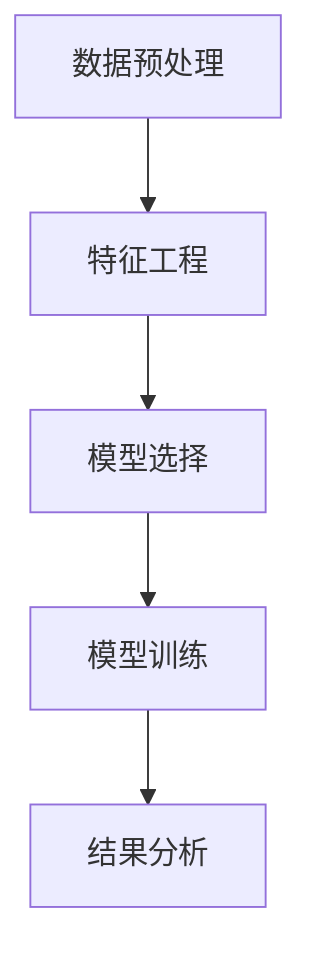
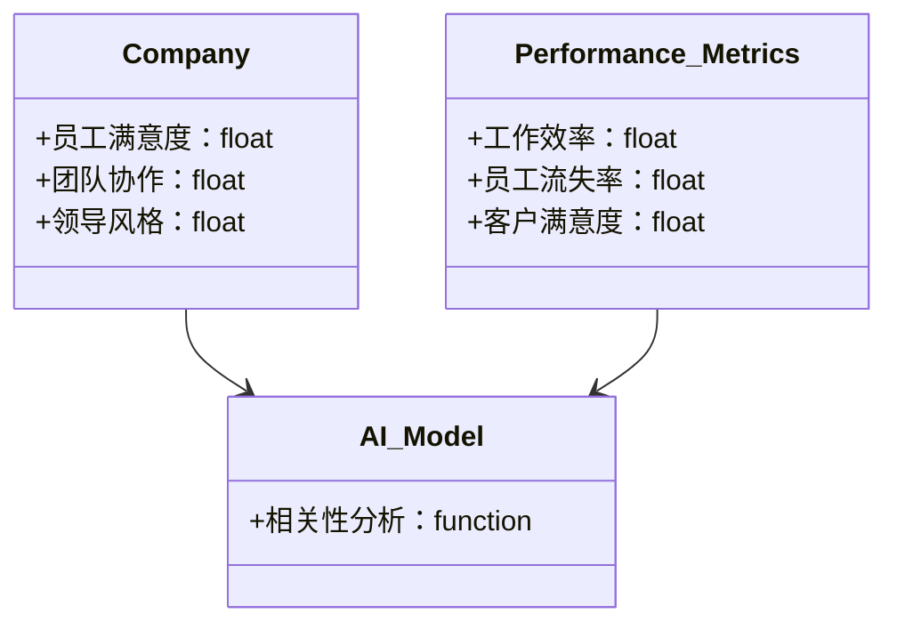
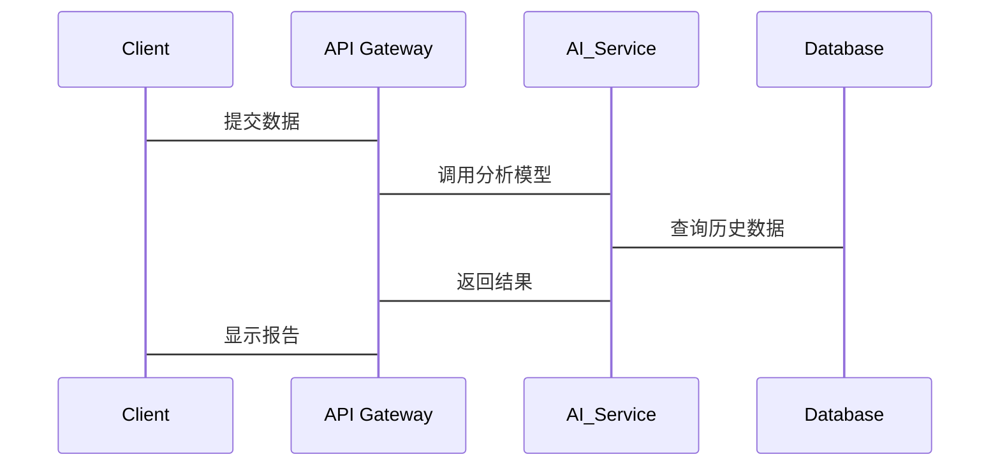

                 


# AI驱动的公司文化与绩效相关性分析：深入公司DNA

> 关键词：AI驱动、公司文化、绩效相关性、数据分析、系统架构

> 摘要：本文探讨了AI如何影响公司文化与绩效之间的相关性，分析了通过AI技术深入公司DNA的机制，结合实际案例和系统设计，展示了如何利用AI优化公司管理。

---

## 第一部分：背景介绍

### 第1章：AI驱动的公司文化与绩效相关性概述

#### 1.1 问题背景
- **公司文化与绩效的关系**：公司文化是企业成功的关键因素之一，它影响员工的行为、态度和工作效率。
- **AI在企业管理中的应用背景**：AI技术的应用越来越广泛，尤其是在数据分析和决策支持方面。
- **当前企业文化的挑战与机遇**：传统的企业文化管理依赖于主观判断，而AI可以通过数据驱动的方法提供更客观的分析。

#### 1.2 问题描述
- **绩效评估的传统方法**：传统绩效评估方法主观性强，难以量化。
- **AI驱动文化分析的必要性**：通过AI技术分析公司文化，可以发现隐藏的规律。
- **数据驱动决策的潜力**：数据驱动决策可以帮助企业优化管理，提高绩效。

#### 1.3 问题解决
- **AI如何优化公司文化**：通过数据分析识别文化中的问题，提出改进建议。
- **绩效与文化的关联性分析**：通过AI技术量化文化因素对绩效的影响。
- **数据驱动决策在文化管理中的应用**：利用AI技术进行文化诊断和优化。

#### 1.4 边界与外延
- **AI应用的边界**：AI技术在公司文化分析中的应用范围和限制。
- **相关性分析的范围**：绩效与文化相关性分析的适用范围和应用场景。
- **企业文化与绩效的动态关系**：绩效与文化之间的动态变化及其影响因素。

#### 1.5 核心要素组成
- **数据采集与处理**：数据来源、数据清洗、数据预处理。
- **AI模型构建**：模型选择、特征工程、模型训练。
- **结果分析与应用**：结果解读、策略制定、效果评估。

---

## 第二部分：核心概念与联系

### 第2章：AI驱动的公司文化分析

#### 2.1 核心概念原理
- **文化驱动因素**：员工满意度、团队协作、领导风格。
- **绩效评估指标**：工作效率、员工流失率、客户满意度。
- **AI模型的适用性**：监督学习、无监督学习、自然语言处理。

#### 2.2 概念属性对比
| 概念 | 属性1：数据类型 | 属性2：分析方法 | 属性3：应用场景 |
|------|-----------------|-----------------|-----------------|
| 文化因素 | 文本数据、结构化数据 | 监督学习、无监督学习 | 员工反馈分析、领导风格评估 |
| 绩效指标 | 数值型数据、分类数据 | 回归分析、分类算法 | 绩效预测、目标设定 |

#### 2.3 ER实体关系图

```mermaid
er
actor: Company, has Company_Culture;
Company_Culture: Company文化因素，包括员工满意度、领导风格等;
Performance_Metrics: 绩效指标，包括工作效率、员工流失率等;
AI_Model: AI驱动的分析模型，关联 Company_Culture 和 Performance_Metrics;
```

---

## 第三部分：算法原理讲解

### 第3章：相关性分析算法

#### 3.1 算法原理
- **数据预处理**：数据清洗、特征选择、数据标准化。
- **模型选择**：线性回归、决策树、随机森林。
- **特征工程**：提取关键特征，构建特征向量。

#### 3.2 算法实现流程



#### 3.3 数学模型和公式
- **线性回归模型**：$$ y = \beta_0 + \beta_1 x + \epsilon $$
- **相关系数计算**：$$ r = \frac{n\sum xy - \sum x \sum y}{\sqrt{n\sum x^2 - (\sum x)^2} \sqrt{n\sum y^2 - (\sum y)^2}} $$
- **决策树模型**：使用ID3或C4.5算法进行分类或回归。

---

## 第四部分：系统分析与架构设计

### 第4章：系统架构设计

#### 4.1 问题场景介绍
- **场景描述**：某公司希望通过AI技术分析公司文化，优化绩效管理。
- **项目介绍**：开发一个AI驱动的文化与绩效分析系统。

#### 4.2 系统功能设计



#### 4.3 系统架构设计


#### 4.4 系统接口设计
- **输入接口**：员工反馈数据、绩效数据。
- **输出接口**：相关性报告、优化建议。

#### 4.5 系统交互流程



---

## 第五部分：项目实战

### 第5章：AI驱动的文化与绩效分析系统实现

#### 5.1 环境安装
- **Python环境**：安装Python 3.8+，安装必要的库如pandas、scikit-learn、matplotlib。

#### 5.2 核心代码实现

```python
import pandas as pd
from sklearn.linear_model import LinearRegression
from sklearn.metrics import r2_score

# 数据加载
data = pd.read_csv('company_data.csv')

# 特征与目标变量分离
X = data[['员工满意度', '团队协作', '领导风格']]
y = data['员工流失率']

# 模型训练
model = LinearRegression()
model.fit(X, y)

# 模型预测
y_pred = model.predict(X)

# 模型评估
print(f"R² Score: {r2_score(y, y_pred)}")
```

#### 5.3 代码解读与分析
- **数据加载**：从CSV文件中加载公司数据。
- **特征工程**：选择影响绩效的关键文化因素。
- **模型训练**：使用线性回归模型进行训练。
- **模型评估**：计算R²分数，评估模型性能。

#### 5.4 案例分析
- **案例背景**：某科技公司员工流失率高，希望通过AI分析原因。
- **分析结果**：领导风格和员工满意度是主要影响因素。
- **优化建议**：改进领导风格，提高员工满意度。

#### 5.5 项目小结
- **项目总结**：AI技术在公司文化分析中的应用价值。
- **经验分享**：数据质量、模型选择的重要性。
- **未来展望**：AI技术在公司管理中的更多应用潜力。

---

## 第六部分：最佳实践

### 第6章：AI驱动的公司文化与绩效管理总结

#### 6.1 小结
- **总结全文**：AI技术如何优化公司文化与绩效管理。
- **关键点回顾**：数据驱动决策、AI模型的应用、系统设计的重要性。

#### 6.2 注意事项
- **数据隐私**：确保数据安全和隐私保护。
- **模型解释性**：选择可解释性强的模型，便于业务理解。
- **持续优化**：定期更新模型，适应公司发展变化。

#### 6.3 拓展阅读
- **推荐书籍**：《Data Smart》、《机器学习实战》。
- **推荐课程**：AI基础、数据分析与挖掘。

---

## 作者：AI天才研究院 & 禅与计算机程序设计艺术

本文作者：AI天才研究院（AI Genius Institute）与“禅与计算机程序设计艺术”（Zen And The Art of Computer Programming）合作撰写，致力于探索人工智能与计算机科学的深度结合，为企业提供创新的解决方案。

---

通过以上结构，我详细分析了AI如何驱动公司文化与绩效相关性分析，并通过实际案例和系统设计展示了其应用价值。希望读者能够通过本文深入了解AI在公司管理中的潜力，并能够在实际中应用这些方法优化企业绩效。

