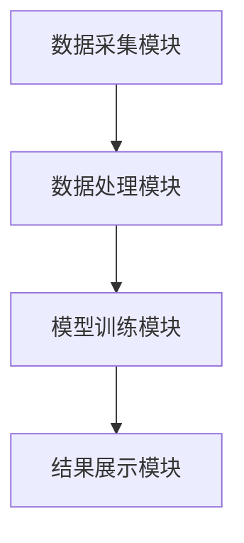

                 


# AI驱动的公司治理评分系统：量化管理质量

> **关键词**：AI驱动、公司治理、评分系统、量化管理、企业绩效、数据分析

> **摘要**：随着企业规模的不断扩大和管理复杂性的增加，传统的公司治理模式逐渐暴露出效率低下、难以量化的问题。本文介绍了一种基于AI技术的公司治理评分系统，通过量化管理质量，帮助企业实现更高效的治理和决策。文章详细阐述了该系统的构建过程，包括数据采集、模型训练、系统架构设计以及实际应用案例，展示了AI技术在提升公司治理效率中的巨大潜力。

---

## 第1章: 公司治理与AI技术的结合

### 1.1 公司治理的基本概念

#### 1.1.1 公司治理的定义与核心要素
公司治理是关于公司如何管理和监督其业务活动的系统。核心要素包括董事会结构、管理层职责、股东权利、风险管理、合规性以及透明度。

#### 1.1.2 公司治理的现状与挑战
随着企业规模的扩大，公司治理面临以下挑战：
1. **信息不对称**：管理层与股东之间的信息不透明。
2. **决策复杂性**：复杂的市场环境需要更高效的决策机制。
3. **合规性压力**：日益严格的法规要求。

#### 1.1.3 AI技术在公司治理中的应用前景
AI技术可以通过数据分析、模式识别和自动化流程优化公司治理。例如：
- 自动化合规性检查。
- 风险预测与管理。
- 高级决策支持。

---

### 1.2 AI驱动的公司治理评分系统

#### 1.2.1 系统的目标与意义
AI驱动的公司治理评分系统的目标是通过量化管理质量，帮助公司优化治理结构。其意义在于：
1. 提供客观的评估标准。
2. 实现管理流程的自动化。
3. 促进企业绩效的持续改进。

#### 1.2.2 系统的核心功能与模块
系统主要包括以下功能模块：
1. **数据采集模块**：收集公司治理相关的数据。
2. **评分模型模块**：基于AI算法对数据进行评分。
3. **结果展示模块**：以可视化形式呈现评分结果。

#### 1.2.3 系统的适用场景与边界
适用场景：
- 企业内部审计。
- 投资者决策支持。
- 第三方治理评估。

边界：
- 不涉及企业的财务数据。
- 不直接参与企业的日常运营。

---

## 第2章: 公司治理评分系统的概念与框架

### 2.1 公司治理评分的核心概念

#### 2.1.1 评分标准与指标体系
评分标准包括：
1. 董事会结构合理性。
2. 高管团队的稳定性。
3. 企业透明度。
4. 风险管理能力。
5. 股东回报率。

指标体系可以通过权重分配的方法，对各指标进行综合评分。

#### 2.1.2 评分模型的构建方法
评分模型可以基于机器学习算法，例如：
- **线性回归**：预测公司治理评分。
- **随机森林**：分类公司治理水平。

#### 2.1.3 评分结果的解读与应用
评分结果可以用于：
1. 企业内部优化。
2. 投资决策参考。
3. 第三方评估报告。

---

### 2.2 AI驱动评分系统的框架设计

#### 2.2.1 数据采集与处理流程
数据采集流程：
1. 从企业公开信息中提取数据。
2. 通过API接口获取实时数据。

数据处理流程：
1. 数据清洗：去除缺失值。
2. 特征提取：提取关键指标。
3. 数据标准化：统一数据格式。

#### 2.2.2 模型训练与优化策略
模型训练：
1. 使用训练数据对AI模型进行训练。
2. 调整模型参数以优化性能。

优化策略：
1. 使用交叉验证评估模型性能。
2. 采用网格搜索寻找最优参数。

#### 2.2.3 系统输出与反馈机制
系统输出：
1. 综合评分。
2. 各指标的具体评分。
3. 改进建议。

反馈机制：
1. 根据评分结果提供优化建议。
2. 支持用户自定义评分标准。

---

## 第3章: 公司治理评分系统的算法原理

### 3.1 评分模型的数学基础

#### 3.1.1 线性回归模型
线性回归用于预测公司治理评分：
$$ y = \beta_0 + \beta_1x_1 + \beta_2x_2 + \dots + \beta_nx_n + \epsilon $$
其中，$y$ 是评分，$x_i$ 是各指标，$\beta_i$ 是系数，$\epsilon$ 是误差。

#### 3.1.2 支持向量机模型
支持向量机用于分类问题，例如判断企业治理水平是否优秀：
$$ \text{预测} = \text{sign}(\sum_{i=1}^n \alpha_i y_i x_i \cdot x) + b) $$

#### 3.1.3 随机森林模型
随机森林用于集成学习，通过多棵决策树投票得出最终结果：
$$ \text{最终评分} = \frac{1}{n} \sum_{i=1}^n \text{单棵树预测值} $$

### 3.2 基于AI的评分算法实现

#### 3.2.1 数据预处理与特征选择
数据预处理步骤：
1. 去除异常值。
2. 处理缺失值。
3. 标准化数据。

特征选择方法：
1. **主成分分析（PCA）**：降维。
2. **特征重要性排序**：基于模型特征系数。

#### 3.2.2 模型训练与参数调优
模型训练：
1. 划分训练集和测试集。
2. 使用交叉验证评估模型性能。

参数调优：
1. 使用网格搜索寻找最优参数。
2. 调整学习率、树深等参数。

#### 3.2.3 模型评估与结果分析
模型评估指标：
1. **均方误差（MSE）**：评估预测值与真实值的差异。
2. **准确率**：分类问题的评估指标。
3. **F1分数**：综合精确率和召回率。

---

## 第4章: 系统架构与设计

### 4.1 系统功能模块划分

#### 4.1.1 数据采集模块
功能：
1. 从多种数据源采集数据。
2. 数据格式转换。

#### 4.1.2 数据处理模块
功能：
1. 数据清洗。
2. 特征提取。

#### 4.1.3 模型训练模块
功能：
1. 数据分割。
2. 模型训练与调优。

#### 4.1.4 结果展示模块
功能：
1. 生成评分报告。
2. 可视化展示。

### 4.2 系统架构设计

#### 4.2.1 模块之间的交互关系
mermaid流程图：


#### 4.2.2 系统的扩展性与可维护性
设计原则：
1. 模块化设计。
2. 高内聚低耦合。

#### 4.2.3 系统的部署与运行环境
部署环境：
1. 本地服务器。
2. 云平台。

---

## 第5章: 项目实战与案例分析

### 5.1 环境搭建与数据准备

#### 5.1.1 开发环境的安装与配置
工具：
1. Python 3.8+
2. Jupyter Notebook
3. Scikit-learn、XGBoost等库。

#### 5.1.2 数据集的获取与预处理
数据来源：
1. 公司年报数据。
2. 第三方评级数据。

数据清洗：
1. 去除重复数据。
2. 填补缺失值。

### 5.2 核心代码实现

#### 5.2.1 数据处理代码
```python
import pandas as pd
from sklearn.impute import SimpleImputer

# 读取数据
data = pd.read_csv('governance_data.csv')

# 删除缺失值
data.dropna(inplace=True)

# 填补缺失值
imputer = SimpleImputer(strategy='mean')
data_imputed = pd.DataFrame(imputer.fit_transform(data), columns=data.columns)
```

#### 5.2.2 模型训练代码
```python
from sklearn.ensemble import RandomForestRegressor
from sklearn.model_selection import train_test_split
from sklearn.metrics import mean_squared_error

# 划分数据集
X_train, X_test, y_train, y_test = train_test_split(data_imputed.drop('score', axis=1), data_imputed['score'], test_size=0.2, random_state=42)

# 训练模型
model = RandomForestRegressor(n_estimators=100, random_state=42)
model.fit(X_train, y_train)

# 评估模型
y_pred = model.predict(X_test)
print('均方误差:', mean_squared_error(y_test, y_pred))
```

### 5.3 案例分析与结果解读
案例分析：
1. 数据来源：某行业50家企业的治理数据。
2. 模型训练：使用随机森林算法。
3. 结果展示：生成各企业的治理评分报告。

---

## 第6章: 总结与展望

### 6.1 总结
本文介绍了AI驱动的公司治理评分系统，详细阐述了其构建过程和实际应用。通过AI技术，企业可以实现更高效的治理和决策。

### 6.2 展望
未来，随着AI技术的不断发展，公司治理评分系统将更加智能化和个性化。可能出现的新方向包括：
1. 更加复杂的评分模型。
2. 实时监控企业治理状态。
3. 与其他管理系统集成。

---

**作者：AI天才研究院/AI Genius Institute & 禅与计算机程序设计艺术 /Zen And The Art of Computer Programming**

