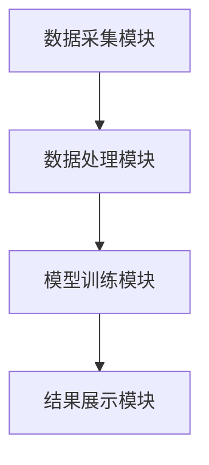

                 


# AI驱动的员工满意度分析：评估人力资本质量

> 关键词：员工满意度分析，AI驱动，人力资本质量，机器学习，深度学习

> 摘要：本文将探讨如何利用人工智能技术驱动员工满意度分析，从而有效评估企业的人力资本质量。通过分析员工满意度的核心概念、AI技术的应用、数学模型的设计与实现，以及系统架构的优化，本文旨在为企业提供一套高效、精准的员工满意度分析解决方案。

---

# 第1章: 背景与核心概念

## 1.1 什么是员工满意度

### 1.1.1 员工满意度的定义
员工满意度是指员工对其工作环境、薪酬、职业发展、团队合作等方面的综合感受和评价。它是衡量员工对工作满意程度的重要指标，直接影响员工的工作表现、留职意愿和企业绩效。

### 1.1.2 员工满意度的核心要素
员工满意度的核心要素包括：
- **工作内容**：员工对工作的兴趣和价值感。
- **薪酬福利**：员工对薪酬和福利的满意度。
- **工作环境**：员工对工作环境和氛围的感受。
- **职业发展**：员工对职业晋升和成长机会的期待。
- **管理与沟通**：员工与上级和同事之间的沟通效率和管理风格。

### 1.1.3 员工满意度与企业绩效的关系
员工满意度与企业绩效密切相关。高满意度的员工通常具有更高的工作效率、更强的团队合作能力和更高的创新意识，从而为企业创造更大的价值。

---

## 1.2 人力资本质量的评估

### 1.2.1 人力资本的定义与特征
人力资本是指员工的知识、技能、经验和能力的总和。与传统资本（如财务资本、物质资本）不同，人力资本是通过员工的劳动创造价值的关键因素。

### 1.2.2 人力资本质量的影响因素
人力资本质量的影响因素包括：
- **员工能力**：员工的专业知识和技能水平。
- **员工态度**：员工的工作积极性和责任感。
- **员工健康**：员工的身体和心理健康状况。
- **员工留职意愿**：员工对企业忠诚度和留职意愿。

### 1.2.3 人力资本评估的挑战与机遇
人力资本评估的挑战在于其主观性和动态性。员工的满意度和能力会随着时间推移而变化，且受到外部环境的影响。然而，通过AI技术，企业可以实时监测员工满意度的变化，从而更好地评估和优化人力资本质量。

---

## 1.3 AI驱动的员工满意度分析

### 1.3.1 AI技术在员工满意度分析中的作用
AI技术可以通过数据分析、模式识别和自然语言处理等手段，帮助企业在海量数据中提取有用信息，从而更准确地评估员工满意度。

### 1.3.2 数据驱动的人力资源管理新趋势
传统的人力资源管理依赖于主观判断和经验，而数据驱动的管理方式则通过收集和分析员工数据，利用AI技术进行预测和优化，从而提升管理的科学性和精准性。

### 1.3.3 企业应用AI驱动员工满意度分析的意义
通过AI驱动的员工满意度分析，企业可以：
- 提高员工满意度，降低员工流失率。
- 优化人力资源配置，提升企业绩效。
- 发现潜在问题，提前采取措施改善员工体验。

---

## 1.4 本章小结
本章介绍了员工满意度的定义和核心要素，分析了人力资本质量的影响因素，探讨了AI技术在员工满意度分析中的作用，以及数据驱动的人力资源管理新趋势。通过这些内容，读者可以理解AI驱动员工满意度分析的重要性和必要性。

---

# 第2章: AI驱动员工满意度分析的核心概念

## 2.1 员工满意度分析的理论框架

### 2.1.1 满意度分析的多维度模型
员工满意度分析通常采用多维度模型，如以下维度：
- 工作满意度
- 薪酬满意度
- 管理满意度
- 职业发展满意度

### 2.1.2 人力资本质量的评估维度
人力资本质量的评估维度包括：
- 员工能力
- 员工态度
- 员工健康
- 员工留职意愿

### 2.1.3 AI在满意度分析中的应用边界
AI技术在满意度分析中的应用边界主要在于数据的准确性和模型的可解释性。尽管AI可以提高分析效率，但最终的决策仍需结合人类的判断和经验。

---

## 2.2 核心概念与联系

### 2.2.1 员工满意度与AI技术的关系
员工满意度与AI技术的关系是相互依存的。AI技术可以帮助企业更精准地分析员工满意度，而员工满意度的提升又可以反过来促进企业的绩效和创新能力。

### 2.2.2 数据特征与模型选择的关联
数据特征与模型选择密切相关。不同的数据特征（如连续型、分类型）需要选择不同的模型（如线性回归、决策树等），以确保分析的准确性和效果。

### 2.2.3 系统架构与业务目标的匹配
系统架构需要与业务目标高度匹配。通过设计合理的系统架构，企业可以更好地实现员工满意度分析的目标，如数据采集、模型训练和结果展示。

---

## 2.3 本章小结
本章通过分析员工满意度分析的理论框架，探讨了核心概念与AI技术的关系，以及数据特征与模型选择的关联。同时，还强调了系统架构与业务目标的匹配性。

---

# 第3章: AI驱动员工满意度分析的算法原理

## 3.1 机器学习在员工满意度分析中的应用

### 3.1.1 监督学习与非监督学习的适用场景
- **监督学习**：适用于有标签的数据，如员工满意度评分。
- **非监督学习**：适用于无标签的数据，如员工的行为数据。

### 3.1.2 常见算法对比与选择策略
以下是常见算法的对比：
| 算法类型      | 适用场景                     | 优点                           | 缺点                           |
|---------------|------------------------------|--------------------------------|--------------------------------|
| 线性回归       | 连续型预测                   | 简单易懂，计算速度快           | 不适合复杂非线性关系           |
| 支持向量机     | 分类与回归                   | 分离能力强，适合高维数据       | 参数调整复杂                   |
| 决策树         | 分类与回归                   | 易解释，适合数据特征复杂性高的场景 | 易受噪声数据影响               |
| 随机森林       | 分类与回归                   | 鲁棒性高，适合特征较多的场景     | 计算复杂度高                   |
| K-means       | 聚类                         | 简单易懂，适合处理大规模数据     | 聚类结果可能不准确             |

---

## 3.2 基于特征工程的员工满意度预测

### 3.2.1 数据预处理与特征提取
数据预处理包括：
- 数据清洗：处理缺失值、异常值。
- 数据标准化：将数据转换为统一的尺度。
- 数据分箱：将连续型变量离散化。

特征提取包括：
- 文本特征提取：使用TF-IDF或词嵌入技术提取文本特征。
- 数值特征提取：对数值特征进行标准化或归一化处理。

### 3.2.2 特征选择与降维方法
特征选择方法：
- 基于统计的方法：如卡方检验。
- 基于模型的方法：如LASSO回归。

降维方法：
- 主成分分析（PCA）：通过线性组合提取主成分。
- 独立成分分析（ICA）：提取相互独立的成分。

---

## 3.3 深度学习模型在满意度分析中的应用

### 3.3.1 神经网络模型的基本原理
神经网络模型通过多层感知机（MLP）对输入数据进行非线性变换，从而实现对员工满意度的预测。

### 3.3.2 Transformer架构的优势与挑战
Transformer架构通过自注意力机制（Self-Attention）捕捉数据中的长距离依赖关系，适用于文本数据的特征提取。

### 3.3.3 深度学习模型的调优技巧
- 调整学习率：使用学习率衰减策略。
- 调整批量大小：选择合适的批量大小以平衡训练效率和稳定性。
- 调整模型深度：避免过深的模型导致计算复杂度过高。

---

## 3.4 本章小结
本章详细介绍了机器学习和深度学习在员工满意度分析中的应用，包括算法选择、特征工程和模型调优的技巧。通过这些内容，读者可以理解如何利用AI技术提高员工满意度分析的准确性和效率。

---

# 第4章: 数学模型与公式详解

## 4.1 基于线性回归的满意度预测

### 4.1.1 线性回归模型的数学表达
$$y = \beta_0 + \beta_1x_1 + \beta_2x_2 + ... + \beta_nx_n + \epsilon$$

其中：
- $y$ 是员工满意度评分。
- $x_i$ 是第$i$个特征变量。
- $\beta_i$ 是对应特征变量的回归系数。
- $\epsilon$ 是误差项。

### 4.1.2 模型假设与检验
- 线性回归模型假设：
  1. 线性假设：因变量与自变量之间存在线性关系。
  2. 独立性假设：误差项之间相互独立。
  3. 正态性假设：误差项服从正态分布。
  4. 同方差性假设：误差项的方差恒定。

### 4.1.3 实际案例中的应用与解释
假设我们有一个简单的线性回归模型，用于预测员工满意度评分：
$$y = 5 + 2x_1 + 3x_2 + \epsilon$$

其中，$x_1$ 是员工薪酬水平，$x_2$ 是员工工作环境评分。系数$\beta_1=2$表示薪酬水平每增加1分，员工满意度评分平均增加2分；$\beta_2=3$表示工作环境评分每增加1分，员工满意度评分平均增加3分。

---

## 4.2 基于聚类分析的员工分群

### 4.2.1 K-means聚类算法的数学基础
$$J = \sum_{i=1}^{k} \sum_{j=1}^{n_i} (x_j - \mu_i)^2$$

其中：
- $k$ 是聚类的数量。
- $n_i$ 是第$i$个聚类中的样本数量。
- $\mu_i$ 是第$i$个聚类的中心点。
- $x_j$ 是第$j$个样本的特征向量。

### 4.2.2 聚类结果的评估指标
常用的聚类评估指标包括：
- **轮廓系数（Silhouette Coefficient）**：衡量聚类的紧密度和分离度。
- **Davies-Bouldin指数**：越小表示聚类效果越好。
- **Calinski-Harabasz指数**：通过计算拐点来确定最佳聚类数。

### 4.2.3 聚类分析在员工管理中的应用
聚类分析可以将员工分为不同的群体，帮助企业识别不同群体的需求和偏好，从而制定更有针对性的管理策略。

---

## 4.3 基于分类算法的满意度分析

### 4.3.1 逻辑回归模型的数学表达
$$P(y=1|x) = \frac{1}{1 + e^{-(\beta_0 + \beta_1x_1 + ... + \beta_nx_n)}}$$

其中：
- $y$ 是二分类标签（如满意或不满意）。
- $x_i$ 是特征变量。
- $\beta_i$ 是回归系数。

### 4.3.2 支持向量机模型的数学表达
支持向量机通过寻找最优超平面，将数据分为两类：
$$y = \text{sign}(\beta_0 + \beta_1x_1 + ... + \beta_nx_n)$$

---

## 4.4 本章小结
本章通过详细讲解线性回归、聚类分析和分类算法的数学模型，帮助读者理解这些算法在员工满意度分析中的应用和原理。通过实际案例的分析，读者可以更好地掌握这些模型的实现和优化技巧。

---

# 第5章: 系统架构设计与实现

## 5.1 系统功能设计

### 5.1.1 数据采集模块
- **功能描述**：通过问卷调查、传感器数据等方式采集员工的相关数据。
- **输入输出**：输入员工信息和行为数据，输出标准化的数据格式。

### 5.1.2 数据处理模块
- **功能描述**：对采集到的数据进行清洗、转换和特征提取。
- **输入输出**：输入原始数据，输出处理后的数据集。

### 5.1.3 模型训练模块
- **功能描述**：基于处理后的数据训练员工满意度预测模型。
- **输入输出**：输入训练数据，输出训练好的模型。

### 5.1.4 结果展示模块
- **功能描述**：将模型的预测结果以可视化形式展示给企业管理者。
- **输入输出**：输入模型预测结果，输出可视化报告。

---

## 5.2 系统架构设计

### 5.2.1 系统架构图


### 5.2.2 系统接口设计
- **数据采集模块接口**：提供数据上传接口，接收员工数据。
- **数据处理模块接口**：提供数据清洗和特征提取的API。
- **模型训练模块接口**：提供模型训练和保存的API。
- **结果展示模块接口**：提供结果查询和导出的API。

---

## 5.3 本章小结
本章通过系统功能设计和架构设计，展示了如何利用AI技术构建一个高效的员工满意度分析系统。通过模块化设计和接口标准化，企业可以灵活地扩展和优化系统功能。

---

# 第6章: 项目实战与案例分析

## 6.1 项目实战

### 6.1.1 环境安装
- 安装Python和相关库（如pandas、scikit-learn、tensorflow）。
- 安装Jupyter Notebook用于数据处理和模型开发。

### 6.1.2 核心代码实现

#### 数据预处理代码
```python
import pandas as pd
from sklearn.preprocessing import StandardScaler

# 读取数据
data = pd.read_csv('employee_survey.csv')

# 数据清洗
data.dropna(inplace=True)

# 标准化处理
scaler = StandardScaler()
scaled_data = scaler.fit_transform(data.drop('satisfaction_score', axis=1))
```

#### 模型训练代码
```python
from sklearn.linear_model import LinearRegression
from sklearn.metrics import mean_squared_error

# 训练模型
model = LinearRegression()
model.fit(scaled_data, data['satisfaction_score'])

# 模型评估
y_pred = model.predict(scaled_data)
mse = mean_squared_error(data['satisfaction_score'], y_pred)
print('均方误差:', mse)
```

### 6.1.3 案例分析
假设我们有一个员工满意度数据集，包含以下字段：
- employee_id：员工ID
- salary：薪酬水平
- work_environment：工作环境评分
- satisfaction_score：员工满意度评分

通过上述代码，我们可以训练一个线性回归模型，预测员工满意度评分，并计算均方误差（MSE）以评估模型的性能。

---

## 6.2 项目小结
本章通过项目实战，展示了如何利用Python和机器学习技术实现员工满意度分析。通过数据预处理、模型训练和结果评估，读者可以掌握AI驱动员工满意度分析的核心步骤和实际应用。

---

# 第7章: 总结与展望

## 7.1 总结
本文详细探讨了AI驱动的员工满意度分析的背景、核心概念、算法原理和系统设计。通过理论与实践的结合，展示了如何利用AI技术提升企业的人力资本质量。

## 7.2 展望
未来，随着AI技术的不断发展，员工满意度分析将更加智能化和个性化。企业可以通过实时监测员工情绪和行为数据，进一步优化人力资本管理，提升员工体验和企业绩效。

---

# 附录

## 附录A: 数据集描述
- 数据集名称：员工满意度调查数据
- 数据集来源：企业内部调查
- 数据字段：employee_id, salary, work_environment, satisfaction_score

## 附录B: 工具包安装
```bash
pip install pandas scikit-learn tensorflow
```

## 附录C: 参考文献
1. Bishop, C. M. (2006). Pattern Recognition and Machine Learning. Springer.
2. Goodfellow, I., Bengio, Y., & Courville, A. (2016). Deep Learning. MIT Press.

---

# 作者：AI天才研究院 & 禅与计算机程序设计艺术

