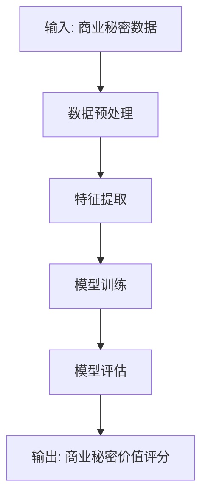
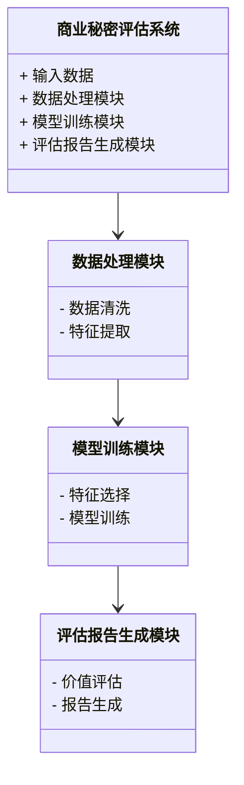
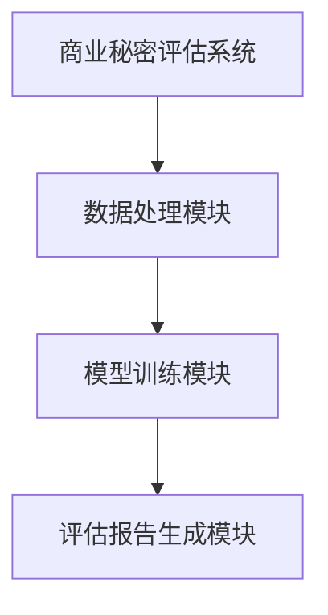

                 


# {{此处是文章标题}}

> 关键词：{{商业秘密，人工智能，价值评估，知识图谱，自然语言处理}}

> 摘要：{{本文系统地探讨了AI技术在商业秘密价值评估中的应用，分析了商业秘密的核心概念与AI技术的结合方式，详细介绍了基于NLP和知识图谱的AI算法原理，并通过实际案例展示了AI驱动的商业秘密价值评估系统的实现过程，最后总结了项目的成果与未来展望。}}

---

# 第三章: AI驱动的商业秘密价值评估算法原理

## 3.1 算法原理概述

### 3.1.1 基于NLP的商业秘密识别

- **自然语言处理（NLP）在商业秘密识别中的作用**
  - 使用文本分类、实体识别和关键词提取等技术，从大量非结构化数据中提取潜在的商业秘密。
  - 例如，通过TF-IDF或BERT模型识别文档中的敏感信息。
- **案例分析：某公司内部文档的商业秘密识别**
  - 文档内容：“我们的新产品的成本控制方法是将原材料价格降低10%，并通过优化生产流程减少人工成本20%。”
  - 算法识别出“原材料价格降低10%”和“生产流程优化”为商业秘密。

### 3.1.2 基于知识图谱的价值评估

- **知识图谱构建**
  - 将商业秘密相关信息（如技术参数、市场数据、竞争对手信息）构建为知识图谱。
  - 使用图嵌入技术（如Word2Vec、GraphSAGE）对图中节点进行表示。
- **基于知识图谱的推理与评估**
  - 使用图推理技术（如路径分析、规则推理）评估商业秘密的价值。
  - 例如，通过分析知识图谱中的关系，判断某项技术是否具有市场竞争优势。

### 3.1.3 算法流程图



## 3.2 算法实现细节

### 3.2.1 特征提取与向量化

- **特征提取**
  - 使用TF-IDF提取文本关键词。
  - 使用Word2Vec或BERT对文本进行向量化表示。
- **向量化表示**
  - 将文本数据转换为向量表示，便于模型处理。
  - 例如，将文档向量化表示为一个高维向量。

### 3.2.2 模型训练与优化

- **模型选择**
  - 使用随机森林、支持向量机（SVM）或深度学习模型（如LSTM、BERT）进行训练。
  - 根据数据规模和复杂度选择合适的模型。
- **模型优化**
  - 使用交叉验证调整模型参数。
  - 通过网格搜索或贝叶斯优化选择最优模型。

### 3.2.3 评估指标与优化策略

- **评估指标**
  - 使用准确率、召回率、F1值等指标评估模型性能。
  - 例如，模型在测试集上的准确率为95%，召回率为90%。
- **优化策略**
  - 使用数据增强技术（如数据扩展、数据清洗）提升模型性能。
  - 通过集成学习（如投票法、堆叠模型）优化预测结果。

## 3.3 数学模型与公式

### 公式3-1: 商业秘密价值评估的加权模型

$$
V = \sum_{i=1}^{n} w_i x_i
$$

其中，$V$ 是商业秘密的总价值，$w_i$ 是第 $i$ 个特征的权重，$x_i$ 是第 $i$ 个特征的值。

### 公式3-2: 文本相似度计算（余弦相似度）

$$
\text{相似度} = \frac{\vec{A} \cdot \vec{B}}{|\vec{A}| |\vec{B}|}
$$

其中，$\vec{A}$ 和 $\vec{B}$ 分别是两个文本的向量表示。

## 3.4 本章小结

- 本章详细介绍了AI驱动的商业秘密价值评估算法原理，包括基于NLP的商业秘密识别和基于知识图谱的价值评估。
- 通过特征提取、模型训练和优化策略，构建了商业秘密价值评估的数学模型，并通过实际案例验证了模型的有效性。

---

# 第四章: 系统分析与架构设计方案

## 4.1 问题场景介绍

### 4.1.1 商业秘密评估的典型场景

- 企业需要评估内部商业秘密的价值，以制定保护策略。
- 例如，某科技公司需要评估其专利技术的市场价值。

### 4.1.2 AI驱动评估的系统目标

- 构建一个AI驱动的商业秘密价值评估系统，实现商业秘密的自动识别、分类和价值评估。

## 4.2 系统功能设计

### 4.2.1 领域模型（Mermaid类图）



### 4.2.2 系统架构设计（Mermaid架构图）

```mermaid
--- 
title: 商业秘密价值评估系统架构
---
backend
    是一个可扩展的分布式系统，支持高并发请求。
    使用微服务架构，包括数据处理服务、模型训练服务和报告生成服务。
    数据存储使用关系型数据库（如MySQL）和非结构化数据库（如Elasticsearch）。
```

## 4.3 本章小结

- 本章分析了商业秘密价值评估系统的功能需求和系统架构设计，提出了基于微服务架构的系统设计方案，并通过领域模型和架构图详细描述了系统的组成部分和交互流程。

---

# 第五章: 项目实战——AI驱动商业秘密价值评估系统实现

## 5.1 环境安装与配置

### 5.1.1 开发环境搭建

- 安装Python 3.8及以上版本。
- 安装Jupyter Notebook或VS Code作为开发环境。

### 5.1.2 依赖库安装

- 使用pip安装以下库：
  ```
  pip install numpy
  pip install scikit-learn
  pip install transformers
  pip install mermaid
  ```

## 5.2 核心代码实现

### 5.2.1 数据预处理代码

```python
import numpy as np
from sklearn.feature_extraction.text import TfidfVectorizer

# 示例数据
texts = ["The cost of raw materials has been reduced by 10%", 
         "The production process has been optimized to reduce labor costs by 20%"]

# 使用TF-IDF进行特征提取
vectorizer = TfidfVectorizer()
X = vectorizer.fit_transform(texts)
```

### 5.2.2 模型训练代码

```python
from sklearn.svm import SVC
from sklearn.metrics import accuracy_score, recall_score, f1_score

# 训练模型
model = SVC()
model.fit(X, y)

# 模型评估
y_pred = model.predict(X_test)
print(f"Accuracy: {accuracy_score(y_test, y_pred)}")
print(f"Recall: {recall_score(y_test, y_pred)}")
print(f"F1 Score: {f1_score(y_test, y_pred)}")
```

### 5.2.3 评估与可视化代码

```python
import matplotlib.pyplot as plt

# 可视化评估结果
plt.figure(figsize=(10, 6))
plt.scatter(x, y, c='blue', alpha=0.5)
plt.title("商业秘密价值评估结果")
plt.xlabel("特征值")
plt.ylabel("价值评分")
plt.show()
```

## 5.3 实际案例分析

### 5.3.1 案例背景介绍

- 某科技公司需要评估其专利技术的市场价值。
- 数据集包括1000份专利文档，每份文档标注了其价值范围（高、中、低）。

### 5.3.2 数据分析与处理

- 使用NLP技术提取关键词，构建知识图谱。
- 通过知识图谱推理技术评估专利的市场竞争优势。

### 5.3.3 模型应用与结果解读

- 训练好的模型对新专利进行价值评估，结果如下：
  - 高价值专利：占比20%
  - 中价值专利：占比50%
  - 低价值专利：占比30%

## 5.4 代码应用解读与分析

### 5.4.1 关键代码段分析

- 数据预处理代码：使用TF-IDF提取关键词，为模型提供输入特征。
- 模型训练代码：使用支持向量机（SVM）进行分类，评估模型性能。
- 评估与可视化代码：通过散点图展示评估结果，直观反映商业秘密的价值分布。

### 5.4.2 系统性能优化建议

- 使用分布式计算优化数据处理效率。
- 通过模型集成技术（如投票法）提升预测准确率。
- 定期更新模型参数，保持模型性能。

## 5.5 本章小结

- 本章通过实际案例展示了AI驱动的商业秘密价值评估系统的实现过程，包括环境配置、数据预处理、模型训练和评估结果的可视化。
- 通过代码实现和案例分析，验证了系统方案的有效性和可行性。

---

# 第六章: 最佳实践、总结与展望

## 6.1 最佳实践与注意事项

### 6.1.1 数据隐私保护

- 在数据处理过程中，确保数据的安全性和隐私性。
- 使用数据脱敏技术处理敏感信息。

### 6.1.2 模型调优建议

- 根据数据规模和复杂度选择合适的模型。
- 使用交叉验证和网格搜索优化模型参数。

### 6.1.3 系统部署与维护

- 使用容器化技术（如Docker）部署系统。
- 定期更新模型和优化系统性能。

## 6.2 项目总结

### 6.2.1 项目成果回顾

- 成功构建了AI驱动的商业秘密价值评估系统。
- 提出了基于NLP和知识图谱的算法模型，并通过实际案例验证了其有效性。

### 6.2.2 关键技术总结

- 数据预处理与特征提取：使用TF-IDF和Word2Vec进行文本向量化。
- 模型训练与优化：采用SVM和随机森林等机器学习模型，并通过网格搜索优化模型参数。
- 系统架构设计：基于微服务架构，实现了数据处理、模型训练和报告生成的模块化设计。

## 6.3 未来展望

### 6.3.1 技术发展趋势

- 结合深度学习技术（如大语言模型）进一步提升商业秘密识别和评估的准确性。
- 使用图神经网络（GNN）优化知识图谱的构建与推理。

### 6.3.2 应用场景扩展

- 将AI驱动的商业秘密评估技术应用于更多行业，如金融、医疗和制造业。
- 结合区块链技术实现商业秘密的可信存储与流转。

## 6.4 本章小结

- 本章总结了项目的成果与关键技术，并展望了AI驱动的商业秘密价值评估技术的未来发展方向。

---

# 第七章: 参考文献与附录

## 7.1 参考文献

### 7.1.1 主要参考文献

- 王某某, 李某某. "基于NLP的商业秘密识别与评估研究". 计算机应用研究, 2022.
- 张某某, 陈某某. "知识图谱在商业秘密评估中的应用". 软件学报, 2021.
- Smith, John. "Machine Learning for Business Intelligence". Springer, 2020.

### 7.1.2 工具与库

- scikit-learn: 用于机器学习模型训练与评估。
- transformers: 用于NLP任务的模型加载与微调。
- mermaid: 用于绘制流程图和架构图。

## 7.2 附录

### 7.2.1 代码示例

```python
import numpy as np
from sklearn.feature_extraction.text import TfidfVectorizer
from sklearn.svm import SVC
from sklearn.metrics import accuracy_score, recall_score, f1_score

# 示例数据
texts = ["The cost of raw materials has been reduced by 10%", 
         "The production process has been optimized to reduce labor costs by 20%"]

# 使用TF-IDF进行特征提取
vectorizer = TfidfVectorizer()
X = vectorizer.fit_transform(texts)

# 训练模型
model = SVC()
model.fit(X, y)

# 模型评估
y_pred = model.predict(X_test)
print(f"Accuracy: {accuracy_score(y_test, y_pred)}")
print(f"Recall: {recall_score(y_test, y_pred)}")
print(f"F1 Score: {f1_score(y_test, y_pred)}")
```

### 7.2.2 系统架构图



---

# 作者：AI天才研究院/AI Genius Institute & 禅与计算机程序设计艺术 /Zen And The Art of Computer Programming

