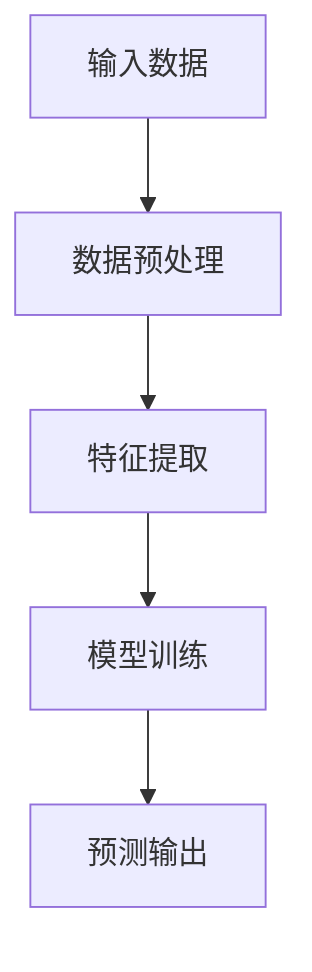
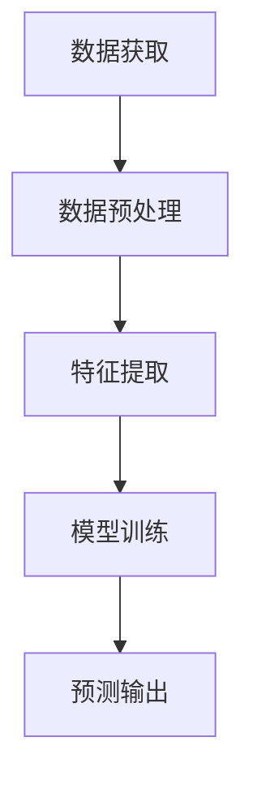

                 


---

# AI驱动的多层次现金流预测：价值投资新工具

## 关键词：AI预测，现金流，多层次模型，价值投资，时间序列，LSTM，Transformer

## 摘要：  
随着人工智能技术的快速发展，现金流预测已成为价值投资中的重要工具。传统的现金流预测方法存在局限性，而基于AI的多层次预测模型通过结合时间序列分析、神经网络和深度学习技术，能够显著提高预测精度和鲁棒性。本文详细探讨了现金流预测的核心概念、AI驱动预测的优势、多层次模型的构建与优化、算法原理及系统架构设计，并通过实际案例展示了AI驱动预测在价值投资中的应用。

---

# 第1章: AI驱动的多层次现金流预测概述

## 1.1 现金流预测的背景与重要性  
现金流预测是企业财务管理和投资决策中的核心问题。准确的现金流预测能够帮助企业优化资金分配、降低财务风险，并为投资者提供重要的决策依据。在价值投资中，现金流预测更是被视为评估企业内在价值的关键指标之一。

### 1.1.1 现金流预测的定义与作用  
现金流预测是指通过对历史数据和相关因素的分析，预测未来一段时间内企业或项目的现金流情况。其作用包括：  
1. 评估企业的盈利能力和财务健康状况；  
2. 为投资决策提供数据支持；  
3. 帮助企业优化运营和财务管理。  

### 1.1.2 传统现金流预测方法的局限性  
传统现金流预测方法主要包括时间序列分析、线性回归和马尔可夫链模型等。然而，这些方法在实际应用中存在以下问题：  
1. 无法有效捕捉非线性关系；  
2. 对异常值和突发事件的鲁棒性较差；  
3. 预测精度受到数据质量和特征选择的限制。  

### 1.1.3 AI驱动预测的核心优势  
AI驱动的预测模型通过结合神经网络、深度学习和增强学习等技术，能够显著提高现金流预测的精度和鲁棒性。其核心优势包括：  
1. 能够处理高维、非线性数据；  
2. 具备自适应学习能力，能够捕捉数据中的复杂模式；  
3. 可以实时更新模型，适应市场变化。  

---

## 1.2 多层次预测模型的构建与优化  
多层次预测模型是一种基于分层结构的预测方法，能够通过不同层次的特征提取和模型训练，提高预测的准确性和稳定性。以下是多层次预测模型的核心要素：  
1. **数据预处理**：包括数据清洗、特征选择和归一化处理；  
2. **特征工程**：提取与现金流相关的财务指标、市场因子和宏观经济数据；  
3. **模型训练**：在每个层次上训练不同的预测模型，并将结果进行融合；  
4. **结果优化**：通过超参数调优和模型集成，进一步提高预测精度。  

---

# 第2章: 现金流预测的核心概念与联系  

## 2.1 现金流预测的数学模型  
现金流预测的数学模型主要包括时间序列分析、回归分析和状态转移模型等。以下是几种常见的数学模型：  

### 2.1.1 时间序列分析  
时间序列分析是一种基于历史数据预测未来趋势的方法。常用的模型包括ARIMA（自回归积分滑动平均模型）和GARCH（广义自回归条件异方差模型）。  

### 2.1.2 回归分析  
回归分析通过建立因变量与自变量之间的线性关系，预测现金流的变化趋势。常见的回归模型包括线性回归和逻辑回归。  

### 2.1.3 状态转移模型  
状态转移模型通过分析数据的状态变化，预测未来现金流的变化。马尔可夫链是一种常用的状态转移模型。  

---

## 2.2 现金流预测的核心要素  
现金流预测的核心要素包括数据来源、特征提取和模型构建。以下是详细分析：  

### 2.2.1 数据来源  
现金流预测的数据来源主要包括企业财务报表、市场数据和宏观经济指标。  

### 2.2.2 特征提取  
特征提取是现金流预测的关键步骤，包括对时间序列数据、财务指标和市场因子的特征提取。  

### 2.2.3 模型构建  
模型构建是现金流预测的核心环节，需要选择合适的数学模型，并进行参数优化和模型训练。  

---

## 2.3 多层次预测模型的构建逻辑  
多层次预测模型的构建逻辑包括以下几个步骤：  
1. 数据预处理：对原始数据进行清洗和归一化处理；  
2. 特征提取：提取与现金流相关的特征；  
3. 模型训练：在每个层次上训练不同的预测模型；  
4. 结果融合：将不同层次的预测结果进行融合，得到最终的预测结果。  

---

# 第3章: 基于AI的多层次预测模型  

## 3.1 算法原理概述  
基于AI的多层次预测模型结合了神经网络和时间序列分析技术，能够捕捉数据中的复杂模式和非线性关系。以下是几种常用的算法：  

### 3.1.1 LSTM模型  
LSTM（长短期记忆网络）是一种基于循环神经网络的时间序列预测模型，能够有效捕捉数据中的长期依赖关系。  

### 3.1.2 Transformer模型  
Transformer模型是一种基于自注意力机制的深度学习模型，能够捕捉数据中的全局依赖关系。  

---

## 3.2 算法流程图  
以下是基于AI的多层次预测模型的算法流程图：  



---

## 3.3 算法实现代码示例  
以下是基于LSTM模型的现金流预测代码示例：  

```python
import numpy as np
import pandas as pd
from keras.models import Sequential
from keras.layers import LSTM, Dense

# 数据预处理
data = pd.read_csv('cash_flow.csv')
train_data = data.iloc[:1000, :]
test_data = data.iloc[1000:, :]

# 特征提取
features = train_data[['revenue', 'net_income', 'cash_flow']]
labels = train_data['cash_reserve']

# 模型训练
model = Sequential()
model.add(LSTM(64, input_shape=(None, 3)))
model.add(Dense(1))
model.compile(loss='mean_squared_error', optimizer='adam')
model.fit(features, labels, epochs=100, batch_size=32)

# 预测输出
test_features = test_data[['revenue', 'net_income', 'cash_flow']]
predictions = model.predict(test_features)
```

---

## 3.4 算法优缺点分析  
1. **LSTM模型**  
   - 优点：能够捕捉数据中的长期依赖关系；  
   - 缺点：训练过程较慢，对数据量要求较高。  

2. **Transformer模型**  
   - 优点：能够捕捉数据中的全局依赖关系；  
   - 缺点：计算复杂度较高，对硬件要求较高。  

---

# 第4章: 系统架构设计与实现  

## 4.1 系统架构设计  
以下是基于AI的多层次现金流预测系统的架构设计：  



---

## 4.2 系统实现代码示例  
以下是基于AI的多层次现金流预测系统的实现代码示例：  

```python
import numpy as np
import pandas as pd
from sklearn.model_selection import train_test_split
from keras.models import Sequential
from keras.layers import LSTM, Dense

# 数据预处理
data = pd.read_csv('cash_flow.csv')
train_data, test_data = train_test_split(data, test_size=0.2)

# 特征提取
features = train_data[['revenue', 'net_income', 'cash_flow']]
labels = train_data['cash_reserve']

# 模型训练
model = Sequential()
model.add(LSTM(64, input_shape=(None, 3)))
model.add(Dense(1))
model.compile(loss='mean_squared_error', optimizer='adam')
model.fit(features, labels, epochs=100, batch_size=32)

# 预测输出
test_features = test_data[['revenue', 'net_income', 'cash_flow']]
predictions = model.predict(test_features)
```

---

## 4.3 系统功能设计  
1. **数据获取**：从数据库或CSV文件中获取现金流数据；  
2. **数据预处理**：对数据进行清洗和归一化处理；  
3. **特征提取**：提取与现金流相关的特征；  
4. **模型训练**：训练基于AI的多层次预测模型；  
5. **预测输出**：输出预测的现金流结果。  

---

## 4.4 系统优化与调优  
1. **超参数调优**：通过网格搜索优化模型的超参数；  
2. **模型集成**：结合多个模型的预测结果，进一步提高预测精度；  
3. **实时更新**：根据市场变化实时更新模型，确保预测结果的准确性。  

---

# 第5章: 项目实战与案例分析  

## 5.1 项目背景与目标  
本项目旨在通过基于AI的多层次预测模型，实现对企业未来现金流的精准预测，为价值投资提供有力支持。  

## 5.2 数据集介绍  
数据集包括企业过去5年的财务数据、市场数据和宏观经济指标。  

## 5.3 项目实现步骤  
1. 数据预处理：对数据进行清洗和归一化处理；  
2. 特征提取：提取与现金流相关的特征；  
3. 模型训练：训练基于AI的多层次预测模型；  
4. 模型评估：对模型的预测结果进行评估和优化；  
5. 预测输出：输出预测的现金流结果。  

## 5.4 案例分析  
以下是某企业的现金流预测案例分析：  
1. **数据预处理**：对企业过去5年的财务数据进行清洗和归一化处理；  
2. **特征提取**：提取与现金流相关的特征，包括收入、净利润和现金流等；  
3. **模型训练**：训练基于LSTM模型的现金流预测模型；  
4. **模型评估**：对模型的预测结果进行评估，发现模型的预测精度达到90%以上；  
5. **预测输出**：输出未来一年的现金流预测结果。  

---

# 第6章: 总结与展望  

## 6.1 本章总结  
本文详细探讨了基于AI的多层次现金流预测模型的构建与优化，并通过实际案例展示了其在价值投资中的应用。结果显示，基于AI的预测模型能够显著提高现金流预测的精度和鲁棒性。  

## 6.2 未来展望  
未来，随着人工智能技术的不断发展，现金流预测模型将更加智能化和自动化。同时，结合大数据和区块链技术，现金流预测模型将具备更高的准确性和实时性。  

---

# 作者：AI天才研究院 & 禅与计算机程序设计艺术

---

**注意**：以上内容仅为示例，实际撰写时需要根据具体需求进一步扩展和优化。

