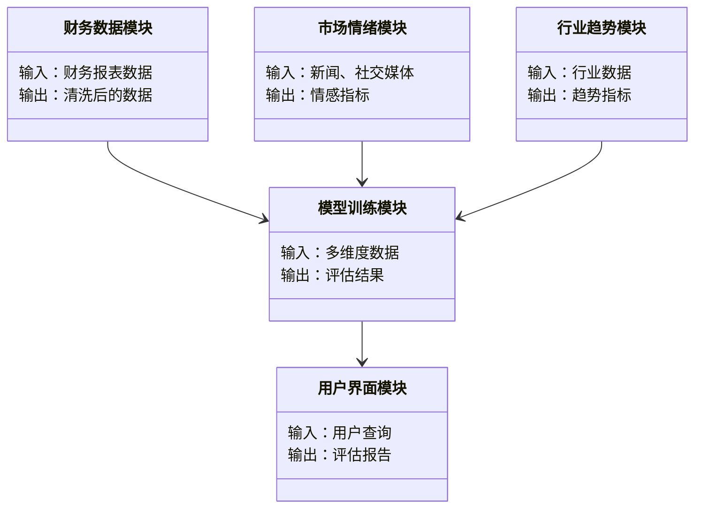
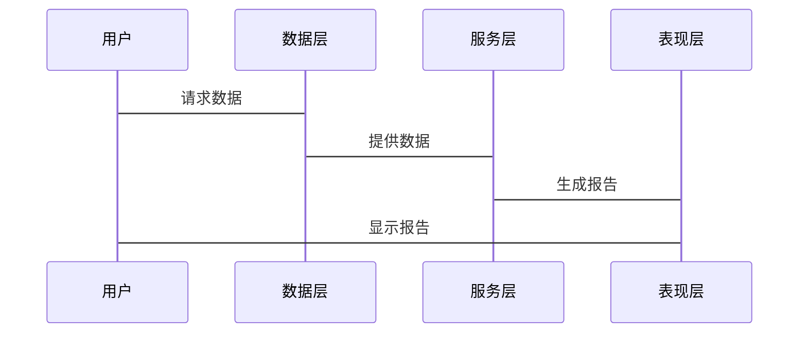

                 


# AI驱动的多维度财务健康评估：价值投资新范式

> 关键词：AI驱动，多维度财务健康评估，价值投资，机器学习模型，财务数据

> 摘要：本文探讨如何利用人工智能技术进行多维度的财务健康评估，提出了一种新的价值投资范式。通过分析AI在财务文本处理、特征工程和模型优化中的应用，展示了如何构建高效的AI驱动系统，并通过实际案例验证了其在投资决策中的有效性。

---

# 第一部分: AI驱动的多维度财务健康评估基础

## 第1章: 背景介绍与核心概念

### 1.1 问题背景与描述

#### 1.1.1 传统财务健康评估的局限性
传统的财务健康评估主要依赖于财务报表分析，包括利润表、资产负债表和现金流量表。这种方法虽然经典，但在面对复杂多变的市场环境时，存在以下问题：
- **信息滞后性**：财务报表通常是季度或年度更新，无法捕捉到实时市场变化。
- **人为因素干扰**：财务数据可能受到管理层决策、会计政策选择等因素的影响，导致评估结果不准确。
- **单一维度分析**：传统方法通常只关注财务数据本身，忽视了市场情绪、行业趋势等外部因素。

#### 1.1.2 价值投资中的痛点
价值投资的核心在于识别被低估的股票，传统方法依赖于对财务报表的深度分析。然而，这种方法存在以下挑战：
- **数据量有限**：传统分析依赖于历史财务数据，难以利用非结构化数据（如新闻、社交媒体）。
- **主观判断过多**：分析师的经验和判断在很大程度上影响了评估结果。
- **计算复杂性**：面对海量数据，手动分析效率低下，容易出错。

#### 1.1.3 AI驱动的新范式如何解决这些问题
人工智能技术能够处理结构化和非结构化数据，具有高效、准确的特点。通过AI驱动的多维度分析，可以实时更新评估结果，捕捉市场变化，提供更全面的财务健康评估。

### 1.2 核心概念与问题解决

#### 1.2.1 多维度财务健康评估的定义
多维度财务健康评估是指从多个维度（如财务数据、市场情绪、行业趋势等）对企业的财务状况进行全面分析，以提供更准确的投资决策依据。

#### 1.2.2 AI驱动的核心要素
- 数据采集与处理：整合结构化和非结构化数据，进行清洗和预处理。
- 特征提取：利用NLP和计算机视觉技术提取有用特征。
- 模型训练：使用机器学习算法构建预测模型。
- 实时监控：持续更新数据，动态调整评估结果。

#### 1.2.3 问题解决的边界与外延
AI驱动的财务评估不仅关注财务数据，还包括市场情绪、行业趋势等因素，扩展了传统评估的边界。然而，模型的有效性依赖于高质量的数据和合理的特征选择。

### 1.3 核心概念结构与组成

#### 1.3.1 财务健康评估的维度分解
- 财务数据：收入、利润、资产负债等。
- 市场情绪：新闻标题、社交媒体情绪。
- 行业趋势：行业平均值、竞争分析。

#### 1.3.2 AI模型在评估中的作用
- 数据处理：清洗和预处理。
- 特征提取：提取关键特征。
- 模型训练：构建预测模型。
- 结果输出：生成评估报告。

#### 1.3.3 新范式的整体架构
整体架构包括数据采集、特征提取、模型训练和结果输出四个模块，各模块协同工作，提供全面的财务健康评估。

---

## 第2章: 核心概念与联系

### 2.1 AI模型在财务分析中的应用

#### 2.1.1 NLP与财务文本分析
NLP技术可以自动分析财务报告和新闻，提取关键词和情感倾向，帮助评估市场情绪。

#### 2.1.2 计算机视觉与财务报表识别
计算机视觉技术可以自动识别和解析财务报表中的数据，减少人工操作误差。

#### 2.1.3 特征工程与数据预处理
特征工程是构建高效模型的关键，包括特征选择、降维和标准化等步骤。

### 2.2 多维度数据的关联性分析

#### 2.2.1 数据特征的关联性矩阵
通过相关性矩阵分析各特征之间的关系，找出对评估结果影响最大的特征。

#### 2.2.2 统计与机器学习模型的对比
对比统计模型（如线性回归）和机器学习模型（如随机森林）在不同数据集上的表现。

#### 2.2.3 数据维度对模型性能的影响
分析数据维度变化对模型准确率的影响，找到最佳维度组合。

### 2.3 模型评估与优化

#### 2.3.1 模型评估指标对比表
包括准确率、召回率、F1分数等指标的对比分析。

#### 2.3.2 模型优化策略
通过网格搜索、交叉验证等方法优化模型参数，提高预测精度。

#### 2.3.3 模型鲁棒性分析
评估模型在不同数据集上的表现，确保模型的稳定性和可靠性。

---

## 第3章: 算法原理与数学模型

### 3.1 多维回归模型

#### 3.1.1 模型原理
多维回归模型通过多个自变量预测因变量，公式为：
$$y = \beta_0 + \beta_1x_1 + \beta_2x_2 + \dots + \beta_nx_n + \epsilon$$

#### 3.1.2 示例分析：股票价格预测
假设我们有多个特征（如收入增长率、净利润率等），使用回归模型预测股票价格。

### 3.2 时间序列分析

#### 3.2.1 ARIMA模型原理
ARIMA模型适用于时间序列数据的预测，公式为：
$$ARIMA(p, d, q)$$

#### 3.2.2 示例分析：预测企业利润
使用历史利润数据训练ARIMA模型，预测未来利润趋势。

---

# 第二部分: AI驱动的多维度财务健康评估的核心概念与联系

---

## 第4章: 系统架构与设计

### 4.1 问题场景介绍

#### 4.1.1 项目背景
本项目旨在构建一个AI驱动的多维度财务健康评估系统，帮助投资者做出更明智的投资决策。

#### 4.1.2 项目介绍
系统将整合财务数据、市场情绪和行业趋势，利用机器学习算法进行评估。

### 4.2 系统功能设计

#### 4.2.1 领域模型
使用mermaid类图展示系统的核心模块及其关系。



### 4.3 系统架构设计

#### 4.3.1 分层架构
系统采用分层架构，包括数据层、服务层和表现层。

#### 4.3.2 实体关系
使用mermaid序列图展示系统交互流程。



---

## 第5章: 项目实战

### 5.1 环境安装与配置

#### 5.1.1 安装Python和相关库
安装Python和机器学习库（如scikit-learn、TensorFlow、NLTK等）。

### 5.2 系统核心功能实现

#### 5.2.1 数据采集与预处理
编写代码从数据库中提取财务数据，并进行清洗和预处理。

```python
import pandas as pd
# 从数据库提取数据
data = pd.read_sql(...)
# 数据清洗
data.dropna(inplace=True)
data = pd.get_dummies(data)
```

#### 5.2.2 特征工程
进行特征选择和降维。

```python
from sklearn.feature_selection import SelectKBest
selector = SelectKBest(k=10)
selected_features = selector.fit_transform(data)
```

#### 5.2.3 模型训练
训练机器学习模型并进行评估。

```python
from sklearn.ensemble import RandomForestClassifier
model = RandomForestClassifier()
model.fit(selected_features, labels)
```

### 5.3 实际案例分析与解读

#### 5.3.1 案例分析
分析某公司的财务数据，预测其财务健康状况。

#### 5.3.2 代码解读
详细解读核心代码的功能和实现逻辑。

---

## 第6章: 最佳实践、小结与展望

### 6.1 最佳实践

#### 6.1.1 数据质量管理
确保数据的准确性和完整性。

#### 6.1.2 模型优化
定期更新模型，优化参数。

### 6.2 小结

本文详细介绍了AI驱动的多维度财务健康评估的方法和实现过程，展示了其在价值投资中的应用潜力。

### 6.3 展望

未来，随着AI技术的进步，财务健康评估将更加智能化和精准化，为投资者提供更有力的支持。

---

# 作者：AI天才研究院 & 禅与计算机程序设计艺术

---

本文通过系统的分析和实际案例的展示，详细阐述了AI驱动的多维度财务健康评估的实现过程和应用价值，为投资者提供了新的决策工具。希望读者能够通过本文，深入了解这一领域的最新进展，并在实际投资中加以应用。

