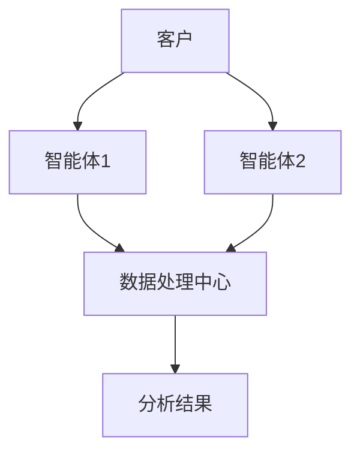
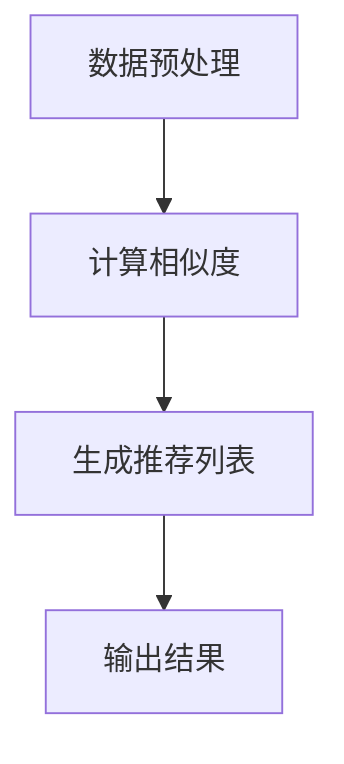
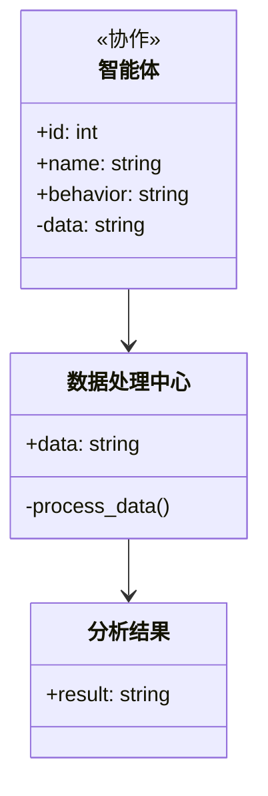
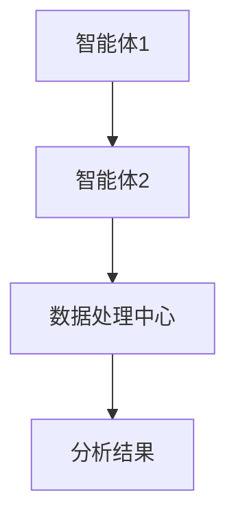

                 


# AI驱动的客户忠诚度分析：价值投资中的多智能体应用

## 关键词：人工智能，客户忠诚度，多智能体系统，机器学习，客户分析

## 摘要：  
在当前商业环境中，客户忠诚度是企业成功的关键因素之一。传统的客户忠诚度分析方法逐渐暴露出效率低下和精度不足的问题。随着人工智能技术的飞速发展，AI驱动的客户忠诚度分析正在成为企业提升客户价值的核心竞争力。本文将深入探讨AI在客户忠诚度分析中的应用，特别是在价值投资中的多智能体系统应用。通过分析客户忠诚度的核心概念、AI算法的原理、多智能体系统的架构设计以及实际案例，本文旨在为企业提供一种高效、精准的客户忠诚度分析方法，从而在价值投资中获得更大的竞争优势。

---

## 第一部分：AI驱动的客户忠诚度分析基础

### 第1章：客户忠诚度分析概述

#### 1.1 客户忠诚度的定义与重要性
客户忠诚度是指客户对企业产品或服务的持续购买和使用意愿。它不仅体现在客户的重复购买行为上，还包括客户对企业的情感依赖和品牌认同。客户忠诚度高的客户通常具有较高的生命周期价值，为企业创造更多的收入和利润。

客户忠诚度的重要性体现在以下几个方面：
1. **客户忠诚度与企业收入增长**：忠诚客户通常会为企业带来更多的订单和更高的消费金额。
2. **降低客户获取成本**：相比于获取新客户，维护现有客户的成本更低。
3. **提升企业竞争力**：忠诚客户更可能推荐企业的产品或服务给他人，从而帮助企业扩大市场份额。

#### 1.2 传统客户忠诚度分析方法
传统的客户忠诚度分析方法主要包括以下几种：
1. **基于问卷调查的分析**：通过客户满意度调查了解客户对产品或服务的满意程度。
2. **基于交易数据的分析**：通过分析客户的购买记录，计算客户的购买频率和购买金额。
3. **基于客户生命周期的分析**：通过客户生命周期模型预测客户的生命周期价值。

然而，传统的分析方法存在以下问题：
1. 数据量有限，难以捕捉客户行为的复杂性。
2. 分析结果缺乏实时性，难以及时指导企业的决策。
3. 方法单一，难以应对客户行为的多样性。

#### 1.3 AI驱动的客户忠诚度分析的优势
人工智能技术的引入为客户忠诚度分析带来了新的可能性。AI可以通过以下方式提升客户忠诚度分析的效率和准确性：
1. **数据处理能力**：AI能够处理海量的非结构化数据（如文本、图像等），并从中提取有价值的信息。
2. **预测能力**：通过机器学习算法，AI可以预测客户的忠诚度水平，并提供个性化推荐。
3. **实时性**：AI系统可以实时分析客户行为数据，及时发现客户流失的潜在风险。

---

### 第2章：多智能体系统概述

#### 2.1 多智能体系统的基本概念
多智能体系统（Multi-Agent System, MAS）是由多个智能体组成的分布式系统，每个智能体都是一个能够感知环境、自主决策的实体。多智能体系统具有以下特点：
1. **分布式**：智能体之间通过通信和协作完成任务。
2. **自主性**：每个智能体都能够自主决策。
3. **协作性**：智能体之间可以协作完成复杂任务。

#### 2.2 多智能体系统的核心原理
多智能体系统的核心原理包括以下几个方面：
1. **分布式智能**：通过多个智能体的协作，实现整体的智能行为。
2. **协作与竞争**：智能体之间可以协作完成任务，也可以通过竞争优化系统性能。
3. **自适应与学习**：智能体能够通过学习和适应环境变化，提升系统的整体性能。

#### 2.3 多智能体系统的应用场景
多智能体系统在多个领域都有广泛的应用，以下是几个典型场景：
1. **金融领域**：通过多智能体系统分析客户行为，预测客户忠诚度。
2. **物流领域**：通过多智能体系统优化物流路径，提高效率。
3. **游戏领域**：通过多智能体系统实现游戏AI的智能化。

---

## 第二部分：客户忠诚度分析的核心概念与联系

### 第3章：客户忠诚度分析的核心概念与联系

#### 3.1 客户忠诚度分析的核心要素
客户忠诚度分析的核心要素包括以下几点：
1. **客户生命周期价值（Customer Lifetime Value, CLV）**：客户在生命周期内为企业带来的总收入减去获取和维护客户所产生的成本。
2. **客户满意度（Customer Satisfaction, CS）**：客户对产品或服务的满意程度。
3. **客户保留率（Customer Retention Rate）**：客户在一定时间内继续使用企业产品或服务的比例。

#### 3.2 多智能体系统与客户忠诚度分析的关系
多智能体系统在客户忠诚度分析中的作用主要体现在以下几个方面：
1. **数据收集与分析**：多智能体系统可以通过分布式智能体收集客户行为数据，并通过协作分析提升数据处理效率。
2. **预测与推荐**：通过多智能体系统的协作，可以更准确地预测客户忠诚度，并为客户提供个性化推荐。
3. **实时监控**：多智能体系统可以实时监控客户行为，及时发现客户流失风险。

#### 3.3 实体关系图与多智能体系统架构
以下是客户忠诚度分析中的实体关系图和多智能体系统架构图：

```mermaid
er
    actor 客户
    actor 企业
    actor 智能体
    customer 表
    customer Loyalty 表
    contains 关系
```



---

## 第三部分：客户忠诚度分析的算法原理

### 第4章：客户忠诚度分析的算法原理

#### 4.1 常见的客户忠诚度分析算法
1. **协同过滤算法（Collaborative Filtering）**：通过分析客户的购买行为，找到与目标客户具有相似购买行为的客户群体，从而预测目标客户的忠诚度。
2. **聚类分析算法（Clustering Analysis）**：通过将客户分为不同的群组，分析每个群组的忠诚度特征。
3. **神经网络算法（Neural Networks）**：通过深度学习模型，分析客户的复杂行为模式，预测客户忠诚度。

#### 4.2 多智能体系统的算法实现
以下是协同过滤算法的实现步骤：



以下是一个简单的协同过滤算法实现代码示例：

```python
def compute_similarity(matrix):
    # 计算相似度矩阵
    pass

def collaborative_filtering(matrix, user_id):
    # 实现协同过滤算法
    pass

# 示例数据矩阵
matrix = [[1, 2, 3],
          [4, 5, 6],
          [7, 8, 9]]
user_id = 0
result = collaborative_filtering(matrix, user_id)
print(result)
```

#### 4.3 数学公式
以下是协同过滤算法中常用的数学公式：

$$\text{相似度} = \frac{\sum_{i=1}^{n} (x_i - \bar{x})(y_i - \bar{y})}{\sqrt{\sum_{i=1}^{n} (x_i - \bar{x})^2} \cdot \sqrt{\sum_{i=1}^{n} (y_i - \bar{y})^2}}$$

其中：
- $x_i$ 和 $y_i$ 分别表示两个客户的第$i$个行为特征。
- $\bar{x}$ 和 $\bar{y}$ 分别表示$x$和$y$的平均值。

---

## 第四部分：系统分析与架构设计方案

### 第5章：系统分析与架构设计方案

#### 5.1 问题场景介绍
在价值投资中，企业需要通过分析客户的忠诚度，预测客户的行为，并制定相应的策略。然而，传统的分析方法难以满足实时性和精准性的要求。

#### 5.2 项目介绍
本项目旨在通过构建一个多智能体系统，实现客户忠诚度的实时分析和预测。

#### 5.3 系统功能设计
以下是系统的功能模块设计：



#### 5.4 系统架构设计
以下是系统的架构设计图：



#### 5.5 系统接口设计
系统接口设计主要包含以下几个部分：
1. **数据输入接口**：接收客户的交易数据和行为数据。
2. **数据处理接口**：对数据进行清洗和预处理。
3. **模型预测接口**：通过机器学习模型预测客户忠诚度。
4. **结果输出接口**：将分析结果输出给企业决策者。

---

## 第五部分：项目实战

### 第6章：项目实战

#### 6.1 环境安装
以下是项目所需的环境和工具：
1. Python 3.8及以上版本
2. TensorFlow 2.0及以上版本
3. scikit-learn 0.20及以上版本

#### 6.2 系统核心实现源代码
以下是客户忠诚度预测模型的实现代码示例：

```python
import numpy as np
from sklearn.metrics.pairwise import cosine_similarity

def compute_similarity(matrix):
    return cosine_similarity(matrix)

def collaborative_filtering(matrix, user_id):
    similarity = compute_similarity(matrix)
    user_similarities = similarity[user_id]
    return user_similarities

# 示例数据矩阵
matrix = np.array([[1, 2, 3],
                   [4, 5, 6],
                   [7, 8, 9]])
user_id = 0
result = collaborative_filtering(matrix, user_id)
print(result)
```

#### 6.3 实际案例分析
以下是实际案例分析的步骤：
1. 数据收集：收集客户的交易数据和行为数据。
2. 数据预处理：清洗数据，提取特征。
3. 模型训练：通过协同过滤算法训练模型。
4. 模型预测：预测客户的忠诚度。
5. 结果分析：分析预测结果，制定相应的策略。

---

## 第六部分：总结与展望

### 第7章：总结与展望

#### 7.1 总结
本文详细介绍了AI驱动的客户忠诚度分析在价值投资中的多智能体应用。通过分析客户忠诚度的核心概念、AI算法的原理、多智能体系统的架构设计以及实际案例，本文为企业的客户忠诚度分析提供了新的思路和方法。

#### 7.2 未来展望
未来，随着AI技术的不断发展，客户忠诚度分析将更加智能化和个性化。多智能体系统将在客户忠诚度分析中发挥更大的作用，帮助企业实现更精准的客户管理和价值投资。

#### 7.3 最佳实践 tips
1. 在实际应用中，企业应根据自身的业务需求选择合适的AI算法。
2. 数据安全和隐私保护是AI系统设计中的重要考虑因素。
3. 模型的可解释性和实时性是提升客户忠诚度分析效果的关键。

---

## 作者：AI天才研究院/AI Genius Institute & 禅与计算机程序设计艺术 /Zen And The Art of Computer Programming

