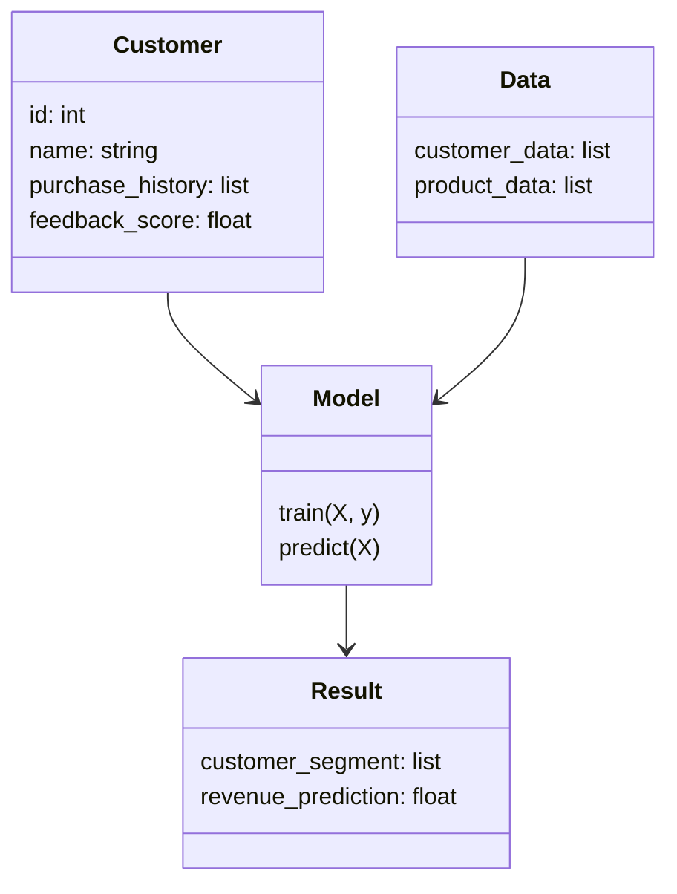

                 


# AI驱动的客户粘性分析：评估公司的长期收入质量

## 关键词：客户粘性，AI分析，长期收入，质量评估，机器学习

## 摘要：  
在当今竞争激烈的市场环境中，客户粘性是衡量企业长期收入质量的重要指标。本文将从AI驱动的客户粘性分析入手，探讨如何利用人工智能技术评估和优化客户粘性，从而为企业提供长期收入质量的评估方法。通过分析客户行为数据、构建预测模型以及设计合理的客户管理策略，企业可以更好地理解和提升客户粘性，确保长期收入的稳定性。

---

# 第一部分：AI驱动的客户粘性分析基础

## 第1章：客户粘性分析概述

### 1.1 客户粘性的定义与重要性  
客户粘性是指客户对企业产品或服务的依赖程度，是客户在多次购买或使用后仍然选择该品牌的能力。它不仅反映了客户对品牌的忠诚度，还直接关系到企业的长期收入质量。  

#### 1.1.1 客户粘性的定义  
客户粘性可以分为以下几种类型：  
- **情感粘性**：客户对企业的情感认同和品牌忠诚度。  
- **惯性粘性**：客户由于习惯或惰性而选择继续使用某产品或服务。  
- **价值粘性**：客户认为企业的产品或服务提供了独特的价值，难以被替代。  

#### 1.1.2 客户粘性对企业的影响  
客户粘性高的企业通常具有以下优势：  
1. **收入稳定性**：高粘性客户更可能成为长期客户，为企业提供稳定的收入来源。  
2. **成本降低**：获取新客户的成本通常高于维护现有客户，高粘性客户有助于降低整体成本。  
3. **市场竞争力**：高客户粘性意味着企业能够更好地抵御市场竞争，吸引并留住客户。  

#### 1.1.3 AI在客户粘性分析中的作用  
AI技术可以通过分析客户的消费行为、反馈数据和市场趋势，帮助企业更精准地预测客户粘性，制定有效的客户管理策略。  

---

### 1.2 长期收入质量的评估标准  
长期收入质量是企业盈利能力的重要指标，而客户粘性是影响长期收入质量的核心因素之一。  

#### 1.2.1 收入质量的核心指标  
- **客户留存率**：客户在一定时间内继续使用企业产品或服务的比例。  
- **客户生命周期价值（CLV）**：客户在生命周期内为企业带来的总收入。  
- **客户满意度**：客户对产品或服务的满意程度，直接影响客户粘性。  

#### 1.2.2 客户粘性与收入质量的关系  
客户粘性高的企业通常具有更高的客户留存率和客户生命周期价值，从而能够实现更稳定的长期收入。  

#### 1.2.3 企业长期收入的预测模型  
企业可以通过以下步骤构建长期收入预测模型：  
1. 收集客户数据，包括消费记录、反馈评分、行为数据等。  
2. 利用AI算法（如随机森林、XGBoost）对客户粘性进行预测。  
3. 结合客户生命周期价值模型，预测企业的长期收入。  

---

## 第2章：客户粘性分析的核心概念  

### 2.1 客户行为分析  
客户行为分析是理解客户粘性的关键。通过分析客户的购买频率、金额、时间等行为数据，企业可以识别高粘性客户和低粘性客户。  

#### 2.1.1 客户行为的分类  
- **购买频率**：客户在一定时间内的购买次数。  
- **购买金额**：每次购买的平均金额。  
- **购买时间**：客户购买的时间分布，如季节性波动。  

#### 2.1.2 客户行为数据的收集与处理  
数据收集渠道包括：  
- **CRM系统**：记录客户的购买记录和互动数据。  
- **在线行为跟踪**：通过网站或App记录客户的浏览、点击和购买行为。  
- **问卷调查**：通过问卷收集客户反馈和满意度数据。  

#### 2.1.3 客户行为分析的常见方法  
1. **聚类分析**：将客户分为不同的群体，识别高粘性客户群体。  
2. **关联规则挖掘**：分析客户的购买行为，发现购买模式。  

---

### 2.2 客户价值评估  
客户价值评估是衡量客户粘性的关键指标。通过评估客户的价值，企业可以制定差异化的客户管理策略。  

#### 2.2.1 客户价值的定义与衡量标准  
客户价值可以分为以下几类：  
- **低价值客户**：消费频率低，金额小。  
- **中价值客户**：消费频率和金额适中。  
- **高价值客户**：消费频率高，金额大，粘性高。  

#### 2.2.2 客户生命周期模型  
客户生命周期模型帮助企业理解客户在不同阶段的行为特征，从而制定针对性的营销策略。  

#### 2.2.3 客户价值与收入质量的关系  
高价值客户通常具有较高的粘性，为企业带来更高的收入和利润。  

---

### 2.3 AI驱动的客户粘性分析模型  

#### 2.3.1 模型的核心要素  
AI驱动的客户粘性分析模型通常包括以下要素：  
- **输入数据**：客户行为数据、产品数据、市场数据等。  
- **算法选择**：如随机森林、XGBoost、神经网络等。  
- **模型输出**：客户粘性评分、客户分类、收入预测等。  

#### 2.3.2 模型的输入与输出  
- **输入**：客户的行为数据、产品属性、市场环境数据。  
- **输出**：客户粘性评分、客户生命周期预测、收入预测。  

#### 2.3.3 模型的优缺点对比  
| 特性       | 优点                              | 缺点                              |
|------------|-----------------------------------|-----------------------------------|
| 简单性     | 算法简单，易于实现                | 预测精度可能有限                  |
| 精度       | 高精度算法（如XGBoost）预测能力强 | 需大量数据支持                   |
| 可解释性   | 线性回归模型易于解释              | 非线性模型（如神经网络）可解释性差 |

---

## 第3章：客户粘性分析的算法原理  

### 3.1 聚类分析  

#### 3.1.1 聚类分析的基本原理  
聚类分析是一种无监督学习方法，通过将客户分成不同的群体，识别高粘性客户群体。  

#### 3.1.2 K-means算法的实现  
K-means算法是一种常用的聚类算法，具体步骤如下：  
1. 初始化：随机选择K个聚类中心。  
2. 分配：将每个客户分配到最近的聚类中心。  
3. 更新：计算每个聚类的新的中心。  
4. 重复步骤2和3，直到聚类中心不再变化。  

```python
from sklearn.cluster import KMeans
import numpy as np

# 示例数据
X = np.array([[1, 2], [5, 8], [10, 15], [12, 17], [20, 25]])

# 初始化K-means模型
kmeans = KMeans(n_clusters=2, random_state=0)
# 模型训练
kmeans.fit(X)
# 获取聚类结果
labels = kmeans.labels_
print(labels)
```

---

### 3.2 回归分析  

#### 3.2.1 线性回归的基本原理  
线性回归是一种监督学习方法，用于预测客户粘性评分。  

#### 3.2.2 逻辑回归的应用  
逻辑回归适用于二分类问题，可以用于预测客户是否为高粘性客户。  

#### 3.2.3 回归分析在客户粘性预测中的应用  
通过回归分析，企业可以预测客户粘性评分，并制定针对性的营销策略。  

---

## 第4章：数学模型与公式  

### 4.1 客户粘性概率模型  

#### 4.1.1 概率论基础  
概率论是构建客户粘性模型的基础，常用公式包括：  
$$ P(A) = \frac{\text{事件A发生的次数}}{\text{总次数}} $$  

#### 4.1.2 客户粘性概率公式  
客户粘性概率公式可以表示为：  
$$ P(\text{粘性}) = \frac{\text{高粘性客户的数量}}{\text{总客户数量}} $$  

---

## 第5章：系统分析与架构设计  

### 5.1 项目背景与目标  

#### 5.1.1 项目背景介绍  
本项目旨在通过AI技术分析客户粘性，帮助企业评估长期收入质量。  

#### 5.1.2 项目目标与范围  
- **目标**：构建客户粘性分析模型，预测客户粘性评分。  
- **范围**：包括数据收集、模型训练、结果分析等。  

---

### 5.2 系统功能设计  

#### 5.2.1 领域模型类图  


---

## 第6章：项目实战  

### 6.1 环境安装与配置  

#### 6.1.1 开发环境的选择  
建议使用Python 3.8及以上版本，安装必要的库：  
- scikit-learn  
- pandas  
- numpy  

---

### 6.2 系统核心实现  

#### 6.2.1 代码实现示例  
```python
import pandas as pd
from sklearn.ensemble import RandomForestClassifier
from sklearn.metrics import accuracy_score

# 数据加载
data = pd.read_csv('customer_data.csv')

# 特征工程
X = data[['purchase_frequency', 'purchase_amount', 'feedback_score']]
y = data['is_high_sticky']

# 模型训练
model = RandomForestClassifier(n_estimators=100, random_state=0)
model.fit(X, y)

# 预测
predicted = model.predict(X)
print("准确率:", accuracy_score(y, predicted))
```

---

## 作者：AI天才研究院 & 禅与计算机程序设计艺术

