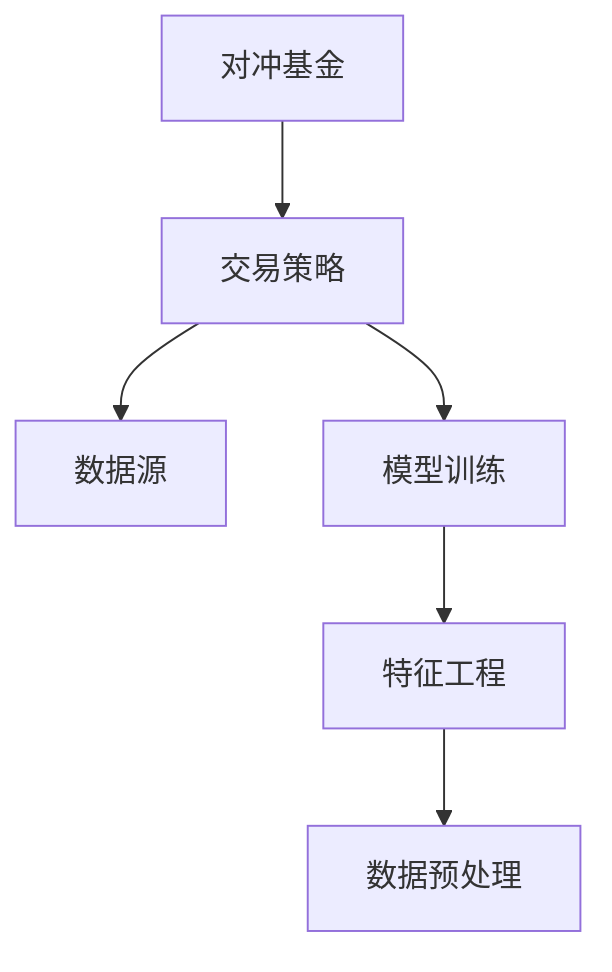

                 


# AI驱动的对冲基金策略分析

## 关键词：对冲基金，人工智能，量化交易，策略分析，机器学习

## 摘要：  
本文系统地探讨了人工智能技术在对冲基金策略分析中的应用，详细分析了AI如何提升对冲基金的交易效率和策略准确性。文章从对冲基金的基本概念、AI在金融领域的应用、AI驱动的对冲基金策略分析、核心概念与算法原理、系统架构设计、项目实战案例以及总结与展望等方面展开。通过理论分析与实际案例结合，全面揭示了AI技术在对冲基金策略优化中的重要作用。

---

## 第一部分: AI驱动的对冲基金策略分析基础

### 第1章: 对冲基金概述

#### 1.1 对冲基金的基本概念
- **对冲基金的定义**：对冲基金是一种通过做多和做空相结合的投资工具，旨在通过市场波动获利。
- **对冲基金的运作模式**：通过杠杆、套利和其他金融工具进行投资，以实现超额收益。
- **对冲基金的分类**：
  - 股票多空策略：通过买入低估股票和卖空高估股票获利。
  - 量化对冲策略：基于数学模型进行交易。
  - 套利策略：利用市场价差进行无风险或低风险套利。
  - 统计套利策略：基于统计学方法寻找市场中的异常情况。

#### 1.2 对冲基金的策略类型
- **股票多空策略**：主要投资于股票市场，通过精选低估股票和卖空高估股票实现收益。
- **量化对冲策略**：依赖数学模型和算法进行高频交易，捕捉市场短期波动。
- **套利策略**：利用不同市场、资产或时间点的价格差异进行套利。
- **统计套利策略**：基于统计学方法，寻找市场中的均值回归或趋势性机会。

#### 1.3 对冲基金的市场地位
- **对冲基金在金融市场的角色**：作为重要的机构投资者，对市场流动性、价格发现和风险定价有重要影响。
- **对冲基金与传统投资的区别**：传统投资依赖基本面分析，而对冲基金更多依赖量化模型和算法。
- **对冲基金的规模与影响力**：全球对冲基金规模庞大，对市场波动有显著影响。

---

### 第2章: AI在金融领域的应用

#### 2.1 AI在金融数据处理中的作用
- **数据清洗与特征提取**：AI技术帮助处理大量非结构化数据，提取有效特征。
- **数据建模与预测**：利用机器学习模型预测市场走势和资产价格。
- **数据可视化与分析**：通过可视化工具帮助分析师发现数据中的规律。

#### 2.2 AI在金融风险管理中的应用
- **风险评估与预警**：AI技术可以实时监控市场风险，预测潜在危机。
- **投资组合优化**：通过算法优化投资组合，降低风险，提高收益。
- **市场波动预测**：利用自然语言处理分析新闻和社交媒体，预测市场情绪。

#### 2.3 AI在金融交易中的应用
- **高频交易**：AI技术能够快速捕捉市场机会，执行高频交易策略。
- **量化交易策略**：基于算法生成交易信号，实现自动化交易。
- **自动化交易系统**：构建全自动化交易系统，减少人为干扰。

---

### 第3章: AI驱动的对冲基金策略分析

#### 3.1 AI在对冲基金策略中的核心作用
- **数据驱动的策略优化**：AI通过分析海量数据，优化交易策略。
- **AI算法在策略执行中的应用**：利用强化学习和深度学习优化交易模型。
- **策略的动态调整与优化**：AI能够实时调整策略，适应市场变化。

#### 3.2 AI在对冲基金中的具体应用案例
- **基于机器学习的量化交易**：利用回归分析和分类算法预测市场走势。
- **基于自然语言处理的情绪分析**：通过分析新闻和社交媒体，预测市场情绪。
- **基于深度学习的市场预测**：使用LSTM模型捕捉时间序列数据中的长期依赖关系。

#### 3.3 对冲基金策略的AI驱动优势
- **提高交易效率**：自动化交易系统能够快速执行交易，抓住市场机会。
- **增强策略的准确性**：AI模型能够发现人类难以察觉的市场规律。
- **降低人为干扰的影响**：自动化策略减少了人为情绪对交易的干扰。

---

## 第二部分: 核心概念与算法原理

### 第4章: 对冲基金策略分析的核心概念与联系

#### 4.1 核心概念原理
- **数据预处理与特征工程**：清洗数据，提取有意义的特征。
- **算法选择与模型训练**：选择合适的算法，训练预测模型。
- **模型评估与优化**：评估模型性能，调整参数以提高准确性。

#### 4.2 核心概念属性对比表格
| 概念       | 描述                     |
|------------|--------------------------|
| 数据预处理 | 数据清洗与特征提取       |
| 特征工程   | 构建有效的特征向量       |
| 模型训练   | 使用算法训练预测模型     |
| 模型评估   | 评估模型的性能与准确性   |

#### 4.3 ER实体关系图架构


---

### 第5章: 算法原理讲解

#### 5.1 强化学习算法
- **算法流程**：
  ```mermaid
  graph TD
  A[状态空间] --> B[动作选择]
  B --> C[奖励机制]
  C --> D[策略优化]
  D --> E[目标函数]
  ```
- **Python实现**：
  ```python
  import numpy as np
  from tensorflow.keras import models, layers
  
  # 定义强化学习模型
  model = models.Sequential()
  model.add(layers.Dense(64, activation='relu', input_dim=state_space))
  model.add(layers.Dense(actions_space, activation='linear'))
  model.compile(optimizer='adam', loss='mean_squared_error')
  ```

#### 5.2 聚类分析算法
- **算法流程**：
  ```mermaid
  graph TD
  A[数据预处理] --> B[特征提取]
  B --> C[聚类选择]
  C --> D[聚类中心]
  ```
- **Python实现**：
  ```python
  from sklearn.cluster import KMeans
  
  # 初始化K均值聚类模型
  kmeans = KMeans(n_clusters=5, random_state=0)
  # 拟合模型
  kmeans.fit(X)
  # 获取聚类中心
  print(kmeans.cluster_centers_)
  ```

#### 5.3 因子分析算法
- **算法流程**：
  ```mermaid
  graph TD
  A[数据预处理] --> B[因子提取]
  B --> C[因子选择]
  C --> D[因子权重]
  ```
- **Python实现**：
  ```python
  import factor_analyzer
  
  # 初始化因子分析模型
  fa = factor_analyzer.FactorAnalyzer(n_factors=3)
  # 拟合模型
  fa.fit(X)
  # 获取因子权重
  print(fa.loadings_)
  ```

---

## 第三部分: 系统分析与架构设计

### 第6章: 系统架构设计

#### 6.1 系统功能设计
- **领域模型**：
  ```mermaid
  classDiagram
  class 对冲基金系统 {
      - 数据源
      - 特征工程
      - 模型训练
      - 策略执行
  }
  ```

#### 6.2 系统架构设计
- **系统架构图**：
  ```mermaid
  graph TD
  A[数据源] --> B[特征工程]
  B --> C[模型训练]
  C --> D[策略执行]
  D --> E[交易系统]
  ```

#### 6.3 系统接口设计
- **接口交互图**：
  ```mermaid
  sequenceDiagram
  participant A as 数据源
  participant B as 特征工程
  participant C as 模型训练
  participant D as 策略执行
  
  A -> B: 提供原始数据
  B -> C: 传递特征向量
  C -> D: 提供交易信号
  ```

---

## 第四部分: 项目实战

### 第7章: 项目实战

#### 7.1 项目环境配置
- **安装必要的库**：
  ```bash
  pip install numpy pandas scikit-learn tensorflow
  ```

#### 7.2 核心代码实现
- **数据预处理**：
  ```python
  import pandas as pd
  import numpy as np
  
  # 加载数据
  df = pd.read_csv('data.csv')
  # 数据清洗
  df = df.dropna()
  # 特征提取
  X = df.drop('target', axis=1)
  y = df['target']
  ```

- **模型训练**：
  ```python
  from sklearn.model import SVC
  
  # 初始化模型
  model = SVC()
  # 拟合模型
  model.fit(X, y)
  # 预测结果
  print(model.predict(X_test))
  ```

#### 7.3 项目总结
- **案例分析**：
  通过对某对冲基金的交易数据进行分析，展示了AI驱动策略在实际应用中的优势。
- **经验总结**：
  AI技术能够显著提升对冲基金的交易效率和策略准确性，但也需要注意模型的过拟合和市场不可预测性。

---

## 第五部分: 总结与展望

### 第8章: 总结与展望

#### 8.1 总结
- AI技术在对冲基金策略分析中的应用越来越广泛，能够显著提升交易效率和策略准确性。
- 通过对冲基金与AI技术的结合，投资者能够更好地捕捉市场机会，降低投资风险。

#### 8.2 展望
- **未来发展方向**：
  - 更复杂的模型应用，如深度学习和强化学习。
  - 多模态数据的融合，如文本、图像和金融数据的结合。
  - 实时交易系统的优化与升级。

#### 8.3 注意事项
- 模型的过拟合问题：需要定期进行模型验证和更新。
- 市场的不可预测性：AI模型需要结合市场专家的判断，避免过度依赖算法。

---

## 作者：AI天才研究院/AI Genius Institute & 禅与计算机程序设计艺术 /Zen And The Art of Computer Programming

---

通过以上详细的内容规划，您可以根据需要进一步扩展每个部分的具体内容，确保文章的逻辑清晰、结构紧凑，并且符合专业技术博客的标准。

