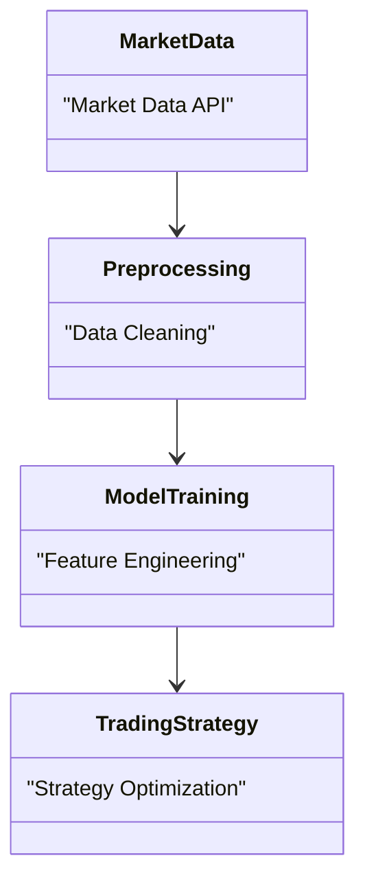
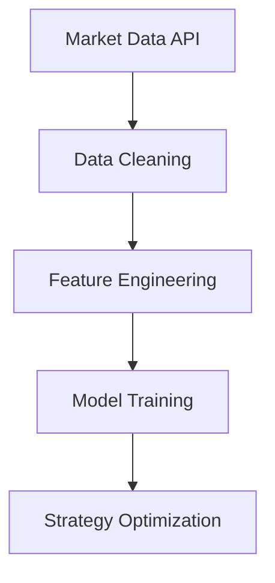

                 


# AI驱动的市场流动性分析：优化交易策略

**关键词**：AI、市场流动性、交易策略、机器学习、深度学习

**摘要**：本文探讨了人工智能（AI）在市场流动性分析中的应用，详细介绍了如何利用AI技术优化交易策略。通过分析市场流动性分析的核心概念、AI驱动的分析方法、算法原理、系统设计与实现，以及实际案例，本文为读者提供了从理论到实践的全面指导。文章还总结了AI在市场流动性分析中的优势与挑战，并展望了未来的发展方向。

---

# 引言

## 背景介绍

### 市场流动性分析的重要性
市场流动性是指资产在短时间内以合理价格买卖的能力。流动性分析是金融市场中的核心问题，直接影响交易策略的制定和执行。传统的流动性分析方法基于统计学和经济学理论，但随着市场的复杂化和高频交易的普及，传统方法的局限性逐渐显现。

### AI技术在金融市场的应用
人工智能技术的快速发展为金融市场分析提供了新的工具。通过机器学习、深度学习等技术，AI能够处理海量数据，发现复杂模式，从而优化交易策略。本文将重点探讨AI在市场流动性分析中的应用，特别是在优化交易策略方面的作用。

### 问题描述与解决
传统流动性分析方法依赖于经验和统计模型，难以应对高频交易和非线性市场变化。AI技术通过数据驱动的方法，能够实时捕捉市场波动，预测流动性变化，从而优化交易策略。本文将详细分析AI驱动的市场流动性分析方法及其优化交易策略的应用。

---

# 第1章：AI与金融市场概述

## 1.1 市场流动性分析的基本概念

### 1.1.1 什么是市场流动性
市场流动性是指资产在短时间内以合理价格买卖的能力。流动性好的资产具有低买卖价差和高交易量的特点。流动性分析的核心在于衡量资产的买卖难易程度。

### 1.1.2 市场流动性的重要性
流动性是金融市场运行的基础。高流动性市场能够快速匹配买卖双方的需求，降低交易成本。流动性不足可能导致市场波动加剧，影响市场稳定性。

### 1.1.3 市场流动性分析的核心要素
市场流动性分析的核心要素包括：
- **买卖价差**：买卖价格之间的差异。
- **交易量**：一定时间内交易的资产数量。
- **深度**：市场在价格变动时的承受能力。
- **波动性**：价格的短期波动程度。

## 1.2 AI技术在金融市场的应用

### 1.2.1 AI在金融分析中的作用
AI技术通过处理海量数据，识别复杂模式，为金融分析提供新的工具。例如，自然语言处理（NLP）可以分析新闻和社交媒体情绪，预测市场走势。

### 1.2.2 AI如何优化交易策略
AI可以通过以下方式优化交易策略：
- **预测流动性变化**：利用机器学习模型预测市场流动性波动。
- **实时调整策略**：根据市场变化动态调整交易策略。
- **风险控制**：通过AI技术识别市场风险，优化投资组合。

### 1.2.3 市场流动性分析中的AI驱动方法
AI驱动的市场流动性分析方法包括：
- **机器学习模型**：如支持向量机（SVM）和随机森林（Random Forest）。
- **深度学习模型**：如长短期记忆网络（LSTM）。
- **强化学习**：通过模拟交易环境优化策略。

---

# 第2章：市场流动性分析的核心概念

## 2.1 市场流动性分析的基本原理

### 2.1.1 流动性分析的定义与目标
流动性分析的目标是预测市场流动性变化，为交易策略提供支持。传统方法依赖于统计分析和经济学理论，但难以应对复杂市场环境。

### 2.1.2 流动性分析的关键指标
流动性分析的关键指标包括：
- **买卖价差**：衡量资产的买卖难易程度。
- **交易量**：反映市场活跃度。
- **深度**：市场在价格变动时的承受能力。
- **波动性**：价格的短期波动程度。

### 2.1.3 流动性分析的数学模型
传统的流动性分析模型包括：
- **CAPM模型**：资本资产定价模型，用于评估资产的预期收益。
- **APT模型**：套利定价理论，用于分析资产价格与风险因素的关系。

## 2.2 AI驱动的流动性分析方法

### 2.2.1 传统流动性分析方法的局限性
传统流动性分析方法的局限性包括：
- **数据依赖性**：需要大量历史数据支持分析。
- **线性假设**：假设市场变量之间的线性关系，难以捕捉复杂模式。
- **实时性不足**：传统方法难以应对高频交易的实时需求。

### 2.2.2 基于机器学习的流动性预测
基于机器学习的流动性预测方法包括：
- **监督学习**：如支持向量机（SVM）和随机森林（Random Forest）。
- **无监督学习**：如聚类分析，用于发现市场状态的变化。

### 2.2.3 深度学习在流动性分析中的应用
深度学习在流动性分析中的应用包括：
- **LSTM网络**：用于捕捉时间序列数据中的长期依赖关系。
- **卷积神经网络（CNN）**：用于处理市场数据的局部特征。

## 2.3 市场流动性分析的核心要素对比

### 2.3.1 传统方法与AI方法的对比
| 对比维度 | 传统方法 | AI方法 |
|----------|----------|--------|
| 数据需求 | 需要大量历史数据 | 需要实时数据 |
| 计算复杂度 | 较低 | 较高 |
| 预测准确性 | 依赖模型假设 | 数据驱动，更准确 |

### 2.3.2 不同AI模型的性能对比
| 模型类型 | 优势 | 局限性 |
|----------|-------|--------|
| SVM      | 简单易用 | 非线性能力有限 |
| Random Forest | 鲁棒性强 | 解释性差 |
| LSTM     | 长期依赖捕捉能力强 | 训练时间长 |
| CNN      | 局部特征提取能力强 | 需要大量数据 |

### 2.3.3 数据源与特征的对比分析
数据源和特征的对比分析：
- **数据源**：传统方法依赖历史数据，AI方法需要实时数据。
- **特征**：传统方法依赖统计指标，AI方法可以处理非结构化数据，如新闻和社交媒体信息。

---

# 第3章：AI驱动的市场流动性分析算法原理

## 3.1 时间序列分析算法

### 3.1.1 ARIMA模型
ARIMA（自回归积分滑动平均模型）是一种常用的时间序列分析模型。其公式为：
$$ ARIMA(p, d, q) $$
其中，$p$ 是自回归阶数，$d$ 是差分阶数，$q$ 是滑动平均阶数。

### 3.1.2 LSTM模型
LSTM（长短期记忆网络）是一种深度学习模型，特别适用于时间序列数据。其核心结构包括输入门、遗忘门和输出门。

### 3.1.3 其他时间序列分析方法
其他时间序列分析方法包括：
- **Prophet模型**：由Facebook开发，适用于非频繁更新的数据。
- **GARCH模型**：用于估计金融时间序列中的波动性。

## 3.2 基于机器学习的流动性预测

### 3.2.1 线性回归模型
线性回归模型用于预测流动性指标，其公式为：
$$ y = \beta_0 + \beta_1x_1 + \beta_2x_2 + \ldots + \beta_nx_n + \epsilon $$
其中，$y$ 是目标变量，$x_i$ 是自变量，$\beta_i$ 是回归系数，$\epsilon$ 是误差项。

### 3.2.2 支持向量机（SVM）
SVM用于分类和回归问题，适用于非线性数据。其优化目标为：
$$ \min_{\theta} \frac{1}{2}\|\theta\|^2 + C \sum_{i=1}^n \xi_i $$
其中，$\theta$ 是模型参数，$C$ 是惩罚系数，$\xi_i$ 是松弛变量。

### 3.2.3 深度学习模型
深度学习模型如LSTM和Transformer适用于复杂时间序列数据。

---

# 第4章：系统分析与架构设计

## 4.1 问题场景介绍
本文将构建一个AI驱动的市场流动性分析系统，用于优化交易策略。系统目标是实时分析市场流动性，预测价格波动，优化交易决策。

## 4.2 系统功能设计

### 4.2.1 领域模型
领域模型展示系统的模块关系：


### 4.2.2 系统架构设计
系统架构设计展示模块之间的关系：


## 4.3 系统接口设计

### 4.3.1 API设计
系统接口包括：
- **市场数据接口**：获取实时市场数据。
- **模型训练接口**：训练AI模型。
- **交易策略接口**：优化交易策略。

### 4.3.2 交互流程
交易流程如下：
1. 获取市场数据。
2. 数据预处理。
3. 训练AI模型。
4. 优化交易策略。
5. 执行交易。

---

# 第5章：项目实战

## 5.1 环境安装

### 5.1.1 安装Python库
安装必要的Python库：
```bash
pip install numpy pandas scikit-learn tensorflow
```

## 5.2 核心代码实现

### 5.2.1 数据预处理
数据预处理代码：
```python
import pandas as pd
import numpy as np

# 读取数据
data = pd.read_csv('market_data.csv')

# 数据清洗
data.dropna(inplace=True)
data = data[~data['volume'].iszero()]
```

### 5.2.2 模型训练
模型训练代码：
```python
from sklearn.model import ARIMA

# 训练ARIMA模型
model = ARIMA(data['price'], order=(1, 1, 1))
model_fit = model.fit()
```

### 5.2.3 交易策略优化
交易策略优化代码：
```python
from tensorflow.keras import layers

# 定义LSTM模型
model = tf.keras.Sequential()
model.add(layers.LSTM(64, input_shape=(timesteps, features)))
model.add(layers.Dense(1))
model.compile(optimizer='adam', loss='mean_squared_error')
```

## 5.3 案例分析与结果解读

### 5.3.1 案例分析
通过实际数据测试模型性能，比较传统方法与AI方法的预测准确性。

### 5.3.2 结果解读
AI方法在预测准确性方面优于传统方法，能够更好地捕捉市场波动。

---

# 第6章：总结与展望

## 6.1 本章总结
本文详细介绍了AI在市场流动性分析中的应用，探讨了AI驱动的分析方法和交易策略优化的实现。

## 6.2 当前挑战与未来展望
当前挑战包括数据质量和模型过拟合问题。未来发展方向包括强化学习和边缘计算在流动性分析中的应用。

## 6.3 最佳实践 tips
- 数据质量是关键，确保数据的完整性和实时性。
- 模型选择要根据实际需求，避免过度复杂。
- 持续监控和优化交易策略，确保模型的有效性。

---

# 作者

**作者：AI天才研究院/AI Genius Institute & 禅与计算机程序设计艺术 /Zen And The Art of Computer Programming**

---

以上是文章的完整目录和内容框架。如需进一步扩展具体章节的内容，请随时告知！

