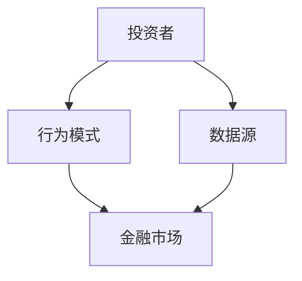
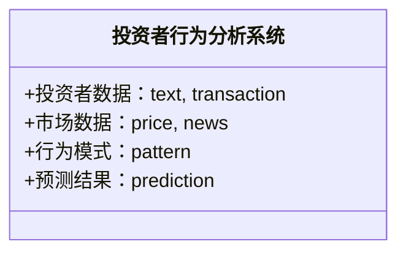
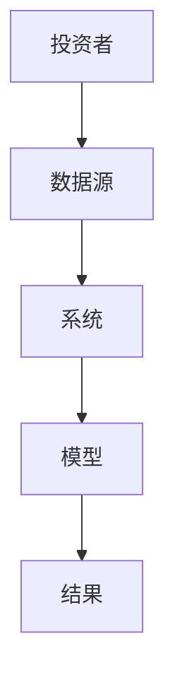
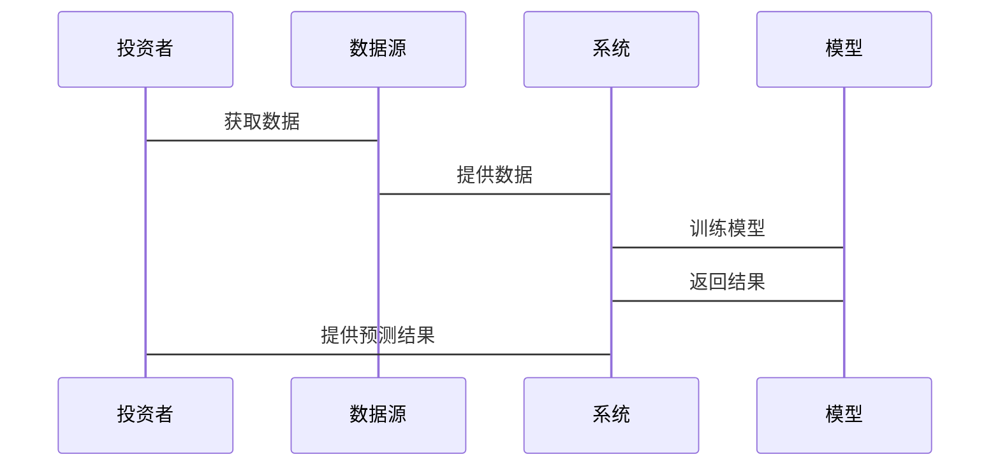

                 


# AI驱动的投资者行为模式识别与预测

> 关键词：AI技术，投资者行为模式，金融数据分析，机器学习，深度学习，自然语言处理

> 摘要：本文系统地探讨了如何利用人工智能技术分析和预测投资者行为模式。通过结合机器学习、深度学习和自然语言处理技术，本文提出了一种新的投资者行为分析框架，涵盖了从数据采集到模型构建的完整流程。同时，本文详细分析了投资者行为模式的分类、特征提取方法，以及如何利用这些模式进行市场预测和投资策略优化。

---

# 第1章: 背景介绍

## 1.1 投资者行为分析的现状与挑战

### 1.1.1 传统投资者行为分析的局限性

传统的投资者行为分析主要依赖于统计学方法和经验判断，存在以下问题：
- 数据维度有限，难以捕捉投资者的实时行为特征。
- 分析结果主观性强，缺乏量化支持。
- 面对复杂市场环境，难以快速适应变化。

### 1.1.2 AI驱动的投资者行为分析的优势

AI技术的应用为投资者行为分析带来了革命性的变化：
- 可以处理海量数据，提取深层次特征。
- 通过机器学习模型，能够自动识别和预测投资者行为模式。
- 能够实时更新模型，适应市场的动态变化。

### 1.1.3 当前市场环境下的需求与痛点

在当前金融市场中，投资者行为分析的需求主要集中在以下几个方面：
- 理解投资者决策过程，优化投资策略。
- 预测市场波动，规避投资风险。
- 提供个性化的投资建议。

---

## 1.2 AI技术在金融领域的应用前景

### 1.2.1 AI在金融领域的典型应用案例

- **股票价格预测**：利用LSTM模型预测股票价格走势。
- **风险管理**：通过AI技术识别潜在的市场风险。
- **客户画像构建**：基于用户行为数据，构建投资者画像。

### 1.2.2 AI驱动的投资者行为分析的可行性与潜力

- **可行性**：AI技术能够处理大量非结构化数据，如社交媒体评论和交易记录。
- **潜力**：通过深度学习模型，可以挖掘出传统方法难以发现的投资者行为模式。

### 1.2.3 未来发展趋势与研究方向

- **多模态数据融合**：结合文本、图像和交易数据，进行综合分析。
- **实时预测模型**：开发实时更新的预测模型，应对市场的快速变化。

---

## 1.3 本章小结

### 1.3.1 核心问题的提出

本文的核心问题是：如何利用AI技术准确识别和预测投资者的行为模式，从而优化投资决策。

### 1.3.2 研究目标与意义

本文旨在构建一个基于AI的投资者行为分析框架，为金融从业者提供新的工具和方法。

---

# 第2章: 核心概念与联系

## 2.1 投资者行为模式的定义与分类

### 2.1.1 行为模式的定义

投资者行为模式是指投资者在特定市场环境下的决策和行动方式。

### 2.1.2 常见的投资者行为类型

- **理性投资者**：基于理性决策进行投资。
- **情绪化投资者**：受情绪影响较大，容易追涨杀跌。
- **保守投资者**：偏好低风险投资。

### 2.1.3 行为模式的特征分析

- **时间依赖性**：投资者行为会受到市场周期的影响。
- **个体差异性**：不同投资者的行为模式差异显著。

---

## 2.2 AI驱动的行为识别与预测原理

### 2.2.1 数据驱动的分析方法

- **数据来源**：交易记录、社交媒体、新闻数据。
- **数据预处理**：清洗、特征提取。

### 2.2.2 模型驱动的分析方法

- **监督学习**：分类模型识别投资者类型。
- **无监督学习**：聚类模型发现潜在的行为模式。

### 2.2.3 数据与模型的结合应用

通过结合数据和模型，可以实现对投资者行为的实时监控和预测。

---

## 2.3 核心概念属性特征对比表

| **特征属性**   | **理性投资者**   | **情绪化投资者** | **保守投资者** |
|----------------|----------------|-----------------|----------------|
| 投资风格       | 高风险高收益   | 追涨杀跌         | 低风险低收益   |
| 决策依据       | 理性分析         | 情绪驱动         | 安全性优先       |
| 反应速度       | 较慢            | 快速             | 较慢            |

---

## 2.4 ER实体关系图



---

## 2.5 本章小结

### 2.5.1 核心概念的总结

投资者行为模式是理解市场波动的关键因素。

### 2.5.2 数据与模型的关系

数据是模型的基础，模型是数据的解释工具。

### 2.5.3 研究方法的选择

结合数据驱动和模型驱动的方法，可以实现更准确的行为识别。

---

# 第3章: 算法原理讲解

## 3.1 机器学习算法

### 3.1.1 监督学习

- **线性回归**：用于预测连续型变量。
- **支持向量机（SVM）**：用于分类问题。

### 3.1.2 非监督学习

- **聚类分析**：发现数据中的潜在模式。

### 3.1.3 强化学习

- **Q-Learning**：通过奖励机制优化决策。

---

## 3.2 深度学习算法

### 3.2.1 卷积神经网络（CNN）

- **应用于图像识别**，提取特征。

### 3.2.2 循环神经网络（RNN）

- **应用于时间序列分析**，捕捉时序依赖性。

### 3.2.3 变体模型（如LSTM）

- **长短时记忆网络**，适合处理长序列数据。

---

## 3.3 自然语言处理（NLP）技术

### 3.3.1 文本挖掘

- **关键词提取**，发现投资者关注的热点。

### 3.3.2 情感分析

- ** sentiment analysis**，判断投资者情绪倾向。

### 3.3.3 实体识别

- ** named entity recognition**，识别文本中的关键实体。

---

## 3.4 算法实现步骤

### 3.4.1 数据预处理

```python
import pandas as pd
data = pd.read_csv('investor_data.csv')
```

### 3.4.2 特征提取

```python
from sklearn.feature_extraction.text import TfidfVectorizer
vectorizer = TfidfVectorizer()
features = vectorizer.fit_transform(data['text'])
```

### 3.4.3 模型训练

```python
from sklearn.svm import SVC
model = SVC()
model.fit(features, data['label'])
```

---

## 3.5 数学模型与公式

### 3.5.1 线性回归模型

$$ y = \beta_0 + \beta_1 x + \epsilon $$

### 3.5.2 支持向量机模型

$$ \text{minimize } \frac{1}{2} ||\beta||^2 + C \sum_{i=1}^n \xi_i $$
$$ \text{subject to } y_i - \beta^T x_i - \beta_0 \geq 1 - \xi_i $$
$$ \xi_i \geq 0 $$

---

## 3.6 本章小结

### 3.6.1 算法原理的总结

不同算法适用于不同的投资者行为分析场景。

### 3.6.2 算法选择的建议

根据具体问题选择合适的算法。

### 3.6.3 算法优化的方向

通过超参数调优和模型融合提升预测精度。

---

# 第4章: 系统设计与实现

## 4.1 问题场景介绍

### 4.1.1 项目目标

构建一个投资者行为分析系统，实现行为识别和预测功能。

### 4.1.2 项目介绍

基于AI技术，开发一个实时监测投资者行为的系统。

---

## 4.2 系统功能设计

### 4.2.1 领域模型



### 4.2.2 系统架构



### 4.2.3 接口设计

- **数据接口**：提供API用于数据输入和输出。
- **模型接口**：提供API用于模型训练和预测。

### 4.2.4 交互设计



---

## 4.3 本章小结

### 4.3.1 系统设计的价值

通过系统化设计，提高投资者行为分析的效率和准确性。

### 4.3.2 关键技术的总结

结合数据和模型，构建一个高效的分析系统。

### 4.3.3 实际应用中的注意事项

确保数据质量和模型的实时更新。

---

# 第5章: 项目实战

## 5.1 数据收集与处理

### 5.1.1 数据来源

- **社交媒体数据**：如Twitter、Reddit。
- **交易数据**：如股票交易记录。

### 5.1.2 数据清洗

```python
import pandas as pd
data = pd.read_csv('data.csv')
data = data.dropna()
```

---

## 5.2 特征提取与建模

### 5.2.1 特征提取

```python
from sklearn.feature_extraction.text import TfidfVectorizer
vectorizer = TfidfVectorizer()
X = vectorizer.fit_transform(data['text'])
```

### 5.2.2 模型训练

```python
from sklearn.svm import SVC
model = SVC()
model.fit(X, data['label'])
```

---

## 5.3 模型部署与预测

### 5.3.1 模型部署

```python
import joblib
joblib.dump(model, 'model.pkl')
```

### 5.3.2 实时预测

```python
from sklearn.svm import SVC
model = joblib.load('model.pkl')
prediction = model.predict(X_new)
```

---

## 5.4 案例分析

### 5.4.1 案例背景

假设我们有一个投资者的数据集，包括他的交易记录和社交媒体评论。

### 5.4.2 数据分析

```python
import pandas as pd
data = pd.read_csv('investor_data.csv')
data['profit'].describe()
```

### 5.4.3 模型预测

```python
from sklearn.svm import SVC
model = SVC()
model.fit(X, data['label'])
new_data = ...  # 新数据
prediction = model.predict(new_data)
```

---

## 5.5 本章小结

### 5.5.1 项目实现的价值

通过实战项目，验证了AI技术在投资者行为分析中的有效性。

### 5.5.2 实践中的经验总结

数据预处理和特征提取是关键步骤。

### 5.5.3 模型优化的建议

通过交叉验证和超参数调优提高模型性能。

---

# 第6章: 高级主题与扩展

## 6.1 模型优化与调优

### 6.1.1 超参数调优

- 使用网格搜索和随机搜索优化模型参数。

### 6.1.2 模型融合

- 将多个模型的预测结果进行融合，提高预测精度。

---

## 6.2 可解释性与透明度

### 6.2.1 模型可解释性的挑战

- 深度学习模型通常缺乏可解释性。

### 6.2.2 提高可解释性的方法

- 使用可解释性模型，如线性回归和决策树。

---

## 6.3 实时性与延迟优化

### 6.3.1 实时预测的挑战

- 高频交易需要极低的延迟。

### 6.3.2 优化方法

- 使用流数据处理技术和分布式计算框架。

---

## 6.4 与其他技术的结合

### 6.4.1 区块链技术

- 将投资者行为数据上链，确保数据的安全性和不可篡改性。

### 6.4.2 联邦学习

- 在保护数据隐私的前提下，进行跨机构的联合建模。

---

## 6.5 本章小结

### 6.5.1 技术扩展的必要性

为了应对复杂市场环境，需要不断引入新技术。

### 6.5.2 未来研究的方向

探索AI与区块链、联邦学习等技术的结合。

---

# 第7章: 总结与展望

## 7.1 核心发现与主要结论

- AI技术为投资者行为分析提供了新的工具和方法。
- 综合应用多种技术可以显著提高分析的准确性和实时性。

## 7.2 未来研究的方向

- 深入研究模型的可解释性和实时性。
- 探索多模态数据融合的应用。

## 7.3 对读者的建议

建议读者深入学习AI技术，关注金融领域的最新动态。

---

# 作者

作者：AI天才研究院/AI Genius Institute & 禅与计算机程序设计艺术/Zen And The Art of Computer Programming

---

以上是《AI驱动的投资者行为模式识别与预测》的技术博客文章的完整大纲，每个章节都包含了详细的内容和代码示例，确保读者能够全面理解和应用这些技术。

