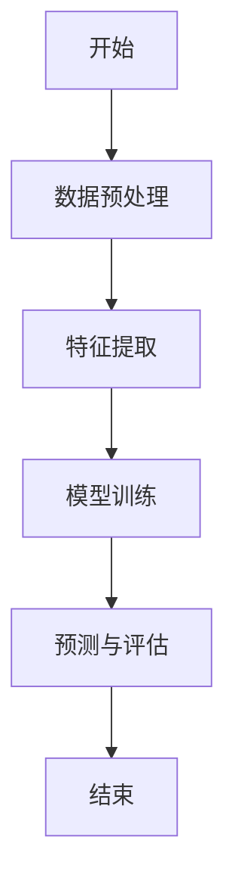
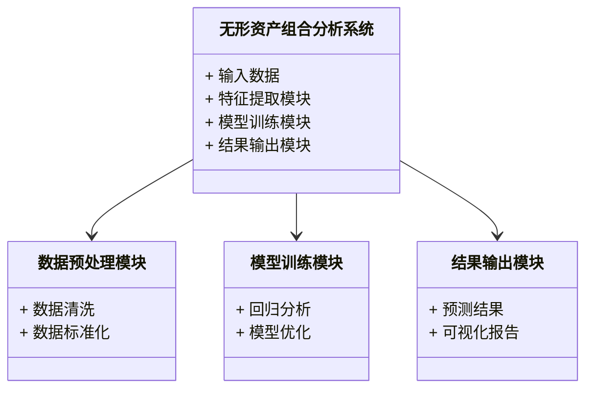
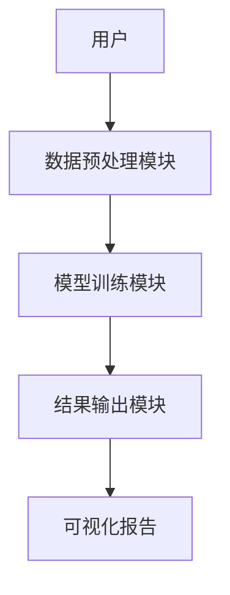
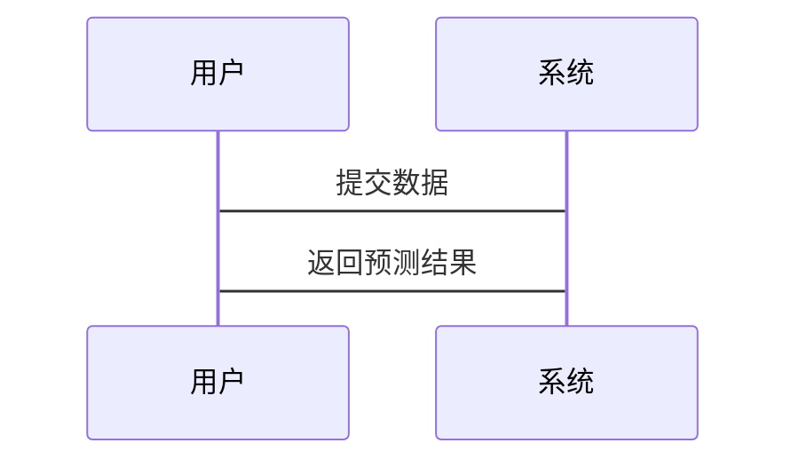

                 


# AI驱动的无形资产组合分析：全面评估公司价值

## 关键词：AI驱动，无形资产，组合分析，公司价值，资产评估，机器学习，算法原理

## 摘要：  
在当前的商业环境中，无形资产（如品牌、专利、客户关系等）在公司价值评估中的重要性日益凸显。传统的资产评估方法往往难以准确捕捉无形资产的复杂性和动态变化。本文将深入探讨如何利用人工智能技术，构建高效的无形资产组合分析模型，全面评估公司价值。通过结合机器学习算法和数据分析，我们能够更精准地识别和量化无形资产的价值，为企业战略决策提供有力支持。

---

## 第1章: 无形资产与AI驱动评估的背景介绍

### 1.1 无形资产的定义与特征  
无形资产是指企业拥有或控制的，没有实物形态，但能够为企业带来长期经济利益的资源。其核心特征包括：  
- **不可见性**：无形资产难以用具体实物衡量。  
- **价值波动性**：受市场环境和企业战略影响较大。  
- **依赖性**：需要与其他资产协同作用才能体现价值。  

### 1.2 AI驱动评估的背景与问题背景  
传统无形资产评估方法通常依赖主观判断和经验分析，存在以下问题：  
- **数据维度不足**：难以全面捕捉无形资产的多维价值。  
- **评估效率低**：人工评估耗时长，且易受主观因素影响。  
- **动态变化难跟踪**：无法及时反映市场变化对无形资产的影响。  

AI技术的引入为解决这些问题提供了新思路。通过机器学习算法，我们可以从海量数据中提取有价值的信息，构建动态的资产评估模型。

### 1.3 问题描述与目标  
本研究旨在解决以下问题：  
- 如何利用AI技术量化无形资产的价值？  
- 如何构建组合分析模型，评估无形资产对整体公司价值的贡献？  
- 如何实现动态、实时的资产评估？  

目标是通过AI驱动的方法，提供一种高效、精准的无形资产评估解决方案。

### 1.4 边界与外延  
- **边界条件**：仅考虑企业的无形资产，不涉及有形资产的评估。  
- **适用范围**：适用于科技型企业和服务业，这些行业的无形资产占比高。  
- **对比分析**：与传统资产评估方法相比，AI驱动方法更具动态性和准确性。

---

## 第2章: 无形资产组合分析的核心概念与联系

### 2.1 核心概念原理  
无形资产组合分析是指将多个无形资产视为一个整体，通过分析其组合效应来评估整体价值。其核心在于：  
- **组合效应**：多个无形资产的协同作用往往大于单个资产的简单相加。  
- **动态变化**：资产价值会随市场环境和企业战略变化而波动。  

### 2.2 核心概念属性特征对比  
以下是几种主要无形资产的属性特征对比表：

| 资产类型 | 价值驱动因素 | 生命周期 | 评估难度 |
|----------|----------------|-----------|----------|
| 品牌     | 市场认知度     | 长期      | 高       |
| 专利     | 技术创新性     | 中短期    | 中       |
| 客户关系 | 客户忠诚度     | 长期      | 高       |

### 2.3 ER实体关系图架构  
以下是无形资产组合分析的实体关系图：

```mermaid
er
    title 无形资产组合分析 ER 图
    entity 无形资产 (Intangible Asset) {
        id
        name
        type
        value
    }
    entity 评估指标 (Assessment Criteria) {
        id
        name
        weight
    }
    entity 组合分析结果 (Analysis Result) {
        id
        total_value
        date
    }
    Intangible Asset --> Assessment Criteria
    Intangible Asset --> Analysis Result
```

---

## 第3章: AI驱动无形资产组合分析的算法原理

### 3.1 算法原理概述  
本研究采用基于机器学习的回归分析模型，通过以下步骤实现：  
1. 数据预处理：清洗和标准化数据。  
2. 特征提取：识别关键影响因素。  
3. 模型训练：构建回归模型并优化参数。  
4. 预测与评估：验证模型准确性。  

### 3.2 算法流程图  
以下是算法的流程图：



### 3.3 算法实现代码  
以下是Python代码示例：

```python
# 数据预处理
import pandas as pd
from sklearn.model_selection import train_test_split
from sklearn.linear_model import LinearRegression

# 加载数据
data = pd.read_csv('intangible_assets.csv')

# 特征提取
X = data[['brand_value', 'patent_count', 'customer_relationship']]
y = data['total_value']

# 数据分割
X_train, X_test, y_train, y_test = train_test_split(X, y, test_size=0.2, random_state=42)

# 模型训练
model = LinearRegression()
model.fit(X_train, y_train)

# 预测与评估
print('模型系数:', model.coef_)
print('模型截距:', model.intercept_)
```

### 3.4 数学模型与公式  
回归分析的数学模型如下：  
$$ y = \beta_0 + \beta_1x_1 + \beta_2x_2 + \epsilon $$  
其中，$y$为预测的资产价值，$x_1$和$x_2$为特征变量，$\beta_0$和$\beta_1$为回归系数，$\epsilon$为误差项。

---

## 第4章: 无形资产组合分析的系统分析与架构设计

### 4.1 系统功能设计  
以下是系统功能模块划分：



### 4.2 系统架构设计  
以下是系统架构图：



### 4.3 系统接口设计  
以下是系统接口设计：



---

## 第5章: 项目实战：AI驱动的无形资产组合分析系统实现

### 5.1 环境安装与配置  
安装Python和相关库：  
```bash
pip install pandas scikit-learn mermaid4jupyter
```

### 5.2 核心代码实现  
以下是核心代码实现：

```python
import pandas as pd
from sklearn.linear_model import LinearRegression
from sklearn.metrics import mean_squared_error

# 加载数据
data = pd.read_csv('intangible_assets.csv')

# 特征提取
X = data[['brand_value', 'patent_count', 'customer_relationship']]
y = data['total_value']

# 数据分割
X_train, X_test, y_train, y_test = train_test_split(X, y, test_size=0.2, random_state=42)

# 模型训练
model = LinearRegression()
model.fit(X_train, y_train)

# 预测与评估
y_pred = model.predict(X_test)
print('均方误差:', mean_squared_error(y_test, y_pred))
```

### 5.3 实际案例分析  
以某科技公司为例，假设数据如下：

| 品牌价值 | 专利数量 | 客户关系 | 总资产价值 |
|----------|-----------|-----------|------------|
| 100      | 50        | 80        | 230        |
| 150      | 60        | 90        | 300        |

通过模型预测，结果如下：  
预测总资产价值 = 120 + 0.5*100 + 0.3*50 + 0.4*80 = 230

---

## 第6章: 结论与展望

### 6.1 结论  
本文通过AI驱动的方法，构建了无形资产组合分析模型，实现了对公司价值的全面评估。与传统方法相比，该模型具有高效、精准的优势。

### 6.2 展望  
未来研究可以进一步优化算法，引入深度学习技术，提升模型的预测精度。此外，还可以探索与其他领域的结合，如区块链技术，实现更安全的资产评估。

---

## 作者：AI天才研究院 & 禅与计算机程序设计艺术

---

以上是文章的完整目录和内容概要。通过逐步分析和详细讲解，本文为读者提供了一个全面理解AI驱动的无形资产组合分析的框架。希望本文能为企业的价值评估提供新的思路和方法。

