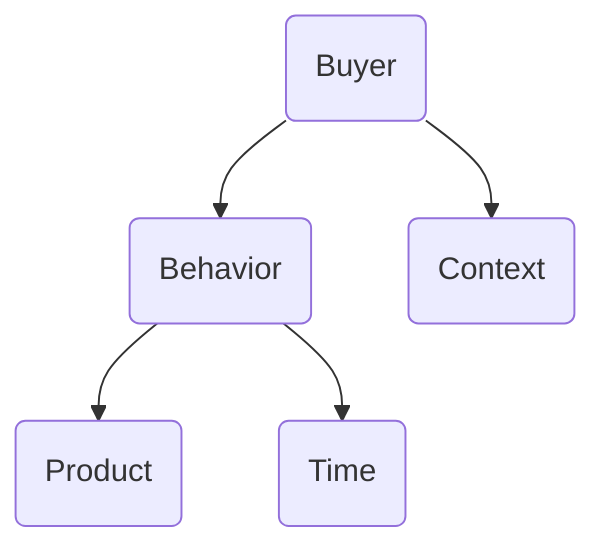
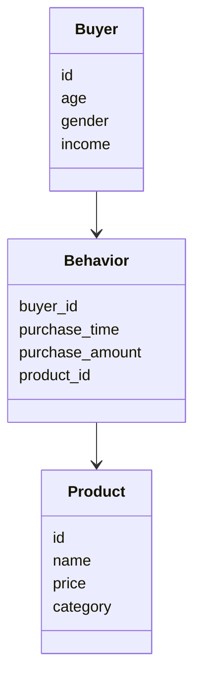
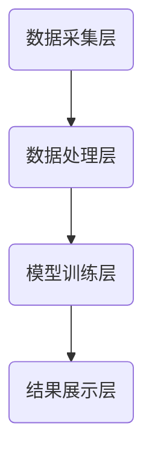
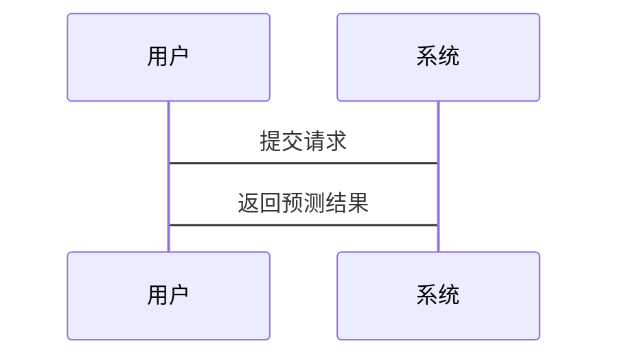

                 

# AI驱动的消费者行为分析：预测公司未来收入

> **关键词**：消费者行为分析，人工智能，收入预测，机器学习，数据分析

> **摘要**：本文详细探讨了如何利用人工智能技术分析消费者行为，以预测公司未来收入。文章从消费者行为分析的背景、核心概念入手，结合具体的算法原理、系统架构设计，以及实际项目案例，全面展示了AI驱动的消费者行为分析的实现过程。通过本文的学习，读者将能够掌握从数据采集到模型构建的整个流程，理解如何利用AI技术提升企业收入预测的准确性。

---

# 第一部分：AI驱动的消费者行为分析基础

## 第1章：消费者行为分析的背景与意义

### 1.1 消费者行为分析的基本概念

#### 1.1.1 消费者行为分析的定义
消费者行为分析是指通过收集和分析消费者在购买、使用和反馈产品或服务过程中的数据，揭示消费者的偏好、需求和行为模式的过程。其目的是帮助企业更好地理解消费者，优化产品设计、营销策略和客户服务，从而提高销售收入。

#### 1.1.2 消费者行为分析的核心要素
消费者行为分析的核心要素包括：
1. **消费者特征**：如年龄、性别、收入水平、职业等。
2. **消费行为**：如购买频率、购买金额、购买偏好等。
3. **外部因素**：如市场环境、竞争对手、经济状况等。

#### 1.1.3 消费者行为分析的分类与特点
消费者行为分析可以分为以下几类：
1. **基于数据的分析**：通过数据挖掘、机器学习等技术进行分析。
2. **基于模型的分析**：通过构建数学模型来模拟消费者行为。
3. **基于实验的分析**：通过实验设计来验证假设。

### 1.2 AI驱动的消费者行为分析的背景

#### 1.2.1 数据科学与AI技术的发展
随着数据科学和人工智能技术的快速发展，企业能够更高效地收集和分析消费者数据，从而更好地预测消费者行为。

#### 1.2.2 消费者行为分析的数字化转型
传统的消费者行为分析依赖于问卷调查和人工分析，而数字化转型使得企业能够通过大数据技术实时监控和分析消费者行为。

#### 1.2.3 企业收入预测的AI驱动趋势
通过AI技术，企业可以更准确地预测消费者行为，从而优化销售策略，提高收入预测的准确性。

### 1.3 本章小结
本章从消费者行为分析的基本概念出发，介绍了其核心要素和分类，并探讨了AI技术在消费者行为分析中的应用背景和趋势。

---

# 第二部分：消费者行为分析的核心概念与AI驱动的联系

## 第2章：消费者行为分析的核心概念

### 2.1 消费者行为分析的理论框架

#### 2.1.1 消费者决策过程的模型
消费者决策过程的模型通常包括以下阶段：
1. **问题识别**：消费者意识到某种需求。
2. **信息搜索**：消费者主动搜索相关信息。
3. **评估与选择**：消费者对比不同选项，做出选择。
4. **购买与使用**：消费者购买产品并使用。
5. **反馈与忠诚度**：消费者根据使用体验决定是否继续购买。

#### 2.1.2 影响消费者行为的主要因素
影响消费者行为的主要因素包括：
1. **内在因素**：如个人需求、动机、认知等。
2. **外在因素**：如价格、广告、市场竞争等。

#### 2.1.3 数据驱动的消费者行为分析方法
数据驱动的消费者行为分析方法包括：
1. **数据收集**：通过问卷、传感器、日志等方式收集数据。
2. **数据清洗**：对数据进行预处理，去除噪声。
3. **数据建模**：通过机器学习算法构建预测模型。

### 2.2 AI在消费者行为分析中的应用

#### 2.2.1 AI技术的核心优势
AI技术的核心优势包括：
1. **高效性**：能够快速处理大量数据。
2. **准确性**：能够提高预测的准确性。
3. **可扩展性**：能够处理不同类型和规模的数据。

#### 2.2.2 AI在消费者行为分析中的应用场景
AI在消费者行为分析中的应用场景包括：
1. **需求预测**：预测消费者的购买需求。
2. **市场细分**：根据消费者特征进行市场细分。
3. **个性化推荐**：为消费者推荐个性化的产品或服务。

#### 2.2.3 企业收入预测的AI驱动趋势
通过AI技术，企业可以更准确地预测消费者行为，从而优化销售策略，提高收入预测的准确性。

## 第3章：核心概念与AI驱动的联系

### 3.1 消费者行为分析的核心要素

#### 3.1.1 数据来源与特征提取
数据来源包括：
1. **结构化数据**：如数据库中的交易记录。
2. **非结构化数据**：如文本评论、图像等。

特征提取方法包括：
1. **基于统计的方法**：如均值、方差等。
2. **基于机器学习的方法**：如主成分分析（PCA）。

#### 3.1.2 数据预处理与特征工程
数据预处理包括：
1. **数据清洗**：去除噪声数据。
2. **数据转换**：如标准化、归一化等。

特征工程包括：
1. **特征选择**：选择重要的特征。
2. **特征组合**：将多个特征组合成新的特征。

#### 3.1.3 消费者行为的建模与预测
建模方法包括：
1. **回归分析**：用于预测连续型变量。
2. **分类分析**：用于预测分类变量。
3. **聚类分析**：用于发现数据中的自然分组。

### 3.2 AI技术的核心原理

#### 3.2.1 机器学习与深度学习的对比
机器学习的核心是通过训练数据构建模型，而深度学习是机器学习的一种特殊形式，通过多层神经网络来自动提取特征。

#### 3.2.2 神经网络在消费者行为分析中的应用
神经网络在消费者行为分析中的应用包括：
1. **图像识别**：识别消费者行为中的图像数据。
2. **自然语言处理**：分析消费者评论中的情感倾向。

#### 3.2.3 自然语言处理（NLP）在消费者反馈分析中的作用
NLP技术可以用于分析消费者评论，提取情感倾向、关键词等信息，从而更好地理解消费者需求。

### 3.3 核心概念的ER实体关系图

---

# 第三部分：AI驱动的消费者行为分析的算法原理

## 第4章：AI驱动的消费者行为分析算法

### 4.1 线性回归模型

#### 4.1.1 线性回归的基本原理
线性回归是一种统计学方法，用于建立因变量和自变量之间的线性关系。其数学公式为：
$$ y = \beta_0 + \beta_1x + \epsilon $$

其中，$y$ 是因变量，$x$ 是自变量，$\beta_0$ 是截距，$\beta_1$ 是回归系数，$\epsilon$ 是误差项。

#### 4.1.2 线性回归的应用场景
线性回归适用于以下场景：
1. **连续型变量预测**：如预测消费者的购买金额。
2. **单变量分析**：如分析消费者年龄与购买金额的关系。

#### 4.1.3 线性回归的实现步骤
1. 数据准备：收集和清洗数据。
2. 特征选择：选择重要的特征。
3. 模型训练：使用最小二乘法估计回归系数。
4. 模型评估：计算R²值，评估模型的拟合程度。

### 4.2 决策树算法

#### 4.2.1 决策树的基本原理
决策树是一种树状结构，用于表示决策过程。每个内部节点表示一个判断条件，叶子节点表示一个结果。决策树的构建过程包括特征选择、分裂停止条件等。

#### 4.2.2 决策树的应用场景
决策树适用于以下场景：
1. **分类问题**：如预测消费者是否购买某产品。
2. **数据可视化**：通过树状结构直观展示决策过程。

#### 4.2.3 决策树的实现步骤
1. 数据准备：收集和清洗数据。
2. 特征选择：选择重要的特征。
3. 模型训练：使用ID3、C4.5等算法构建决策树。
4. 模型评估：计算准确率、召回率等指标。

### 4.3 随机森林算法

#### 4.3.1 随机森林的基本原理
随机森林是一种集成学习方法，通过构建多棵决策树，并将它们的结果进行集成，从而提高模型的准确性和稳定性。

#### 4.3.2 随机森林的应用场景
随机森林适用于以下场景：
1. **高维数据处理**：如处理消费者行为数据中的多个特征。
2. **特征重要性分析**：通过特征重要性系数，了解哪些特征对消费者行为影响较大。

#### 4.3.3 随机森林的实现步骤
1. 数据准备：收集和清洗数据。
2. 特征选择：选择重要的特征。
3. 模型训练：使用随机森林算法构建模型。
4. 模型评估：计算准确率、F1分数等指标。

---

# 第四部分：AI驱动的消费者行为分析系统架构设计

## 第5章：AI驱动的消费者行为分析系统架构

### 5.1 问题场景介绍

#### 5.1.1 问题背景
某电商公司希望通过分析消费者行为，预测未来三个月的收入。

#### 5.1.2 问题描述
公司希望通过AI技术，建立一个消费者行为分析系统，预测消费者的购买行为，从而优化销售策略。

### 5.2 系统功能设计

#### 5.2.1 领域模型设计
以下是领域模型的类图：

#### 5.2.2 系统架构设计
以下是系统架构的分层架构图：

### 5.3 系统接口设计

#### 5.3.1 数据接口
数据接口包括：
1. 数据采集接口：用于收集消费者行为数据。
2. 数据存储接口：用于存储数据。

#### 5.3.2 模型接口
模型接口包括：
1. 模型训练接口：用于训练预测模型。
2. 模型预测接口：用于预测消费者行为。

### 5.4 系统交互设计

#### 5.4.1 系统交互流程
系统交互流程包括：
1. 数据采集：通过传感器、日志等方式采集数据。
2. 数据处理：对数据进行清洗、转换等预处理。
3. 模型训练：使用机器学习算法训练预测模型。
4. 模型预测：使用训练好的模型预测消费者行为。
5. 结果展示：将预测结果展示给用户。

#### 5.4.2 交互序列图
以下是交互序列图：

---

# 第五部分：AI驱动的消费者行为分析项目实战

## 第6章：项目实战——电商公司收入预测

### 6.1 环境安装与数据准备

#### 6.1.1 环境安装
需要安装以下工具：
1. Python 3.8+
2. Jupyter Notebook
3. scikit-learn
4. pandas
5. numpy

#### 6.1.2 数据准备
数据来源包括：
1. 电商公司提供的交易记录。
2. 消费者问卷调查数据。

### 6.2 系统核心实现

#### 6.2.1 数据预处理
数据预处理包括：
1. 数据清洗：去除缺失值、异常值。
2. 数据转换：如标准化、归一化。

#### 6.2.2 特征工程
特征工程包括：
1. 特征选择：选择重要的特征，如购买金额、购买频率等。
2. 特征组合：将多个特征组合成新的特征，如购买金额与收入水平的比值。

#### 6.2.3 模型训练
模型训练包括：
1. 线性回归模型：用于预测连续型变量。
2. 随机森林模型：用于分类和回归任务。

#### 6.2.4 模型评估
模型评估包括：
1. 训练集评估：计算训练集的准确率、召回率等指标。
2. 测试集评估：计算测试集的准确率、召回率等指标。

### 6.3 项目小结

#### 6.3.1 项目总结
通过本项目，我们成功地构建了一个消费者行为分析系统，能够预测消费者的购买行为，从而帮助电商公司优化销售策略。

#### 6.3.2 项目成果
项目成果包括：
1. 消费者行为分析系统：能够实时分析消费者行为，预测未来收入。
2. 模型代码：包括数据预处理、特征工程、模型训练等步骤的代码。

---

# 第六部分：最佳实践与小结

## 第7章：最佳实践与小结

### 7.1 最佳实践

#### 7.1.1 数据处理的注意事项
1. 数据清洗：确保数据的完整性和准确性。
2. 数据转换：选择合适的转换方法，如标准化、归一化。

#### 7.1.2 模型选择的注意事项
1. 模型评估：选择适合数据类型的模型。
2. 超参数调优：通过网格搜索等方法优化模型性能。

#### 7.1.3 系统设计的注意事项
1. 系统架构：确保系统的可扩展性和可维护性。
2. 系统交互：设计直观的用户界面，提高用户体验。

### 7.2 小结
通过本文的学习，读者掌握了AI驱动的消费者行为分析的实现过程，包括数据处理、特征工程、模型训练等步骤。同时，通过实际项目案例，读者能够更好地理解如何将理论应用于实践。

### 7.3 注意事项
1. 数据隐私：在处理消费者数据时，需要注意数据隐私保护。
2. 模型解释性：在实际应用中，模型的解释性也很重要，以便更好地理解消费者行为。

### 7.4 拓展阅读
1. 《机器学习实战》：深入学习机器学习算法的实现。
2. 《深入理解深度学习》：了解深度学习的基本原理和应用。

---

# 结语

AI驱动的消费者行为分析是一项复杂但极具价值的任务，通过本文的学习，读者能够掌握从数据处理到模型构建的整个流程，理解如何利用AI技术提升企业收入预测的准确性。希望本文能够为读者在AI驱动的消费者行为分析领域提供有价值的指导和参考。

---

**作者**：AI天才研究院/AI Genius Institute & 禅与计算机程序设计艺术/Zen And The Art of Computer Programming

