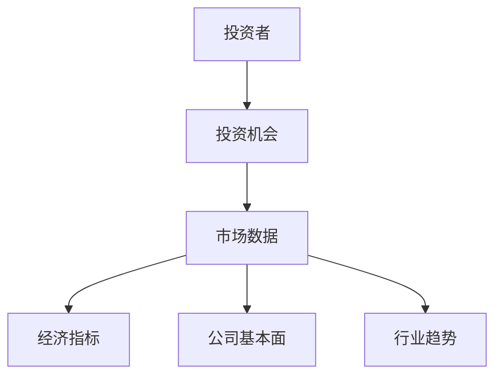
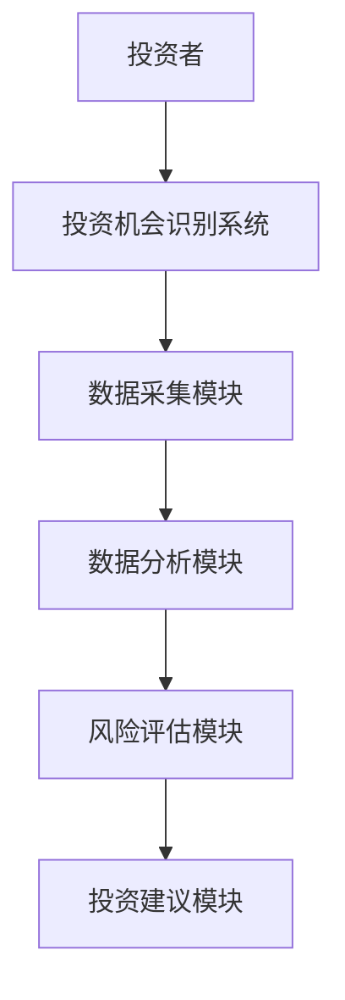

                 


# AI驱动的特殊情况投资机会识别

> 关键词：人工智能，投资机会识别，特殊情况，数据驱动，金融分析

> 摘要：本文深入探讨了如何利用人工智能技术识别特殊情况下的投资机会，从背景分析、算法原理到系统架构设计，结合实际案例分析，详细阐述了AI在金融投资中的应用潜力和实现方法。

---

## 第一部分：AI驱动的特殊情况投资机会识别背景介绍

### 第1章：特殊情况投资机会识别的背景与挑战

#### 1.1 问题背景
- **传统投资分析的局限性**：传统金融分析依赖于人工经验判断，难以快速处理海量数据，且容易受到主观因素影响。
- **AI技术在金融领域的应用潜力**：人工智能技术（如机器学习、深度学习）能够高效处理大量非结构化数据，挖掘潜在规律，为投资决策提供支持。
- **特殊情况下的投资机会**：特殊情况通常指的是市场波动剧烈、突发事件（如疫情、地缘政治冲突）等，这些情况下传统方法难以及时捕捉机会。

#### 1.2 问题描述
- **投资机会识别的核心问题**：如何从海量数据中提取有效信息，识别潜在的投资机会。
- **特殊情况下的投资机会特征**：高波动性、低可预测性、短期性等。
- **现有解决方案的不足**：传统方法在特殊情况下的表现不佳，难以适应快速变化的市场环境。

#### 1.3 问题解决
- **AI驱动的解决方案概述**：利用机器学习算法对市场数据进行建模，识别潜在的投资机会。
- **数据驱动的投资机会识别方法**：通过分析市场数据、公司基本面数据、行业趋势等，构建预测模型。
- **AI算法在特殊情况下的优势**：能够快速适应数据变化，捕捉短期市场波动。

#### 1.4 概念结构与核心要素
- **框架模型**：包括数据采集、特征提取、模型训练、结果预测等模块。
- **核心要素**：市场数据、公司基本面、经济指标、行业趋势、模型算法。
- **框架的边界与外延**：限定于特殊情况下的投资机会识别，不包括长期投资策略。

---

## 第二部分：AI驱动投资机会识别的核心概念与联系

### 第2章：AI驱动投资机会识别的核心原理

#### 2.1 核心概念原理
- **数据驱动的特征提取**：从市场数据中提取有用的特征，如波动率、成交量、市场情绪等。
- **AI算法的预测机制**：利用机器学习算法对市场走势进行预测，识别投资机会。
- **模型构建**：基于历史数据，构建预测模型，并通过回测验证模型的有效性。

#### 2.2 核心概念属性特征对比
- **不同AI算法的性能对比**：比较ARIMA、LSTM、随机森林等算法在投资机会识别中的表现。
- **数据特征的重要性排序**：通过特征重要性分析，确定哪些特征对投资机会识别影响最大。
- **模型性能的评估指标**：包括准确率、召回率、F1值等。

#### 2.3 ER实体关系图架构


---

## 第三部分：算法原理讲解

### 第3章：算法原理与实现

#### 3.1 时间序列分析
- **ARIMA模型原理**
  - ARIMA（自回归积分滑动平均模型）是一种常用的时间序列预测模型。
  - 模型结构：ARIMA(p, d, q)，其中p为自回归阶数，d为差分阶数，q为移动平均阶数。
  - 示例代码：
    ```python
    from statsmodels.tsa.arima_model import ARIMA
    model = ARIMA(train_data, order=(p, d, q))
    model_fit = model.fit()
    ```
  - 数学公式：
    $$ ARIMA(p, d, q): y_t = \phi_1 y_{t-1} + \dots + \phi_p y_{t-p} + \theta_1 \epsilon_{t-1} + \dots + \theta_q \epsilon_{t-q} + \epsilon_t $$

#### 3.2 LSTM网络的应用
- **LSTM（长短期记忆网络）**：适用于捕捉时间序列中的长期依赖关系。
  - LSTM结构：包括输入门、遗忘门、输出门。
  - 示例代码：
    ```python
    from keras.layers import LSTM
    model = Sequential()
    model.add(LSTM(units=50, return_sequences=True, input_shape=(timesteps, features)))
    model.add(Dense(1))
    model.compile(optimizer='adam', loss='mean_squared_error')
    ```
  - 数学公式：
    $$ f_t = \sigma(W_f \cdot [h_{t-1}, x_t] + b_f) $$
    $$ i_t = \sigma(W_i \cdot [h_{t-1}, x_t] + b_i) $$
    $$ o_t = \sigma(W_o \cdot [h_{t-1}, x_t] + b_o) $$
    $$ h_t = f_t \cdot c_t + i_t \cdot c_{t-1} $$
    $$ c_t = g(W_c \cdot [h_{t-1}, x_t] + b_c) $$

#### 3.3 机器学习模型
- **随机森林算法**
  - 随机森林是一种基于决策树的集成学习算法，适用于特征重要性分析和分类/回归任务。
  - 示例代码：
    ```python
    from sklearn.ensemble import RandomForestRegressor
    model = RandomForestRegressor(n_estimators=100, random_state=42)
    model.fit(X_train, y_train)
    ```
  - 数学公式：
    $$ y = \sum_{i=1}^{n} \theta_i \cdot x_i $$

---

## 第四部分：系统分析与架构设计方案

### 第4章：系统分析与架构设计

#### 4.1 问题场景介绍
- **投资机会识别系统**：目标是通过AI技术，帮助投资者快速识别特殊情况下的投资机会。
- **系统功能设计**：
  - 数据采集模块：从多个数据源获取市场数据。
  - 数据分析模块：对数据进行预处理、特征提取和建模。
  - 风险评估模块：评估投资机会的风险。
  - 投资建议模块：根据模型预测结果，生成投资建议。

#### 4.2 系统架构设计
- **系统架构图**


#### 4.3 系统接口设计
- **数据接口**：与数据源（如股票交易所、财经新闻网站）对接，获取实时数据。
- **用户接口**：提供友好的用户界面，方便投资者查看预测结果和投资建议。

#### 4.4 系统交互流程


---

## 第五部分：项目实战

### 第5章：项目实战

#### 5.1 环境安装
- **Python环境**：建议使用Anaconda，安装必要的库（如numpy、pandas、scikit-learn、keras等）。
- **数据源获取**：从公开数据源（如Yahoo Finance、Alpha Vantage）获取市场数据。

#### 5.2 系统核心实现
- **数据预处理**：
  ```python
  import pandas as pd
  data = pd.read_csv('market_data.csv')
  data = data.dropna()
  ```

- **模型训练与预测**：
  ```python
  from sklearn.model_selection import train_test_split
  X_train, X_test, y_train, y_test = train_test_split(X, y, test_size=0.2)
  model.fit(X_train, y_train)
  y_pred = model.predict(X_test)
  ```

#### 5.3 案例分析
- **案例：疫情期间的股票投资机会识别**
  - 数据来源：疫情期间的股票价格数据。
  - 模型选择：使用LSTM模型进行预测。
  - 分析结果：识别出某些行业（如医疗、科技）的投资机会。

#### 5.4 代码解读
- **核心代码**：
  ```python
  def preprocess_data(data):
      # 数据预处理代码
      pass

  def train_model(X, y):
      # 模型训练代码
      pass

  def predict_opportunity(model, data):
      # 投资机会预测代码
      pass
  ```

---

## 第六部分：最佳实践

### 第6章：最佳实践

#### 6.1 小结
- **核心内容回顾**：AI技术在特殊情况下的投资机会识别中具有重要作用，能够通过数据分析和建模，帮助投资者快速捕捉市场机会。
- **算法选择建议**：根据具体场景选择合适的算法，如时间序列分析、LSTM、随机森林等。

#### 6.2 注意事项
- **数据质量**：确保数据来源可靠，数据预处理充分。
- **模型评估**：通过回测和交叉验证，确保模型的稳定性和有效性。
- **风险管理**：在实际投资中，结合风险控制策略，避免过度依赖模型预测。

#### 6.3 拓展阅读
- **推荐书籍**：《机器学习实战》、《深度学习》。
- **推荐博客**：Towards Data Science、Medium上的AI相关专栏。

---

## 结语

AI驱动的特殊情况投资机会识别是一项具有挑战性的任务，但通过合理的算法选择和系统设计，可以显著提升投资决策的效率和准确性。希望本文能够为读者提供有价值的参考和启发。

---

作者：AI天才研究院/AI Genius Institute & 禅与计算机程序设计艺术 /Zen And The Art of Computer Programming

