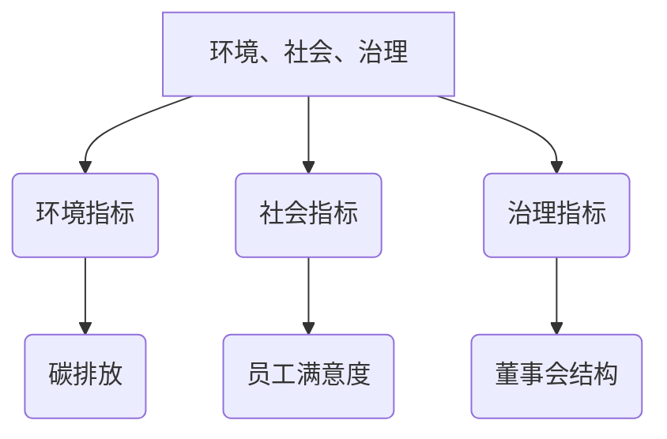

                 


# AI驱动的环境、社会和治理(ESG)分析：可持续价值投资

---

## 关键词：  
AI, ESG, 可持续投资, 环境、社会、治理, 人工智能

---

## 摘要：  
本文深入探讨了人工智能在环境、社会和治理（ESG）分析中的应用，结合可持续价值投资的视角，系统性地分析了AI驱动ESG分析的技术原理、系统架构和实际应用场景。文章从背景介绍、核心概念、算法原理、系统设计到项目实战，全面解析了AI在ESG领域的潜力和实现路径，为投资者和企业提供了技术与实践相结合的参考。

---

# 第一部分：背景介绍

## 第1章：环境、社会和治理（ESG）概述

### 1.1 ESG的核心概念  
环境、社会和治理（ESG）是衡量企业可持续发展能力的重要指标，分别从环境、社会和公司治理三个维度评估企业的价值。ESG不仅关注企业的经济表现，还强调其对社会和环境的贡献，是实现可持续发展的关键要素。

### 1.2 AI技术的背景与潜力  
人工智能（AI）作为一项前沿技术，正在改变金融行业的分析方式。AI的强大数据处理能力和深度学习算法使其能够从海量数据中提取有价值的信息，为ESG分析提供了新的可能性。

### 1.3 本章小结  
ESG与AI的结合不仅是技术进步的体现，更是可持续发展理念在金融领域的实践。通过AI驱动的ESG分析，投资者能够更准确地评估企业的可持续价值，从而做出更明智的投资决策。

---

# 第二部分：核心概念与联系

## 第2章：ESG分析的核心要素  

### 2.1 ESG的三个维度  
1. **环境（Environmental）**：关注企业的碳排放、资源利用效率等环境表现。  
2. **社会（Social）**：关注企业的员工权益、社会责任履行情况。  
3. **治理（Governance）**：关注企业的公司治理结构、高管薪酬透明度等。  

### 2.2 ESG分析的关键指标  
| 维度 | 指标 |
|------|------|
| 环境 | 碳排放强度、可再生能源使用率 |
| 社会 | 员工满意度、社会责任投入 |
| 治理 | 董事会多样性、高管薪酬结构 |

### 2.3 ESG分析的实体关系图  


---

# 第三部分：算法原理讲解

## 第3章：AI驱动的ESG评分模型  

### 3.1 数据预处理  
- **数据清洗**：去除缺失值和异常值。  
- **标准化**：对数据进行归一化处理，确保不同维度的数据具有可比性。  

### 3.2 特征提取与选择  
- **文本数据处理**：对公司的年报进行文本挖掘，提取关键词和情感倾向。  
- **数值数据归一化**：使用标准化方法，将数据范围控制在[0,1]之间。  
- **主成分分析（PCA）**：降低数据维度，提取核心特征。  

### 3.3 模型训练与优化  
- **线性回归模型**：用于预测企业的ESG评分。  
  $$ y = \beta_0 + \beta_1x_1 + \beta_2x_2 + \dots + \beta_nx_n $$  
- **神经网络模型**：使用深度学习模型（如LSTM）处理时间序列数据。  

### 3.4 模型评估与预测  
- **准确率、召回率、F1分数**：评估模型的性能。  
- **混淆矩阵分析**：分析模型的预测结果。  

---

## 第4章：AI驱动的ESG分析系统架构  

### 4.1 问题场景介绍  
- 数据来源：ESG数据集、公司财报。  
- 业务目标：构建一个实时的ESG评分系统。  

### 4.2 系统功能设计  
- **领域模型**：定义系统的核心功能模块。  
  ```mermaid
  classDiagram
      class ESG评分系统 {
          输入数据
          数据处理模块
          模型训练模块
          预测结果
      }
  ```

### 4.3 系统架构设计  
- **架构图**：展示系统的整体结构。  
  ```mermaid
  rectangle ES_Governance {
      输入数据
      数据处理模块
      模型训练模块
  }
  ```

### 4.4 接口设计与交互  
- **接口设计**：定义系统与外部的数据接口。  
- **交互设计**：用户通过Web界面提交数据，系统返回ESG评分。  

---

## 第5章：项目实战  

### 5.1 环境安装  
- 安装Python、TensorFlow、Pandas等依赖库。  

### 5.2 核心代码实现  
```python
import pandas as pd
import numpy as np
from sklearn.linear_model import LinearRegression

# 数据加载
data = pd.read_csv('esg_data.csv')

# 数据预处理
X = data.drop('esg_score', axis=1)
y = data['esg_score']

# 模型训练
model = LinearRegression()
model.fit(X, y)

# 预测
new_data = pd.DataFrame({
    'feature1': [0.5],
    'feature2': [0.6],
    # 其他特征...
})
prediction = model.predict(new_data)
print("预测的ESG分数为：", prediction[0])
```

### 5.3 案例分析  
以某公司为例，分析其ESG评分，并解读结果。  

---

## 第6章：最佳实践  

### 6.1 小结  
AI驱动的ESG分析能够显著提升投资决策的准确性和效率。  

### 6.2 注意事项  
- 数据质量对模型性能影响重大。  
- 模型需要定期更新以适应市场变化。  

### 6.3 拓展阅读  
建议读者深入学习深度学习和时间序列分析技术，以进一步提升ESG分析的准确性。

---

## 作者：  
AI天才研究院/AI Genius Institute & 禅与计算机程序设计艺术/Zen And The Art of Computer Programming

