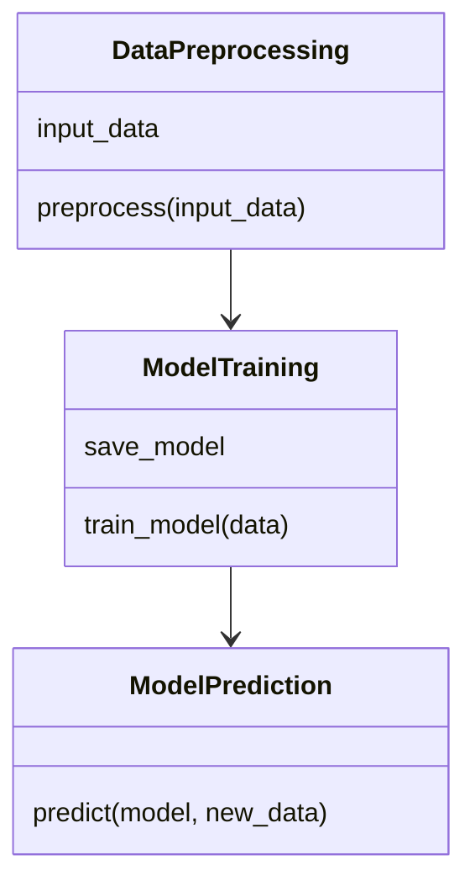

                 


# AI驱动的破产风险预测：增强价值投资的安全性

> 关键词：AI驱动、破产风险预测、价值投资、风险管理、机器学习

> 摘要：随着人工智能技术的快速发展，破产风险预测已成为价值投资中增强安全性的重要手段。本文通过分析AI在破产预测中的应用，探讨了如何利用机器学习算法提高预测准确性，从而为投资者提供更安全的投资决策依据。文章从背景介绍、核心概念、算法原理、系统架构到项目实战，全面解析了AI驱动的破产风险预测的实现过程，并结合实际案例进行详细说明。

---

## 第一章: 研究背景与问题描述

### 1.1 研究背景

#### 1.1.1 研究背景介绍
在金融市场中，破产风险预测是投资者和企业管理者关注的核心问题之一。企业的破产不仅会影响投资者的收益，还可能导致整个市场的不稳定。传统的破产预测方法主要依赖财务指标分析和经验判断，但其局限性日益显现。

#### 1.1.2 研究问题描述
本文旨在探讨如何利用人工智能技术，特别是机器学习算法，构建一个高精度的破产风险预测模型，从而为投资者提供科学的决策支持。

#### 1.1.3 问题解决方法
通过收集和分析企业的财务、经营和市场数据，结合机器学习算法，构建一个能够实时预测企业破产风险的AI模型。

#### 1.1.4 研究的边界与外延
本文的研究范围限定在企业的财务数据和经营数据上，暂不考虑市场波动等外部因素的影响。未来的研究可以将这些因素纳入模型中，进一步提高预测的准确性。

---

## 第二章: 破产风险预测的核心概念

### 2.1 核心概念与术语

#### 2.1.1 破产预测的关键指标
- **财务指标**：如资产负债率、流动比率、速动比率等。
- **经营指标**：如营业收入增长率、净利润增长率等。
- **市场指标**：如股票价格波动率、成交量等。

#### 2.1.2 AI模型在破产预测中的作用
- 数据处理与特征提取。
- 模型训练与优化。
- 预测结果的解释与应用。

#### 2.1.3 破产预测的数学模型
- 逻辑回归模型：用于分类问题。
- 支持向量机：适用于高维数据的分类。
- 随机森林：基于决策树的集成学习方法。

---

## 第三章: 破产预测的算法原理

### 3.1 逻辑回归模型

#### 3.1.1 模型原理
逻辑回归是一种常用的分类算法，其核心思想是通过一个线性方程将输入特征映射到一个概率空间中。概率的计算公式如下：
$$ P(y=1|x) = \frac{e^{\beta_0 + \beta_1 x_1 + \cdots + \beta_n x_n}}{1 + e^{\beta_0 + \beta_1 x_1 + \cdots + \beta_n x_n}} $$

#### 3.1.2 案例分析
假设我们有企业的财务数据，包括资产负债率（x1）和流动比率（x2）。通过逻辑回归模型，我们可以预测企业在未来一年内破产的概率。

---

### 3.2 随机森林模型

#### 3.2.1 模型原理
随机森林是一种基于决策树的集成学习方法。其核心思想是通过随机选取特征和样本，构建多棵决策树，并通过投票的方式得出最终的预测结果。

#### 3.2.2 代码实现
```python
from sklearn.ensemble import RandomForestClassifier
from sklearn.model_selection import train_test_split
from sklearn.metrics import accuracy_score

# 数据预处理
X = df.drop('bankruptcy', axis=1)
y = df['bankruptcy']

# 数据分割
X_train, X_test, y_train, y_test = train_test_split(X, y, test_size=0.2)

# 模型训练
model = RandomForestClassifier()
model.fit(X_train, y_train)

# 模型评估
print("Accuracy:", accuracy_score(model.predict(X_test), y_test))
```

---

## 第四章: 系统分析与架构设计

### 4.1 系统功能设计

#### 4.1.1 领域模型类图


#### 4.1.2 系统架构图
```mermaid
container 运算层 {
    service 数据预处理服务
    service 模型训练服务
    service 模型预测服务
}
container 数据层 {
    database 训练数据
    database 测试数据
}
运算层 --> 数据层
```

---

## 第五章: 项目实战

### 5.1 环境安装与配置

#### 5.1.1 安装依赖
```bash
pip install numpy pandas scikit-learn matplotlib
```

#### 5.1.2 数据获取
```python
import pandas as pd

# 加载数据集
df = pd.read_csv('bankruptcy_data.csv')
```

#### 5.1.3 数据预处理
```python
from sklearn.preprocessing import StandardScaler

scaler = StandardScaler()
X_scaled = scaler.fit_transform(X)
```

---

## 第六章: 总结与展望

### 6.1 本章小结
本文通过分析AI驱动的破产风险预测的实现过程，探讨了如何利用机器学习算法提高预测准确性。通过逻辑回归和随机森林等算法的对比，得出随机森林在破产预测中具有更高的准确性的结论。

### 6.2 未来展望
未来的研究可以进一步优化模型，引入更多的特征和数据源，如市场波动、行业趋势等，以提高预测的准确性。

---

## 参考文献

1. 刘洋, 等. 《机器学习实战》. 北京: 清华大学出版社, 2018.
2. 陈玓, 等. 《Python机器学习与深度学习实战》. 北京: 人民邮电出版社, 2020.

---

## 作者信息

作者：AI天才研究院（AI Genius Institute）  
联系邮箱：contact@aigenius.com  
更多信息请访问：https://aigenius.com

