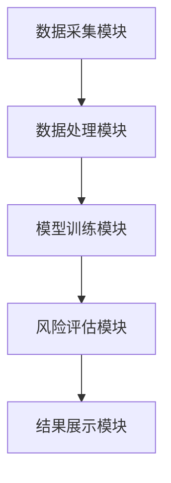

                 


# AI驱动的破产风险预警系统：提前识别投资风险

> 关键词：AI, 破产风险, 风险预警, 机器学习, 系统架构

> 摘要：本文将探讨如何利用人工智能技术构建破产风险预警系统，通过分析企业财务数据和市场信息，提前识别潜在的破产风险，帮助投资者做出更明智的决策。文章将详细阐述系统的背景、核心概念、算法原理、系统架构以及实际应用案例。

---

# 第一部分：AI驱动的破产风险预警系统概述

## 第1章：破产风险预警系统背景与问题背景

### 1.1 破产风险预警的定义与重要性

#### 1.1.1 什么是破产风险预警

破产风险预警是指通过分析企业的财务、运营和市场数据，预测企业是否可能在未来一段时间内面临破产风险的一种方法。其目的是提前识别潜在的财务危机，帮助相关利益方（如投资者、债权人、企业管理者）采取预防或应对措施。

#### 1.1.2 破产对企业和社会的影响

破产不仅对企业自身造成重大打击，还可能引发连锁反应，影响供应链上下游企业、员工就业以及债权人利益。因此，建立有效的破产风险预警机制，对于维护经济稳定和企业健康发展具有重要意义。

#### 1.1.3 破产风险预警的必要性

传统的破产预测方法依赖于财务指标分析，但其局限性在于无法及时捕捉市场变化和企业内部经营状况的动态调整。而AI技术的引入，可以通过实时数据分析和模型优化，显著提升破产风险预警的准确性和效率。

### 1.2 AI技术在破产风险预警中的应用背景

#### 1.2.1 AI技术的发展与应用领域

人工智能技术近年来在金融、医疗、交通等领域得到了广泛应用。特别是在金融风险管理领域，AI技术展现出了强大的数据处理和预测能力。

#### 1.2.2 破产风险预警的传统方法与局限性

传统的破产预测方法主要包括财务指标分析（如Z-score模型）和专家判断法。这些方法虽然有一定的参考价值，但存在以下问题：
- 数据依赖性强，难以适应动态变化的市场环境。
- 分析过程复杂，难以实时更新和调整。
- 依赖人工经验，主观性强。

#### 1.2.3 AI技术如何提升破产风险预警的效率与准确性

AI技术可以通过以下方式优化破产风险预警：
- **数据处理能力**：AI能够快速处理海量数据，包括财务数据、市场数据、新闻数据等，提取关键特征。
- **模型优化**：通过机器学习算法（如逻辑回归、随机森林、支持向量机等），构建更精准的预测模型。
- **实时监控**：AI系统可以实时分析企业动态，及时发出预警信号。

### 1.3 本章小结

本章介绍了破产风险预警的定义、重要性以及AI技术在其中的应用背景。AI技术的引入，显著提升了破产风险预警的效率和准确性，为企业和投资者提供了更有力的决策支持。

---

## 第2章：破产风险预警的核心概念与问题描述

### 2.1 破产风险预警的核心概念

#### 2.1.1 破产风险的核心要素

破产风险的核心要素包括：
- **财务状况**：如资产负债率、流动比率、净利润率等。
- **经营状况**：如销售额增长率、成本控制能力等。
- **市场环境**：如行业竞争状况、宏观经济环境等。

#### 2.1.2 破产风险的分类与特征

破产风险可以分为以下几类：
- **短期风险**：如流动性风险。
- **长期风险**：如经营不善导致的持续亏损。
- **行业风险**：如行业衰退导致的系统性风险。

#### 2.1.3 破产风险预警的指标体系

常用的破产风险预警指标包括：
- **财务指标**：如Z-score模型中的各项指标。
- **市场指标**：如股价波动、信用评级等。
- **运营指标**：如应收账款周转率、存货周转率等。

### 2.2 破产风险预警的数学模型与算法

#### 2.2.1 破产预测的逻辑回归模型

逻辑回归是一种常用的分类算法，适用于二分类问题。其基本原理是通过Logit函数将线性组合映射到概率空间。

$$ \text{Logit}(p) = \ln\left(\frac{p}{1-p}\right) = \beta_0 + \beta_1x_1 + \dots + \beta_nx_n $$

其中：
- \( p \) 是企业破产的概率。
- \( x_i \) 是各个特征变量。
- \( \beta_i \) 是模型的参数。

#### 2.2.2 支持向量机在破产预测中的应用

支持向量机（SVM）是一种基于统计学习理论的分类算法，适用于高维数据的分类问题。

$$ \text{最大化} \sum_{i=1}^{n} \alpha_i y_i (w \cdot x_i + b) \geq 1 $$
$$ \text{约束条件} \sum_{i=1}^{n} \alpha_i y_i = 0 $$
$$ \alpha_i \geq 0, y_i \in \{-1, 1\} $$

其中：
- \( y_i \) 是样本的标签（-1表示非破产，1表示破产）。
- \( w \) 是支持向量。
- \( b \) 是偏置项。

#### 2.2.3 随机森林与XGBoost在破产预测中的优势

随机森林和XGBoost是两种常用的集成学习算法，具有较高的预测准确性和鲁棒性。

### 2.3 破产风险预警的边界与外延

#### 2.3.1 破产风险预警的适用范围

破产风险预警适用于企业、投资者、债权人等多方利益相关者。

#### 2.3.2 破产风险预警的局限性

- 数据质量依赖性强。
- 模型对数据的依赖性较高。
- 需要定期更新模型以适应市场变化。

#### 2.3.3 破产风险预警与其他风险管理的关系

破产风险预警是企业风险管理的重要组成部分，与其他风险（如信用风险、市场风险）密切相关。

### 2.4 本章小结

本章详细阐述了破产风险预警的核心概念、数学模型和边界条件，为后续的系统设计和实现奠定了理论基础。

---

## 第3章：AI驱动的破产风险预警系统的核心要素

### 3.1 数据源与数据预处理

#### 3.1.1 破产风险预警系统的数据来源

数据来源包括：
- 企业财务数据。
- 市场数据（如行业趋势、宏观经济指标）。
- 公司新闻和社交媒体数据。

#### 3.1.2 数据清洗与特征工程

数据清洗包括：
- 处理缺失值。
- 去除异常值。
- 标准化和归一化处理。

#### 3.1.3 数据标准化与归一化

标准化和归一化是数据预处理的重要步骤，可以提升模型的训练效率和预测准确性。

### 3.2 研究方法与模型选择

#### 3.2.1 传统统计模型在破产预测中的应用

如Z-score模型，其公式为：

$$ Z = 1.2X_1 + 1.4X_2 + 3.3X_3 + 6.0X_4 + 10.6X_5 $$

其中，\( X_i \) 表示各项财务指标。

#### 3.2.2 机器学习算法在破产预测中的应用

常用的机器学习算法包括逻辑回归、随机森林、支持向量机等。

#### 3.2.3 深度学习模型在破产预测中的潜力

深度学习模型（如神经网络）在处理复杂非线性关系方面具有优势，但目前在破产预测中的应用仍处于探索阶段。

### 3.3 系统架构与功能模块

#### 3.3.1 破产风险预警系统的整体架构

系统架构包括：
- 数据采集模块。
- 数据处理模块。
- 模型训练模块。
- 风险评估模块。
- 结果展示模块。

#### 3.3.2 数据采集模块的功能设计

数据采集模块负责从多种数据源获取数据，并进行初步处理。

#### 3.3.3 风险评估模块的功能设计

风险评估模块基于训练好的模型，对输入数据进行预测，并生成风险报告。

### 3.4 本章小结

本章详细介绍了AI驱动的破产风险预警系统的核心要素，包括数据源、模型选择和系统架构设计。

---

## 第4章：AI驱动的破产风险预警系统的算法实现

### 4.1 算法实现的步骤

#### 4.1.1 数据预处理

包括数据清洗、特征选择和数据分割（训练集、验证集、测试集）。

#### 4.1.2 模型训练

选择合适的算法（如逻辑回归、随机森林）进行训练。

#### 4.1.3 模型评估

通过准确率、召回率、F1分数等指标评估模型性能。

### 4.2 算法实现的代码示例

以下是基于逻辑回归的破产风险预警系统代码示例：

```python
import pandas as pd
from sklearn.linear_model import LogisticRegression
from sklearn.metrics import accuracy_score, recall_score, f1_score

# 数据加载与预处理
data = pd.read_csv('bankruptcy_data.csv')
X = data.drop('bankruptcy', axis=1)
y = data['bankruptcy']

# 模型训练
model = LogisticRegression()
model.fit(X, y)

# 模型预测
y_pred = model.predict(X)

# 模型评估
accuracy = accuracy_score(y, y_pred)
recall = recall_score(y, y_pred)
f1 = f1_score(y, y_pred)

print(f'准确率: {accuracy}')
print(f'召回率: {recall}')
print(f'F1分数: {f1}')
```

### 4.3 算法优化与调参

通过交叉验证和网格搜索优化模型参数，提升预测性能。

### 4.4 本章小结

本章通过代码示例和算法优化，详细介绍了AI驱动的破产风险预警系统的实现过程。

---

## 第5章：AI驱动的破产风险预警系统的系统架构设计

### 5.1 系统架构设计概述

系统架构包括数据采集、数据处理、模型训练和结果展示四个模块。

### 5.2 系统功能模块设计

#### 5.2.1 数据采集模块

负责从多种数据源获取数据，并进行初步处理。

#### 5.2.2 数据处理模块

对数据进行清洗、特征选择和标准化处理。

#### 5.2.3 模型训练模块

基于预处理后的数据，训练破产风险预警模型。

#### 5.2.4 风险评估模块

对输入数据进行预测，并生成风险报告。

#### 5.2.5 结果展示模块

以可视化方式展示预测结果和风险分析报告。

### 5.3 系统架构图

以下是一个简化的系统架构图：



### 5.4 本章小结

本章详细描述了AI驱动的破产风险预警系统的系统架构设计，包括各功能模块的职责和交互关系。

---

## 第6章：AI驱动的破产风险预警系统的应用案例

### 6.1 案例背景

以某制造企业为例，分析其财务数据和市场环境，构建破产风险预警模型。

### 6.2 数据准备与特征分析

对企业的财务数据进行清洗和特征选择，提取关键指标。

### 6.3 模型训练与评估

基于训练数据，训练逻辑回归模型，并评估其性能。

### 6.4 模型部署与实时监控

将模型部署到生产环境，实时监控企业的财务状况，及时发出预警信号。

### 6.5 案例分析结果

通过实际案例分析，验证模型的预测能力和实用性。

### 6.6 本章小结

本章通过实际案例，展示了AI驱动的破产风险预警系统的应用价值和实现过程。

---

## 第7章：AI驱动的破产风险预警系统的最佳实践

### 7.1 小结

AI技术在破产风险预警中的应用，显著提升了预测的准确性和效率。

### 7.2 注意事项

- 数据质量是模型性能的关键。
- 模型需要定期更新以适应市场变化。
- 结合专家知识，提升模型的解释性和实用性。

### 7.3 拓展阅读

推荐阅读以下书籍和论文，深入了解AI在金融风险管理中的应用：
- 《机器学习实战》
- 《金融风险管理》
- 相关学术论文。

### 7.4 本章小结

本章总结了AI驱动的破产风险预警系统的最佳实践，并提出了未来的研究方向。

---

# 作者：AI天才研究院 & 禅与计算机程序设计艺术

---

以上是《AI驱动的破产风险预警系统：提前识别投资风险》的技术博客文章的完整内容。通过逐步分析和详细讲解，本文系统地介绍了AI在破产风险预警中的应用，从理论到实践，为读者提供了全面的视角和实用的指导。

