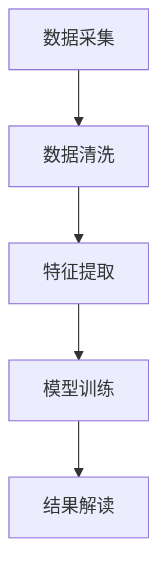

                 


# AI驱动的竞争对手分析：全面评估投资标的的市场地位

> 关键词：AI驱动，竞争对手分析，市场地位，投资评估，机器学习，自然语言处理，数据挖掘

> 摘要：随着AI技术的迅速发展，竞争对手分析方法也在不断进化。本文详细探讨了如何利用AI技术进行竞争对手分析，以全面评估投资标的的市场地位。通过介绍背景、核心概念、算法原理、系统设计和项目实战，文章旨在为读者提供一个系统化的视角，帮助他们在投资决策中做出更明智的选择。

---

## 第1章: 背景介绍

### 1.1 AI驱动的竞争对手分析概述

#### 1.1.1 问题背景与重要性

在商业竞争日益激烈的今天，准确评估竞争对手的市场地位对于企业制定战略至关重要。传统的竞争对手分析依赖于人工收集和整理数据，耗时且效率低下。随着AI技术的兴起，通过机器学习和自然语言处理等技术，可以更高效地进行竞争对手分析，帮助企业快速获取市场洞察。

#### 1.1.2 问题描述与目标

竞争对手分析的目标是识别竞争对手的市场地位、优势和劣势，以便制定有效的竞争策略。本文旨在探讨如何利用AI技术，从海量数据中提取关键信息，评估投资标的的市场表现。

#### 1.1.3 解决方案与边界

AI驱动的竞争对手分析解决方案包括数据采集、清洗、特征提取、模型训练和结果解读。本文的边界包括仅分析公开数据，不涉及内部机密信息，并专注于市场地位评估，而非财务分析。

#### 1.1.4 核心概念与要素

AI驱动的竞争对手分析涉及数据、模型、算法和结果解读等核心要素。通过这些要素，可以系统性地评估竞争对手的市场地位。

---

## 第2章: 核心概念与理论基础

### 2.1 AI驱动分析的核心概念

#### 2.1.1 数据驱动与AI分析的关系

数据是AI分析的基础，AI技术通过分析数据提供洞察。数据驱动的方法使分析更加客观和高效。

#### 2.1.2 市场地位评估的关键指标

关键指标包括市场份额、品牌影响力、客户满意度等。这些指标帮助评估投资标的的市场表现。

#### 2.1.3 竞争对手分析的框架模型

本文提出了一个框架模型，包括数据采集、特征提取、模型训练和结果解读四个步骤。

### 2.2 理论基础与方法论

#### 2.2.1 数据挖掘与机器学习基础

数据挖掘技术用于从数据中提取模式，机器学习模型用于预测市场趋势。

#### 2.2.2 自然语言处理在文本分析中的应用

自然语言处理技术用于分析文本数据，提取竞争对手的产品评价和市场反馈。

#### 2.2.3 图论与网络分析在竞争关系中的应用

图论用于分析竞争网络，识别关键竞争对手和潜在威胁。

---

## 第3章: AI驱动分析的算法原理

### 3.1 常用算法与模型

#### 3.1.1 机器学习模型（如随机森林、XGBoost）

随机森林和XGBoost是常用的分类模型，用于预测市场地位。

#### 3.1.2 自然语言处理模型（如BERT、GPT）

BERT和GPT用于文本分析，提取竞争对手的产品优势。

#### 3.1.3 图神经网络模型

图神经网络用于分析竞争网络结构，识别关键节点。

### 3.2 竞争对手分析的特征工程

#### 3.2.1 数据清洗与预处理

数据清洗包括去除缺失值和异常值，预处理包括标准化和归一化。

#### 3.2.2 特征提取与选择

特征提取包括文本向量化和数值特征提取，特征选择使用主成分分析。

#### 3.2.3 特征工程的代码实现

使用Python代码实现特征工程，包括文本向量化和特征选择。

### 3.3 模型训练与优化

#### 3.3.1 模型训练流程

模型训练包括数据分割、模型训练、验证和调优。

#### 3.3.2 超参数调优与评估指标

使用网格搜索调优模型，评估指标包括准确率、召回率和F1分数。

#### 3.3.3 模型部署与实时预测

部署模型到生产环境，实时预测竞争对手的市场地位。

---

## 第4章: 系统分析与架构设计

### 4.1 系统分析与设计

#### 4.1.1 问题场景与需求分析

分析竞争对手的市场地位，需求包括数据采集、清洗、特征提取、模型训练和结果解读。

#### 4.1.2 系统功能模块划分

系统功能模块包括数据采集模块、数据清洗模块、特征提取模块、模型训练模块和结果解读模块。

#### 4.1.3 系统架构设计

系统架构采用分层设计，包括数据层、业务逻辑层和表现层。

### 4.2 系统架构图

#### 4.2.1 系统架构的mermaid图



---

## 第5章: 项目实战

### 5.1 环境安装与数据采集

#### 5.1.1 环境配置

安装Python和必要的库，如scikit-learn、BERT、Keras。

#### 5.1.2 数据采集

通过网络爬虫采集竞争对手的产品评论和市场份额数据。

### 5.2 系统核心实现源代码

#### 5.2.1 特征提取代码

```python
import pandas as pd
from sklearn.feature_extraction.text import TfidfVectorizer

# 文本数据
texts = ["Product A is great", "Product B is better"]
vectorizer = TfidfVectorizer()
X = vectorizer.fit_transform(texts)
```

#### 5.2.2 模型训练代码

```python
from sklearn.ensemble import RandomForestClassifier
from sklearn.model_selection import train_test_split

# 训练数据
X_train, X_test, y_train, y_test = train_test_split(X, y, test_size=0.2)
model = RandomForestClassifier()
model.fit(X_train, y_train)
```

### 5.3 代码应用解读与分析

通过特征提取代码，将文本数据转换为TF-IDF向量。模型训练代码使用随机森林分类器预测竞争对手的市场地位。

### 5.4 实际案例分析

以具体公司为例，展示如何通过AI技术进行竞争对手分析，评估其市场地位。

### 5.5 项目小结

总结项目实施过程，强调AI技术在提升竞争对手分析效率和准确性中的作用。

---

## 第6章: 小结与展望

### 6.1 小结

本文详细介绍了AI驱动的竞争对手分析方法，包括数据采集、特征提取、模型训练和结果解读。

### 6.2 未来展望

未来，AI技术将更加智能化，可能引入更复杂的模型如Transformer架构，进一步提升分析精度。

---

## 作者

作者：AI天才研究院/AI Genius Institute & 禅与计算机程序设计艺术 /Zen And The Art of Computer Programming

