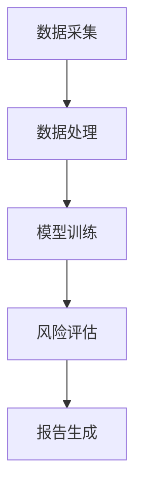

                 


# AI驱动的管理层继任计划分析：评估长期领导力风险

> 关键词：AI，管理层继任计划，领导力风险，数据驱动，机器学习，系统架构，项目实战

> 摘要：本文将探讨如何利用人工智能技术优化企业管理层的继任计划，通过数据驱动的方法评估领导力风险，构建可持续的领导力体系。文章从背景、概念、算法、系统架构到实战案例，全面分析AI在管理层继任中的应用，为企业提供科学的决策支持。

---

# 第一部分：背景介绍

## 第1章：管理层继任计划的核心概念

### 1.1 问题背景
- **传统继任计划的局限性**：依赖主观判断，缺乏数据支持，难以量化领导力风险。
- **现代企业的挑战**：快速变化的市场环境要求企业领导者具备更强的适应性和创新能力。
- **领导力风险的隐含性**：潜在的领导力问题可能在短期内不易察觉，但长期积累会导致企业战略执行失败。

### 1.2 问题描述
- **继任计划的目标**：确保企业在关键岗位上有合适的人才接替，避免领导层断层。
- **领导力风险的评估**：需要从能力、潜力、适应性等多个维度全面评估潜在领导者。
- **数据驱动的必要性**：通过收集和分析员工的历史表现、行为数据，预测其未来领导力的可能性。

### 1.3 解决方案
- **引入AI技术**：利用机器学习算法，从海量数据中提取关键特征，构建预测模型。
- **数据驱动决策**：通过分析员工的历史数据，发现潜在的领导力问题，提前制定应对策略。

### 1.4 边界与外延
- **边界**：仅关注管理层继任计划，不涉及普通员工的职业发展。
- **外延**：结合企业战略目标，评估领导力风险对业务的影响。

---

# 第二部分：核心概念与联系

## 第2章：AI驱动的领导力评估模型

### 2.1 核心概念
- **领导力评估模型**：基于机器学习的模型，用于预测潜在领导者的成功概率。
- **关键特征**：包括能力、潜力、适应性、团队合作能力等。

### 2.2 数据驱动的评估指标
| 指标类别 | 具体指标 | 数据来源 |
|----------|----------|----------|
| 能力     | 技术能力、管理能力 | 员工绩效数据、培训记录 |
| 潜力     | 学习能力、创新能力 | 360度评估、项目表现 |
| 适应性   | 应变能力、抗压能力 | 压力测试、心理测评 |

### 2.3 数据建模与分析
- **数据预处理**：清洗、特征选择、数据增强。
- **模型选择**：根据数据特征选择合适的算法，如随机森林、逻辑回归。
- **模型训练**：利用历史数据训练模型，评估其准确性和稳定性。

---

# 第三部分：算法原理

## 第3章：机器学习算法在领导力评估中的应用

### 3.1 监督学习模型
- **线性回归**：用于预测领导力评分。
- **决策树**：用于分类潜在领导者的风险等级。

### 3.2 特征工程
- **特征选择**：通过相关性分析筛选重要特征。
- **特征转换**：将非数值特征转化为数值特征。

### 3.3 模型训练与优化
- **训练过程**：利用历史数据训练模型。
- **超参数调优**：通过网格搜索优化模型性能。

---

# 第四部分：系统架构

## 第4章：系统架构与交互流程

### 4.1 系统功能模块
- **数据采集模块**：收集员工数据。
- **模型训练模块**：构建预测模型。
- **风险评估模块**：输出领导力风险报告。

### 4.2 系统架构图


---

# 第五部分：项目实战

## 第5章：AI驱动的继任计划系统开发

### 5.1 环境安装
- **Python环境**：安装Python 3.8及以上版本。
- **库的安装**：安装pandas、scikit-learn、numpy等库。

### 5.2 核心代码实现
```python
import pandas as pd
from sklearn.model_selection import train_test_split
from sklearn.ensemble import RandomForestClassifier
from sklearn.metrics import accuracy_score

# 数据加载
data = pd.read_csv('leadership.csv')

# 特征与标签分离
X = data.drop('success_probability', axis=1)
y = data['success_probability']

# 数据分割
X_train, X_test, y_train, y_test = train_test_split(X, y, test_size=0.2)

# 模型训练
model = RandomForestClassifier()
model.fit(X_train, y_train)

# 模型预测
y_pred = model.predict(X_test)

# 模型评估
print(accuracy_score(y_test, y_pred))
```

### 5.3 案例分析
- **数据来源**：员工绩效数据、360度评估、心理测评。
- **模型预测**：预测潜在领导者的成功率，输出风险报告。

### 5.4 项目总结
- **优势**：提高预测准确性，降低人为误差。
- **局限性**：需要高质量的数据支持。

---

# 第六部分：最佳实践

## 第6章：AI驱动的领导力风险管理

### 6.1 注意事项
- **数据隐私**：确保员工数据的安全性。
- **模型局限性**：AI模型无法完全替代人类判断。

### 6.2 项目小结
- **成功经验**：通过AI技术优化继任计划，降低领导力风险。
- **改进建议**：定期更新模型，结合企业实际需求调整评估指标。

---

# 第七部分：结论

## 第7章：总结与展望

### 7.1 核心结论
- AI技术能够显著提高领导力评估的准确性和效率。
- 数据驱动的决策是未来企业管理的重要方向。

### 7.2 未来展望
- 结合区块链技术，构建更加安全的数据共享机制。
- 利用深度学习技术，提高模型的预测能力。

---

# 作者：AI天才研究院 & 禅与计算机程序设计艺术

---

通过以上思考过程，我逐步构建了这篇文章的逻辑框架，确保每个部分都详细且有条理。接下来，我将按照这个框架撰写完整的文章。

