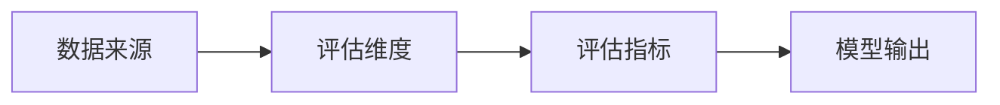
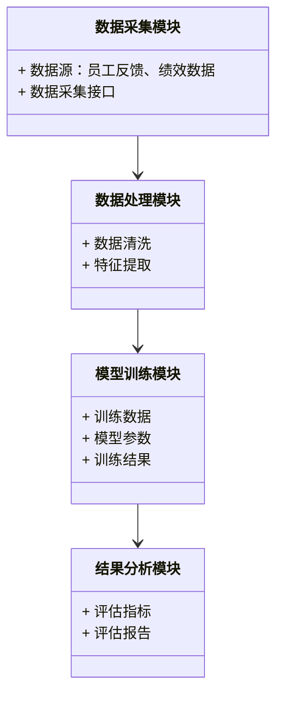
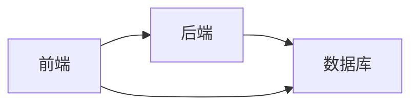
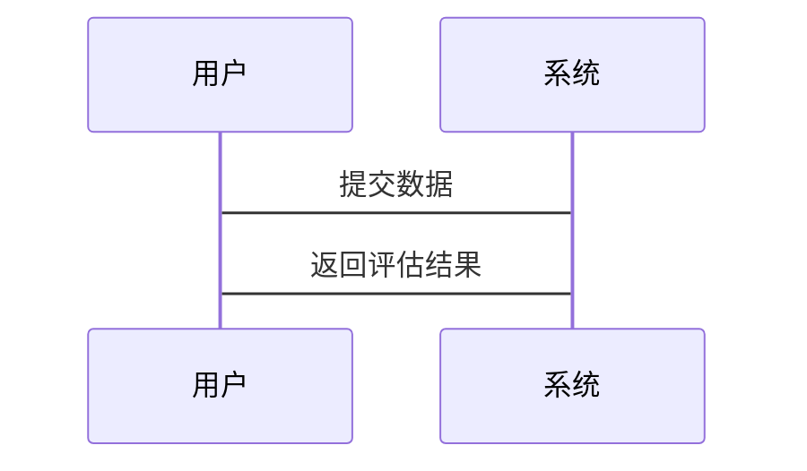

                 


# AI驱动的管理层能力评估：量化领导力对公司价值的影响

## 关键词：AI驱动，领导力评估，量化领导力，公司价值，人工智能，领导力模型

## 摘要：  
本文探讨了利用人工智能技术量化领导力对公司价值的影响。通过构建AI驱动的领导力评估模型，分析领导力的多维度特征，并结合具体案例，展示了如何将领导力转化为可量化的价值指标。文章从理论到实践，详细阐述了AI在领导力评估中的应用，包括算法原理、系统架构和项目实战，最终总结了AI驱动领导力评估的潜力与挑战。

---

## 第一部分: AI驱动的管理层能力评估概述

### 第1章: 背景与概述

#### 1.1 领导力评估的现状与挑战

- **1.1.1 领导力评估的传统方法**  
  传统领导力评估主要依赖主观评价，如360度反馈、绩效考核和性格测试。这些方法虽然有一定参考价值，但存在数据片面、评估结果不稳定等问题。

- **1.1.2 传统方法的局限性**  
  传统评估方法难以量化领导力对公司价值的具体影响，且容易受到主观偏见的影响。此外，数据碎片化和动态变化的环境使得传统方法难以捕捉领导力的动态特征。

- **1.1.3 AI技术如何解决评估难题**  
  AI技术可以通过大数据分析和机器学习算法，将领导力的多维度特征转化为可量化的指标，从而更准确地评估领导力对公司的影响。

#### 1.2 AI技术的发展与应用

- **1.2.1 AI技术的演进历程**  
  AI技术从早期的规则引擎到现在的深度学习，经历了多次变革。近年来，深度学习和自然语言处理技术的快速发展为领导力评估提供了新的可能性。

- **1.2.2 AI在企业管理中的应用现状**  
  AI技术已经在招聘、员工绩效评估、团队协作分析等领域得到广泛应用。通过AI技术，企业能够更高效地识别高潜力领导者。

- **1.2.3 AI驱动领导力评估的潜力**  
  AI技术能够将领导力评估从定性分析转化为定量分析，帮助企业更精准地识别领导力优劣，优化管理层结构。

#### 1.3 问题背景与目标

- **1.3.1 领导力对公司价值的影响**  
  领导力是企业成功的关键因素之一，优秀的领导者能够带领团队实现更高的绩效目标。

- **1.3.2 量化领导力的必要性**  
  通过量化领导力，企业可以更清晰地了解领导者对公司价值的具体贡献，从而制定更科学的管理决策。

- **1.3.3 本书的研究目标**  
  本书旨在构建一个基于AI的领导力评估模型，量化领导力对公司价值的影响，并提供实际应用案例。

#### 1.4 本书结构与内容

- **1.4.1 核心章节介绍**  
  本书分为七章，涵盖背景介绍、领导力评估框架、AI算法原理、系统架构、项目实战、数学模型和总结展望。

- **1.4.2 实战案例分析**  
  通过具体案例分析，展示AI技术在领导力评估中的实际应用。

- **1.4.3 最佳实践总结**  
  总结AI驱动领导力评估的最佳实践，为企业提供参考。

---

### 第2章: 领导力评估的核心概念

#### 2.1 领导力的维度与特征

- **2.1.1 领导力的五大学派**  
  领导力理论主要包括特质理论、行为理论、情景理论、变革理论和资源依恋理论。每种理论都有其独特的视角，为领导力评估提供了理论基础。

- **2.1.2 领导力的四大维度**  
  领导力可以从以下几个维度进行评估：
  - **愿景设定能力**：领导者是否能够明确团队目标并制定清晰的愿景。
  - **决策能力**：领导者在决策过程中的准确性和速度。
  - **团队协作能力**：领导者促进团队协作和沟通的能力。
  - **影响力**：领导者在团队中的影响力和说服力。

- **2.1.3 各维度的特征对比**  
  通过对比分析，明确每个维度的特征及其对领导力的影响。

| 维度         | 特征                           | 影响因素                  |
|--------------|--------------------------------|---------------------------|
| 愿景设定能力 | 明确性、创新性、可实现性       | 团队目标、员工积极性       |
| 决策能力     | 准确性、速度、风险意识         | 企业绩效、团队稳定性       |
| 团队协作能力 | 沟通能力、冲突解决能力、激励能力 | 团队凝聚力、员工满意度     |
| 影响力       | 说服力、情感共鸣、权威性       | 团队执行力、员工忠诚度     |

#### 2.2 量化领导力的模型框架

- **2.2.1 模型的核心要素**  
  量化领导力模型包括以下核心要素：
  - 数据来源：包括员工反馈、绩效数据、领导行为记录等。
  - 评估维度：愿景设定能力、决策能力、团队协作能力和影响力。
  - 评估指标：通过量化指标（如KPI）衡量领导力。

- **2.2.2 各要素之间的关系**  
  通过构建因果关系图，展示各要素之间的相互作用。



- **2.2.3 模型的构建步骤**  
  1. 数据收集：整合多源数据，包括员工反馈、绩效数据等。
  2. 数据预处理：清洗数据，消除噪声。
  3. 模型训练：基于机器学习算法，训练领导力评估模型。
  4. 模型验证：通过交叉验证，评估模型的准确性和稳定性。

#### 2.3 领导力与公司价值的关系

- **2.3.1 领导力对业绩的影响**  
  优秀的领导者能够提升团队绩效，推动公司业绩增长。

- **2.3.2 领导力的间接影响**  
  领导力通过影响团队文化、员工满意度等方面间接影响公司价值。

- **2.3.3 量化模型的应用场景**  
  量化模型可以应用于领导力培养、团队优化和组织结构调整等领域。

#### 2.4 本章小结

---

### 第3章: AI驱动的领导力评估算法原理

#### 3.1 算法选择与原理

- **3.1.1 算法选择**  
  基于自然语言处理和机器学习技术，选择适合领导力评估的算法，如支持向量机（SVM）和随机森林（Random Forest）。

- **3.1.2 算法原理**  
  以支持向量机为例，详细讲解算法的工作原理。

  支持向量机是一种监督学习算法，适用于分类问题。其核心思想是通过构建超平面，将数据分成不同的类别。

  $$ \text{损失函数} = \sum_{i=1}^{n} \max(0, 1 - y_i(\omega \cdot x_i + b)) $$

  其中，$\omega$ 是权重向量，$b$ 是偏置项，$y_i$ 是标签，$x_i$ 是输入数据。

- **3.1.3 算法流程**  
  1. 数据预处理：特征提取、标准化。
  2. 模型训练：基于训练数据，训练支持向量机模型。
  3. 模型评估：通过测试数据评估模型性能。

#### 3.2 算法实现与优化

- **3.2.1 算法实现**  
  使用Python代码实现支持向量机模型，代码如下：

  ```python
  from sklearn.svm import SVC
  from sklearn.model_selection import train_test_split
  from sklearn.metrics import accuracy_score

  # 加载数据
  data = [...]  # 数据集
  target = [...]  # 标签

  # 分割数据
  X_train, X_test, y_train, y_test = train_test_split(data, target, test_size=0.2)

  # 训练模型
  model = SVC()
  model.fit(X_train, y_train)

  # 模型评估
  y_pred = model.predict(X_test)
  print("Accuracy:", accuracy_score(y_test, y_pred))
  ```

- **3.2.2 算法优化**  
  通过网格搜索（Grid Search）优化模型参数，提升模型性能。

---

### 第4章: 系统分析与架构设计

#### 4.1 系统功能设计

- **4.1.1 功能模块**  
  - 数据采集模块：收集领导力相关数据。
  - 数据处理模块：清洗和预处理数据。
  - 模型训练模块：训练领导力评估模型。
  - 结果分析模块：输出评估结果和报告。

- **4.1.2 领域模型**  
  通过类图展示系统各模块之间的关系。



#### 4.2 系统架构设计

- **4.2.1 系统架构图**  
  展示系统的整体架构，包括前端、后端和数据库。



- **4.2.2 接口设计**  
  详细描述系统各模块之间的接口，如数据采集接口、模型训练接口等。

- **4.2.3 交互流程图**  
  展示用户与系统之间的交互流程。



---

### 第5章: 项目实战与应用

#### 5.1 项目背景与目标

- **5.1.1 项目背景**  
  以某科技公司为例，介绍项目背景和目标。

- **5.1.2 数据准备**  
  收集领导力相关数据，包括员工反馈、绩效数据等。

- **5.1.3 数据清洗与预处理**  
  清洗数据，处理缺失值和异常值。

#### 5.2 模型训练与评估

- **5.2.1 模型训练**  
  使用Python代码训练模型。

  ```python
  from sklearn.ensemble import RandomForestClassifier
  from sklearn.metrics import classification_report

  # 数据准备
  X = [...]  # 特征矩阵
  y = [...]  # 标签向量

  # 训练模型
  model = RandomForestClassifier()
  model.fit(X, y)

  # 模型预测
  y_pred = model.predict(X)
  print(classification_report(y, y_pred))
  ```

- **5.2.2 模型评估**  
  通过准确率、召回率等指标评估模型性能。

#### 5.3 结果分析与优化

- **5.3.1 结果分析**  
  解释模型输出的评估结果，分析领导力的优缺点。

- **5.3.2 模型优化**  
  根据评估结果，优化模型参数，提升评估精度。

---

### 第6章: 数学模型与公式推导

#### 6.1 领导力评估的数学模型

- **6.1.1 线性回归模型**  
  使用线性回归模型预测领导力对绩效的影响。

  $$ y = \beta_0 + \beta_1 x_1 + \beta_2 x_2 + \epsilon $$

  其中，$y$ 是绩效指标，$x_1$ 和 $x_2$ 是领导力相关特征，$\beta$ 是回归系数，$\epsilon$ 是误差项。

- **6.1.2 逻辑回归模型**  
  使用逻辑回归模型进行二分类问题，如判断领导力是否优秀。

  $$ P(y=1|x) = \frac{1}{1 + e^{-(\beta_0 + \beta_1 x_1 + \beta_2 x_2)}} $$

- **6.1.3 神经网络模型**  
  使用深度学习模型，如卷积神经网络（CNN）进行领导力评估。

---

### 第7章: 总结与展望

#### 7.1 本书总结

- **7.1.1 核心观点回顾**  
  回顾本书的核心观点，强调AI技术在领导力评估中的重要性。

- **7.1.2 实战经验总结**  
  总结项目实战中的经验教训，提出改进建议。

- **7.1.3 未来研究方向**  
  展望AI驱动领导力评估的未来发展方向，如实时评估、动态调整等。

#### 7.2 注意事项与建议

- **7.2.1 应用中的注意事项**  
  提醒读者在实际应用中注意数据隐私、模型泛化能力等问题。

- **7.2.2 最佳实践建议**  
  提供一些实用的建议，如数据多样化、模型定期更新等。

#### 7.3 拓展阅读

- **7.3.1 推荐书籍**  
  推荐一些与领导力评估和AI技术相关的书籍。

- **7.3.2 推荐论文**  
  推荐一些最新的研究成果，供读者深入阅读。

---

## 作者信息

作者：AI天才研究院/AI Genius Institute & 禅与计算机程序设计艺术 /Zen And The Art of Computer Programming

---

以上是《AI驱动的管理层能力评估：量化领导力对公司价值的影响》的技术博客文章的详细目录和内容结构。

