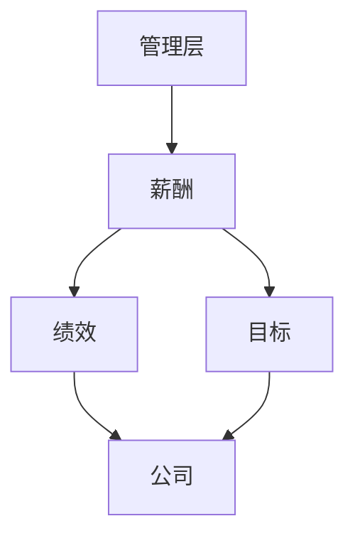
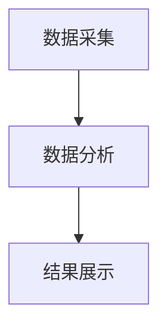

                 


# AI驱动的管理层薪酬分析：评估利益一致性

## 关键词：AI技术，管理层薪酬分析，利益一致性，激励机制，企业绩效管理，利益冲突，数学建模

## 摘要：  
在现代企业管理中，管理层的薪酬设计直接影响着企业的绩效和员工的积极性。然而，传统的薪酬分析方法往往难以准确评估管理层的利益一致性。本文通过引入人工智能技术，提出了一种基于AI的管理层薪酬分析方法，旨在构建一个能够量化管理层薪酬与公司利益一致性的数学模型，从而优化薪酬结构，确保管理层的行为与公司目标保持一致。本文将从问题背景、核心概念、算法原理、系统设计到实际应用进行详细阐述，为企业的薪酬管理提供新的思路和解决方案。

---

# 正文

## 第一章：管理层薪酬分析的背景与问题

### 1.1 问题背景
现代企业中，管理层的薪酬设计是企业治理的重要组成部分。合理的薪酬结构能够激励管理层积极为公司创造价值，而设计不当的薪酬结构可能导致管理层的行为偏离公司利益。例如，短期绩效导向的薪酬设计可能促使管理层为短期业绩造假，而长期激励不足则可能导致管理层缺乏长期目标感。

#### 1.1.1 管理层薪酬分析的核心目标
管理层薪酬分析的核心目标在于评估薪酬结构是否能够有效激励管理层为公司创造长期价值，同时避免利益冲突。具体来说，薪酬分析需要回答以下问题：
- 薪酬结构是否与公司绩效密切相关？
- 薪酬分配是否公平合理？
- 薪酬设计是否能够有效激励管理层？

#### 1.1.2 当前薪酬分析方法的局限性
传统的薪酬分析方法通常基于简单的统计分析，例如回归分析，难以捕捉管理层行为与公司绩效之间的复杂关系。此外，传统方法往往忽视了管理层的主观决策和外部环境的不确定性。

### 1.2 问题描述
利益一致性问题是管理层薪酬分析的核心问题。如果管理层的个人利益与公司利益不一致，可能导致以下后果：
- 管理层可能为追求个人利益而损害公司利益。
- 股东价值无法最大化。
- 公司治理效率低下。

#### 1.2.1 利益一致性模型的构建
为了量化管理层的个人利益与公司利益之间的关系，我们需要构建一个利益一致性模型。该模型需要考虑以下因素：
- 管理层的薪酬结构（如股票期权、奖金等）。
- 公司绩效的衡量指标（如股价、净利润等）。
- 管理层的决策行为（如投资决策、并购决策等）。

#### 1.2.2 利益一致性模型的数学表达
利益一致性模型可以表示为：
$$
\text{利益一致性} = \alpha \cdot \text{个人收益} + \beta \cdot \text{公司收益}
$$
其中，$\alpha$ 和 $\beta$ 是权重系数，用于衡量个人收益和公司收益的相对重要性。

### 1.3 问题解决方法
引入人工智能技术可以有效解决传统薪酬分析方法的局限性。通过AI技术，我们可以构建一个动态的、非线性的利益一致性模型，能够实时捕捉管理层行为与公司绩效之间的复杂关系。

#### 1.3.1 AI技术在薪酬分析中的应用优势
- 数据处理能力：AI能够处理大量非结构化数据，如文本、图像等。
- 动态建模：AI能够构建动态模型，捕捉管理层行为与公司绩效之间的非线性关系。
- 实时反馈：AI系统可以实时监控管理层行为，提供及时的反馈。

#### 1.3.2 利益一致性评估的AI驱动框架
AI驱动的管理层薪酬分析框架包括以下几个步骤：
1. 数据采集：收集管理层的薪酬数据、公司绩效数据、市场环境数据等。
2. 数据预处理：清洗数据，提取特征。
3. 模型训练：构建利益一致性模型，训练AI算法。
4. 结果分析：评估模型的性能，优化模型参数。
5. 反馈与优化：根据模型输出结果，优化薪酬结构。

---

## 第二章：核心概念与联系

### 2.1 利益一致性模型的原理
利益一致性模型的核心在于量化管理层的个人收益与公司收益之间的关系。通过分析管理层的决策行为和公司绩效，我们可以评估其行为是否符合公司利益。

#### 2.1.1 利益一致性模型的定义
利益一致性模型是一个动态的、非线性的数学模型，用于量化管理层的个人收益与公司收益之间的关系。模型的输入包括管理层的薪酬结构、公司绩效指标、市场环境等，输出是一个利益一致性指数。

#### 2.1.2 模型的核心属性与特征
- **动态性**：模型能够捕捉管理层行为与公司绩效之间的动态关系。
- **非线性**：管理层行为与公司绩效之间的关系往往是非线性的。
- **可解释性**：模型需要具备较高的可解释性，以便企业能够根据模型输出结果优化薪酬结构。

### 2.2 核心概念的ER实体关系图
为了更好地理解利益一致性模型的实体关系，我们可以绘制一个ER实体关系图：



---

## 第三章：算法原理与实现

### 3.1 利益一致性评估算法
利益一致性评估算法的核心在于构建一个能够量化管理层个人收益与公司收益之间关系的数学模型。

#### 3.1.1 算法原理概述
利益一致性评估算法基于博弈论模型和强化学习算法。通过模拟管理层的决策行为，我们可以预测其行为对公司绩效的影响。

#### 3.1.2 算法的数学模型
利益一致性模型可以表示为：
$$
\text{利益一致性} = \sum_{i=1}^{n} w_i x_i
$$
其中，$w_i$ 是权重系数，$x_i$ 是特征变量。

#### 3.1.3 算法的Python实现
以下是一个简单的利益一致性评估算法的Python实现示例：

```python
import numpy as np

def incentive_model(performance, target):
    alpha = 0.7
    beta = 0.3
    return alpha * performance + beta * target

performance = np.array([85, 90, 88])
target = np.array([100, 95, 98])
result = incentive_model(performance, target)
print(result)
```

---

## 第四章：数学模型与公式推导

### 4.1 利益一致性函数
利益一致性函数是利益一致性模型的核心部分。通过数学建模，我们可以量化管理层的个人收益与公司收益之间的关系。

#### 4.1.1 利益一致性函数的构建
利益一致性函数可以表示为：
$$
f(x) = \sum_{i=1}^{n} w_i x_i
$$
其中，$w_i$ 是权重系数，$x_i$ 是特征变量。

#### 4.1.2 优化目标
我们的优化目标是最大化利益一致性指数：
$$
\max f(x) = \sum_{i=1}^{n} w_i x_i
$$

#### 4.1.3 约束条件
利益一致性模型的约束条件包括：
$$
\sum_{i=1}^{n} w_i = 1
$$
$$
w_i \geq 0 \quad \forall i
$$

### 4.2 优化模型
为了优化利益一致性函数，我们可以使用拉格朗日乘数法。

#### 4.2.1 拉格朗日函数
拉格朗日函数可以表示为：
$$
L = \sum_{i=1}^{n} w_i x_i - \lambda \left(\sum_{i=1}^{n} w_i - 1\right)
$$

#### 4.2.2 优化过程
通过对拉格朗日函数求导并令导数为零，我们可以求得最优权重系数：
$$
\frac{\partial L}{\partial w_i} = x_i - \lambda = 0 \quad \Rightarrow \quad w_i = \lambda
$$

---

## 第五章：系统分析与架构设计

### 5.1 问题场景介绍
在实际应用中，我们需要设计一个能够实时监控管理层行为和公司绩效的系统。

#### 5.1.1 系统功能需求
- 数据采集：实时采集管理层的薪酬数据、公司绩效数据、市场环境数据等。
- 数据分析：构建利益一致性模型，评估管理层的行为是否符合公司利益。
- 结果展示：可视化结果，提供优化建议。

#### 5.1.2 系统架构设计
系统的架构设计包括以下几个部分：
1. 数据采集模块：负责采集数据。
2. 数据分析模块：负责构建和优化利益一致性模型。
3. 结果展示模块：负责可视化结果。

### 5.2 系统架构图
以下是一个简单的系统架构图：



---

## 第六章：项目实战

### 6.1 环境安装
为了实现利益一致性评估系统，我们需要安装以下工具：
- Python
- NumPy
- Matplotlib

### 6.2 系统核心实现
以下是一个简单的利益一致性评估系统的Python实现示例：

```python
import numpy as np
import matplotlib.pyplot as plt

def incentive_model(performance, target):
    alpha = 0.7
    beta = 0.3
    return alpha * performance + beta * target

performance = np.array([85, 90, 88])
target = np.array([100, 95, 98])
result = incentive_model(performance, target)
print(result)

plt.plot(result)
plt.xlabel('时间')
plt.ylabel('利益一致性指数')
plt.show()
```

### 6.3 代码解读与应用
上述代码实现了一个简单的利益一致性评估系统。通过输入管理层的绩效和目标，我们可以输出利益一致性指数，并通过图形化界面进行展示。

---

## 第七章：最佳实践与总结

### 7.1 本章总结
本文通过引入人工智能技术，提出了一种基于AI的管理层薪酬分析方法，旨在构建一个能够量化管理层个人收益与公司收益之间关系的数学模型。通过数学建模和算法优化，我们可以有效评估管理层的行为是否符合公司利益，并为企业的薪酬管理提供新的思路和解决方案。

### 7.2 最佳实践
- 在实际应用中，我们需要根据具体业务需求调整模型参数。
- 系统需要定期更新数据，以保证模型的准确性和实时性。

### 7.3 拓展阅读
- 《博弈论与经济行为》
- 《强化学习导论》
- 《企业绩效管理》

---

# 作者：AI天才研究院/AI Genius Institute & 禅与计算机程序设计艺术 /Zen And The Art of Computer Programming

