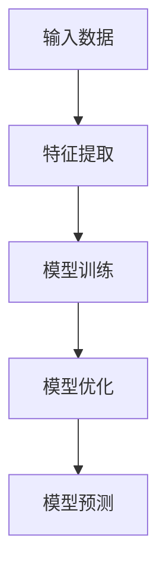
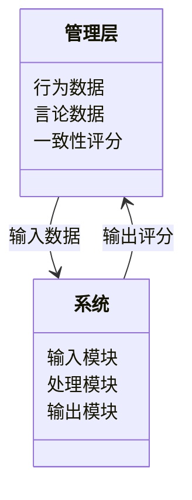
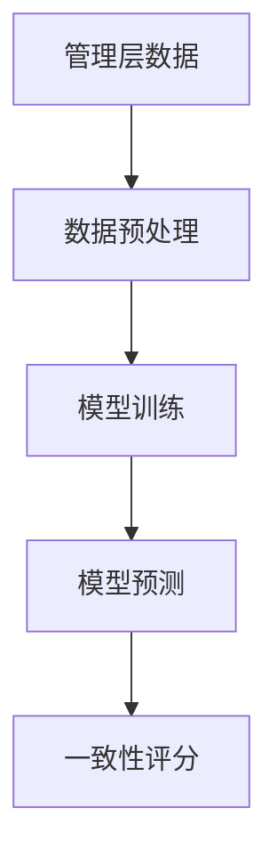
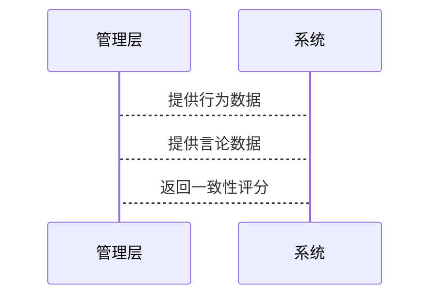

                 


# AI驱动的管理层言行一致性分析：深入洞察公司治理

**关键词**：AI、管理层言行一致性、公司治理、自然语言处理、行为分析、深度学习

**摘要**：  
随着人工智能技术的快速发展，公司治理中的管理层言行一致性分析成为了一个新兴的研究领域。本文深入探讨了如何利用AI技术，特别是自然语言处理和深度学习，来分析和评估管理层的言行一致性。通过构建一致性的分析模型、行为分析框架和算法实现，本文为公司治理提供了一种全新的视角和方法。文章从问题背景、核心理论、算法原理、系统设计到项目实战，全面解析了AI驱动的管理层言行一致性分析的实现过程，并通过实际案例展示了其在公司治理中的应用价值。

---

## 第1章: 管理层言行一致性分析的背景与问题

### 1.1 管理层言行一致性的概念与重要性

#### 1.1.1 管理层言行一致性的定义
管理层言行一致性是指公司高层管理者在公开声明（如会议发言、财报解读、公司公告等）与实际行为（如决策、投资、管理风格等）之间是否存在一致性和可信度。  

**关键点**：  
- 行为一致性：管理者的行为是否与其声明的目标一致。  
- 言论一致性：管理者的言论是否与其行为一致。  
- 时间一致性：管理者在不同时间点的言行是否保持一致。

#### 1.1.2 管理层言行一致性的核心要素
| 要素 | 描述 | 示例 |
|------|------|------|
| **行为数据** | 管理层的决策、投资行为、管理风格等 | 投资决策、人事变动、资本运作 |
| **言论数据** | 管理层的公开演讲、财报解读、公司公告等 | 会议发言、战略规划、业绩预告 |
| **一致性度量** | 行为与言论之间的匹配程度 | 行为与言论的关联性、相关性、一致性指标 |

#### 1.1.3 管理层言行一致性与公司治理的关系
- **公司治理**：管理层的言行一致性直接影响公司的决策质量、员工信任度和外部投资者信心。  
- **股东利益**：管理层言行一致是保障股东利益的重要前提。  
- **企业声誉**：一致性的管理行为有助于提升企业声誉和品牌形象。

---

### 1.2 问题背景与问题描述

#### 1.2.1 当前公司治理中的问题与挑战
- **信息不对称**：管理层与股东之间存在信息不对称，导致难以准确评估管理层的言行一致性。  
- **数据复杂性**：管理层的言行数据来源多样，包括文本、行为数据等，整合和分析难度大。  
- **主观性问题**：传统的评估方法依赖于人工判断，主观性强，缺乏客观依据。

#### 1.2.2 管理层言行不一致对公司的影响
- **决策失误**：管理层言行不一致可能导致公司战略混乱，影响市场信心。  
- **利益冲突**：管理层的短期利益与公司长期目标不一致，可能损害股东利益。  
- **信任危机**：言行不一致的管理层容易引发员工和客户的信任危机。

#### 1.2.3 问题解决的必要性与紧迫性
- **提升决策透明度**：通过AI技术，实现管理层言行数据的自动化分析，提高决策透明度。  
- **降低治理成本**：利用AI技术减少人工分析的时间和成本。  
- **增强企业竞争力**：通过一致的言行管理，提升企业在市场中的竞争力。

---

### 1.3 问题解决的思路与方法

#### 1.3.1 传统方法的局限性
- **人工分析**：耗时长、成本高、主观性强。  
- **单一数据源**：传统方法通常只关注行为或言论，缺乏多源数据的整合分析。  
- **缺乏量化指标**：传统方法难以提供量化的一致性评估指标。

#### 1.3.2 AI技术在问题解决中的优势
- **自动化分析**：AI能够快速处理大规模的文本和行为数据，提高分析效率。  
- **多源数据融合**：AI技术可以整合文本、行为、市场反应等多种数据源，提供更全面的分析结果。  
- **量化评估**：AI可以通过数学模型，提供一致性的量化指标，便于比较和分析。

#### 1.3.3 问题解决的边界与外延
- **边界**：本研究仅关注管理层的言行一致性，不涉及其他治理问题（如股权结构、董事会治理等）。  
- **外延**：未来可以扩展到其他治理问题，如公司透明度、内部控制等。

---

### 1.4 核心概念与联系

#### 1.4.1 管理层言行一致性分析的理论基础
- **一致性分析模型**：通过行为和言论数据，构建一致性评估模型。  
- **行为分析框架**：基于行为数据，分析管理层的决策风格和行为模式。  
- **言论分析框架**：基于文本数据，分析管理层的沟通风格和语言特征。

#### 1.4.2 核心概念的属性特征对比
| 概念 | 属性 | 特征 |
|------|------|------|
| **行为数据** | 时间性 | 数据具有时间序列特征 |
| **言论数据** | 文本性 | 数据以文本形式存在 |
| **一致性度量** | 数量化 | 以数值形式量化一致性程度 |

#### 1.4.3 实体关系图（ER图）

```mermaid
erd
    管理层
    行为数据
    言论数据
    一致性评估

    管理层 --> 行为数据: 产生
    管理层 --> 言论数据: 产生
    行为数据 --> 一致性评估: 输入
    言论数据 --> 一致性评估: 输入
```

---

## 第2章: 管理层言行一致性分析的核心理论

### 2.1 一致性分析模型

#### 2.1.1 模型的构建逻辑
- **输入**：行为数据和言论数据。  
- **输出**：一致性评估指标（0-1之间）。  
- **过程**：通过特征提取、模型训练和预测，得出一致性评估结果。

#### 2.1.2 模型的输入与输出
- **输入**：行为数据（如投资决策、人事变动）和言论数据（如会议发言）。  
- **输出**：一致性评分（如0.8表示较高一致性）。

#### 2.1.3 模型的关键参数与假设
- **参数**：相似性度量方法（如余弦相似度）、特征权重等。  
- **假设**：管理层的言行数据是可量化的。

---

### 2.2 管理层行为分析框架

#### 2.2.1 行为数据的分类与特征
- **分类**：投资行为、管理行为、资本运作。  
- **特征**：时间性、数量性、关联性。

#### 2.2.2 行为分析的维度与方法
- **维度**：决策频率、决策风险、决策一致性。  
- **方法**：聚类分析、回归分析。

#### 2.2.3 行为分析的数学模型

$$ \text{一致性评分} = \sum_{i=1}^{n} w_i \cdot x_i $$

其中，\( w_i \) 是特征权重，\( x_i \) 是特征值。

---

### 2.3 管理层言论分析框架

#### 2.3.1 言论数据的获取与处理
- **获取**：通过爬虫获取公开演讲、财报解读等文本数据。  
- **处理**：分词、去停用词、情感分析。

#### 2.3.2 言论分析的关键指标
- **关键词频率**：管理层常用关键词的频率。  
- **语言风格**：语言的正式性、复杂性。

#### 2.3.3 言论分析的算法选择
- **算法**：TF-IDF、LDA主题模型。

---

### 2.4 管理层言行一致性的度量方法

#### 2.4.1 度量指标的设计
- **指标**：一致性评分、相关性系数（如皮尔逊系数）。  

$$ r = \frac{\sum (x_i - \bar{x})(y_i - \bar{y})}{\sqrt{\sum (x_i - \bar{x})^2 \sum (y_i - \bar{y})^2}} $$

其中，\( r \) 是相关性系数，\( x_i \) 和 \( y_i \) 分别是行为和言论数据。

#### 2.4.2 度量模型的构建
- **模型**：基于深度学习的序列匹配模型（如BERT）。

---

## 第3章: AI驱动的管理层言行一致性分析算法原理

### 3.1 算法选择与优化

#### 3.1.1 基于深度学习的NLP模型
- **模型**：BERT、GPT。  
- **优化**：微调模型以适应特定任务。

#### 3.1.2 算法的优化与调参
- **参数优化**：学习率、批量大小。  
- **模型调优**：交叉验证、网格搜索。

#### 3.1.3 算法的性能评估
- **指标**：准确率、召回率、F1分数。

---

### 3.2 算法实现的数学模型

#### 3.2.1 模型的数学表达式
$$ y = f(x; \theta) $$

其中，\( y \) 是输出，\( x \) 是输入，\( \theta \) 是模型参数。

#### 3.2.2 模型的训练与优化过程



---

### 3.3 算法实现的代码示例

```python
import numpy as np
from sklearn.metrics.pairwise import cosine_similarity

# 示例数据
behavior = np.array([1, 2, 3])
speech = np.array([2, 3, 4])

# 计算一致性评分
similarity = cosine_similarity(behavior.reshape(1, -1), speech.reshape(1, -1))
score = similarity[0][0]
print(f"一致性评分：{score}")
```

---

## 第4章: 系统分析与架构设计

### 4.1 系统功能设计

#### 4.1.1 领域模型



---

### 4.2 系统架构设计



---

### 4.3 系统接口设计

#### 4.3.1 接口描述
- **输入接口**：接收行为数据和言论数据。  
- **输出接口**：返回一致性评分。

---

### 4.4 系统交互流程



---

## 第5章: 项目实战

### 5.1 环境配置

```bash
pip install numpy scikit-learn
```

---

### 5.2 系统核心实现

```python
import numpy as np
from sklearn.metrics.pairwise import cosine_similarity

def calculate_consistency(behavior_data, speech_data):
    # 特征提取
    behavior_features = np.array(behavior_data)
    speech_features = np.array(speech_data)
    # 计算一致性评分
    similarity = cosine_similarity(behavior_features.reshape(1, -1), speech_features.reshape(1, -1))
    return similarity[0][0]

# 示例
behavior = [1, 2, 3]
speech = [2, 3, 4]
score = calculate_consistency(behavior, speech)
print(f"一致性评分：{score}")
```

---

### 5.3 案例分析

#### 5.3.1 数据来源
- **行为数据**：某公司过去三年的投资决策。  
- **言论数据**：公司 CEO 过去三年的公开演讲。

#### 5.3.2 数据处理
- **文本处理**：分词、去停用词、情感分析。  
- **行为处理**：提取投资金额、时间等特征。

#### 5.3.3 结果解读
- **一致性评分**：0.85，表明较高一致性。

---

## 第6章: 总结与展望

### 6.1 全文总结
- **核心内容**：AI技术在管理层言行一致性分析中的应用。  
- **主要贡献**：提出了一种基于深度学习的分析模型。

### 6.2 未来展望
- **算法优化**：探索更高效的模型。  
- **扩展应用**：应用于其他治理问题。

---

**作者**：AI天才研究院/AI Genius Institute & 禅与计算机程序设计艺术 /Zen And The Art of Computer Programming

