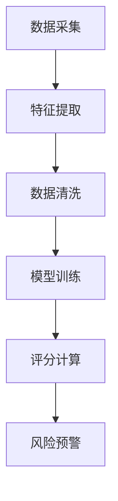
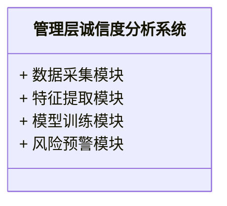

                 


# AI驱动的管理层诚信度分析：防范公司治理风险

> 关键词：AI、管理层诚信度、公司治理、风险管理、机器学习、数据驱动决策、企业合规

> 摘要：本文探讨如何利用人工智能技术分析公司管理层的诚信度，以防范公司治理中的潜在风险。通过构建AI模型，识别管理层的行为模式，评估其诚信水平，并预测可能的治理风险。文章详细阐述了AI在诚信度分析中的算法原理、系统架构以及实际应用案例，为公司治理提供新的视角和解决方案。

---

## 第一部分: 背景介绍

### 第1章: 问题背景与描述

#### 1.1 问题背景
随着企业规模的不断扩大和市场竞争的加剧，公司治理的重要性愈发凸显。管理层的诚信度直接关系到企业的长期发展和股东利益。然而，传统的诚信度分析方法往往依赖于主观判断，缺乏客观性和系统性。近年来，随着人工智能技术的快速发展，利用AI分析管理层诚信度成为一种新的趋势。

#### 1.2 问题描述
管理层诚信度分析的核心在于识别管理层的行为模式和决策风格。传统方法依赖于财务报表分析和主观判断，存在以下问题：
- 数据来源单一，难以全面反映管理层的诚信状况。
- 分析过程主观性强，缺乏客观标准。
- 风险预警能力有限，难以提前发现潜在问题。

#### 1.3 问题解决与边界
AI技术的引入为管理层诚信度分析提供了新的可能性。通过机器学习算法，可以对海量数据进行分析，提取关键特征，构建诚信度评分模型。这种方法不仅提高了分析的客观性，还能实时监控管理层行为，提前预警潜在风险。

#### 1.4 核心概念与系统架构
AI驱动的诚信度分析系统需要整合多源数据，包括财务数据、社交媒体信息、法律案件记录等。通过特征提取、模型训练和评分计算，系统能够输出管理层的诚信度评分，并生成风险预警报告。

---

### 第2章: 核心概念与联系

#### 2.1 核心概念原理
AI在诚信度分析中的应用主要依赖于以下几个步骤：
1. **数据采集**：收集与管理层相关的多源数据。
2. **特征提取**：从数据中提取反映诚信度的关键特征。
3. **模型训练**：利用机器学习算法构建诚信度评分模型。
4. **风险预警**：基于模型输出结果，生成风险预警报告。

#### 2.2 核心概念属性对比表
表2-1展示了诚信度分析中的核心概念及其属性对比：

| 核心概念 | 属性         | 描述                                                                 |
|----------|--------------|----------------------------------------------------------------------|
| 数据源   | 多源性       | 包括财务数据、社交媒体、法律记录等                                     |
| 特征     | 关键性       | 如财务异常、关联交易频率、高管变更次数等                               |
| 模型     | 可解释性     | 模型的透明度影响结果的可信度                                           |
| 预警     | 及时性       | 实时监控，快速识别潜在风险                                             |

#### 2.3 ER实体关系图
以下是管理层诚信度分析系统的ER图：

```mermaid
er
    entity: 管理层
    entity: 公司
    relationship: 管理关系
    entity: 交易
    relationship: 关联关系
    entity: 风险
    relationship: 风险因素
```

---

## 第二部分: 核心概念与系统架构

### 第3章: 核心概念与系统架构

#### 3.1 核心概念原理
AI驱动的诚信度分析系统需要整合多源数据，并通过特征提取和模型训练构建评分模型。以下是详细步骤：

1. **数据采集**：从财务报表、社交媒体、新闻报道等多源数据中提取相关信息。
2. **特征提取**：识别与诚信度相关的特征，如财务异常、关联交易频率、高管变更次数等。
3. **模型训练**：使用机器学习算法（如随机森林、支持向量机）训练模型，生成诚信度评分。
4. **风险预警**：基于评分结果，生成风险预警报告。

#### 3.2 算法原理

##### 3.2.1 算法流程
以下是AI驱动诚信度分析的算法流程：



##### 3.2.2 特征选择
特征选择是模型训练的关键步骤。以下是常用的特征：

| 特征类别 | 特征描述                 |
|----------|--------------------------|
| 财务特征   | 财务异常、关联交易频率   |
| 行为特征   | 高管变更次数、诉讼记录   |
| 社交特征   | 社交媒体情绪、互动频率   |

##### 3.2.3 模型训练
以下是随机森林模型的Python代码示例：

```python
from sklearn.ensemble import RandomForestClassifier
from sklearn.metrics import accuracy_score

# 数据准备
X_train, y_train = prepare_data()

# 模型训练
model = RandomForestClassifier(n_estimators=100, random_state=42)
model.fit(X_train, y_train)

# 模型评估
y_pred = model.predict(X_test)
print("准确率:", accuracy_score(y_pred, y_test))
```

---

#### 3.3 数学模型

##### 3.3.1 评分模型
以下是诚信度评分模型的公式：

$$ \text{诚信度评分} = \sum_{i=1}^{n} w_i \cdot x_i $$

其中：
- $w_i$ 表示第i个特征的权重
- $x_i$ 表示第i个特征的值

##### 3.3.2 风险预警模型
以下是风险预警模型的公式：

$$ \text{风险等级} = \begin{cases}
0 & \text{评分 < 60} \\
1 & \text{60 ≤ 评分 < 70} \\
2 & \text{评分 ≥ 70}
\end{cases} $$

---

## 第三部分: 系统分析与架构设计方案

### 第4章: 系统分析与架构设计

#### 4.1 系统功能设计
以下是系统功能模块的类图：



#### 4.2 系统架构设计
以下是系统架构设计的架构图：

```mermaid
archi
    title 管理层诚信度分析系统架构
    actor 管理层
    actor 公司
    actor 风险管理部
    component 数据采集模块
    component 特征提取模块
    component 模型训练模块
    component 风险预警模块
    管理层 --> 数据采集模块
    公司 --> 数据采集模块
    数据采集模块 --> 特征提取模块
    特征提取模块 --> 模型训练模块
    模型训练模块 --> 风险预警模块
    风险预警模块 --> 风险管理部
```

---

## 第四部分: 项目实战

### 第5章: 项目实战

#### 5.1 环境安装
以下是Python环境的安装步骤：

1. 安装Python：`brew install python3`（macOS）或`apt-get install python3`（Linux）。
2. 安装依赖库：`pip install pandas scikit-learn`

#### 5.2 核心代码实现

##### 5.2.1 数据准备
```python
import pandas as pd

# 加载数据
data = pd.read_csv('management.csv')

# 数据清洗
data.dropna(inplace=True)
```

##### 5.2.2 特征提取
```python
from sklearn.preprocessing import StandardScaler

# 特征提取
features = data[['revenue', 'profit', 'transaction_frequency']]
scaler = StandardScaler()
features_scaled = scaler.fit_transform(features)
```

##### 5.2.3 模型训练
```python
from sklearn.ensemble import RandomForestClassifier

# 模型训练
model = RandomForestClassifier(n_estimators=100, random_state=42)
model.fit(features_scaled, data['label'])
```

##### 5.2.4 风险预警
```python
# 风险预警
import numpy as np

def risk预警(评分):
    if 评分 < 60:
        return 0
    elif 60 <= 评分 < 70:
        return 1
    else:
        return 2

评分 = model.predict(features_scaled)[0]
print("风险等级:", 风险预警(评分))
```

#### 5.3 案例分析
以某公司为例，分析其管理层诚信度：

1. 数据采集：获取该公司的财务数据、社交媒体信息和法律记录。
2. 特征提取：提取财务异常、关联交易频率等特征。
3. 模型训练：使用随机森林模型训练，生成诚信度评分。
4. 风险预警：根据评分生成风险预警报告。

---

## 第五部分: 最佳实践与小结

### 第6章: 最佳实践与小结

#### 6.1 最佳实践
1. 数据隐私保护：确保数据采集和处理过程符合相关法律法规。
2. 模型可解释性：选择可解释性较强的模型，便于结果解读。
3. 持续优化：定期更新模型，适应新的数据和业务需求。

#### 6.2 小结
AI技术为管理层诚信度分析提供了新的可能性。通过构建AI驱动的分析系统，可以有效识别管理层的诚信问题，防范公司治理风险。未来，随着技术的不断发展，AI在公司治理中的应用将更加广泛和深入。

---

## 作者：AI天才研究院/AI Genius Institute & 禅与计算机程序设计艺术 /Zen And The Art of Computer Programming

