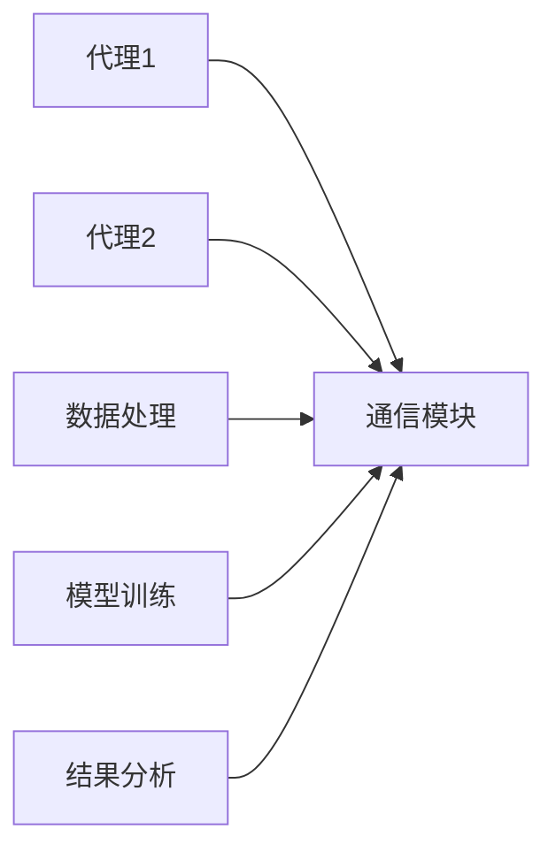

                 


# AI驱动的经济护城河评估：价值投资中的多智能体应用

## 关键词：
- AI驱动
- 经济护城河评估
- 价值投资
- 多智能体系统
- 技术博客

## 摘要：
本文探讨了如何利用AI技术，特别是多智能体系统，来评估和构建经济护城河，从而在价值投资中应用。文章从经济护城河的定义、价值投资的基本原理开始，详细讲解了AI在经济护城河评估中的方法论，包括数据采集与预处理、特征工程、模型构建与训练等。接着，文章深入分析了多智能体系统的构建与实现，展示了系统架构设计、算法实现、接口设计等技术细节。最后，通过实际案例分析，展示了AI技术在价值投资中的具体应用，并展望了未来的发展方向。

---

## 第一部分：AI驱动的经济护城河评估基础

### 第1章：经济护城河与价值投资概述

#### 1.1 经济护城河的定义与特征

##### 1.1.1 经济护城河的定义
经济护城河是指企业在行业中形成的竞争优势，使其能够长期保持较高的盈利能力。这种优势可以是成本优势、网络效应、品牌忠诚度等多种形式。

##### 1.1.2 经济护城河的核心特征
- **可持续性**：竞争优势能够长期存在。
- **可扩展性**：竞争优势能够随着企业规模的扩大而增强。
- **防御性**：能够防御竞争对手的侵蚀。

##### 1.1.3 经济护城河的分类与边界
经济护城河可以分为成本优势型、网络效应型、品牌忠诚型等。其边界在于企业的核心竞争力是否能够在较长的时间内保持不变。

#### 1.2 价值投资的基本原理

##### 1.2.1 价值投资的定义与历史
价值投资是一种投资策略，通过寻找市场价格低于其内在价值的股票进行投资。该策略由本杰明·格雷厄姆提出，并被沃伦·巴菲特发扬光大。

##### 1.2.2 价值投资的核心理念
- **安全边际**：买入价格低于内在价值。
- **长期视角**：关注企业的长期盈利能力。

##### 1.2.3 价值投资与经济护城河的关系
经济护城河是价值投资的重要考量因素，具有强大护城河的企业更可能具备长期竞争优势。

#### 1.3 AI技术在经济护城河评估中的作用

##### 1.3.1 AI技术的基本概念
人工智能（AI）是指计算机系统执行人类智能任务的能力，如视觉识别、语音识别、决策等。

##### 1.3.2 AI在经济分析中的优势
- **数据处理能力**：能够处理大量复杂数据。
- **模式识别**：能够发现数据中的隐藏模式。

##### 1.3.3 多智能体系统在经济护城河评估中的应用
多智能体系统通过多个AI代理协同工作，能够更全面地分析企业的竞争优势。

---

## 第二部分：AI驱动的经济护城河评估方法论

### 第2章：AI驱动的经济护城河评估方法论

#### 2.1 数据采集与预处理

##### 2.1.1 数据来源与采集方法
数据来源包括企业财务报表、市场数据、新闻媒体等。数据采集方法包括爬虫技术、API接口等。

##### 2.1.2 数据清洗与特征提取
数据清洗包括去除缺失值、异常值等。特征提取包括文本挖掘、数值分析等。

##### 2.1.3 数据标准化与归一化
数据标准化是将数据按比例缩放到统一范围内，归一化则是将数据转换为标准正态分布。

#### 2.2 经济护城河评估模型构建

##### 2.2.1 模型构建的基本原则
- **目标明确**：明确模型的目标。
- **数据驱动**：基于数据进行建模。

##### 2.2.2 多智能体系统的构建与优化
多智能体系统由多个AI代理组成，每个代理负责不同的任务，通过协同工作完成整体目标。

##### 2.2.3 模型的训练与验证
模型训练包括监督学习、无监督学习等。模型验证包括交叉验证、测试集验证等。

#### 2.3 经济护城河评估的算法实现

##### 2.3.1 基于多智能体的算法设计
多智能体系统通过分布式计算，能够更高效地处理大规模数据。

##### 2.3.2 算法的收敛性与稳定性分析
收敛性指算法是否能够收敛到最优解，稳定性指算法在不同输入下的表现。

##### 2.3.3 算法实现的代码示例
以下是基于Python的多智能体协同算法示例：

```python
import numpy as np
import gym

class Agent:
    def __init__(self, env):
        self.env = env
        self.obs = env.reset()

    def act(self):
        action = np.random.randint(0, self.env.action_space.n)
        obs, reward, done, info = self.env.step(action)
        if done:
            obs = self.env.reset()
        return obs

env = gym.make('CartPole-v0')
agent = Agent(env)
for _ in range(100):
    obs = agent.act()
```

---

## 第三部分：多智能体系统的构建与实现

### 第3章：多智能体系统的构建与实现

#### 3.1 系统架构设计

##### 3.1.1 系统整体架构
多智能体系统由多个代理组成，通过通信模块进行交互。

##### 3.1.2 各模块的功能与交互
- **代理模块**：负责具体任务。
- **通信模块**：负责代理之间的信息传递。

##### 3.1.3 系统的可扩展性与可维护性
系统设计应考虑模块化，便于扩展和维护。

#### 3.2 系统功能设计

##### 3.2.1 数据处理模块
数据处理模块负责数据的采集、清洗和特征提取。

##### 3.2.2 模型训练模块
模型训练模块负责模型的训练和优化。

##### 3.2.3 结果分析模块
结果分析模块负责评估模型的性能，并生成报告。

#### 3.3 系统架构图（Mermaid）



---

## 第四部分：价值投资中的AI护城河应用案例

### 第4章：价值投资中的AI护城河应用案例

#### 4.1 案例分析

##### 4.1.1 案例背景
选择一家具有强大护城河的企业，如苹果公司。

##### 4.1.2 数据处理
收集苹果公司的财务数据、市场数据等。

##### 4.1.3 模型训练
使用多智能体系统训练模型，评估苹果公司的护城河强度。

##### 4.1.4 结果分析
分析模型输出的结果，评估苹果公司的投资价值。

#### 4.2 案例总结

##### 4.2.1 成功经验
多智能体系统能够更全面地分析企业的竞争优势。

##### 4.2.2 经验教训
模型的准确性和数据质量对结果影响重大。

---

## 第五部分：系统的优化与扩展

### 第5章：系统的优化与扩展

#### 5.1 系统优化

##### 5.1.1 模型优化
优化算法参数，提高模型的准确性和效率。

##### 5.1.2 性能优化
优化系统架构，提高系统的运行效率。

#### 5.2 系统扩展

##### 5.2.1 新功能开发
扩展系统功能，增加更多的分析模块。

##### 5.2.2 新场景应用
探索更多领域的应用，如金融、医疗等。

---

## 第六部分：总结与展望

### 第6章：总结与展望

#### 6.1 总结

##### 6.1.1 核心内容回顾
本文详细讲解了AI驱动的经济护城河评估方法，并展示了多智能体系统的应用。

##### 6.1.2 系统设计总结
系统设计注重模块化和可扩展性，便于后续优化和扩展。

#### 6.2 未来展望

##### 6.2.1 技术发展趋势
AI技术将更加成熟，多智能体系统将得到更广泛应用。

##### 6.2.2 应用场景拓展
AI技术将应用于更多领域，推动经济分析的深入发展。

---

## 作者：AI天才研究院/AI Genius Institute & 禅与计算机程序设计艺术 /Zen And The Art of Computer Programming

---

### **注意事项**：
1. **数据来源**：确保数据的合法性和准确性。
2. **算法选择**：根据具体需求选择合适的算法。
3. **系统优化**：定期优化系统性能和功能。
4. **案例分析**：选择具有代表性的案例进行分析。

---

通过以上内容，我们详细探讨了AI驱动的经济护城河评估方法，并展示了多智能体系统在价值投资中的应用。希望本文能够为读者提供有价值的参考和启发。

