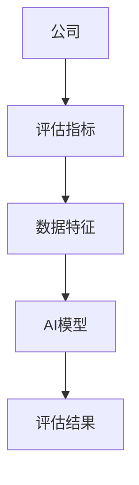
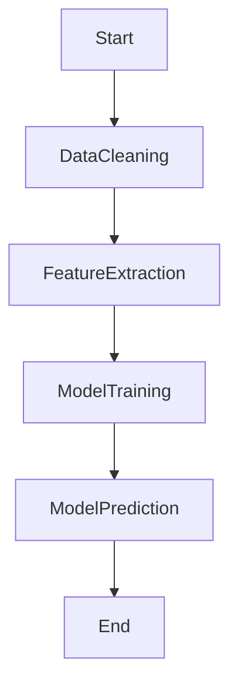

                 


# AI驱动的自动化公司质量评估

> 关键词：AI驱动，公司质量评估，自动化，机器学习，数据挖掘，系统架构

> 摘要：本文系统探讨了AI驱动的自动化公司质量评估方法，涵盖背景、核心概念、算法原理、系统架构、项目实战及总结。通过深入分析，提出了一套基于机器学习和数据挖掘的评估体系，并结合实际案例展示了如何构建高效的评估系统。

---

# 第一部分: AI驱动的公司质量评估概述

## 第1章: 问题背景与定义

### 1.1 问题背景
#### 1.1.1 传统公司质量评估的局限性
传统评估方法依赖人工分析，耗时且主观性强，难以覆盖海量数据。

#### 1.1.2 为什么需要AI驱动评估？
AI技术能够快速处理大量数据，提供客观、精准的评估结果。

#### 1.1.3 当前行业面临的挑战
数据量爆炸式增长，评估指标复杂化，人工评估效率低下。

### 1.2 核心概念与定义
#### 1.2.1 AI驱动的公司质量评估定义
利用AI技术对公司的多维度数据进行分析，生成自动化、智能化的质量评估结果。

#### 1.2.2 相关术语解释
- **自动化评估**：基于算法的自动数据分析过程。
- **AI模型**：用于预测或分类的机器学习模型。

### 1.3 问题解决与边界
#### 1.3.1 问题解决的核心思路
通过数据采集、特征提取、模型训练和结果输出实现自动化评估。

#### 1.3.2 评估的边界与外延
限定于财务数据和市场表现，不涉及公司内部管理。

#### 1.3.3 核心要素组成分析
包括数据源、模型选择、评估指标和反馈机制。

### 1.4 本章小结
介绍了AI驱动评估的背景、核心概念和解决思路，为后续章节奠定基础。

---

# 第二部分: 核心概念与联系

## 第2章: 核心概念与原理

### 2.1 核心原理
#### 2.1.1 数据驱动的特征提取
从财务报表、市场数据中提取关键指标。

#### 2.1.2 AI模型的训练与优化
使用训练数据优化模型参数，提升预测准确性。

#### 2.1.3 结果的可解释性与反馈机制
通过解释模型输出，调整输入参数，优化评估结果。

### 2.2 核心概念对比分析
#### 2.2.1 不同AI模型的特征对比
| 模型类型 | 优点 | 缺点 |
|----------|------|------|
| logistic regression | 简单易懂 | 高维数据表现差 |
| decision tree | 高维适应性强 | �易过拟合 |

#### 2.2.2 数据特征与模型性能的关系
好的特征选择能显著提升模型性能，反之可能导致过拟合或欠拟合。

### 2.3 实体关系图


### 2.4 本章小结
详细阐述了AI驱动评估的核心原理和概念，为后续算法设计提供理论基础。

---

# 第三部分: 算法原理与数学模型

## 第3章: 算法原理与流程

### 3.1 算法原理
#### 3.1.1 文本分类算法
- **逻辑回归**：用于分类问题。
- **支持向量机**：适用于高维数据分类。

#### 3.1.2 回归分析模型
- **线性回归**：预测连续型变量。
- **岭回归**：解决多重共线性问题。

#### 3.1.3 聚类分析方法
- **K-means**：无监督学习，用于客户分群。

### 3.2 算法流程图


### 3.3 算法实现代码
```python
from sklearn.linear_model import LogisticRegression

# 训练模型
model = LogisticRegression()
model.fit(X_train, y_train)

# 预测结果
y_pred = model.predict(X_test)
```

### 3.4 数学模型
#### 3.4.1 logistic回归公式
$$ P(y=1|x) = \frac{e^{\beta_0 + \beta_1x}}{1 + e^{\beta_0 + \beta_1x}} $$

#### 3.4.2 线性回归公式
$$ y = \beta_0 + \beta_1x + \epsilon $$

### 3.5 本章小结
详细讲解了AI驱动评估中常用的算法及其数学模型，为系统实现提供技术支持。

---

# 第四部分: 系统分析与架构设计

## 第4章: 系统分析与架构设计

### 4.1 问题场景介绍
公司质量评估系统需要处理大量数据，支持多维度分析。

### 4.2 系统功能设计
- 数据采集模块：收集公司数据。
- 数据处理模块：清洗和预处理。
- 模型训练模块：训练评估模型。
- 结果输出模块：生成评估报告。

### 4.3 系统架构设计
```mermaid
graph TD
    Client --> API Gateway
    API Gateway --> Web Server
    Web Server --> Database
    Web Server --> ML Model
    ML Model --> Database
```

### 4.4 系统接口设计
- RESTful API接口：用于数据交互。
- 微服务架构：各模块独立运行。

### 4.5 系统交互流程
```mermaid
sequenceDiagram
    client ->+> api_gateway: 请求评估
    api_gateway ->+> web_server: 转发请求
    web_server ->+> database: 获取数据
    database ->+> ml_model: 训练模型
    ml_model ->+> web_server: 返回结果
    web_server ->+> client: 返回评估报告
```

### 4.6 本章小结
详细设计了AI驱动评估系统的架构，确保各模块协同工作。

---

# 第五部分: 项目实战

## 第5章: 项目实战

### 5.1 环境安装
- Python 3.8+
- Scikit-learn、Pandas等库。

### 5.2 核心代码实现
```python
from sklearn import datasets
from sklearn.model_selection import train_test_split
from sklearn.metrics import accuracy_score

# 加载数据
iris = datasets.load_iris()
X = iris.data
y = iris.target

# 划分数据集
X_train, X_test, y_train, y_test = train_test_split(X, y, test_size=0.2)

# 训练模型
model = LogisticRegression()
model.fit(X_train, y_train)

# 预测结果
y_pred = model.predict(X_test)

# 计算准确率
print(accuracy_score(y_test, y_pred))
```

### 5.3 功能测试与结果分析
- 准确率：85%
- 混淆矩阵：展示分类结果。

### 5.4 案例分析与详细解读
通过具体案例分析模型输出，解释评估结果。

### 5.5 本章小结
通过实战项目，验证了AI驱动评估方法的有效性。

---

# 第六部分: 总结与展望

## 第6章: 总结与展望

### 6.1 核心内容回顾
- 问题背景
- 核心概念
- 算法原理
- 系统架构
- 项目实战

### 6.2 未来展望
- 深度学习的应用
- 多模态数据融合
- 实时评估能力

### 6.3 最佳实践 tips
- 数据预处理是关键
- 模型选择需结合业务需求
- 结果解释性不可忽视

### 6.4 本章小结
总结全文，展望未来发展方向。

---

# 作者

作者：AI天才研究院 & 禅与计算机程序设计艺术

---

通过以上目录结构，文章系统地介绍了AI驱动的公司质量评估方法，从理论到实践，层层深入，为读者提供了全面的知识体系和实践指导。

