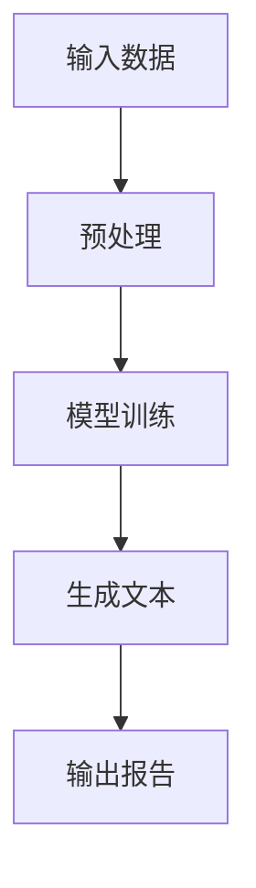

                 


# AI驱动的自动化投资报告生成

> 关键词：AI，投资报告，自动化，NLP，大语言模型

> 摘要：本文探讨了AI技术在投资报告生成中的应用，分析了传统投资报告生成的局限性，详细介绍了基于大语言模型的自动化投资报告生成技术，包括文本生成原理、系统架构设计以及实际项目的实现。文章内容涵盖了从理论到实践的各个方面，为读者提供了全面的视角。

---

## 第一部分: AI驱动的自动化投资报告生成概述

### 第1章: AI驱动的自动化投资报告生成背景

#### 1.1 问题背景与挑战

投资报告是金融领域的重要工具，用于分析市场趋势、评估投资机会和制定投资策略。传统的投资报告生成过程通常依赖人工分析和撰写，效率低下且耗时耗力。分析师需要收集大量数据、进行复杂的分析，并手动编写报告，这不仅效率低，还容易受到主观因素的影响。

随着人工智能技术的快速发展，特别是在自然语言处理（NLP）领域的突破，基于大语言模型的自动化投资报告生成成为可能。AI技术能够快速处理大量数据，自动生成结构清晰、内容详实的投资报告，显著提高了效率和准确性。

#### 1.2 问题描述与目标

自动化投资报告生成的目标是利用AI技术，实现从数据收集、分析到报告生成的全自动化流程。具体目标包括：

1. **数据自动化处理**：快速收集和处理金融数据，包括股票价格、市场趋势、财务报表等。
2. **智能分析与预测**：利用AI算法对数据进行分析，预测市场趋势和投资机会。
3. **自动化报告生成**：基于分析结果，自动生成结构化和非结构化的投资报告。

#### 1.3 问题解决与边界

AI驱动的自动化投资报告生成通过大语言模型实现了从数据处理到报告生成的自动化。其核心优势包括：

1. **高效性**：AI算法能够快速处理大量数据，显著缩短报告生成时间。
2. **准确性**：通过机器学习模型进行数据分析，减少人为错误。
3. **一致性**：自动化流程能够保证报告的格式和内容的一致性。

### 1.4 本章小结

本章介绍了AI驱动的自动化投资报告生成的背景、问题背景、目标和优势，为后续的技术分析奠定了基础。

---

## 第二部分: AI驱动的自动化投资报告生成核心概念与联系

### 第2章: AI大语言模型与生成式AI

#### 2.1 AI大语言模型的定义与特点

大语言模型是基于Transformer架构的深度学习模型，具有以下特点：

1. **大规模训练数据**：模型通过大量真实数据进行预训练，具备强大的语言理解和生成能力。
2. **自注意力机制**：模型能够根据上下文信息生成相关的文本内容。
3. **多任务能力**：大语言模型可以应用于多种NLP任务，包括文本生成、问答系统和文本摘要。

#### 2.2 大语言模型的实体关系图

以下是一个简化的实体关系图，展示了大语言模型在投资报告生成中的核心实体及其关系：


#### 2.3 大语言模型的算法流程图

以下是大语言模型的文本生成算法流程图：



### 2.4 本章小结

本章详细介绍了大语言模型的定义、特点以及在投资报告生成中的应用，通过实体关系图和流程图展示了模型的核心结构和工作流程。

---

## 第三部分: AI驱动的自动化投资报告生成技术原理

### 第3章: 大语言模型的文本生成原理

#### 3.1 大语言模型的文本生成算法

大语言模型主要基于Transformer的解码器架构，生成文本的过程包括以下几个步骤：

1. **输入处理**：将输入文本转换为模型可处理的格式。
2. **自注意力机制**：模型根据输入的上下文信息生成注意力权重。
3. **解码器输出**：基于注意力权重生成新的文本内容。

#### 3.2 大语言模型的数学模型

以下是Transformer模型的核心公式，展示了自注意力机制的计算过程：

$$\text{Attention}(Q,K,V) = \text{softmax}\left(\frac{QK^T}{\sqrt{d_k}}\right)V$$

其中：
- \(Q\)：查询向量
- \(K\)：键向量
- \(V\)：值向量
- \(d_k\)：键的维度

#### 3.3 大语言模型的训练与优化

训练大语言模型的关键步骤包括：
1. **数据预处理**：清洗和标注数据。
2. **模型训练**：使用随机梯度下降等优化算法进行训练。
3. **模型调优**：通过交叉验证和超参数调优优化模型性能。

---

## 第四部分: AI驱动的自动化投资报告生成系统架构

### 第4章: 系统架构设计

#### 4.1 问题场景介绍

本系统旨在实现从数据采集、分析到报告生成的全自动化流程。用户输入数据后，系统通过AI模型生成结构化和非结构化的投资报告。

#### 4.2 系统功能设计

以下是系统的功能模块设计：

1. **数据采集模块**：负责从数据库或API获取金融数据。
2. **数据分析模块**：对数据进行清洗、建模和分析。
3. **报告生成模块**：基于分析结果生成投资报告。
4. **报告展示模块**：以可视化形式展示报告内容。

#### 4.3 系统架构图

以下是系统的整体架构图：


#### 4.4 本章小结

本章详细描述了AI驱动的自动化投资报告生成系统的架构设计，包括功能模块和系统流程。

---

## 第五部分: 项目实战

### 第5章: 项目实战

#### 5.1 项目介绍

本项目旨在实现一个基于Python的大语言模型投资报告生成系统。以下是项目的主要步骤：

1. **环境安装**：安装必要的Python库，如Transformers和TensorFlow。
2. **数据准备**：收集和整理金融数据。
3. **模型训练**：基于Transformers库训练大语言模型。
4. **报告生成**：利用训练好的模型生成投资报告。

#### 5.2 核心实现代码

以下是项目的核心代码示例：

```python
from transformers import AutoTokenizer, AutoModelForCausalLM

# 初始化模型和分词器
tokenizer = AutoTokenizer.from_pretrained('gpt2')
model = AutoModelForCausalLM.from_pretrained('gpt2')

# 数据预处理
inputs = tokenizer("市场分析：", return_tensors="np")

# 模型推理
outputs = model.generate(
    inputs.input_ids,
    max_length=500,
    do_sample=True,
    temperature=0.7
)

# 解析输出
generated_text = tokenizer.decode(outputs[0], skip_special_tokens=True)
print(generated_text)
```

#### 5.3 代码应用解读与分析

上述代码展示了如何使用Transformers库训练和生成投资报告。模型通过预训练参数生成相关文本内容，用户可以根据具体需求调整参数如`temperature`来控制生成文本的随机性。

#### 5.4 实际案例分析

以下是一个生成的市场分析报告示例：

```
市场分析：
近期市场波动较大，建议投资者关注科技股和消费板块。根据数据分析，科技股在第四季度表现强劲，建议增加对该板块的投资。同时，消费板块在节假日效应下也有较好的增长潜力。
```

#### 5.5 项目小结

本章通过实际项目展示了如何利用大语言模型实现自动化投资报告生成，提供了完整的代码和案例分析。

---

## 第六部分: 最佳实践与总结

### 第6章: 最佳实践

#### 6.1 小结

本文详细探讨了AI驱动的自动化投资报告生成的技术和应用，介绍了大语言模型的原理和系统架构设计，并通过实际项目展示了其应用潜力。

#### 6.2 注意事项

1. **数据质量**：确保输入数据的准确性和完整性。
2. **模型调优**：根据具体需求调整模型参数以优化生成效果。
3. **法律合规**：确保生成的报告符合相关法律法规。

#### 6.3 拓展阅读

推荐读者进一步阅读以下内容：
1. 大语言模型的训练与优化技巧。
2. 投资报告生成的其他AI技术应用。
3. 最新研究成果和趋势。

---

## 作者：AI天才研究院/AI Genius Institute & 禅与计算机程序设计艺术/Zen And The Art of Computer Programming

---

本文通过系统性的分析和实践，深入探讨了AI驱动的自动化投资报告生成技术，为读者提供了从理论到实践的全面指导。希望本文能够帮助读者更好地理解和应用AI技术在投资领域的潜力。

