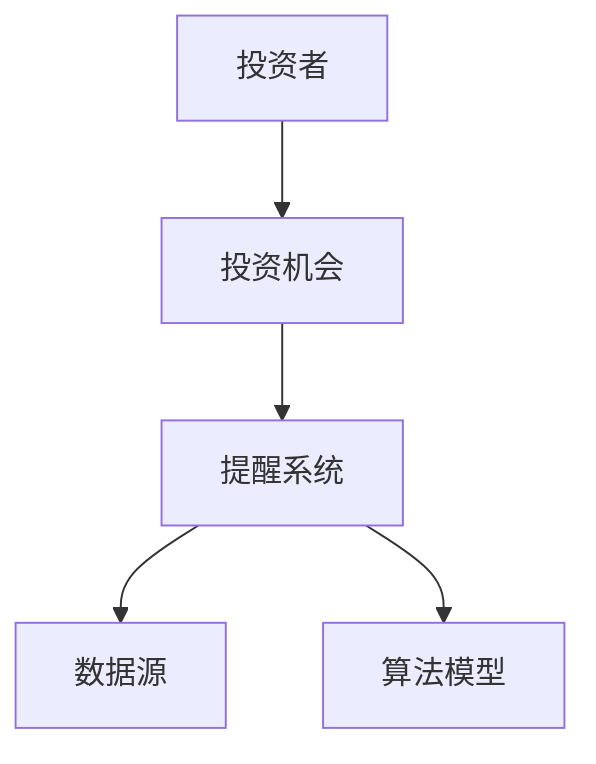
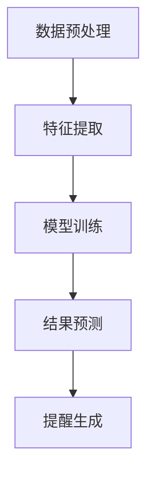
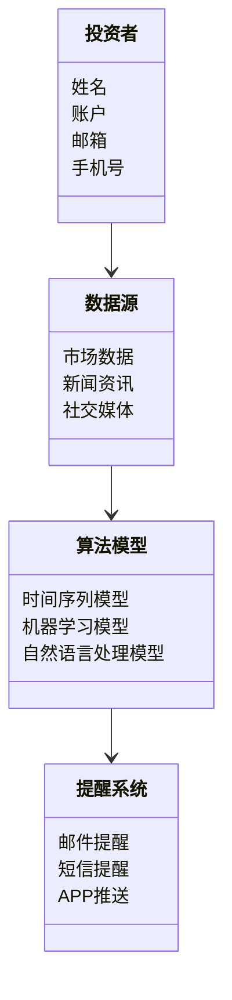
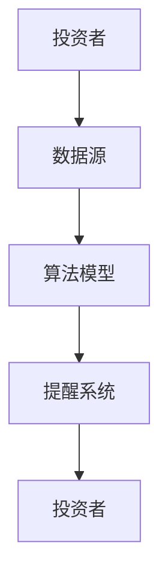
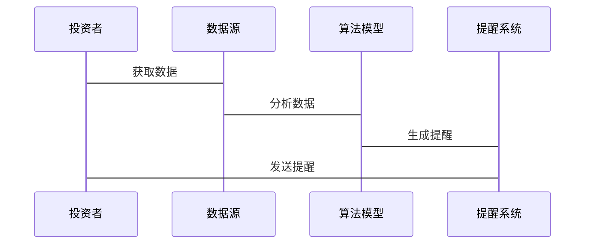

                 


# AI驱动的自动化投资机会提醒

> 关键词：AI驱动，自动化投资，机会提醒，金融算法，投资系统

> 摘要：本文详细探讨了AI驱动的自动化投资机会提醒系统的背景、核心概念、算法原理、系统架构设计、项目实战及总结与展望。通过系统的分析与设计，结合具体的代码实现和案例分析，本文为读者提供了从理论到实践的全面指导，帮助读者理解并掌握如何利用AI技术实现自动化投资机会提醒。

---

# 第一部分: AI驱动的自动化投资机会提醒概述

---

## 第1章: AI驱动的自动化投资机会提醒背景

### 1.1 问题背景与目标

#### 1.1.1 投资机会提醒的核心问题
在金融市场中，投资机会的发现和提醒是一个关键环节。传统的投资机会提醒依赖于人工分析和经验判断，存在效率低、主观性强、覆盖面有限等问题。随着AI技术的发展，利用机器学习、自然语言处理等技术，可以实现自动化、智能化的投资机会提醒，从而提高投资效率和准确性。

#### 1.1.2 AI技术在投资领域的应用潜力
AI技术在金融领域的应用已经取得了显著进展，尤其是在股票预测、风险评估、交易决策等领域。通过分析海量的市场数据、新闻资讯和社交媒体信息，AI能够发现潜在的投资机会，并通过自动化系统实时提醒投资者。

#### 1.1.3 自动化投资机会提醒的目标与意义
自动化投资机会提醒的目标是通过AI技术，实时监控市场动态，识别潜在的投资机会，并以自动化的方式提醒投资者。这不仅可以提高投资效率，还可以降低人为错误，帮助投资者做出更明智的决策。

### 1.2 问题描述与解决思路

#### 1.2.1 投资机会提醒的定义与分类
投资机会提醒是指通过技术手段，对市场中的潜在投资机会进行识别，并以提醒的方式通知投资者。根据提醒的方式和内容，可以将投资机会提醒分为股票提醒、基金提醒、期货提醒等类型。

#### 1.2.2 传统投资机会提醒的局限性
传统的投资机会提醒主要依赖于人工分析和经验判断，存在以下局限性：
- 数据量有限，难以捕捉全局机会；
- 人工分析耗时耗力，效率低；
- 主观性强，容易受到情绪影响；
- 难以实时监控市场动态。

#### 1.2.3 AI驱动的自动化解决方案
AI驱动的自动化投资机会提醒通过以下方式解决传统方法的局限性：
- 利用机器学习算法分析海量数据，发现潜在机会；
- 通过自然语言处理技术分析新闻和社交媒体信息；
- 实时监控市场动态，自动化生成提醒。

### 1.3 核心概念与边界

#### 1.3.1 AI驱动的自动化投资机会提醒的核心要素
AI驱动的自动化投资机会提醒系统的核心要素包括：
- 数据源：包括市场数据、新闻资讯、社交媒体等；
- 特征提取：从数据中提取有用的特征，用于模型训练；
- 算法模型：用于预测市场趋势和识别投资机会；
- 自动化提醒：通过邮件、短信、APP通知等方式提醒投资者。

#### 1.3.2 问题的边界与外延
AI驱动的自动化投资机会提醒系统的边界包括：
- 数据范围：仅限于与投资相关的数据；
- 提醒方式：仅限于预先设定的提醒方式；
- 使用场景：仅限于投资领域。

#### 1.3.3 相关概念的对比分析
与传统投资机会提醒相比，AI驱动的自动化投资机会提醒具有以下优势：
- 数据处理能力更强；
- 分析效率更高；
- 提醒更加及时和准确。

### 1.4 本章小结

---

## 第2章: AI驱动的自动化投资机会提醒系统核心概念

### 2.1 核心概念原理

#### 2.1.1 数据驱动的特征提取
特征提取是AI驱动的自动化投资机会提醒系统的关键步骤。通过分析市场数据、新闻资讯等，提取有用的特征，例如股票的市盈率、市净率、成交量等。

#### 2.1.2 AI算法的投资决策机制
AI算法通过分析提取的特征，预测市场趋势，识别潜在的投资机会。例如，使用机器学习算法预测股票价格走势，或者通过自然语言处理技术分析新闻 sentiment。

#### 2.1.3 自动化提醒的实现逻辑
自动化提醒系统通过预设的规则或算法生成提醒信号，并通过邮件、短信、APP通知等方式通知投资者。

### 2.2 核心概念属性对比

#### 2.2.1 数据源类型对比
| 数据源类型 | 描述 |
|------------|------|
| 市场数据 | 包括股票价格、成交量等实时数据 |
| 新闻资讯 | 包括财经新闻、公司公告等 |
| 社交媒体 | 包括社交媒体上的投资者情绪分析 |

#### 2.2.2 算法模型性能对比
| 算法模型 | 描述 | 性能 |
|----------|------|------|
| 时间序列模型 | 基于历史数据预测未来趋势 | 中等 |
| 机器学习模型 | 基于特征的分类与回归 | 较高 |
| 自然语言处理模型 | 基于文本的情感分析 | 高 |

#### 2.2.3 提醒机制的效率对比
| 提醒机制 | 描述 | 效率 |
|----------|------|------|
| 邮件提醒 | 通过邮件通知 | 较低 |
| 短信提醒 | 通过短信通知 | 中等 |
| APP推送 | 通过APP推送通知 | 较高 |

### 2.3 ER实体关系图



### 2.4 本章小结

---

## 第3章: AI驱动的自动化投资机会提醒算法原理

### 3.1 算法原理概述

#### 3.1.1 时间序列分析
时间序列分析是一种通过分析历史数据，预测未来趋势的方法。常用的时间序列模型包括ARIMA、LSTM等。

#### 3.1.2 机器学习模型
机器学习模型通过训练数据，学习投资机会的特征，预测未来的机会。常用的模型包括随机森林、支持向量机、神经网络等。

#### 3.1.3 自然语言处理
自然语言处理技术用于分析新闻资讯和社交媒体上的文本，提取情感和关键词，帮助识别潜在的投资机会。

### 3.2 算法实现流程



### 3.3 核心算法数学模型

#### 3.3.1 时间序列模型
$$ARIMA(p, d, q)$$

#### 3.3.2 机器学习模型
$$y = f(x)$$

#### 3.3.3 自然语言处理模型
$$P(y|x) = \text{softmax}(xW + b)$$

### 3.4 代码实现示例

#### 3.4.1 时间序列预测代码

```python
import numpy as np
from statsmodels.tsa.arima_model import ARIMA

# 示例数据
data = np.array([1, 2, 3, 4, 5, 6, 7, 8, 9, 10])

# 模型训练
model = ARIMA(data, order=(1, 1, 1))
model_fit = model.fit()

# 预测未来值
forecast = model_fit.forecast(steps=5)
print(forecast)
```

#### 3.4.2 机器学习模型代码

```python
import numpy as np
from sklearn.linear_model import LinearRegression

# 示例数据
X = np.array([[1], [2], [3], [4]])
y = np.array([2, 4, 6, 8])

# 模型训练
model = LinearRegression()
model.fit(X, y)

# 预测结果
new_data = np.array([[5]])
print(model.predict(new_data))
```

### 3.5 本章小结

---

## 第4章: AI驱动的自动化投资机会提醒系统架构设计

### 4.1 系统功能设计

#### 4.1.1 领域模型



#### 4.1.2 系统架构设计



### 4.2 系统接口设计

#### 4.2.1 数据接口
```python
# 数据接口示例
def get_market_data(symbol):
    # 获取股票数据
    return data
```

#### 4.2.2 模型接口
```python
# 模型接口示例
def predict_opportunity(data):
    # 预测投资机会
    return result
```

#### 4.2.3 提醒接口
```python
# 提醒接口示例
def send_notification(message):
    # 发送提醒
    pass
```

### 4.3 系统交互流程



### 4.4 本章小结

---

## 第5章: AI驱动的自动化投资机会提醒项目实战

### 5.1 环境配置

#### 5.1.1 安装依赖
```bash
pip install numpy pandas scikit-learn statsmodels
```

#### 5.1.2 数据准备
```python
import pandas as pd

# 示例数据
data = pd.DataFrame({
    '日期': ['2023-01-01', '2023-01-02', '2023-01-03', '2023-01-04'],
    '收盘价': [100, 102, 101, 103]
})
```

### 5.2 系统核心实现

#### 5.2.1 数据预处理

```python
import numpy as np
import pandas as pd

# 数据清洗
data.dropna(inplace=True)
data = data.astype(float)
```

#### 5.2.2 模型训练

```python
from statsmodels.tsa.arima_model import ARIMA

# 时间序列模型训练
model = ARIMA(data['收盘价'], order=(1, 1, 1))
model_fit = model.fit()
```

#### 5.2.3 提醒生成

```python
def send_notification(message):
    # 示例提醒函数
    print(f"提醒：{message}")
```

### 5.3 实际案例分析

#### 5.3.1 案例背景
假设我们有一个股票数据集，需要预测未来的价格走势，并在价格达到特定阈值时提醒投资者。

#### 5.3.2 数据分析

```python
import matplotlib.pyplot as plt

data['收盘价'].plot()
plt.title('股票价格走势')
plt.show()
```

#### 5.3.3 模型预测

```python
forecast = model_fit.forecast(steps=5)
print(forecast)
```

#### 5.3.4 提醒触发

```python
threshold = 105
if forecast[0] > threshold:
    send_notification(f"股票价格超过阈值：{threshold}")
```

### 5.4 本章小结

---

## 第6章: 总结与展望

### 6.1 本章总结
本文详细探讨了AI驱动的自动化投资机会提醒系统的背景、核心概念、算法原理、系统架构设计、项目实战及总结与展望。通过系统的分析与设计，结合具体的代码实现和案例分析，本文为读者提供了从理论到实践的全面指导。

### 6.2 未来展望
未来，随着AI技术的不断发展，AI驱动的自动化投资机会提醒系统将更加智能化和自动化。可能的发展方向包括：
- 更加复杂的算法模型，例如深度学习模型；
- 多模态数据的融合分析；
- 更加个性化的提醒服务。

### 6.3 注意事项
在实际应用中，需要注意以下几点：
- 数据的准确性和完整性；
- 模型的可解释性和透明度；
- 系统的安全性和稳定性。

### 6.4 拓展阅读
建议读者进一步阅读以下内容：
- 时间序列分析的经典书籍；
- 机器学习在金融领域的应用；
- 自然语言处理技术的最新进展。

### 6.5 本章小结

---

## 作者：AI天才研究院/AI Genius Institute & 禅与计算机程序设计艺术 /Zen And The Art of Computer Programming

---

以上是《AI驱动的自动化投资机会提醒》的技术博客文章的完整目录和内容。希望这篇文章能为您提供清晰的思路和实践指导。

