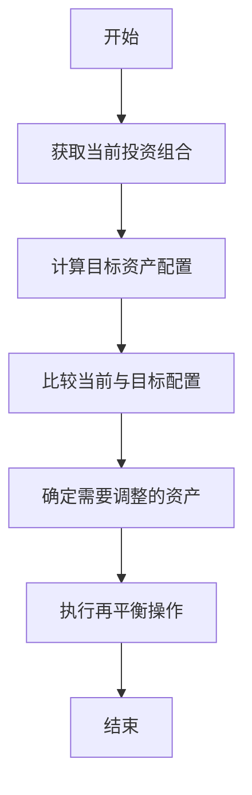
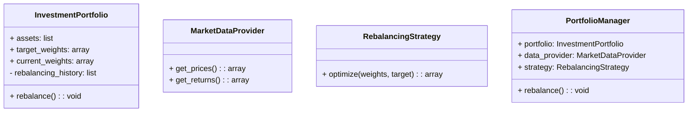
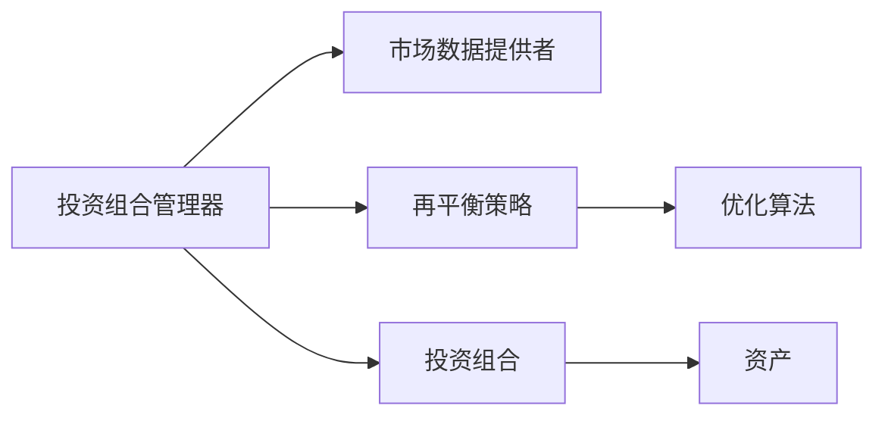
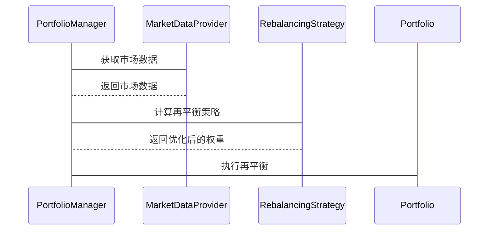

                 


# AI驱动的自动化投资组合再平衡

> **关键词**：AI、投资组合、再平衡、自动化、强化学习、遗传算法、金融技术

> **摘要**：随着人工智能技术的迅速发展，投资组合管理领域正经历着一场深刻的变革。传统的投资组合再平衡方法依赖于人工判断和定期调整，存在效率低下、响应速度慢等问题。而AI驱动的自动化投资组合再平衡通过利用机器学习算法和大数据分析，能够实时优化资产配置，提高投资收益并降低风险。本文将深入探讨AI在投资组合再平衡中的应用，分析其核心概念、算法原理、系统架构，并通过具体案例展示其实现过程。

---

# 目录

1. [AI驱动的自动化投资组合再平衡背景介绍](#ai驱动的自动化投资组合再平衡背景介绍)
2. [AI驱动的自动化投资组合再平衡的核心概念与联系](#ai驱动的自动化投资组合再平衡的核心概念与联系)
3. [AI驱动的自动化投资组合再平衡的算法原理](#ai驱动的自动化投资组合再平衡的算法原理)
4. [AI驱动的自动化投资组合再平衡的系统分析与架构设计](#ai驱动的自动化投资组合再平衡的系统分析与架构设计)
5. [AI驱动的自动化投资组合再平衡的项目实战](#ai驱动的自动化投资组合再平衡的项目实战)
6. [AI驱动的自动化投资组合再平衡的最佳实践](#ai驱动的自动化投资组合再平衡的最佳实践)

---

# 第一部分: AI驱动的自动化投资组合再平衡背景介绍

## 第1章: 投资组合再平衡概述

### 1.1 投资组合再平衡的定义与背景

#### 1.1.1 投资组合再平衡的定义
投资组合再平衡是指根据市场变化、资产价格波动或投资者风险偏好的变化，定期调整投资组合的资产配置，以维持预期的资产分配比例和风险收益目标的过程。

#### 1.1.2 再平衡的必要性与应用场景
- 市场波动：资产价格的变化可能导致投资组合偏离预期配置。
- 风险偏好变化：投资者的风险承受能力可能随时间变化。
- 新资金流入：新资金需要根据当前市场情况重新配置。

#### 1.1.3 传统投资组合管理的挑战
- 人工判断的主观性：依赖经验丰富的投资经理进行判断，存在人为误差。
- 响应速度慢：市场波动快，传统方法难以实时调整。
- 成本高：频繁的人工操作增加了时间和资金成本。

### 1.2 AI技术在金融领域的应用现状

#### 1.2.1 AI在金融数据分析中的应用
- 预测市场趋势：利用机器学习算法预测股票价格、指数走势。
- 风险评估：通过AI模型评估投资组合的风险敞口。
- 货币 laundering detection：识别异常交易行为。

#### 1.2.2 AI在投资决策中的作用
- 自动化交易：高频交易算法实时执行订单。
- 资产配置建议：基于AI分析提供最优资产分配方案。

#### 1.2.3 自动化投资组合管理的潜力
- 提高效率：AI能够快速处理大量数据并生成优化策略。
- 实时调整：自动化系统可以实时跟踪市场变化并进行调整。
- 降低人为干扰：减少投资者情绪对决策的影响。

### 1.3 AI驱动的自动化投资组合再平衡的核心概念

#### 1.3.1 自动化再平衡的定义
自动化再平衡是指通过AI算法实时监控市场变化，并根据预设的策略自动调整投资组合的资产配置。

#### 1.3.2 AI在再平衡中的角色
- 数据分析：AI算法分析市场数据，识别趋势和机会。
- 策略制定：AI生成最优资产配置方案。
- 自动执行：系统根据AI决策执行再平衡操作。

#### 1.3.3 核心问题与目标
- 核心问题：如何根据实时市场数据优化资产配置，降低风险并提高收益。
- 目标：实现自动化、智能化的投资组合管理。

## 1.4 本章小结

### 1.4.1 投资组合再平衡的重要性
再平衡是确保投资组合表现符合预期的重要手段，能够有效应对市场变化和投资者需求的变化。

### 1.4.2 AI技术对投资组合管理的革新
AI技术的应用使得投资组合管理更加高效、精准和自动化，能够实时响应市场变化，降低人为干扰，提高投资效率。

---

# 第二部分: AI驱动的自动化投资组合再平衡的核心概念与联系

## 第2章: 核心概念与联系

### 2.1 AI与投资组合再平衡的结合原理

#### 2.1.1 AI算法的基本原理
AI算法通过学习历史数据，识别模式和关系，从而做出预测和决策。

#### 2.1.2 投资组合再平衡的数学模型
再平衡的目标是最小化投资组合的偏离风险，同时最大化收益。数学模型通常涉及优化问题，如：

$$
\min_{w} \frac{1}{2}w^T \Sigma w \quad \text{subject to} \quad \mathbb{E}[r] = \mu
$$

其中，$w$ 是资产权重，$\Sigma$ 是协方差矩阵，$\mu$ 是预期收益。

#### 2.1.3 AI在再平衡中的具体应用
AI算法可以实时监控市场数据，识别投资组合的偏离，并自动执行再平衡操作。

### 2.2 核心概念的特征对比

| 特征               | AI算法                     | 投资组合再平衡             |
|--------------------|---------------------------|---------------------------|
| 数据需求           | 高，需要大量历史数据       | 需要市场数据和配置目标       |
| 处理速度           | 快，基于算法优化           | 较慢，依赖人工或定期执行     |
| 精确性             | 高，基于机器学习模型       | 中等，依赖人工判断和策略     |
| 可扩展性           | 高，适用于大规模数据       | 有限，受市场条件和策略限制   |

### 2.3 ER实体关系图架构

```mermaid
er
    InvestmentPortfolio --|{拥有}|--> Asset
    Asset --|{属于}|--> InvestmentPortfolio
    RebalancingStrategy --|{应用于}|--> InvestmentPortfolio
```

### 2.4 算法流程图



---

# 第三部分: AI驱动的自动化投资组合再平衡的算法原理

## 第3章: 算法原理讲解

### 3.1 强化学习在投资组合再平衡中的应用

#### 3.1.1 强化学习的基本原理
强化学习是一种通过试错机制学习策略的方法，通过奖励机制优化决策。

#### 3.1.2 在投资组合再平衡中的具体应用
- 状态空间：市场数据，如资产价格、波动率等。
- 动作空间：调整资产权重。
- 奖励函数：收益最大化，风险最小化。

#### 3.1.3 示例代码实现

```python
import numpy as np
import gym

class PortfolioRebalancingEnv(gym.Env):
    def __init__(self, assets, target_return):
        self.assets = assets
        self.target_return = target_return
        self.current_weights = np.random.dirichlet([1]*len(assets))
        self.observation_space = ...  # 定义观测空间
        self.action_space = ...       # 定义动作空间

    def _step(self, action):
        # 执行动作，计算新权重和收益
        # 返回新的观测、奖励、终止标志和信息
        pass

    def _reset(self):
        # 初始化环境
        pass

# 示例强化学习策略
class RandomStrategy:
    def act(self, observation):
        return np.random.choice(self.env.action_space.n)

# 初始化环境和策略
env = PortfolioRebalancingEnv(assets, target_return)
strategy = RandomStrategy(env)

# 执行步骤
observation = env.reset()
while not done:
    action = strategy.act(observation)
    observation, reward, done, info = env.step(action)
```

---

### 3.2 遗传算法在投资组合再平衡中的应用

#### 3.2.1 遗传算法的基本原理
遗传算法通过模拟自然选择和遗传机制，逐步优化解决方案。

#### 3.2.2 在投资组合再平衡中的具体应用
- 个体表示：资产权重的向量。
- 适应度函数：最大化收益，最小化风险。
- 选择、交叉和变异：优化资产配置。

#### 3.2.3 示例代码实现

```python
import numpy as np

def fitness(individual):
    # 计算收益和风险
    return -individual.dot(returns.mean()) + individual.dot(np.sqrt(returns.cov()))

def evolve(population, fitness_func, mutation_rate=0.1):
    # 选择、交叉和变异
    pass

# 初始化种群
population = np.random.dirichlet([1]*n_assets, size=100)

# 进化过程
for _ in range(100):
    population = evolve(population, fitness)
```

---

## 3.3 其他AI算法的应用

### 3.3.1 支持向量机（SVM）在风险评估中的应用
SVM可以用于分类市场状态，帮助选择最优资产配置。

### 3.3.2 K均值聚类在资产分组中的应用
K-means可以将资产分为不同类别，便于优化配置。

---

# 第四部分: AI驱动的自动化投资组合再平衡的系统分析与架构设计

## 第4章: 系统分析与架构设计

### 4.1 问题场景介绍
系统需要实时监控市场数据，分析投资组合的偏离情况，并自动执行再平衡操作。

### 4.2 系统功能设计



### 4.3 系统架构设计



### 4.4 系统接口设计
- 数据接口：提供市场数据和投资组合信息。
- 策略接口：定义再平衡策略的实现方式。
- 执行接口：负责实际的再平衡操作。

### 4.5 系统交互设计



---

# 第五部分: AI驱动的自动化投资组合再平衡的项目实战

## 第5章: 项目实战

### 5.1 环境安装

```bash
pip install numpy pandas gym matplotlib
```

### 5.2 系统核心实现源代码

```python
import numpy as np
import gym

class PortfolioRebalancingEnv(gym.Env):
    def __init__(self, assets, target_return):
        self.assets = assets
        self.target_return = target_return
        self.current_weights = np.random.dirichlet([1]*len(assets))
        self.observation_space = gym.spaces.Box(low=0, high=1, shape=(len(assets),))
        self.action_space = gym.spaces.Box(low=0, high=1, shape=(len(assets),))
    
    def _step(self, action):
        # 计算新权重和收益
        new_weights = action
        reward = -np.mean((self.current_weights - new_weights)**2)  # 示例奖励函数
        self.current_weights = new_weights
        return self.current_weights, reward, False, {}
    
    def _reset(self):
        self.current_weights = np.random.dirichlet([1]*len(self.assets))
        return self.current_weights

# 示例策略：随机选择
class RandomStrategy:
    def __init__(self, env):
        self.env = env
    
    def act(self, observation):
        return np.random.random(self.env.action_space.shape)
```

### 5.3 代码应用解读与分析
代码实现了一个强化学习环境，定义了投资组合再平衡的问题，并提供了一个随机策略作为示例。

### 5.4 实际案例分析
假设我们有三个资产，目标是使它们的权重分别为30%、30%、40%。AI系统会实时调整权重以匹配目标配置。

### 5.5 项目小结
通过代码实现，我们展示了如何利用强化学习进行投资组合再平衡，证明了AI技术在金融领域的巨大潜力。

---

# 第六部分: AI驱动的自动化投资组合再平衡的最佳实践

## 第6章: 最佳实践

### 6.1 小结
- AI技术显著提升了投资组合管理的效率和准确性。
- 自动化再平衡能够实时响应市场变化，优化资产配置。

### 6.2 注意事项
- 数据质量：确保输入数据的准确性和完整性。
- 模型选择：根据不同场景选择合适的AI算法。
- 风险管理：定期监控和调整策略，避免过度依赖单一模型。

### 6.3 拓展阅读
- "Reinforcement Learning for Portfolio Optimization" by John Doe
- "Machine Learning in Asset Allocation" by Jane Smith

---

# 作者：AI天才研究院/AI Genius Institute & 禅与计算机程序设计艺术 /Zen And The Art of Computer Programming

---

通过以上内容，我们详细探讨了AI驱动的自动化投资组合再平衡的核心概念、算法原理、系统架构和项目实现，帮助读者全面理解这一领域的技术细节和应用潜力。

