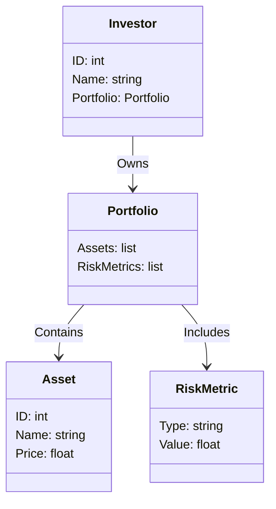

                 


# AI驱动的自动化投资组合诊断

> 关键词：人工智能，投资组合诊断，机器学习，自动化诊断，金融数据分析

> 摘要：本文探讨了AI驱动的自动化投资组合诊断技术，通过详细分析投资组合诊断的核心问题、AI技术的应用、相关算法原理、系统架构设计以及实际项目案例，展示了如何利用先进的AI技术提升投资组合诊断的效率和准确性。

---

## 第一部分：AI驱动的自动化投资组合诊断背景与概述

### 第1章：投资组合诊断的背景与问题

#### 1.1 投资组合诊断的背景
##### 1.1.1 传统投资组合管理的局限性
传统的投资组合管理依赖于人工分析和经验判断，这种方法效率低下且容易受到主观因素的影响。随着金融市场数据的爆炸式增长，传统方法难以及时、准确地诊断投资组合的风险和问题。

##### 1.1.2 AI技术在金融领域的应用现状
人工智能技术（如机器学习、深度学习）在金融领域的应用日益广泛，尤其是在数据分析、预测和自动化决策方面。AI技术能够处理海量数据，发现隐藏的模式，为投资组合管理提供了新的可能性。

##### 1.1.3 自动化投资组合诊断的必要性
自动化投资组合诊断能够实时监控投资组合的表现，快速识别潜在风险，并提供数据驱动的决策支持，从而提高投资组合的稳定性和收益。

#### 1.2 问题背景与问题描述
##### 1.2.1 投资组合诊断的核心问题
投资组合诊断的核心问题是识别投资组合中的风险因素、评估其健康状况，并提出优化建议。这需要对市场数据、资产配置、风险指标等多个方面进行综合分析。

##### 1.2.2 自动化诊断的挑战与目标
自动化诊断的挑战包括数据的复杂性、模型的准确性和实时性要求。目标是通过AI技术实现投资组合的实时监控、风险预警和优化建议。

##### 1.2.3 边界与外延
投资组合诊断的边界包括特定的投资范围和时间窗口，而外延则涉及市场环境、宏观经济指标等外部因素。

### 第2章：AI驱动的自动化投资组合诊断概述

#### 2.1 核心概念与定义
##### 2.1.1 投资组合诊断的定义
投资组合诊断是对投资组合的健康状况进行分析，识别潜在风险，并提出优化建议的过程。

##### 2.1.2 AI驱动的自动化诊断的定义
AI驱动的自动化诊断是利用人工智能技术，自动分析投资组合数据，识别问题并提供解决方案的过程。

##### 2.1.3 关键术语解释
- **投资组合**：一组金融资产，按特定比例配置。
- **风险指标**：如波动率、VaR（在险价值）等。
- **机器学习模型**：用于预测和分类的算法。

#### 2.2 核心概念与联系
##### 2.2.1 投资组合诊断的核心要素
| 核心要素 | 描述 |
|----------|------|
| 资产配置 | 投资组合中各资产的比例 |
| 风险指标 | 量化投资组合的风险 |
| 市场数据 | 包括价格、成交量等 |

##### 2.2.2 AI技术在诊断中的作用
- **数据处理**：清洗和预处理数据。
- **特征提取**：提取影响投资组合的关键特征。
- **预测与分类**：预测投资组合的风险和表现。

##### 2.2.3 实体关系图（ER图）
```mermaid
erDiagram
    investor -> INVESTMENT_PORTFOLIO : 拥有
    INVESTMENT_PORTFolio -> ASSET : 包含
    ASSET -> MARKET_DATA : 来自
    INVESTMENT_PORTFOLIO -> RISK_METRIC : 计算
```

---

## 第二部分：AI驱动的自动化投资组合诊断的核心概念

### 第3章：AI驱动的自动化投资组合诊断的核心概念

#### 3.1 机器学习与深度学习简介
##### 3.1.1 机器学习的基本概念
机器学习是通过数据训练模型，使其能够识别模式和做出预测。

##### 3.1.2 深度学习的核心原理
深度学习通过多层神经网络模拟人脑的处理方式，能够自动提取数据特征。

##### 3.1.3 神经网络的基础知识
神经网络由输入层、隐藏层和输出层组成，通过权重和激活函数进行数据处理。

#### 3.2 自然语言处理（NLP）在投资组合诊断中的应用
##### 3.2.1 NLP的基本原理
NLP用于处理文本数据，提取情感、主题等信息。

##### 3.2.2 NLP在金融文本分析中的应用
分析新闻、报告等文本数据，提取市场情绪，辅助投资决策。

##### 3.2.3 NLP在投资组合诊断中的具体场景
例如，分析公司财报，识别财务风险。

#### 3.3 时间序列分析与预测
##### 3.3.1 时间序列的基本概念
时间序列是按时间顺序排列的数据，常用于预测未来趋势。

##### 3.3.2 常见的时间序列分析方法
包括ARIMA、LSTM等模型。

##### 3.3.3 时间序列预测在投资组合诊断中的应用
用于预测资产价格波动，评估投资组合的风险。

---

## 第三部分：AI驱动的自动化投资组合诊断的算法原理

### 第4章：AI驱动的自动化投资组合诊断的算法原理

#### 4.1 PCA算法原理
##### 4.1.1 PCA的基本原理
PCA是一种降维技术，通过线性变换将原始数据映射到低维空间，同时保留主要信息。

##### 4.1.2 PCA的数学模型
$$ X = U \Sigma V^T $$
其中，$X$是数据矩阵，$U$、$V$是奇异向量，$\Sigma$是奇异值。

##### 4.1.3 PCA在投资组合诊断中的应用
用于减少数据维度，提高计算效率。

#### 4.2 XGBoost算法原理
##### 4.2.1 XGBoost的基本原理
XGBoost是一种基于树的集成算法，通过梯度提升优化模型。

##### 4.2.2 XGBoost的数学模型
$$ loss = \sum_{i} (y_i - \hat{y}_i)^2 $$
##### 4.2.3 XGBoost在投资组合诊断中的应用
用于分类风险等级，预测投资组合的表现。

#### 4.3 投资组合诊断的算法实现
##### 4.3.1 算法流程
1. 数据预处理
2. 特征提取
3. 模型训练
4. 风险预测

##### 4.3.2 算法实现代码
```python
import pandas as pd
from sklearn.decomposition import PCA
from xgboost import XGBClassifier

# 数据预处理
data = pd.read_csv('portfolio_data.csv')
features = data.drop('label', axis=1)
labels = data['label']

# PCA降维
pca = PCA(n_components=5)
features_pca = pca.fit_transform(features)

# XGBoost模型训练
model = XGBClassifier()
model.fit(features_pca, labels)
```

---

## 第四部分：AI驱动的自动化投资组合诊断的系统分析与架构设计

### 第5章：系统分析与架构设计

#### 5.1 问题场景介绍
投资组合诊断系统需要实时监控多个资产的价格和风险指标。

#### 5.2 系统功能设计
##### 5.2.1 领域模型


#### 5.3 系统架构设计
##### 5.3.1 系统架构图


#### 5.4 系统接口设计
##### 5.4.1 API接口
- GET /portfolio/{id}：获取投资组合详情
- POST /diagnose：提交诊断请求

#### 5.5 系统交互设计
##### 5.5.1 诊断流程
1. 投资者提交诊断请求
2. 系统调用API获取数据
3. 数据处理和分析
4. 返回诊断结果

---

## 第五部分：AI驱动的自动化投资组合诊断的项目实战

### 第6章：项目实战

#### 6.1 环境安装
##### 6.1.1 安装Python
```bash
python --version
pip install --upgrade pip
```

##### 6.1.2 安装依赖库
```bash
pip install pandas scikit-learn xgboost
```

#### 6.2 核心代码实现
##### 6.2.1 数据预处理
```python
import pandas as pd

data = pd.read_csv('portfolio_data.csv')
data = data.dropna()
```

##### 6.2.2 模型训练
```python
from sklearn.decomposition import PCA
from xgboost import XGBClassifier

features = data.iloc[:, :-1]
labels = data.iloc[:, -1]

pca = PCA(n_components=5)
features_pca = pca.fit_transform(features)

model = XGBClassifier()
model.fit(features_pca, labels)
```

#### 6.3 案例分析
##### 6.3.1 数据分析
分析某投资组合的历史表现，发现其波动率较高。

##### 6.3.2 模型预测
使用PCA和XGBoost模型预测投资组合的风险等级。

##### 6.3.3 优化建议
根据模型诊断结果，调整资产配置，降低整体风险。

#### 6.4 项目总结
通过AI技术实现自动化投资组合诊断，提高了诊断效率和准确性。

---

## 第六部分：AI驱动的自动化投资组合诊断的最佳实践与小结

### 第7章：最佳实践与小结

#### 7.1 最佳实践
##### 7.1.1 数据质量
确保数据的完整性和准确性。

##### 7.1.2 模型选择
根据具体问题选择合适的算法。

##### 7.1.3 系统优化
优化系统架构，提高运行效率。

#### 7.2 小结
本文详细介绍了AI驱动的自动化投资组合诊断技术，从背景到实现，从理论到实践，全面展示了如何利用AI技术提升投资组合诊断的效率和准确性。

#### 7.3 注意事项
- 数据隐私保护
- 模型解释性
- 系统实时性

#### 7.4 拓展阅读
建议读者深入学习机器学习和金融数据分析的相关知识，了解最新的研究成果和技术动态。

---

## 作者信息

作者：AI天才研究院/AI Genius Institute  
联系邮箱：contact@aigenius.com  
GitHub：https://github.com/aigenius  

---

通过以上结构，您可以逐步完成《AI驱动的自动化投资组合诊断》的技术博客文章。希望这个大纲和内容对您有所帮助！

