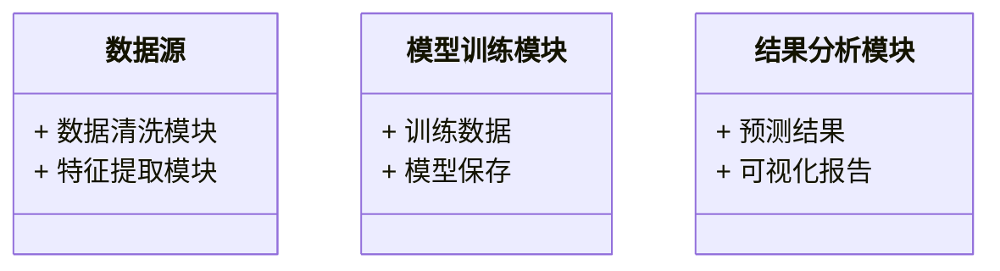
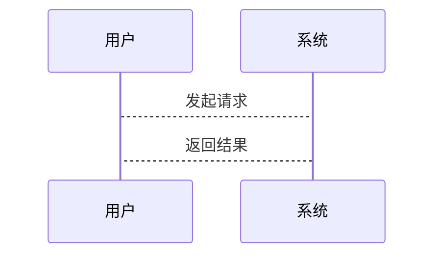

                 


# AI驱动的自动化投资风格识别

> 关键词：人工智能，投资风格，自动化，机器学习，金融分析

> 摘要：本文探讨了如何利用人工智能技术实现投资风格的自动化识别，通过分析投资行为和市场数据，结合机器学习算法和数据驱动的方法，构建高效的投资风格分类系统，帮助投资者和金融机构优化决策过程。

---

## 第1章：问题背景与投资风格识别

### 1.1 问题背景
投资风格识别是金融领域的重要问题，传统方法依赖人工分析，存在效率低、主观性强等问题。随着AI技术的发展，自动化识别成为可能。

### 1.2 问题描述
投资风格包括成长型、价值型等，识别过程涉及复杂的数据分析。传统方法依赖经验，而AI可以提供客观、高效的解决方案。

### 1.3 问题解决
AI技术通过数据驱动的方法，利用机器学习算法识别投资模式，帮助投资者优化决策。

### 1.4 边界与外延
本书研究范围限于投资风格识别，不涉及投资策略的具体执行。其他相关领域如风险管理需另行研究。

### 1.5 核心概念与结构
投资风格的定义与分类、AI技术的核心要素、数据驱动的分析框架是本书的核心。

---

## 第2章：AI驱动的投资风格识别原理

### 2.1 核心概念原理
AI通过数据处理、特征提取和模型训练实现投资风格识别，解决传统方法的不足。

### 2.2 概念属性对比
| 概念       | 传统方法 | AI方法   |
|------------|----------|----------|
| 数据来源   | 有限     | 大数据   |
| 分析速度   | 慢       | 快 |

### 2.3 ER实体关系图


---

## 第3章：算法原理讲解

### 3.1 机器学习算法
常用的算法包括支持向量机（SVM）、随机森林和神经网络。

### 3.2 算法流程图


### 3.3 Python代码示例
```python
from sklearn import svm
from sklearn.metrics import accuracy_score

# 数据预处理
X = ...  # 特征数据
y = ...  # 标签

# 模型训练
model = svm.SVC()
model.fit(X, y)

# 模型预测
y_pred = model.predict(X)

# 结果评估
print("Accuracy:", accuracy_score(y, y_pred))
```

### 3.4 数学模型
分类函数：$$f(x) = \text{sign}(w^T x + b)$$

损失函数：$$L = \sum_{i=1}^{n} (y_i \neq f(x_i))$$

---

## 第4章：系统分析与架构设计方案

### 4.1 问题场景
金融市场的数据获取和处理，系统功能设计包括数据清洗、特征工程、模型训练和结果分析。

### 4.2 系统功能设计


### 4.3 系统架构设计


### 4.4 系统接口设计
API接口：```plaintext
POST /api/train
{
    "data": [...],
    "model": "svm"
}
```

### 4.5 交互流程图


---

## 第5章：项目实战

### 5.1 环境安装
安装Python、scikit-learn、TensorFlow等库。

### 5.2 核心代码实现
```python
import pandas as pd
from sklearn.model_selection import train_test_split
from sklearn.metrics import classification_report

# 数据加载
data = pd.read_csv('data.csv')

# 数据分割
X_train, X_test, y_train, y_test = train_test_split(data.drop('style', axis=1), data['style'])

# 模型训练
model = svm.SVC()
model.fit(X_train, y_train)

# 模型预测
y_pred = model.predict(X_test)

# 结果分析
print(classification_report(y_test, y_pred))
```

### 5.3 实际案例分析
使用公开股票数据训练模型，分析结果并优化参数。

### 5.4 项目小结
总结项目实现过程，强调AI技术在投资风格识别中的优势。

---

## 第6章：最佳实践与注意事项

### 6.1 最佳实践
- 数据预处理是关键
- 模型调优提高准确率
- 结果验证避免过拟合

### 6.2 小结
本书系统介绍了AI驱动的投资风格识别技术，提供理论和实践指导。

### 6.3 注意事项
- 数据偏差可能影响结果
- 模型过拟合需谨慎处理
- 保持对市场的持续学习

### 6.4 拓展阅读
推荐相关书籍和论文，供读者深入学习。

---

作者：AI天才研究院 & 禅与计算机程序设计艺术

